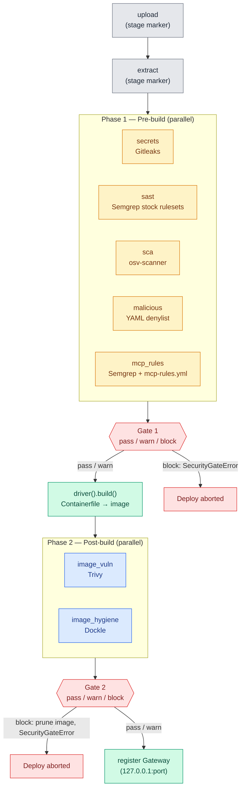

# Code Scanning for Deployed MCP Servers

**Audience:** ESO (Engineering Security Operations) reviewers, on-call SREs, and platform operators evaluating or running the deployed-MCP-server feature.

**Scope:** This document covers the in-product scanning pipeline that runs **when a user uploads MCP server code through the gateway** (the "deployed MCP server" feature, sometimes called "custom tool"). It does **not** describe the CI-time scanning that runs on the platform's own source code — for that, see [`SECURITY_WHITEPAPER.md` §9.1–9.4](../../../../SECURITY_WHITEPAPER.md#91-static-application-security-testing-sast).

For the high-level lifecycle (upload → stage → scan → build → register → run) and the position of scanning within it, see [`ARCHITECTURE.md` §Deployed MCP Servers](../../../../ARCHITECTURE.md#deployed-mcp-servers-custom-tools). For the security-controls summary, see [`SECURITY_WHITEPAPER.md` §9.5](../../../../SECURITY_WHITEPAPER.md#95-deployment-time-scanning-deployed-mcp-servers).

---

## Overview

When a deploy request is received (`POST /admin/gateways/deploy`), `DeploymentRuntimeService.deploy()` runs the source through a **9-stage scan pipeline** before the resulting container is allowed to register as a Gateway. The pipeline has two phases:

- **Pre-build (5 scanners + 2 framing stages)** — runs against the extracted source tree. Blocks the build entirely on a `block` outcome.
- **Post-build (2 scanners)** — runs against the freshly built container image. On a `block` outcome, the just-built image is pruned and the deploy fails.

Each scanner runs as an **ephemeral container** instantiated through the same `RuntimeDriver` (Docker / Podman / Kubernetes) that the gateway uses for the deployment itself. Scanner images are pulled from configurable references and pinned by digest in production. **No user code is executed on the gateway host at any point** — neither during scanning nor afterwards.

The pipeline is implemented in `mcpgateway/services/security/`:

- `runner.py` — the `SecurityScanRunner` orchestrator (entry points: `run_pre_build()`, `run_post_build()`).
- `policy.py` — pure-function policy evaluation.
- `report.py` — `Finding`, `StageState`, `ScanSummary`, `ScanReport` dataclasses.
- `progress.py` — live progress tracker for the deploy-status UI.
- `scanners/` — one module per scanner (gitleaks, semgrep, osv, malicious_pkg, trivy, dockle, hadolint).
- `rules/` — bundled detection rules (`mcp-rules.yml`, `malicious_packages.yml`).

Invocation site: `mcpgateway/services/deployment_runtime_service.py:180-220`.

---

## Pipeline diagram

The two framing stages (`upload`, `extract`) carry no findings; they exist so the deploy-status UI can render the entire 9-step progress bar consistently. The "block" lanes raise `SecurityGateError` from `services/security/errors.py`; the orchestrator persists the partial report and findings to the DB before propagating the error.

---

## Phase 1 — Pre-build scanners

All five scanners execute in parallel through `asyncio.gather` (`runner.py:160-167`). Each scanner respects a per-stage timeout and shares the gateway's build-concurrency semaphore so host pressure stays bounded.

### `secrets` — Gitleaks

| | |
|---|---|
| **Tool** | [Gitleaks](https://github.com/gitleaks/gitleaks) (no-git mode) |
| **Container image** | `mcpgateway_security_scan_image_gitleaks` (default `zricethezav/gitleaks:latest`; pin by `@sha256` in production) |
| **Timeout** | `mcpgateway_security_scan_secrets_timeout_s` (default 60s) |
| **Scope** | Entire extracted source tree |
| **Implementation** | `services/security/scanners/gitleaks.py` |

Gitleaks emits one finding per matched secret. Two flavours are distinguished:

- **Verified secrets** (`verified_secret=true` on the in-memory `Finding`) — Gitleaks performed live verification (e.g., made a probe request) and the secret is active. **Always blocks**, regardless of severity.
- **Entropy-only matches** (`verified_secret=false`) — high-entropy strings that match a secret rule pattern but were not verified. Treated as `high`-severity warnings (not blocking by default).

> **Persistence note:** the `verified_secret` flag is captured in the in-memory `Finding` dataclass and serialized to the per-deployment `scan-report.json`. It is **not** a column on `gateway_security_scan_findings` — reviewers reproducing a gate decision against the database alone will need to consult the JSON report.

### `sast` — Semgrep (stock rulesets)

| | |
|---|---|
| **Tool** | [Semgrep](https://semgrep.dev) with the public Semgrep Registry rulesets `p/security-audit`, `p/python`, `p/javascript`, `p/owasp-top-ten` |
| **Container image** | `mcpgateway_security_scan_image_semgrep` (default `returntocorp/semgrep:latest`) |
| **Timeout** | `mcpgateway_security_scan_sast_timeout_s` (default 180s) |
| **Network** | Disabled inside the scanner container; rulesets are baked in |
| **Implementation** | `services/security/scanners/semgrep.py` (`SemgrepStockScanner`) |

Severity mapping from Semgrep to the gateway's internal severity ladder:

| Semgrep severity | Mapped to | Gate behaviour (default policy) |
|---|---|---|
| `ERROR` | `high` | Blocks |
| `WARNING` | `medium` | Warn |
| `INFO` | `info` | Warn |

### `sca` — osv-scanner

| | |
|---|---|
| **Tool** | [osv-scanner](https://github.com/google/osv-scanner) — queries the OSV (Open Source Vulnerabilities) database |
| **Container image** | `mcpgateway_security_scan_image_osv` (default `ghcr.io/google/osv-scanner:latest`) |
| **Timeout** | `mcpgateway_security_scan_sca_timeout_s` (default 60s) |
| **Network** | Enabled (OSV database queries only); egress should be allowlisted to `osv.dev` and the package indexes osv-scanner consults |
| **Manifests scanned** | `requirements.txt`, `pyproject.toml`, `uv.lock`, `package.json`, `package-lock.json`, `yarn.lock`, plus any other manifest osv-scanner natively detects |
| **Implementation** | `services/security/scanners/osv.py` |

Findings record `direct_dependency=true|false` on the in-memory `Finding` dataclass. Policy treats the two cases differently:

- **`high` severity in a direct dependency** → blocks. Rationale: the user explicitly added the package, so a known-vulnerable direct dep is a clear signal.
- **`high` severity in a transitive dependency** → warns. Rationale: transitive vulns are often unfixable without the parent package coordinating; warning preserves visibility without making every deploy a hostage to the dep tree.
- **`critical` severity** → always blocks regardless of direct/transitive.

> **Persistence note:** `direct_dependency` lives on the in-memory `Finding` and the JSON report; it is not a column on `gateway_security_scan_findings`.

### `malicious` — bundled denylist

| | |
|---|---|
| **Tool** | Pure-Python denylist matcher (no container) |
| **Rules** | `services/security/rules/malicious_packages.yml` (bundled with the gateway) |
| **Timeout** | `mcpgateway_security_scan_malicious_timeout_s` (default 30s) |
| **Network** | None |
| **Implementation** | `services/security/scanners/malicious_pkg.py` |

Detects two classes:

- **Known-malicious packages** — names previously published to PyPI, npm, or other indexes that have been confirmed to ship malware (typically taken down by the registry but still reachable via stale lockfiles or cached mirrors).
- **Typosquats** — packages whose names are common misspellings of widely-used libraries (e.g. `requets` → `requests`, `cryptograpy` → `cryptography`).

**Any match in this stage blocks the deploy.** This is the strictest gate in the pipeline because the false-positive rate is essentially zero — the denylist contains specific package names known to be unsafe.

The denylist is a YAML file shipped with the gateway. Updates require a gateway release (or, for self-hosted operators, replacing the file in the deployed artefact). A future enhancement (see [Roadmap](#limits-and-roadmap)) is to load operator-supplied additions from settings.

### `mcp_rules` — Semgrep + bundled MCP rules

| | |
|---|---|
| **Tool** | Semgrep, same scanner image as `sast`, but with custom rules |
| **Rules** | `services/security/rules/mcp-rules.yml` (bundled with the gateway, mounted read-only into the scanner container) |
| **Container image** | `mcpgateway_security_scan_image_semgrep` (shared with `sast`) |
| **Timeout** | Shares `mcpgateway_security_scan_sast_timeout_s` (default 180s) |
| **Implementation** | `services/security/scanners/semgrep.py` (`SemgrepMcpRulesScanner`) |

The bundled rules target MCP-protocol-specific anti-patterns that generic SAST rulesets do not catch — things like dangerous imports inside MCP tool descriptors, unsanitised pass-through of model-supplied arguments to subprocess invocations, or known-bad serialisation patterns. Severity mapping is the same as the stock SAST ruleset.

---

## Phase 2 — Post-build scanners

The two post-build scanners run in parallel after `driver().build()` returns successfully (`runner.py:200-211`). They operate on the **built image** rather than the source tree, so they catch CVEs introduced by base-image layers and Dockerfile-level misconfigurations.

### `image_vuln` — Trivy

| | |
|---|---|
| **Tool** | [Trivy](https://trivy.dev) (`trivy image <tag>`) |
| **Container image** | `mcpgateway_security_scan_image_trivy` (default `aquasec/trivy:latest`) |
| **Timeout** | `mcpgateway_security_scan_image_vuln_timeout_s` (default 120s) |
| **Network** | Enabled (Trivy DB updates); egress should be allowlisted to Trivy's database mirror |
| **Implementation** | `services/security/scanners/trivy.py` |

Severity policy: any `critical` finding blocks the deploy; `high` and below are recorded as warnings. CVEs in OS packages and language-runtime packages are both reported.

### `image_hygiene` — Dockle (with Hadolint scaffolded)

| | |
|---|---|
| **Tool (active)** | [Dockle](https://github.com/goodwithtech/dockle) (`dockle <tag>`) |
| **Tool (scaffolded)** | [Hadolint](https://github.com/hadolint/hadolint) — wired but **not yet executed in v1** (see note below) |
| **Container images** | `mcpgateway_security_scan_image_dockle`, `mcpgateway_security_scan_image_hadolint` |
| **Timeout** | `mcpgateway_security_scan_image_hygiene_timeout_s` (default 30s) |
| **Implementation** | `services/security/scanners/dockle.py`, `services/security/scanners/hadolint.py` |

Dockle checks the built image for hardening issues (root user, present package manager, suid/sgid binaries, missing healthchecks, etc.).

> **v1 limitation — Hadolint deferred.** Hadolint operates on the source-tree `Containerfile`, but in v1 the runner does not retain a handle to the source directory between the pre- and post-build phases. The Hadolint scanner module is wired through and will run once the source directory is threaded through to post-build (`runner.py:291-297` documents this explicitly). Until then, **`image_hygiene` is effectively Dockle-only**. ESO-relevant Dockerfile hygiene is partially covered by Dockle's image-side checks; operators who need full Hadolint coverage can run it separately in CI ahead of upload.

---

## Policy and gating

The gate is a pure function in `services/security/policy.py`. It receives the full list of `Finding` objects collected so far and returns one of `pass`, `warn`, `block`. The default ("balanced") policy:

| Condition | Outcome |
|---|---|
| Any finding with severity `critical` | **block** |
| `secrets` stage with `verified_secret=true` | **block** |
| `malicious` stage match (any) | **block** |
| `sca` stage with severity `high` and `direct_dependency=true` | **block** |
| `sast` or `mcp_rules` stage with severity `high` (i.e., Semgrep `ERROR`) | **block** |
| `image_vuln` stage with severity `high` (non-critical) | **warn** |
| `image_hygiene` stage findings | **warn** |
| `secrets` stage with `verified_secret=false` (entropy-only) | **warn** |
| `sca` stage with severity `high` and `direct_dependency=false` (transitive) | **warn** |
| `medium` / `low` / `info` (any stage) | **warn** if `block_warnings=true`, else dropped |
| No findings (or all dropped by `ignore_rules`) | **pass** |

### Knobs

- `mcpgateway_security_scan_block_warnings` — when `true`, every `warn` is escalated to `block`. Use for high-assurance environments where the operator wants zero unaddressed findings before deploy.
- `mcpgateway_security_scan_ignore_rules` — list of scanner-native rule IDs that are dropped before the policy evaluates. Use to allowlist known-acceptable findings (e.g. a Semgrep rule that produces consistent false positives in your codebase). Dropped findings are **not** persisted to the DB but the suppression itself is a configuration-level audit fact.
- `mcpgateway_security_scan_enabled` — master switch; setting to `false` skips the entire pipeline. **Disable only in non-production environments**, and document the deviation for ESO.

### Where the gate is enforced

`runner.py:171-175` (pre-build) and `runner.py:213-227` (post-build) compute the gate after each phase. `deployment_runtime_service.py:195-196` raises `SecurityGateError(stage="pre_build", report=...)`; `deployment_runtime_service.py:214-220` does the same for post-build, additionally pruning the just-built image (line 217) before raising. The orchestrator catches the error in the registration path and persists the partial report so reviewers can still see *why* the deploy was blocked.

---

## Persistence and reporting

Each scan run produces a unique `scan_run_id` (UUIDv4, generated at `runner.py:141`) and writes to three locations:

### 1. Compact summary on the `Gateway` row

Six columns on the `gateways` table (`db.py:2930-2936`):

| Column | Type | Values |
|---|---|---|
| `deployment_security_scan_status` | `String(16)` | `pending` / `running` / `passed` / `warned` / `blocked` / `error` / `skipped` |
| `deployment_security_scan_run_id` | `String(36)` | UUID of the scan run |
| `deployment_security_scan_report_ref` | `String(512)` | Path to the JSON artifact |
| `deployment_security_scan_summary` | `JSON` | Compact summary (per-stage counts, gate outcome, blocking-findings count) |
| `deployment_security_scan_started_at` | `DateTime(tz)` | Phase-1 start time |
| `deployment_security_scan_completed_at` | `DateTime(tz)` | Phase-2 finish time |

Migration: `alembic/versions/sec1scan2gate3_add_security_scan_columns_and_findings.py`.

### 2. Findings table

`gateway_security_scan_findings` (`db.py:3028-3055`) — one row per finding:

| Column | Type | Notes |
|---|---|---|
| `id` | UUID | Primary key |
| `gateway_id` | FK → `gateways.id` | `ON DELETE CASCADE` |
| `scan_run_id` | UUID (indexed) | Links a finding to its scan run |
| `scanner` | `String(32)` | `gitleaks` / `semgrep` / `osv-scanner` / `denylist` / `trivy` / `dockle` / `hadolint` |
| `stage` | `String(32)` | `secrets` / `sast` / `sca` / `malicious` / `mcp_rules` / `image_vuln` / `image_hygiene` |
| `severity` | `String(16)` | `critical` / `high` / `medium` / `low` / `info` |
| `rule_id` | `String(128)` | Scanner-native rule identifier |
| `file`, `line` | nullable | Source location for source-side findings |
| `message` | `Text` | Human-readable finding text |
| `cwe` | `String(32)` nullable | When the scanner reports a CWE |
| `raw_excerpt` | `Text` nullable | The matched code/string (truncated) |
| `created_at` | `DateTime(tz)` | When the finding was persisted |

Indexes: `(gateway_id, severity)`, `(gateway_id, scan_run_id)`.

> **The `verified_secret` and `direct_dependency` flags used by the policy are not persisted as columns.** They are properties of the in-memory `Finding` dataclass (`services/security/report.py:23-42`) and are written into the JSON artifact (`scan-report.json`) but not into the DB. ESO reviewers reconstructing a gate decision from the database alone should also pull the JSON artifact.

### 3. Full JSON artifact

`{mcpgateway_deploy_artifact_dir}/{gateway_id}/scan-report.json` — written by `runner._persist_report()` after each phase. Contains the full `summary` (run id, gate outcome, per-stage status, severity counts) and every `Finding` with all in-memory fields including `verified_secret`, `direct_dependency`, `cwe`, `raw_excerpt`, and `rule_id`.

Served at `GET /admin/gateways/{id}/deployment/security-scan/report.json` (`admin.py:7800`).

### Live progress

While the scan is running, the `ProgressTracker` in `services/security/progress.py` holds per-stage state in memory. The admin UI polls `GET /admin/gateways/{id}/deployment/security-scan/status` (`admin.py:7688`) every ~2s to render the progress bar. Once the run finalizes the tracker entry is removed and the same endpoint falls back to the persisted summary on the gateway row.

### Scan log

`{artifact_dir}/{gateway_id}/scan.log` — plain-text log of the scan run, served at `GET /admin/gateways/{id}/deployment/logs?kind=scan` (`admin.py:7648`, `kind=scan` branch at line 7672).

---

## Configuration reference

All scan-pipeline settings live on the `Settings` object in `mcpgateway/config.py:1505-1520` and are surfaced as environment variables (uppercased, dot-prefixed `MCPGATEWAY_`).

### Master and timeouts

| Setting | Default | Purpose |
|---|---|---|
| `mcpgateway_security_scan_enabled` | `true` | Master switch. Disable only in non-production. |
| `mcpgateway_security_scan_total_timeout_s` | `300` | Hard cap on the entire scan run (across both phases) |
| `mcpgateway_security_scan_secrets_timeout_s` | `60` | Per-stage timeout — `secrets` (Gitleaks) |
| `mcpgateway_security_scan_sast_timeout_s` | `180` | Per-stage timeout — `sast` and `mcp_rules` (Semgrep) |
| `mcpgateway_security_scan_sca_timeout_s` | `60` | Per-stage timeout — `sca` (osv-scanner) |
| `mcpgateway_security_scan_malicious_timeout_s` | `30` | Per-stage timeout — `malicious` (denylist) |
| `mcpgateway_security_scan_image_vuln_timeout_s` | `120` | Per-stage timeout — `image_vuln` (Trivy) |
| `mcpgateway_security_scan_image_hygiene_timeout_s` | `30` | Per-stage timeout — `image_hygiene` (Dockle/Hadolint) |

### Scanner images (pin by `@sha256` in production)

| Setting | Default |
|---|---|
| `mcpgateway_security_scan_image_gitleaks` | `zricethezav/gitleaks:latest` |
| `mcpgateway_security_scan_image_semgrep` | `returntocorp/semgrep:latest` |
| `mcpgateway_security_scan_image_osv` | `ghcr.io/google/osv-scanner:latest` |
| `mcpgateway_security_scan_image_trivy` | `aquasec/trivy:latest` |
| `mcpgateway_security_scan_image_hadolint` | `hadolint/hadolint:latest` |
| `mcpgateway_security_scan_image_dockle` | `goodwithtech/dockle:latest` |

Pinning by digest is required for reproducible gate decisions across releases — without it, an upstream scanner image change can silently shift the set of findings produced for the same source.

### Policy

| Setting | Default | Effect |
|---|---|---|
| `mcpgateway_security_scan_block_warnings` | `false` | When `true`, all `warn`-level outcomes escalate to `block` |
| `mcpgateway_security_scan_ignore_rules` | `[]` | List of scanner-native `rule_id`s; matching findings are dropped before the policy evaluates them |

### Related deploy settings (context)

These live alongside the scan settings and shape the scan-relevant artifact layout:

| Setting | Default | Purpose |
|---|---|---|
| `mcpgateway_deploy_enabled` | `false` | Master switch for the deployed-MCP-server feature itself |
| `mcpgateway_deploy_artifact_dir` | `var/deployments` | Per-deployment directory containing `scan-report.json`, `scan.log`, build log, extracted source |
| `mcpgateway_deploy_max_archive_mb` | `50` | Upload size cap (rejected pre-scan with HTTP 413) |
| `mcpgateway_deploy_max_concurrent_builds` | `3` | Build/scan concurrency — also caps how many scanner containers can run simultaneously |

---

## Operations runbook

### Viewing findings

| Goal | Endpoint / artifact |
|---|---|
| Live progress bar during deploy | `GET /admin/gateways/{id}/deployment/security-scan/status` (`admin.py:7688`) |
| Paginated, filterable findings | `GET /admin/gateways/{id}/deployment/security-scan/findings?stage=&severity=&page=&size=` (`admin.py:7755`) |
| Full machine-readable report | `GET /admin/gateways/{id}/deployment/security-scan/report.json` (`admin.py:7800`) |
| Per-deployment scan log (text) | `GET /admin/gateways/{id}/deployment/logs?kind=scan` (`admin.py:7648`) |
| Compact summary (status row) | `GET /admin/gateways/{id}/deployment/status` (`admin.py:7608`) |

The admin UI's Deployment Status page consumes these endpoints in that order: live status first, then the persisted summary, with drill-down into findings and the raw JSON.

### Allowlisting a finding

Finding the `rule_id` to allowlist:

1. Pull the JSON report (or paginated findings endpoint) and locate the offending finding.
2. Copy the `rule_id` field exactly (e.g. `python.lang.security.audit.subprocess-shell-true`).
3. Add the rule ID to `mcpgateway_security_scan_ignore_rules` in the gateway settings.
4. Redeploy or rebuild — the next scan will drop matching findings before policy evaluation.

> Allowlisting bypasses the gate but does **not** silently disappear: the configuration value itself is auditable, and the original rule continues to fire in the scanner so removing the allowlist later restores the finding without code changes.

### Disabling scanning

`mcpgateway_security_scan_enabled=false` skips the entire pipeline. Use cases:

- **Local development** — speeds up iteration when scanner images aren't pulled.
- **Restricted environments** — air-gapped clusters where scanner images cannot be pulled may need to disable scanning until images are mirrored locally and `mcpgateway_security_scan_image_*` repointed.

Production environments **must** keep this enabled. ESO compliance attestation hinges on the pipeline running.

### Rebuild vs. restart

- `POST /admin/gateways/{id}/deployment/rebuild` (`admin.py:7858`) — re-pulls source and runs the **full** scan pipeline. Use this whenever upstream code changes.
- `POST /admin/gateways/{id}/deployment/restart` (`admin.py:7821`) — restarts the **existing container** without rebuilding or rescanning. Safe because the image is already gated; an attacker would have to compromise the image registry to inject scan-evading code, which is a separate threat model.

### Investigating a `block`

1. Check `deployment_security_scan_status` on the gateway row — `blocked` confirms the gate fired.
2. Pull the JSON report; the `summary.gate_outcome` is `block` and `summary.blocking_findings_count` gives the count.
3. Filter `gateway_security_scan_findings` by `gateway_id` and stage to enumerate the findings, ordered by severity.
4. For `secrets` and `sca` blocks, also consult the JSON report for the `verified_secret` / `direct_dependency` flags that drove the decision.
5. Either fix the source and re-deploy, or (with ESO sign-off) allowlist the specific `rule_id`.

---

## Compliance mapping

| Framework | Control(s) | How the pipeline contributes |
|---|---|---|
| **SOC 2 TSC** | CC8.1 (change management), CC7.1 (system monitoring) | Gating mechanism for changes that introduce new MCP server code into the platform; provides per-deploy evidence |
| **ISO 27001:2022** | A.12.6 (technical vulnerability management), A.14.2 (secure development) | Vulnerability scanning of dependencies and built images; secure-by-default acceptance gate for user-supplied code |
| **OWASP Top 10 (2021)** | A06: Vulnerable & Outdated Components; A08: Software & Data Integrity Failures | osv-scanner + Trivy address A06 directly; image hygiene + signed image pinning supports A08 |
| **NIST CSF** | PR.IP-2 (development lifecycle), DE.CM-8 (vulnerability scans) | Pre-deploy vulnerability scans of user-supplied code and the resulting image |

This row is mirrored in [`SECURITY_WHITEPAPER.md` §12 Standards Mapping](../../../../SECURITY_WHITEPAPER.md#12-compliance-and-standards-alignment).

---

## Limits and roadmap

What this pipeline **does not** cover, and where each gap is being addressed:

- **Runtime sandboxing.** Scanning is a deploy-time control. Once the container is running, it is constrained by the platform's resource limits and egress allowlist, but not by a syscall-level sandbox. gVisor / Firecracker / WebAssembly sandboxing is on the security roadmap (see [`SECURITY_WHITEPAPER.md` §14 Runtime and Infrastructure Security](../../../../SECURITY_WHITEPAPER.md#14-security-roadmap)).
- **Hadolint Containerfile linting** — wired but deferred to a future iteration of the runner that threads the source dir into the post-build phase. Image-side hygiene is currently covered by Dockle alone. (`runner.py:291-297` documents the deferral inline.)
- **User-extensible Semgrep rules.** A source-scanner plugin scaffold landed in commit `01b2058d8` on the `feat/source-code-scanner` branch and is not part of the released pipeline. When merged it will allow operators to add their own Semgrep rules via the plugin framework rather than only through gateway releases.
- **Operator-supplied malicious-package additions.** The `malicious_packages.yml` denylist is bundled with the gateway. A future setting will allow operators to merge in environment-specific entries.
- **License compliance.** Not in scope for the current pipeline. Operators with license obligations should run a separate SBOM-based license scan against the built image (Cosign + Syft attestations from the platform's CI build are still applicable).
- **Persistence of `verified_secret` and `direct_dependency` flags.** These flags drive the gate but live only in the JSON report and the in-memory `Finding`. A future migration could promote them to columns on `gateway_security_scan_findings` for easier SQL-side audit.

---

## File index

Source files referenced by this document, with a one-line description of each:

| File | Role |
|---|---|
| `mcpgateway/services/security/runner.py` | `SecurityScanRunner` orchestrator (`run_pre_build`, `run_post_build`, `_persist_report`) |
| `mcpgateway/services/security/policy.py` | Pure-function gate evaluation (`evaluate`, `_is_blocking`, `PolicyConfig`) |
| `mcpgateway/services/security/report.py` | `Finding`, `StageState`, `ScanSummary`, `ScanReport` dataclasses |
| `mcpgateway/services/security/progress.py` | In-memory `ProgressTracker` for live UI updates |
| `mcpgateway/services/security/errors.py` | `SecurityGateError` raised on a blocking outcome |
| `mcpgateway/services/security/scanners/base.py` | `SourceContext`, `ImageContext`, scanner base class |
| `mcpgateway/services/security/scanners/gitleaks.py` | Gitleaks wrapper (secrets stage) |
| `mcpgateway/services/security/scanners/semgrep.py` | Semgrep wrappers — `SemgrepStockScanner` (sast) and `SemgrepMcpRulesScanner` (mcp_rules) |
| `mcpgateway/services/security/scanners/osv.py` | osv-scanner wrapper (sca stage) |
| `mcpgateway/services/security/scanners/malicious_pkg.py` | YAML-denylist matcher (malicious stage) |
| `mcpgateway/services/security/scanners/trivy.py` | Trivy wrapper (image_vuln stage) |
| `mcpgateway/services/security/scanners/dockle.py` | Dockle wrapper (image_hygiene stage) |
| `mcpgateway/services/security/scanners/hadolint.py` | Hadolint wrapper (scaffolded; deferred in v1) |
| `mcpgateway/services/security/rules/mcp-rules.yml` | Bundled Semgrep rules for MCP-specific anti-patterns |
| `mcpgateway/services/security/rules/malicious_packages.yml` | Bundled denylist for malicious / typosquat package names |
| `mcpgateway/services/deployment_runtime_service.py` | Pipeline invocation site (`deploy()`, lines 180–220) |
| `mcpgateway/admin.py` | Deploy and security-scan HTTP endpoints (lines 7430–7858) |
| `mcpgateway/db.py` | `Gateway.deployment_security_scan_*` columns (2930–2936) and `GatewaySecurityScanFinding` table (3028–3055) |
| `mcpgateway/alembic/versions/sec1scan2gate3_add_security_scan_columns_and_findings.py` | Migration that introduced the scan columns and findings table |
| `mcpgateway/config.py` | Scan settings (`mcpgateway_security_scan_*`, lines 1505–1520) |

---

## See also

- [`ARCHITECTURE.md` — Deployed MCP Servers (Custom Tools)](../../../../ARCHITECTURE.md#deployed-mcp-servers-custom-tools) — high-level lifecycle.
- [`SECURITY_WHITEPAPER.md` §9.5 Deployment-Time Scanning](../../../../SECURITY_WHITEPAPER.md#95-deployment-time-scanning-deployed-mcp-servers) — security-controls summary.
- [`SECURITY_WHITEPAPER.md` §9.1–9.4 Supply Chain Security and CI/CD](../../../../SECURITY_WHITEPAPER.md#9-supply-chain-security-and-cicd) — platform-side scanning that runs in CI before merge (distinct from this pipeline).
- [`security-features.md`](security-features.md) — overall security posture of the gateway.
- [`plugins.md`](plugins.md) — the plugin framework (separate from scanning, but the source-scanner plugin scaffold mentioned in the roadmap will live here).
