# Functional Requirements Document — MCP Triggers & Events

> **Status:** Draft for review &nbsp;·&nbsp; **Date:** 2026-05-30 &nbsp;·&nbsp; **Scope:** cross-repo (`mcp-context-forge`, `bda`, `bud-runtime`)
>
> Adds a server-initiated **triggers/events** subsystem to MCP. The `mcp-context-forge` gateway is the central event hub ("mailroom"): it ingests provider events (external webhooks + native MCP notifications), normalizes them into a proprietary envelope, and delivers each to its subscriber via **one signed outbound HTTP POST to a registered callback URL** (plus SSE/WS for browser/streaming clients). The gateway's subscription match is the routing decision and stamps the target agent identity into every delivery, so receivers need only a thin event→invoke adapter. Default agent target is **budprompt** (direct); **bda** via its reactive receiver; **budpipeline** only for multi-step workflows. Forward-compatible with the MCP Triggers & Events WG, the Tasks extension, and `webhooksSupported`.

---

## Table of Contents

- [1. Executive Summary, Context, Goals & Glossary](#executive-summary-context-goals-glossary)
- [2. Standards Landscape & MCP Spec Alignment](#standards-landscape-mcp-spec-alignment)
- [3. Functional Requirements &amp; User Stories](#functional-requirements-user-stories)
- [4. System Architecture Overview](#system-architecture-overview)
- [5. Unified Connector Registry & Data Model](#unified-connector-registry-data-model)
- [6. Config-Driven Ingress & Provider Descriptors](#config-driven-ingress-provider-descriptors)
- [7. Subscription Model & API](#subscription-model-api)
- [8. Publish & Delivery Pipeline](#publish-delivery-pipeline)
- [Egress Adapters & Cross-Repo Integration](#egress-adapters-cross-repo-integration)
- [10. Security, Reliability & Observability](#security-reliability-observability)
- [11. Rollout Plan, Testing, Risks & Open Questions](#rollout-plan-testing-risks-open-questions)

---

## 1. Executive Summary, Context, Goals & Glossary

### 1.1 Executive Summary

The Model Context Protocol (MCP) today is a strictly **request/response, tool-call protocol**: a client calls `tools/call`, the server computes, and the server replies. There is no first-class way for an MCP server (a "provider") to *initiate* contact — to say "a payment just settled," "a PR was opened," "the file you subscribed to changed" — and thereby wake or resume an agent. The few existing server→client primitives (`notifications/resources/updated`, `notifications/message`, `notifications/progress`; see spec §1) ride a live connection that stateless servers are not guaranteed to hold, and in this codebase they are in fact **dropped** at the federation boundary (the gateway tears down each upstream `ClientSession` immediately after `list_tools()`/`list_resources()`; see `mcpgateway/services/gateway_service.py:3809` and the "notifications never read" note in the grounded facts).

This FRD specifies a **triggers/events subsystem** that closes that gap. The `mcp-context-forge` **gateway becomes the central event hub — "the mailroom."** It does not run agents. It ingests provider events (external webhooks and native MCP notifications), normalizes them into a single canonical envelope, and delivers them to each subscriber via **one signed outbound HTTP POST to a registered callback URL** (plus a live SSE/WS stream for browser/streaming clients). The gateway's own **subscription match is the routing decision** — it stamps *which agent to invoke* into every delivery, so receivers need only a thin event→invoke adapter, not a routing engine of their own. Two agent systems are first-class delivery targets: **budprompt** in bud-runtime (the default direct target — a thin inbound event receiver adapts a delivery into an invocation of its existing per-agent A2A / `responses` executor) and **bda** (the `bda-reactive` callback `POST /webhook/{hook_name}` → bda's own `TriggerEngine` → in-process PEVR runs). **budpipeline** is an *optional* target reserved for genuine multi-step workflows or resuming a waiting workflow step.

The design is anchored on decisions detailed in sibling sections and summarized here so this section stands alone:

| Decision | One-line statement | Detailed in |
|---|---|---|
| Unified connector registry | Events are a *capability* folded into the existing gateway/connector record, not a separate registry. One registration = identity + auth + tools + events. Subscriptions remain a **standalone table** (`event_subscriptions`), not a column on `gateways`. | §5 (Registry & Data Model) |
| Config-driven single ingress | One generic route `POST /webhooks/{conn-id}`; a declarative YAML **descriptor** parameterizes signature verification, type extraction, dedup, handshake. New provider = YAML + secret, no new code. ~5% exotic providers use a named-plugin escape hatch. | §6 (Ingress & Descriptors) |
| Egress = one signed HTTP callback (+ stream) | The gateway delivers every event by a **single signed outbound HTTP POST to a registered callback URL**. There are exactly **two** egress adapter kinds: (a) **HTTP callback** (push) — covers budprompt, bda, external #523 receivers, and budpipeline-when-needed; (b) **SSE/WS** (stream) — for browser/streaming clients that cannot receive a callback. The gateway **never speaks Dapr** (no sidecar, no Dapr HTTP API, no topic publishing). | §4 (Bus), §9 (Egress Adapters) |
| Proprietary envelope | Normalize the *envelope*, keep the raw provider body under `data`. The envelope's `event` block carries the fields `id`, `source`, `type`, `subject`, `time`, `data`. `type` is always reverse-DNS. | §4 (Envelope & Taxonomy) |
| Delivery carries the target identity | The subscription stores its target identity at registration time; the gateway **echoes** it on every delivery so the receiver knows which agent to invoke without doing its own routing (`subscription.target = {agent_id, version, params}`, plus `delivery_id` per attempt and `correlation_id` for correlate mode). | §7 (Subscriptions), §8 (Delivery) |
| Two pub/sub layers + egress | L1 in-process `asyncio.Queue` fan-out, L2 Redis Streams cross-instance durability/retry/replay spine, then L3 egress delivery (HTTP-callback + SSE/WS). L2 is the durability backbone, **not** a delivery target. | §4 (Bus Architecture) |
| Subscription model | A standalone `(filter → target)` record (`event_subscriptions`) with three registration paths (declarative config, programmatic API, per-operation `webhooks:[…]`). Modes: **fanout** (spawn) and **correlate** (resume). | §7 (Subscriptions) |
| Forward-compatibility | Track the MCP Triggers & Events WG ("Events in MCP v1," Ideating), the Tasks RC (2026-07-28), and discussion #523's `webhooksSupported`. Design so finalization is a rename, not a rewrite. **Do not** build delivery on long-held SSE. | §2 (Standards Alignment) |

### 1.2 Problem Statement

MCP is **tool-call-only**. The protocol's center of gravity is the synchronous `tools/call` round-trip. Agents that depend on MCP can therefore only act when *they* poll or when a human prompts them. The concrete consequences in this codebase:

1. **No server-initiated wake-up.** There is no standardized MCP method by which a provider pushes an event that causes an idle agent to start running. The Tasks RC explicitly constrains server-initiated requests to "during an active, in-flight client-initiated request" (SEP-2260, spec §2.4) — so a *stateless* server literally cannot hold a channel open to push later. Out-of-band webhook/push delivery is the only viable mechanism, and the WG that would standardize it ("Events in MCP v1") is still **Ideating** (spec §4).
2. **Existing notifications are dropped here.** The gateway's upstream connections are one-shot. `connect_to_sse_server` (`gateway_service.py:3809`) opens a `ClientSession`, calls `initialize()` then `list_*`, and returns — with no receive loop. Server-initiated `notifications/resources/updated` are never read. Reverse-proxy inbound `notification` messages are acknowledged then discarded with a `# TODO: Route to appropriate MCP client` stub (`mcpgateway/routers/reverse_proxy.py:217`).
3. **`resources/subscribe` is local-only.** The handler (`mcpgateway/main.py:5608`) and `resource_service.subscribe_resource` (`resource_service.py:969`) merely persist a `DbSubscription` row and verify the resource exists locally; they do **not** subscribe upstream. Events are published only when the gateway itself mutates a resource — there is no path from an upstream provider event into the pub/sub.
4. **In-process fan-out does not scale.** The only working pub/sub is `tool_service._event_subscribers` (`tool_service.py:242`), a per-worker `List[asyncio.Queue]` with `_publish_event` (`tool_service.py:1981`) — in-process only, no cross-worker fan-out, no durability or replay.
5. **No inbound signature verification exists.** A `grep` for HMAC/webhook-signature primitives across `mcpgateway/**.py` returns nothing; inbound auth is bearer/JWT/basic only. Accepting provider webhooks safely requires this to be built.
6. **No agent receives gateway-initiated invocations today.** budprompt does agent *execution* + client-side MCP integration but has **no inbound event receiver and no routing engine** — its only MCP coupling is an *outbound-only* cleanup client (`shared/mcp_foundry_service.py`: `delete_gateway` / `delete_virtual_server`). A thin inbound receiver must be added there to turn a delivery into an agent invocation (§9).

### 1.3 Business Motivation

Enterprise agent workflows are overwhelmingly **event-initiated, not prompt-initiated.** Value-generating automations begin when *something happens in a system of record* — a payment settles in Stripe, a PR is opened in GitHub, a message lands in Slack, a model finishes onboarding in bud-runtime — not when a human types into a chat box. The prompt-initiated model forces a human into every loop and reduces agents to manually invoked tools.

A server-initiated triggers/events layer turns the agent platform from a reactive console into an autonomous, event-driven control plane:

- **Provider events become first-class workflow inputs.** A GitHub `push` can start a bda reactive run; a `model.onboarded` event can wake a budprompt agent — through the *same* gateway path and the *same* HTTP-callback delivery, with no per-provider bespoke integration code.
- **Async tool calls get a resume path.** With the Tasks RC (spec §2) a long-running `tools/call` returns a task handle; the completing event can resume the exact blocked run (correlate mode) instead of forcing the agent to poll.
- **One integration surface, one delivery shape.** Centralizing ingress, normalization, dedup, retry, dead-lettering, and a single signed-callback delivery contract in the gateway means provider onboarding is a reviewed YAML descriptor plus a stored secret, and every receiver implements the *same* small inbound contract — the marginal cost of a new provider or a new target approaches zero, and security/observability are uniform.
- **Routing lives in the match, not the receiver.** Because "which agent" is decided by the gateway's subscription match and stamped into `target` on every delivery, receivers need only a thin event→invoke adapter. No downstream needs a routing engine, and no event has to detour through a workflow engine just to be routed.
- **Standards-track, low-rewrite risk.** The design shadows the WG/Tasks/#523 identifiers, so the eventual ratified contract is absorbed as a rename rather than a re-architecture — without taking on any broker as a dependency.

### 1.4 Scope

#### In Scope

| # | In-scope item |
|---|---|
| S1 | An `events` capability block added to the `Gateway.capabilities` JSON column (`db.py:2881`) and surfaced through `GatewayCreate`/`GatewayRead` (`schemas.py:2909` / `:3543`). The connection-instance webhook signing secret and any extra OAuth scopes attach to the existing `Gateway` record; events do **not** add columns to `gateways`. |
| S2 | A declarative **provider descriptor** schema (signature recipe, type extraction, dedup, subject, time, handshake) and a named-plugin escape hatch for exotic providers. |
| S3 | A single config-driven ingress route `POST /webhooks/{conn-id}` with HMAC/timestamped-HMAC/plugin/none signature verification (newly built — none exists today). |
| S4 | The **canonical envelope** (proprietary; fields `id`/`source`/`type`/`subject`/`time`/`data`) and the reverse-DNS event-type taxonomy (`com.github.push`, `com.stripe.payment_intent.succeeded`, `com.slack.message`). |
| S5 | The two-layer internal bus + egress: L1 (generalize `tool_service._event_subscribers`), L2 (Redis Streams `XADD`/`XREADGROUP`, extending the Pub/Sub pattern in `cache/session_registry.py`), then L3 egress delivery. |
| S6 | Four standalone tables with one Alembic migration: `event_subscriptions`, `event_log`, `delivery_attempts`, `dead_letters` (ORM classes `EventSubscription`, `EventLog`, `DeliveryAttempt`, `DeadLetter`), plus the three registration paths and `fanout`/`correlate` modes. The subscription stores its `callback_url`, delivery `auth`, echo-metadata, and `target` identity (see S11). |
| S7 | Exactly two egress adapter kinds: **HTTP callback** (a single signed outbound `POST` to a registered `callback_url` — used for budprompt, bda, external #523 receivers, and budpipeline-when-needed) and **SSE/WS** (live Admin UI / streaming clients). The gateway never speaks Dapr. |
| S8 | The native-MCP ingress path: a persistent upstream `ClientSession` with `resources/subscribe`, reading `notifications/resources/updated` (currently dropped) and emitting them as canonical events with a gateway-synthesized event `id` (see NG6). |
| S9 | At-least-once delivery semantics: dedup on event `id`, idempotency-keyed delivery (`delivery_id` unique per attempt), exponential-backoff retry, dead-letter table (`dead_letters`), and Admin UI surfacing — uniformly across both adapter kinds, since the gateway owns durability for all of its egress. |
| S10 | Downstream integration contracts: **budprompt** (a thin inbound event receiver — e.g. `POST /v1/events` or `/triggers` — that adapts the delivery envelope into an invocation of `target.agent_id` via its existing A2A / `responses` executor); **bda** (`EventSource::Mcp` + a `SourceHandler` behind its existing `POST /webhook/{hook_name}`); and **budpipeline** (optional, multi-step / correlate-to-workflow only — `POST /workflow-events` reached via the same HTTP-callback adapter when the subscription's `callback_url` points at it). |
| S11 | The **delivery envelope** (§8): `{ event:{id,source,type,subject,time,data}, subscription:{id, delivery_id, mode, target:{agent_id,version,params}, correlation_id} }`, where `target.*`, `callback_url`, and `auth` are set when the agent subscribes and echoed on every delivery (D3). |

#### Out of Scope

| # | Out-of-scope item | Rationale |
|---|---|---|
| O1 | Running or scheduling agents in the gateway. | The gateway is the mailroom; budprompt, bda-daemon, and budpipeline own admission/execution. |
| O2 | General-purpose message brokering or being a Kafka/Dapr replacement; the gateway speaking Dapr at all. | Matches the WG charter's out-of-scope framing (spec §4); L2 reuses Redis as an internal durability spine, it is not a new broker product, and the gateway has **no Dapr sidecar, Dapr HTTP API, or topic publishing**. |
| O3 | Full workflow orchestration / DAG execution. | Owned by budpipeline and bda's TriggerEngine/PEVR. The gateway routes; it does not orchestrate. |
| O4 | Ratifying or front-running the MCP WG wire format. | We shadow non-final identifiers (spec §6) behind our own stable surface; we do not publish a competing standard. |
| O5 | Delivery built on long-held SSE as the primary transport. | The durable path is the signed HTTP callback; SSE/WS is a live-client adapter only. |
| O6 | Changing downstream control-plane ownership. | budprompt, bda, and budpipeline keep their execution and (where they have one) local matching logic; we add an event *source* and stamp the target, not a new executor. |
| O7 | A downstream-owned routing engine, or routing events through budpipeline merely to reach a single agent. | "Which agent" is decided by the gateway's subscription match and carried in `target` (§7, §8). Receivers need only a thin event→invoke adapter. budpipeline is engaged only for genuine multi-step workflows or resuming a waiting step (§9). |

### 1.5 Goals & Non-Goals

**Goals**

- **G1 — Server-initiated triggers.** Let any registered provider (external webhook or native MCP) push an event that wakes a new agent run or resumes a waiting one.
- **G2 — Zero-code provider onboarding.** A new provider is a reviewed YAML descriptor + a stored secret; the finite verification/extraction axes are parameterized, not coded.
- **G3 — One envelope, no information loss.** Normalize to the proprietary envelope; carry the raw provider body verbatim under `data`.
- **G4 — Durable, horizontally scalable routing.** Cross-instance fan-out, replay, and at-least-once delivery via the Redis Streams internal spine; per-subscription ordering and isolation.
- **G5 — Unified lifecycle.** Events share the connector's identity, auth, and lifecycle — one registration, one toggle, one delete.
- **G6 — Standards forward-compatibility.** Absorb the eventual WG/Tasks/#523 contract as a rename, not a rewrite.
- **G7 — Secure ingress.** Verify every inbound payload (signature recipe per descriptor) **before** any provider-observable side effect (including handshake answers), so the ingress is not an enumeration oracle (§6, §10); refuse unverified events.
- **G8 — One delivery contract, routing-free receivers.** Deliver via a single signed HTTP callback that echoes the matched `target` identity, so every receiver implements the same small inbound contract and needs only a thin event→invoke adapter — no receiver-side routing engine.

**Non-Goals**

- **NG1** — Exactly-once delivery. The contract is **at-least-once**; receivers dedupe on `Idempotency-Key` (= `delivery_id`, unique per attempt). No part of this design claims exactly-once at the receiver.
- **NG2** — Synchronous, in-band event delivery on the originating `tools/call` connection.
- **NG3** — A flattened/lossy payload format, or coupling the envelope to an external broker/CNCF dependency.
- **NG4** — Provider-specific hardcoded ingress handlers for the common (~95%) case.
- **NG5** — Owning agent admission, scheduling, or execution.
- **NG6** — Relying on a provider-supplied `id` for MCP-native events. MCP `notifications/*` carry no event id, so the gateway **synthesizes** a stable `id` (e.g. a hash of `source` + resource `uri` + sequence/`time`) so the dedup-on-`id` and `Idempotency-Key` machinery is satisfiable on the MCP-native path (§6, §8).
- **NG7** — A receiver that must route events to agents itself. The gateway's subscription match *is* the routing; the matched `target` is echoed on delivery (D3/D4). Any text implying a receiver must route, or that events must flow through budpipeline to be routed, is incorrect.

### 1.6 Primary Personas

| Persona | Who they are | What they need from this subsystem | Primary touchpoints |
|---|---|---|---|
| **Provider Integrator** | Engineer onboarding a new event source (GitHub, Stripe, Slack, a native MCP server). | Author + PR-review a provider descriptor and event taxonomy; configure the connection's webhook signing secret and any extra OAuth scopes (e.g. GitHub `admin:repo_hook`). Wants to add a provider with **no new gateway code**. | Connector definition descriptor; connection-instance secrets on the `Gateway` record; `POST /gateways` (`main.py:5186`). |
| **Agent Author** | Engineer building a budprompt agent, a bda reactive plan, or a bud-runtime pipeline that should react to events. | Declare subscriptions (filter → their agent target), set the `callback_url` + `auth` + `target{agent_id, version, params}` at registration, choose fanout vs correlate, and trust that matching events arrive at their existing front door (already stamped with the agent to invoke) with retries. | budprompt inbound event receiver (`POST /v1/events` / `/triggers`) over its A2A / `responses` executor; bda `trigger_store` YAML (`TriggerSource::Mcp`) behind `POST /webhook/{hook_name}`; gateway `POST /subscriptions`; per-call `webhooks:[…]`. |
| **Platform Operator** | Runs the gateway in production. | Observe event flow, inspect the dead-letter table, manage refcounted upstream hook registrations, rotate secrets, scale workers across instances. | Admin UI (`dead_letters` surfacing, hook state); Redis Streams config (`config.py:1017-1023`); connection lifecycle (`POST /gateways/{id}/toggle`, `main.py:5116`). |

### 1.7 Glossary

Every term used across this FRD is defined here once; sibling sections reference these definitions rather than redefining them. The canonical table and ORM names below are authoritative — §5, §7, §8, §9, and §11 use exactly these and add no synonyms.

| Term | Definition |
|---|---|
| **Event** | A discrete, immutable fact that something happened in a provider system (e.g. a GitHub push). Carried as a canonical envelope; the raw provider body is preserved under `data`. |
| **Trigger** | A configured binding that says "when an event matching *this* arrives, invoke *that* agent." In this design a trigger is realized as a **subscription** record; "trigger" is the user-facing/declarative term (bda `TriggerRule`, budpipeline `EventTrigger`). |
| **Provider** | The system that originates events. Two ingress kinds: **external** (sends signed webhooks — GitHub, Stripe, Slack) and **native MCP** (a federated MCP server emitting `notifications/*`). "MCP is just another provider adapter." |
| **Connector / Connection** | The unified registry entity. A **connector definition** (catalog/definition level) carries the shared, PR-reviewed declarative descriptor + event taxonomy. A **connection instance** carries per-tenant OAuth creds (outbound), the webhook signing secret (inbound), and live hook state. In this codebase the connector *is* the `Gateway` record (`db.py:2870`); there is no separate registry, and no new columns are added to `gateways` for events. |
| **Descriptor** | The declarative YAML that parameterizes the finite ingress axes for a provider: signature-verify recipe (`hmac` \| `hmac_timestamped` \| `none` \| `plugin`; header, algo, encoding, prefix, signed-payload template), event-type extraction (`from header` \| `jsonpath`), `dedup_id`, `subject`, `time`, and `handshake` (e.g. Slack `url_verification` challenge). New provider = a descriptor + a secret. |
| **Canonical Envelope** | The normalized event wrapper — a **proprietary** structure whose `event` block carries the fields `id`, `source`, `type`, `subject`, `time`, `data`. Only the envelope is normalized; `data` holds the raw provider body. On the wire this `event` object is nested inside the delivery envelope (see **Delivery envelope**). |
| **Event Type / Taxonomy** | The envelope `type` is **always reverse-DNS-namespaced**: `com.github.push`, `com.stripe.payment_intent.succeeded`, `com.slack.message`. **MCP-native events use the `com.<provider>.*` form** (e.g. `com.mcp.resource.updated`) — the design does **not** use the `io.mcp.*` prefix anywhere. This reverse-DNS taxonomy is the gateway's own type space and is preserved verbatim and unchanged on every delivery, across both egress adapter kinds. |
| **Delivery envelope** | The wire payload the gateway POSTs to a `callback_url` (or streams over SSE/WS): `{ event:{id,source,type,subject,time,data}, subscription:{id, delivery_id, mode:"fanout"\|"correlate", target:{agent_id, version, params}, correlation_id: null\|"<task-handle/step-id>"} }`. `delivery_id` is **unique per attempt** (the idempotency key). `subscription.target.*`, the `callback_url`, and the delivery `auth` are fixed when the agent subscribes and echoed on every delivery, so the receiver knows which agent to invoke without routing (D3, §8). |
| **Subscription** | The persisted standalone `(filter → target)` binding in table **`event_subscriptions`** (ORM `EventSubscription`): `id`, `subscriber_kind` (`http_callback \| sse \| ws` — the **egress-adapter** kind, *not* the receiver; the actual receiver is distinguished by `callback_url`, per D1/§5.4.1), `callback_url`, `delivery{auth, retry, ordering}`, `target{agent_id, version, params}`, `source`/`provider`, `correlation_key` (jsonpath, correlate mode) + `correlation_value` (resolved bound value, indexed for exact-match resume), `event_types` (glob list), `filter` (CEL over envelope+data), `mode`, `owner`, `active`, `expires_at` (set for ephemeral correlate subs). It is **not** a column on `gateways`. |
| **Event log** | The persisted raw-event record in table **`event_log`** (ORM `EventLog`): the verified, normalized envelope plus the raw provider body, keyed by event `id`, written before `XADD` to L2. This is the single canonical name for the raw-event table across §5/§8. |
| **Delivery attempts** | The per-delivery record in table **`delivery_attempts`** (ORM `DeliveryAttempt`): `(event_id, subscription_id, delivery_id)`, attempt count, last status, next-retry time. Backs the retry/backoff machinery. |
| **Dead letters** | The persisted record in table **`dead_letters`** (ORM `DeadLetter`) where deliveries that exhaust max retry attempts land, surfaced in the Admin UI for operator action. Applies uniformly to both egress adapter kinds (HTTP callback, SSE/WS), since the gateway owns durability for all of its egress. |
| **Connection ID (`conn-id`)** | The opaque identifier in the single ingress route `POST /webhooks/{conn-id}`. It doubles as a capability URL — possession of the URL is part of the ingress contract, backed by signature verification. To preserve the no-enumeration goal (FR-33, §10), the route does not leak whether a given `conn-id` exists before signature verification (§6). |
| **Fanout (spawn)** | Delivery mode where **no agent is waiting**: a matching event *starts a new run*. Routing is by CEL **filter match** — an event may fan out to many subscriptions, each carrying its own `target`. |
| **Correlate (resume)** | Delivery mode where **an agent is already blocked** on an async tool result (MCP Tasks / #523) or a workflow step is waiting. The event carries a `correlation_id` (task handle / step id) and is routed by **exact match on the bound `correlation_value`** (resolved from the `correlation_key` jsonpath) to the single waiting run; never spawns. The ephemeral subscription auto-expires (`expires_at`) after resume. |
| **Ingress** | The inbound side: receiving and verifying provider events at `POST /webhooks/{conn-id}` (external) or via a persistent upstream `ClientSession` reading `notifications/*` (native MCP). |
| **Egress** | The outbound side: delivering canonical events to a subscriber's target via one of the two pluggable **adapters** (HTTP callback, SSE/WS). |
| **Egress Adapter** | One of exactly two delivery mechanisms behind the one subscription model. **HTTP callback** → a single signed outbound `POST` to the subscription's registered `callback_url` (budprompt's inbound event receiver, bda's `POST /webhook/{hook_name}`, external #523 receivers, or budpipeline's `POST /workflow-events` when the subscription points there). **SSE/WS** → live Admin UI / streaming clients that cannot receive a callback. There is **no Dapr adapter**. |
| **HTTP-callback delivery** | The default, durable delivery path: a signed outbound `POST` of the delivery envelope to `callback_url`, with the `auth` recorded on the subscription, an `Idempotency-Key: <delivery_id>` header, and gateway-owned retry/backoff/dead-lettering. This is the common webhook pattern (Stripe / GitHub / Svix / Hookdeck and the MCP #523 proposal all use outbound signed HTTP POST). |
| **L1 — In-process bus** | Per-worker `asyncio.Queue` fan-out for live SSE/WS handlers. Generalizes the existing `tool_service._event_subscribers` / `_publish_event` / `subscribe_events` / `event_generator` (`tool_service.py:242` / `:1981` / `:1932` / `:2021`). In-process only. |
| **L2 — Internal Redis Streams bus** | Redis **Streams** (`XADD` / consumer groups via `XREADGROUP` / `XACK`) for durability, replay, retry, and horizontal scale. Redis is **already** a dependency (`pyproject.toml:80` `redis>=5.0.0`; used for leader election `gateway_service.py:488`, OAuth state `oauth_manager.py:64`, chat sessions `llmchat_router.py:69`), so L2 adds **no new dependency**. It is the durability/retry/replay/multi-instance **spine — not a delivery target**; egress reads from it. Extends the existing Redis usage in `cache/session_registry.py` (today Pub/Sub, not Streams). Per-subject ordering is established by Redis stream id at consume time. |
| **L3 — Egress delivery** | The delivery-worker layer that reads L2, matches candidate subscriptions via index then evaluates CEL, enqueues per-subscription jobs, builds the delivery envelope (stamping the matched `target`), and invokes the HTTP-callback or SSE/WS adapter with an `Idempotency-Key` = `delivery_id`. Handles retry, backoff, and dead-lettering. |
| **CEL filter** | A Common Expression Language predicate evaluated over the canonical envelope + `data`, used to decide whether a subscription matches an event (with a simple type/attribute fast path before full evaluation). CEL is the committed filter language (FR-18, §7; OQ-2 closed); it is not an open question. |
| **Correlation key** | A JSONPath (in correlate mode) identifying the value in an event that maps to exactly one waiting run — typically an MCP task handle or workflow step id. The jsonpath is stored as `correlation_key`; the resolved value bound at subscribe time is stored as the indexed `correlation_value` and surfaced as `subscription.correlation_id` on delivery. |
| **Handshake** | A provider-required verification exchange answered synchronously at ingress (e.g. Slack's `url_verification` challenge). It is answered **after** signature/identity verification, never before, so the handshake response cannot be used to probe `conn-id` existence (§6, §10). |
| **Refcounted upstream hook** | An externally registered provider webhook (registered via the connection's stored OAuth token) shared across subscriptions; de-registered only when the last referencing subscription is deleted (refcount → 0). |
| **MCP Triggers & Events WG** | The working group (chartered 2026-03-24; leads AWS + Anthropic) defining a standardized callback/push mechanism. Its "Events in MCP v1" RFC is **Ideating** — non-normative; this design shadows its identifiers (spec §4). |
| **Tasks extension (RC 2026-07-28)** | The stateless Tasks profile: `tools/call` returns a task handle; `tasks/get` \| `tasks/cancel` \| (provisional) `tasks/update`/`tasks/result`; server-initiated requests only during an active client request (SEP-2260). The rationale for needing out-of-band push (spec §2). |
| **`webhooksSupported`** | Proposed `ServerCapabilities.tools.webhooksSupported` boolean and `CallToolRequest.webhooks: list[Webhook]` from discussion #523 — the per-operation registration model behind the per-call `webhooks:[…]` path, and itself an outbound-HTTP-POST callback model (spec §3). Proposal-level. |

### 1.8 Context Diagram

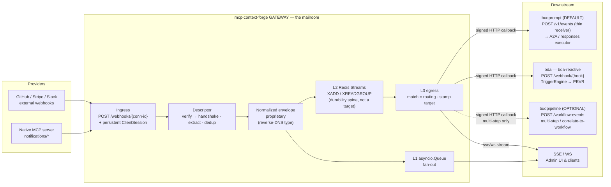

Cross-references: standards alignment is specified in §2; the canonical envelope and taxonomy in §4; the two internal bus layers plus egress in §4; the registry and the four standalone tables (`event_subscriptions`, `event_log`, `delivery_attempts`, `dead_letters`) in §5; ingress and descriptors in §6; subscriptions, the `callback_url`/`target` fields, registration paths, and fanout/correlate in §7; the publish/deliver flow and the delivery envelope in §8; the two egress adapters, the budprompt thin receiver, the bda callback, optional budpipeline, and the native-MCP path in §9; security, reliability, and observability (including the at-least-once contract and the verify-before-handshake rule) in §10; the milestone plan in §11.

---

## 2. Standards Landscape & MCP Spec Alignment

This section establishes the standards backdrop the triggers/events subsystem is built against, separates what is **finalized** from what is **provisional**, and commits to a concrete mapping between our constructs and the (still-evolving) MCP spec constructs so that ratification becomes a rename, not a rewrite. The cross-cutting architectural consequence stated up front: **we do not build event delivery on a long-held SSE connection.** The stateless direction the MCP spec is taking (§2.2 below) makes a persistent server→client channel a non-goal; we build out-of-band, durable delivery (the L2 Redis Stream + egress adapters described in §8 and §9) and treat any live SSE/WS stream as a *consumer of last resort* for the Admin UI, never as the system of record.

A second cross-cutting architectural decision stated up front: **the gateway delivers every event the same way — a single signed outbound HTTP POST to a registered callback URL.** There is exactly one push egress kind (HTTP callback) plus the streaming kind (SSE/WS) for browser clients that cannot receive a callback. The gateway **never speaks Dapr** — no sidecar, no Dapr HTTP API, no topic publishing from the gateway. This is the common webhook pattern that Stripe, GitHub, Svix, Hookdeck, and the MCP `webhooksSupported` proposal (#523) all converge on: the producer signs a POST and the receiver does the rest. The consequence for the rest of the FRD is that a subscription's *target* is just `{ callback_url, auth, echo-metadata }`, and "which downstream service" (budprompt vs bda vs budpipeline vs an external endpoint) is purely a per-subscription choice of URL, not an architecture fork (§2.5, and §9 for the full egress design).

Two normative naming contracts that this section establishes and that the rest of the FRD (§5, §7, §8, §9, §11) must use verbatim — they are called out here because the data model and the event taxonomy are cross-cutting and were previously inconsistent:

- **Canonical data model (§2.6).** The subsystem adds exactly four new standalone tables — `event_subscriptions`, `event_log`, `delivery_attempts`, `dead_letters` — with ORM classes `EventSubscription`, `EventLog`, `DeliveryAttempt`, `DeadLetter`. The subscription is a **first-class standalone entity, not a column added to `gateways`**. Per-connection inbound state (webhook signing secret, live hook registration) is a separate concern carried on the connection instance and is *not* the subscription record.
- **Canonical event taxonomy (§2.7).** The delivery envelope's `type` field is **always reverse-DNS** (`com.github.push`, `com.stripe.payment_intent.succeeded`, `com.slack.message`, and for MCP-native events `com.mcp.resource.updated` / `com.mcp.task.completed`). There is **no `io.mcp.*` namespace** anywhere in the design. This reverse-DNS taxonomy is independent of any external envelope standard — it is our own type space. bud-runtime's short `SUPPORTED_EVENTS` keys (`mcp.*`) are a *consumer-side projection* that lives at budpipeline's receiving edge on the optional multi-step budpipeline path (§2.7, §2.5/D6, §9.6) — the gateway never rewrites `type`, so this is not an alternate emission format.

### 2.1 Status legend

| Tier | Meaning | Build posture |
|---|---|---|
| **[STABLE]** | In a ratified MCP revision or a ratified external standard. | Build directly against the wire identifiers. |
| **[RC]** | Dated release candidate (Tasks extension, 2026-07-28). | Build behind an internal name; mirror semantics, do not hardcode RC method spellings on a public surface. |
| **[PROPOSAL]** | Open GitHub discussion / SEP, not adopted (`webhooksSupported` #523). | Adopt the *shape* as an internal idiom; gate the wire identifier behind a feature flag. |
| **[WG]** | Working-group charter, "Events in MCP v1" still **Ideating**. | Keep an adapter seam; expect nothing normative. |

### 2.2 The MCP spec landscape

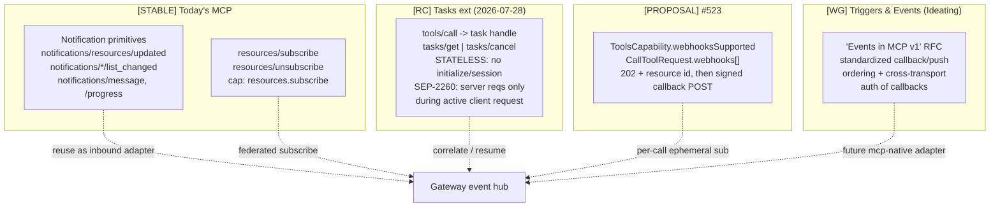

**[STABLE] — Existing notification primitives.** MCP already defines a complete set of JSON-RPC 2.0 *notifications* (no `id`, no response). The load-bearing ones for this subsystem are `notifications/resources/updated` (gated by `capabilities.resources.subscribe`), the `notifications/*/list_changed` family, and `notifications/message` (logging). These are the only push primitives we can rely on as ratified. Two facts about our current codebase bound how much of this we get "for free":

- The local `resources/subscribe` handler (`mcpgateway/main.py:5608`) and `resource_service.subscribe_resource` (`mcpgateway/services/resource_service.py:969`) only verify a *local* resource and insert a `DbSubscription` row; they do **not** subscribe upstream. Local pub/sub (`resource_service.py:120` `_event_subscribers`) only fires on the gateway's own mutations.
- Upstream MCP `ClientSession`s are one-shot (`mcpgateway/services/gateway_service.py:3809`, `:3929`, `:3712`): connect → `initialize()` → `list_*()` → tear down. There is no receive loop, so any server-initiated `notifications/resources/updated` is **dropped today**. The reverse-proxy WS router likewise discards inbound `notification` frames (`mcpgateway/routers/reverse_proxy.py:217`, TODO stub at `:219`).

> **Reliability caveat for the MCP-native path (carried to §8.3/§11).** MCP notifications carry **no provider-supplied event id** — `notifications/resources/updated` has only `uri` (+ optional `title`). Our dedup-on-`id` and `Idempotency-Key` machinery (§8.5) therefore cannot key on a provider id for this path. The MCP-native inbound adapter **synthesizes** a deterministic envelope `id` from the available fields — `id = sha256(source ‖ subject ‖ method ‖ stream-entry-id)` — and that synthesized id is what flows into dedup and `Idempotency-Key`. This is the only path where the gateway, not the provider, authors the `id`; it is called out so the guarantee in §8.5 is honestly scoped.

Closing this gap (a persistent upstream session + receive loop that re-emits these notifications as canonical events) is the **MCP-native inbound adapter** — see §2.5 and §11.

**[RC] — Tasks extension + the stateless 2026-07-28 direction.** Tasks moved *out of core* into a separate extension. `tools/call` may return a task handle (`{ "task": { "taskId", "status", "pollInterval" } }`); the client polls via `tasks/get` and may `tasks/cancel`. The decisive points for our architecture, all **provisional**:

- **No `initialize` handshake / no sessions** in the stateless profile.
- **No tasks-list enumeration** — tasks are addressed only by `taskId`.
- **SEP-2260:** a server may issue requests back to the client **only during an active, in-flight client-initiated request**. There is no general unsolicited server→client channel.

This is exactly *why a separate out-of-band delivery mechanism is required*: a stateless server cannot hold a connection open to push later. It is also the spec-level justification for **not building on long-held SSE** — the direction of travel is away from persistent server→client channels, so anchoring delivery to one would be building against the grain of the spec. The same logic favours the signed-HTTP-callback egress (§2.5): a stateless POST to a registered URL is the delivery primitive that matches a stateless server.

**[PROPOSAL] — `webhooksSupported`, discussion #523.** Proposes `ToolsCapability.webhooksSupported: bool`, a `CallToolRequest.webhooks: list[Webhook]` augmentation, and the "202 Accepted + resource id, then POST result to the registered callback URL" pattern. `Webhook` carries `url` + `authentication.strategy` (`bearer|apiKey|basic|customHeader`) + strategy-specific `credentials`. Note that #523's `authentication.strategy` is an **outbound delivery-auth** axis (how the gateway authenticates *to* the callback URL) — it is unrelated to inbound signature verification (§2.4). This proposal's outbound-signed-POST shape is **exactly our single egress primitive** (§2.5, D1): #523 is the MCP-native spelling of the same callback pattern our HTTP-callback adapter implements. This is **proposal-level only**; we adopt its *shape* as registration path (c) — see §2.4 row for per-operation subscriptions.

**[WG] — Triggers & Events Working Group.** Chartered 2026-03-24 (leads: Clare Liguori, AWS; Peter Alexander, Anthropic). Mission: a standardized callback/webhook push mechanism with **ordering guarantees**, consistent **across transports** (stdio, Streamable HTTP, out-of-band webhook), with callback authentication. Tracking artifact "Events in MCP v1" is **Ideating** — nothing normative. Notably **out of scope** for the WG: general pub/sub brokering, full workflow orchestration, and replacing transports. That scope boundary is our opportunity: the WG standardizes the *MCP-level contract*; the gateway supplies the *infrastructure* (the broker, the durable bus, the egress fan-out) the WG explicitly will not.

**The delivery envelope.** The gateway emits a simple proprietary delivery envelope (§2.5, §4) whose `event` block carries the fields `id`, `source`, `type`, `subject`, `time`, `data`. `subject` is the natural carrier for an MCP `taskId` (§Tasks) or resource `uri` (§notifications), tying envelopes back to MCP primitives. **The `time` field is provider-supplied and is *not* used to order delivery** — ordering is supplied by the L2 Redis Stream per-subject sequence (§2.3, §8.5). budprompt, bda, and budpipeline all consume this envelope directly (§9).

> **Forward-compat note.** The `event` block's field names (`id`, `source`, `type`, `subject`, `time`, `data`) are chosen so that, if CloudEvents interoperability is ever required, adopting it is a field rename rather than a rewrite. CloudEvents is **not used and not a dependency** today — the gateway emits its own envelope and no downstream consumes CloudEvents.

### 2.3 Finalized vs provisional — the commitment table

| Spec element | Tier | What we depend on | Risk if it changes |
|---|---|---|---|
| `notifications/resources/updated`, `notifications/*/list_changed`, `notifications/message` | STABLE | Inbound MCP-native adapter re-emits these into our envelope (id **synthesized** by the gateway — §2.2 caveat) | None — ratified |
| `resources/subscribe` / `resources/unsubscribe` + `capabilities.resources.subscribe` | STABLE | Upstream provisioning for MCP-native subscriptions | None — ratified |
| Proprietary delivery envelope | internal | Canonical envelope; **dedup on `id`** (`source`+`id`). Ordering is **NOT** from the envelope — it is provided by the L2 Redis Stream per-subject sequence (§8.5); `time` is informational only | None — internal contract under our control |
| Tasks `tools/call`→task handle, `tasks/get`, `tasks/cancel` | RC | `correlation_key` = `taskId`; correlate/resume routing | Method spelling / `status` enum may shift — isolated to one adapter |
| Stateless profile (no `initialize`/sessions, no tasks-list) | RC | Justifies out-of-band signed-callback delivery; no reliance on persistent client channel | None to us — *reinforces* our design |
| SEP-2260 (server reqs only during active client request) | RC/SEP | We never assume an unsolicited server→client request channel | None to us — we route out-of-band |
| `tasks/update`, `tasks/result` | RC (not finalized) | Not depended on | We poll `tasks/get`; no exposure |
| `ToolsCapability.webhooksSupported` | PROPOSAL | Capability advertisement for per-call webhooks | Flag name may change — behind feature gate |
| `CallToolRequest.webhooks[]` + `Webhook.authentication` (outbound delivery auth) | PROPOSAL | Registration path (c): per-operation ephemeral subscription; maps to our **outbound** delivery-auth recipes; shares the signed-POST shape of our one egress primitive | Field name/shape may change — internal mapping absorbs it |
| WG "Events in MCP v1" callback/notification primitives + ordering guarantees | WG (Ideating) | Future mcp-native *inbound* adapter; the WG ordering contract, when it lands, is satisfied by our per-subject stream sequence | Entirely future — adapter seam reserved, nothing built on it yet |

> **Ordering is a delivery-layer guarantee, not an envelope guarantee.** Earlier drafts attributed ordering to a `time`/`sequence` envelope field. That is incorrect and has been removed: provider-supplied `time` is unreliable and non-monotonic, and our envelope carries no `sequence` field (§4). Per-subject ordering is enforced exclusively by Redis Stream entry-id order within a per-subject delivery queue — see §8.5.

### 2.4 Spec-alignment & migration — construct mapping

Every internal construct is given a stable internal name and an explicit "maps-to" target, so that when the SEP lands the change is a localized rename behind an adapter, not a structural change. Our internal subscription record (the `(filter -> target)` binding, persisted in `event_subscriptions` — §2.6) and the delivery envelope are the **invariants**; the spec identifiers are **adapter-edge details**.

**Two distinct auth axes — do not conflate them.** The design has two independent authentication concerns that earlier drafts collapsed into one row:

- **Inbound signature verification** — how the ingress proves an incoming POST genuinely came from the provider. Recipes: `hmac | hmac_timestamped | none | plugin` (header, algo, encoding, prefix, signed-payload template). This axis has **no #523 counterpart** — #523 says nothing about inbound provider→gateway signature verification. It maps (loosely, future) only to the WG's "authentication of callbacks" topic.
- **Outbound delivery auth** — how the gateway authenticates *to* the subscriber's callback URL on egress (the single HTTP-callback egress primitive — §2.5). Recipes: `bearer | apiKey | basic | customHeader`. This axis **does** map onto #523's `Webhook.authentication.strategy` and is what registration path (c) carries. (Independently of these recipes, the gateway always HMAC-signs the outbound body so the receiver can verify the gateway as origin — §9, §10.)

| Our construct | Where it lives (grounded) | Maps to (future spec) | Tier | Rename/adaptation when SEP lands |
|---|---|---|---|---|
| `events` capability block in `Gateway.capabilities` JSON | `mcpgateway/db.py:2881`; surfaced `GatewayRead` `mcpgateway/schemas.py:3595`, added to `GatewayCreate` `mcpgateway/schemas.py:2909` | `ToolsCapability.webhooksSupported` (and any WG `events` capability) | PROPOSAL / WG | Add/rename a key inside the JSON block; no schema migration (it's a JSON column) |
| `event_subscriptions` table / `EventSubscription` ORM (standalone, **not** a `gateways` column) + `POST /subscriptions` / `DELETE /subscriptions/{id}` (registration path b) | new table (§2.6) + new route; mirrors `resources/subscribe` lifecycle at `mcpgateway/main.py:5608` | WG subscribe/unsubscribe primitive + `resources/subscribe` semantics | WG / STABLE | Add a JSON-RPC `notifications/`-band or `events/*` method alias at the `handle_rpc` catch-all (`mcpgateway/main.py:5696`); REST + `event_subscriptions` row stay |
| Per-operation `tools/call` carrying `webhooks:[{url,auth}]` (registration path c) → ephemeral correlate-mode `event_subscriptions` row | new; ephemeral sub keyed by returned task handle | `CallToolRequest.webhooks[]` + `Webhook.authentication.strategy` (#523, **outbound delivery auth**) | PROPOSAL | Read `webhooks[]` off the call params instead of our interim field name; the `url` becomes `target.callback_url` and the outbound-auth-strategy enum maps 1:1 |
| `correlation_key` (jsonpath, correlate mode) → `correlation_value` (the resolved/bound value) | `event_subscriptions` row | Tasks `taskId` / `subject` of the event | RC | Bind `correlation_key` default to the `taskId` jsonpath; `correlation_value` holds the bound handle. If Tasks renames the handle, change the extractor default only |
| `subscriber.target = { callback_url, auth, target:{agent_id,version,params} }` (single HTTP-callback egress) + MCP-native inbound adapter | `event_subscriptions.delivery`/`subscriber`; inbound notif re-emit via upstream `ClientSession` (`gateway_service.py:3809`) | #523 signed-callback shape (egress); WG `notifications/*` push (inbound) | PROPOSAL / WG / STABLE inbound | Inbound already uses STABLE `notifications/resources/updated`; egress is already the #523-shaped signed POST, so #523 ratification is a field-name rename, not a new adapter |
| Envelope `type` (reverse-DNS: `com.github.push`, `com.mcp.resource.updated`) | descriptor `type_map`; taxonomy in §2.7 | WG event `type` | internal / WG taxonomy | Taxonomy is data (YAML descriptors), not code — re-namespacing is a config edit |
| Envelope `id` (dedup) | envelope; persisted on `event_log` | WG event `id` (if/when ratified) | internal | None — ordering is *not* on the envelope (see §2.3) |
| Reverse-DNS `type` → bud-runtime short `mcp.*` `SUPPORTED_EVENTS` key | §2.7 mapping table, projected **at budpipeline's `/workflow-events` receiving edge** on the optional multi-step path (the gateway never rewrites `type`) | bud-runtime `EventTriggerService.SUPPORTED_EVENTS` keys (`services/budpipeline/budpipeline/scheduler/services.py:488-521`) | n/a (consumer constraint) | Add a row to the §2.7 mapping table per new MCP event type *if* a budpipeline workflow needs it; also add the short key to bud-runtime's `SUPPORTED_EVENTS` at its edge |
| Provider descriptor **inbound** signature-verify recipe (`hmac`/`hmac_timestamped`/`none`/`plugin`) | YAML descriptor + stored secret (no HMAC exists today — `grep` confirms none in `mcpgateway/**`) | WG "authentication of callbacks" (inbound) | WG | No #523 mapping — this is the inbound axis. Recipes stay as-is until/unless the WG defines inbound verification |
| Subscription **outbound** delivery-auth recipe (`bearer`/`apiKey`/`basic`/`customHeader`) | `event_subscriptions.delivery.auth` | `#523 Webhook.authentication.strategy` | PROPOSAL | Map our outbound recipe names onto #523's `authentication.strategy` enum 1:1 |

**What concretely renames when the SEP lands.** The expected blast radius is three edges, all isolated:

1. **JSON-RPC method names.** When the WG ratifies subscribe/push methods, we register them as aliases at the existing `handle_rpc` catch-all `elif method.startswith("notifications/")` branch (`mcpgateway/main.py:5696`, currently returns `{}`) and/or `handle_notification` (`mcpgateway/main.py:1581`). Our REST `/subscriptions` API and the `event_subscriptions` records are untouched.
2. **Capability key.** `webhooksSupported` (or the WG's chosen key) is added inside the `Gateway.capabilities` JSON block — no Alembic migration, since it is a JSON column.
3. **Per-call field + outbound-auth enum.** When `CallToolRequest.webhooks[]` is ratified, the per-operation reader switches from our interim field to the ratified one (`url` → `target.callback_url`); `Webhook.authentication.strategy` maps onto our **outbound** delivery-auth recipe names. The inbound signature-verify recipes are unaffected.

Everything downstream of the adapter edge — the `event_subscriptions` record, the delivery envelope, the L1/L2/L3 pub/sub layers (§8), the single HTTP-callback egress and the SSE/WS stream adapter (§9) — is **spec-identifier-agnostic** and does not move. §8 and §9 own the full pub/sub and egress design; this section commits only to the *naming and mapping* contract.

### 2.5 The egress decision: one signed HTTP callback, plus a streaming consumer of last resort

Two coupled architectural commitments are restated here because they are the points where our design most visibly diverges from naive alternatives: (a) we do **not** build delivery on a long-held SSE connection, and (b) the gateway delivers via a **single signed outbound HTTP POST** to a registered callback URL — it never publishes to Dapr.

**Why not long-held SSE.**

- **Spec rationale.** The stateless 2026-07-28 direction removes `initialize`/sessions and constrains server-initiated traffic to within an active client request (SEP-2260). A long-held SSE connection assumes the opposite — a durable session the server can push down. Building delivery on it would be building against the spec's direction of travel.
- **Operational rationale.** Our existing SSE/WS transports are **in-process, per-worker, non-durable**: `SSETransport` pushes onto a per-connection `asyncio.Queue` (`mcpgateway/transports/sse_transport.py:215`); the tool-service fan-out is a per-worker list of queues (`mcpgateway/services/tool_service.py:242`, `:1981`) with no cross-worker fanout; `SessionRegistry` uses fire-and-forget Redis **Pub/Sub** (`mcpgateway/cache/session_registry.py:200-201`, `:715`, `:848-867`) with no persistence or replay. None of these survive a worker restart, a redeploy, or a slow/offline consumer — unacceptable for waking or resuming an agent.

**Egress is exactly two adapter kinds.** Reflecting the unified-callback decision, the egress layer has exactly **two** kinds (§9 owns the full design); the `subscriber.kind` enum selects the adapter and is `http_callback | sse | ws` (ws shares the sse adapter):

- **(a) HTTP callback (push)** — `subscriber.kind = http_callback`, the default and primary kind. The gateway sends a single signed HTTP POST of the delivery envelope (§2.5 envelope below) to the subscription's registered `callback_url`, authenticating with the subscription's outbound delivery-auth recipe (§2.4) and HMAC-signing the body. This **one** adapter covers every push target: budprompt (the bud-runtime default target — D5), bda (`bda-reactive`), external #523-style consumers, and budpipeline when a multi-step workflow genuinely needs it. There is **no Dapr publish adapter** — the gateway has no Dapr sidecar, makes no Dapr HTTP API calls, and publishes to no topic. This is the same outbound-signed-POST pattern used by Stripe, GitHub, Svix, Hookdeck, and the MCP #523 proposal.
- **(b) SSE/WS (stream)** — strictly a *live convenience consumer* (`subscriber.kind = sse | ws`) for the Admin UI / browser/streaming clients that cannot receive an inbound callback, served off the L1 in-process fan-out. It is never the durable record and never the path that wakes a remote agent. If a live stream drops, the durable L2 stream (and `event_log`) is the source of truth.

**The subscription's target, and the delivery envelope.** A subscription's target is simply `{ callback_url, auth, echo-metadata }`. The receiver does not run a routing engine: the **gateway's subscription match is the routing** (the `(filter → target)` binding decided which agent), and the chosen target identity is **echoed on every delivery** so the receiver knows which agent to invoke without doing its own lookup. The delivery envelope the HTTP-callback adapter POSTs is:

```json
{
  "event": {
    "id":      "<unique event id, dedup key>",
    "source":  "<provider/connection>",
    "type":    "<reverse-DNS, e.g. com.github.push>",
    "subject": "<MCP taskId or resource uri>",
    "time":    "<provider-supplied, informational only>",
    "data":    { "...raw provider payload..." }
  },
  "subscription": {
    "id":             "<subscription id>",
    "delivery_id":    "<unique per attempt — idempotency key>",
    "mode":           "fanout | correlate",
    "target":         { "agent_id": "...", "version": "...", "params": { } },
    "correlation_id": null
  }
}
```

The `event` block carries the fields `id`/`source`/`type`/`subject`/`time`/`data` (§2.2, §4.5). `delivery_id` is unique **per attempt** and is the idempotency key the receiver dedups on (it is the value placed in the `Idempotency-Key` header — §8.5). `subscription.target.*`, `callback_url`, and `auth` are all set when the agent subscribes; `correlation_id` carries the task-handle / workflow step-id in correlate mode and is `null` in fanout mode. Per-subject ordering is still a delivery-layer guarantee from the L2 stream (§8.5), not anything in this envelope.

**What we build for durability.** Durable, out-of-band delivery: a Redis **Streams** L2 bus (`XADD`/`XREADGROUP`, upgrading the existing Pub/Sub pattern) feeding the two egress adapters above. At-least-once with `Idempotency-Key` = `delivery_id`, retry/backoff, and a dead-letter table (`dead_letters` — §2.6). The L2 Redis Stream is the durability/retry/replay/multi-instance spine — it is **not** a delivery target; do not confuse the internal L2 bus with egress. Redis is **already a dependency** (`pyproject.toml:80` `redis>=5.0.0`; used for leader election `gateway_service.py:488`, OAuth state `oauth_manager.py:64`, chat sessions `llmchat_router.py:69`), so adding Redis Streams introduces **no new dependency**. Full mechanics are in §8/§9.

> **Durability scope (carried to §9).** The gateway owns every delivery hop, so for the **HTTP-callback (push) kind** the headline at-least-once + unified-`dead_letters` contract holds in full: the gateway records `delivery_attempts` and dead-letters terminal failures itself. There is no longer a split where one adapter delegates durability to a third-party broker — the prior Dapr `poisonMessages` caveat is **removed** along with the Dapr adapter (D1). The **SSE/WS (stream) kind is best-effort** — it is a live convenience consumer served off the L1 fan-out and has **no DLQ**; a dropped stream is recovered by re-reading the durable L2 stream / `event_log`, not by retry+dead-lettering (§9.1/§9.2.2). If the *receiver* (budprompt, bda, budpipeline) does its own internal queuing or DLQ after acknowledging our POST, that is the receiver's concern, beyond the gateway's at-least-once boundary.

This positioning is also what makes the gateway forward-compatible with the WG's eventual cross-transport push contract: when "Events in MCP v1" defines a transport-spanning callback, it becomes *one more way to spell* the signed POST our HTTP-callback adapter already sends — behind the same `event_subscriptions` model — not a re-architecture of how events are stored and delivered.

### 2.6 Canonical data model — authoritative table & ORM names

These names are normative for the whole FRD. §5 (registry-model), §7 (subscription), §8 (publish), §9 (egress), and §11 must use exactly these table names, ORM class names, and column names; no section may rename or re-scope them. The subscription is a **standalone table**, never a column on `gateways`.

| Table | ORM class | Role | Authored/owned by |
|---|---|---|---|
| `event_subscriptions` | `EventSubscription` | The `(filter → target)` binding (§6 of AGREED DESIGN): `id`, `subscriber` (`kind` ∈ `http_callback`/`sse`/`ws`, `target_ref`), `source`/`provider`, `event_types` (glob list), `filter` (CEL), `mode` (`fanout`/`correlate`), `correlation_key` (jsonpath), `correlation_value` (resolved/bound value, indexed for correlate exact-match resume), `delivery` (`callback_url`/`auth`/`retry`/`ordering` + echoed `target` identity `{agent_id,version,params}`), standing-subscription dedup columns `subscriber_target_ref_hash` + `filter_hash` (String(64)), `owner`, `team_id`, `active`, `created_at`/`updated_at`. New first-class entity. | §7 |
| `event_log` | `EventLog` | Persisted raw + normalized event record (the "persist raw" step of §8 PUBLISH flow): envelope `id` (dedup key), `source`, `type`, `subject`, `time`, raw provider body under `data`, ingest timestamp, `gateway_id`/connection ref. | §8 |
| `delivery_attempts` | `DeliveryAttempt` | Per-subscription, per-event delivery ledger: `event_id` FK→`event_log`, `subscription_id` FK→`event_subscriptions`, `delivery_id`, attempt number, status, HTTP/adapter response, next-retry time. Covers the HTTP-callback (push) hops; SSE/WS stream deliveries are best-effort and not retried/dead-lettered (§2.5, §9.1). | §8/§9 |
| `dead_letters` | `DeadLetter` | Terminal failures after max attempts on the HTTP-callback (push) kind, surfaced in the Admin UI: `event_id`, `subscription_id`, last error, attempt count, dead-lettered timestamp. The gateway owns these push hops (no third-party broker DLQ to defer to); the best-effort SSE/WS stream kind has no DLQ. | §8/§9 |

Naming/column conventions also normative across sections: the correlation field is `correlation_key` (the jsonpath) with its resolved/bound value in `correlation_value` (the exact-match resume route, indexed per §5.4.1/§7.1.1); the per-attempt idempotency field carried in the envelope is `delivery_id`; the ephemeral-subscription expiry field is `expires_at` (not `auto_expire_at`); every table carries `team_id` + `owner_email` for tenant scoping, mirroring the `Gateway` audit/scoping block (`mcpgateway/db.py:2974-2977`). Two uniqueness/dedup constraints are normative: dedup of stored events is on `event_log(source, id)` (the envelope's natural key); standing-subscription dedup is enforced by the DB constraint `uq_event_sub_dedup` on `event_subscriptions(subscriber_target_ref_hash, filter_hash, ...)` (the two `String(64)` `_hash` columns above, per §7.1.1). §5 and §7 are reconciled to this single model: §5 describes the connection-instance inbound state (signing secret, live hook registration) which lives on the connection record and is **out of scope of these four tables**, while §7 is authoritative for `event_subscriptions`.

### 2.7 Canonical event taxonomy & the (optional) bud-runtime key mapping

**Rule (normative).** Every envelope `type` the gateway emits is **reverse-DNS**: `com.<provider>.<event>` for external providers and `com.mcp.<primitive>.<event>` for MCP-native events. The `io.mcp.*` namespace is **not used** and must not appear in any section, FR, or user story. `com.amazonaws.sns.*` etc. are valid instances of the same rule (provider = `amazonaws.sns`). This taxonomy is our own type space and is independent of any external envelope standard.

**The consumer-projection problem (only on the optional multi-step path).** The default delivery to budprompt and bda carries the reverse-DNS `type` **unchanged** — neither receiver requires a short key (budprompt invokes `target.agent_id` directly via its thin event→invoke receiver, D5; bda matches on `EventSource::Mcp` + payload conditions in its own `TriggerEngine`, D7). The short-key projection is needed **only** when a subscription targets budpipeline for a genuine multi-step workflow (D6), because bud-runtime's `EventTriggerService.SUPPORTED_EVENTS` (`services/budpipeline/budpipeline/scheduler/services.py:488-521`) gates on **short dotted** keys (`model.onboarded`, `deployment.created`, …) rather than reverse-DNS. The gateway performs **no** `type` rewrite for this path: it always POSTs the reverse-DNS `type` verbatim, and the short-key projection lives **at budpipeline's `/workflow-events` receiving edge** (§9.6 item 1) — budpipeline either registers the reverse-DNS strings directly in `SUPPORTED_EVENTS` or maps them to short keys at its own edge using this single authoritative mapping table:

| Gateway envelope `type` (reverse-DNS, emitted verbatim) | bud-runtime `SUPPORTED_EVENTS` key (short, mapped **at budpipeline's edge** on the optional path) | Notes |
|---|---|---|
| `com.mcp.resource.updated` | `mcp.resource.updated` | MCP-native `notifications/resources/updated` re-emission (id synthesized — §2.2) |
| `com.mcp.task.completed` | `mcp.task.completed` | Tasks terminal state; correlate-mode resume |
| `com.mcp.tool.triggered` | `mcp.tool.triggered` | per-operation / generic tool-originated trigger |
| `com.stripe.payment_intent.succeeded` | `mcp.payment.succeeded` | external provider example (US-2) |
| `com.github.push` | `mcp.github.push` | external provider example |
| `com.slack.message` | `mcp.slack.message` | external provider example |

When (and only when) a new MCP event type needs to drive a budpipeline workflow, add **one row here** and **one entry** to bud-runtime's `SUPPORTED_EVENTS` (`services/budpipeline/budpipeline/scheduler/services.py:488`). The mapping is data applied at budpipeline's receiving edge, not code in the gateway, and the gateway's default emission and its budprompt/bda deliveries are unaffected by it — the gateway carries reverse-DNS verbatim on every egress (D8/D1). The FR list and US-2/US-3/US-4 in §3, and §5/§8.10/§9.5/M-numbering in §11, all reference the reverse-DNS form for emission and this table only for the optional budpipeline edge projection — there is no other taxonomy in the document.

---

## 3. Functional Requirements & User Stories

This section enumerates the testable functional requirements (FRs) for the MCP triggers/events subsystem, walks through concrete end-to-end user stories, and closes with non-functional requirements. Architecture rationale and the layered design (L1/L2/L3, descriptor schema, egress adapters) are covered in the design/architecture sibling sections (§5 registry-model, §6 ingress, §7 subscription, §8 publish, §9 egress); this section references those decisions rather than restating them.

Notation conventions:

- **FR-IDs** are grouped by area; each is independently testable (a "Verify" column states the acceptance check).
- **Event-type taxonomy (authoritative rule).** The delivery envelope's `type` field is **always reverse-DNS**: `com.github.push`, `com.stripe.payment_intent.succeeded`, `com.slack.message`, and for MCP-native sources `com.mcp.resource.updated`, `com.mcp.task.completed`. The earlier `io.mcp.*` spelling is **dropped**; all references use the `com.mcp.*` prefix. This reverse-DNS taxonomy is independent of any external standard and is carried verbatim on every delivery (D2/D4). bud-runtime's `SUPPORTED_EVENTS` short-key gate (`scheduler/services.py:488`) is relevant ONLY for the optional multi-step budpipeline target (§3.1.6, FR-29) and only where that downstream applies its own routing at its own edge — it is never the canonical type the gateway carries.
- **Delivery envelope (authoritative).** The gateway emits a simple proprietary delivery envelope whose `event` block carries the fields `id`, `source`, `type`, `subject`, `time`, `data` (the prior Dapr egress path is removed — the gateway no longer publishes to Dapr; see §9 egress and D1/D2). The full envelope (event + subscription/target identity) is given after FR-12.
- **Canonical data model (authoritative; §5/§7/§8/§9/§11 all use exactly these names).** The subscription is a **standalone first-class table** (NOT a column-extension of `gateways`). **Four new standalone tables**, one ORM class each (the optional fifth `provider_descriptors` table is documented where §5 introduces it):

  | Concern | Table | ORM class |
  |---|---|---|
  | Subscription `(filter → target)` binding | `event_subscriptions` | `EventSubscription` |
  | Persisted raw accepted events | `event_log` | `EventLog` |
  | Per-delivery attempt/result records | `delivery_attempts` | `DeliveryAttempt` |
  | Exhausted-retry dead letters | `dead_letters` | `DeadLetter` |

  The connection-instance secrets (inbound webhook signing secret, outbound OAuth creds, live hook state) are stored on the **existing `gateways` row** in their dedicated columns — the inbound signing secret in the dedicated encrypted `webhook_signing_secret` column (§5.3), outbound creds in `auth_value`/`oauth_config` — **never** in `Gateway.capabilities` (which leaks via `GatewayRead`, §5.2) and never in `event_subscriptions`. The subscription table's candidate-match index is **tenant-leading**: `ix_event_subs_tenant_source_type` on `(team_id, source, event_type, active)` (§10.1.7); the correlate exact-match resume route is the indexed `correlation_value` column (`ix_event_subscriptions_corr_value`, §7.1.1). There are **no** `*_hash` columns and **no** hash-based unique constraint on `event_subscriptions`.

### 3.1 Functional requirements

#### 3.1.1 Connector/registry & capability

| FR | Requirement | Verify |
|----|-------------|--------|
| **FR-1** | The `events` capability MUST be folded into the existing connector (Gateway) definition — NOT a separate registry. The `Gateway.capabilities` JSON column (`mcpgateway/db.py:2881`) MUST carry an `events` block; one registration covers identity + auth + tools + events with a single lifecycle. | Register one gateway with `capabilities.events`; assert no second registry row is created and the events block round-trips. |
| **FR-2** | `GatewayCreate` (`mcpgateway/schemas.py:2909`) MUST accept an optional declarative `events` descriptor, and `GatewayRead` (`mcpgateway/schemas.py:3543`, which already exposes `capabilities` at `schemas.py:3595`) MUST surface it. | POST a gateway with an `events` descriptor; GET it back and assert the descriptor is present and unmodified. |
| **FR-3** | The **catalog/definition level** carries the declarative provider descriptor + event taxonomy (shared, PR-reviewed). The **connection instance** carries OAuth creds (outbound, in `auth_value`/`oauth_config`), the webhook signing secret (inbound, persisted in the dedicated encrypted `webhook_signing_secret` column on the `gateways` row — **not** in `capabilities`, per §5.3), and live hook state. Inbound/outbound secrets MUST be stored encrypted using the existing AES-GCM path (`mcpgateway/utils/services_auth.py:86/119`) or the encryption service (`mcpgateway/services/encryption_service.py`). | Persist a connection with a signing secret; assert ciphertext at rest in the `webhook_signing_secret` column (never in `capabilities`/`GatewayRead`), plaintext only after `decode_auth`/`decrypt_secret`. |
| **FR-4** | Enabling events for a provider MAY require additional OAuth scopes (e.g. GitHub `admin:repo_hook`). The system MUST detect missing scopes at subscribe time and surface an actionable error rather than silently failing upstream provisioning. | Attempt event-enable with insufficient scopes; assert a `403`/`scope_required` error naming the missing scope. |
| **FR-5** | A new provider MUST be addable with only (a) a YAML descriptor at the definition level and (b) a stored secret — **no new code** — for the ~95% of providers covered by the finite descriptor axes. | Add a brand-new provider via descriptor only; deliver a signed sample webhook end-to-end with zero code changes. |
| **FR-6** | The descriptor escape hatch (named plugin) MUST exist for the ~5% exotic providers (AWS SNS cert validation, GCP Pub/Sub base64/OIDC). A new plugin-band hook (`EVENT_*`) MUST be registerable via the existing hook registry pattern (`mcpgateway/plugins/framework/hooks/registry.py`) and declared in `plugins/config.yaml`. | Configure an AWS SNS adapter as a named plugin; assert ingress dispatches verification to the plugin. |

#### 3.1.2 Ingress & normalization

| FR | Requirement | Verify |
|----|-------------|--------|
| **FR-7** | A single generic ingress route `POST /webhooks/{conn-id}` MUST accept inbound provider POSTs. The opaque `conn-id` doubles as the capability URL (possession = authorization to deliver). Routing to a connection's descriptor MUST occur only **after** signature verification succeeds (see FR-7a); an unverified/unknown POST MUST NOT reveal whether the `conn-id` exists. | POST a correctly-signed request to a valid, events-enabled `conn-id`; assert routing to that connection's descriptor and `202`. |
| **FR-7a** | **No-leak ingress (testable).** A POST to (a) a nonexistent `conn-id`, (b) a syntactically valid but events-**disabled** `conn-id`, and (c) a valid events-enabled `conn-id` with an **invalid/missing** signature MUST all return an **identical `404 Not Found`** with the **same response body and no distinguishing timing or headers** — the ingress MUST NOT behave as a conn-id existence oracle. Signature verification for a known descriptor MUST run against a constant-time comparison; the handshake/challenge echo (FR-10) MUST run only **after** the request is attributable to a verified connection, never before. (Resolves §6.7/§8.2 ordering and the §10.1.1 no-enumeration goal.) | Issue all three request classes; assert byte-identical `404` bodies, identical header sets, and that response-time distributions are statistically indistinguishable (no oracle). Assert the Slack `url_verification` challenge is **not** echoed for an unsigned/invalid request. |
| **FR-8** | Signature verification MUST be descriptor-driven across recipes `hmac`, `hmac_timestamped`, `none`, `plugin`, parameterized by header name, algo, encoding, prefix, and a `signed_payload` template. (No HMAC verification exists today — `mcpgateway/...` grep is empty — so this is net-new.) | For each recipe, supply a valid and an invalid signature; assert `2xx`/`202` vs `404` (per FR-7a, an invalid signature is indistinguishable from unknown conn-id). |
| **FR-9** | `hmac_timestamped` recipes MUST reject replayed/stale requests outside a configurable tolerance window using the provider timestamp header. | Replay a request older than tolerance; assert rejection. |
| **FR-10** | Ingress MUST answer provider handshakes declaratively (e.g. Slack `url_verification` challenge echo) **after** the request is attributable to a verified connection (FR-7a), and before any event processing. | Send a verified Slack `url_verification` body; assert the `challenge` value is echoed with `200`. Send an unverified one; assert `404` (no echo). |
| **FR-11** | Ingress MUST normalize each accepted POST into the canonical `event` block (fields `id`/`source`/`type`/`subject`/`time`/`data`): `type` (reverse-DNS, via descriptor extraction `from header` or `jsonpath`), `id`/`dedup_id`, `subject`, `time`, `source`. The **raw provider body MUST be preserved verbatim under `data`** (no flattening, no lossy mapping). Provider/connection identity (`providerid`) and the matched subscription/trigger identity are carried in the `subscription` block at delivery time (see envelope after FR-12 and FR-13), not as event-level attributes. | Send a known provider payload; assert `event` attrs are correct AND `data` byte-equals the raw body. |
| **FR-11a** | **Synthesized `id` for sourceless events.** When a provider payload carries no usable provider-supplied event id (notably the entire **MCP-native path**, where `notifications/resources/updated` has no id — §1.2), the gateway MUST synthesize a deterministic `id` so that the connection/tenant-scoped dedup (FR-23) and `Idempotency-Key` (FR-26) are satisfiable. The synthesized id MUST be a stable hash over `(source, type, subject, time, canonicalized data)`; identical re-deliveries of the same upstream notification MUST yield the same `id`. | Re-emit the same MCP-native notification twice; assert identical synthesized `id` and a single dedup-deduplicated event. Emit two genuinely distinct notifications; assert distinct ids. |
| **FR-12** | Ingress MUST return `202 Accepted` immediately after signature verification + handshake, before delivery/matching work (async, non-blocking). | Measure that the HTTP response returns prior to any egress delivery attempt. |

Canonical delivery envelope (normative shape). The gateway delivers this as the body of a single signed outbound HTTP POST to the subscription's registered `callback_url` (D1). The `event` block holds the normalized event (fields `id`/`source`/`type`/`subject`/`time`/`data`); the `subscription` block echoes the target identity stored at registration time so the receiver knows **which agent to invoke without doing its own routing** (D3/D4):

```json
{
  "event": {
    "id": "evt_01HZX...",
    "source": "https://gw.example/webhooks/conn_abc",
    "type": "com.github.push",
    "subject": "octo-org/octo-repo",
    "time": "2026-05-30T12:00:00Z",
    "data": { "...": "raw provider body, verbatim" }
  },
  "subscription": {
    "id": "sub_01HZY...",
    "delivery_id": "dlv_01HZZ...",
    "mode": "fanout",
    "target": { "agent_id": "agent_abc", "version": "1", "params": { "...": "..." } },
    "correlation_id": null
  }
}
```

- `event.data` byte-equals the raw provider body (FR-11). The connection identity is `event.source` (and the `conn-id` it embeds); the matched subscription is `subscription.id`.
- `subscription.delivery_id` is **unique per delivery attempt** and is the idempotency token carried on the wire (FR-26). `subscription.id` is stable across retries of the same logical delivery.
- `subscription.mode` is `fanout` (spawn) or `correlate` (resume). `subscription.correlation_id` is `null` for fanout and the task-handle/step-id for correlate (FR-22).
- `subscription.target` (`agent_id`/`version`/`params`) and the `callback_url`/`auth` are set when the agent subscribes (D3); they are stored on `event_subscriptions` (FR-13) and echoed verbatim here so the receiver needs only a thin event→invoke adapter, not a routing engine (D4, §9).

#### 3.1.3 Subscription

| FR | Requirement | Verify |
|----|-------------|--------|
| **FR-13** | A subscription MUST be a `(filter -> target)` binding persisted as the standalone **`event_subscriptions`** table (ORM class **`EventSubscription`**) + an Alembic migration (following the new-table pattern of `GatewaySecurityScanFinding` at `db.py:3028` and `3c89a45f32e5_add_grpc_services_table.py`). It MUST NOT be a column-extension of `gateways`. Required fields: `id`, `subscriber{kind, target_ref}`, `source`/`provider`, `event_types` (glob list), `filter` (CEL), `mode` (`fanout`\|`correlate`), `correlation_key` (jsonpath), `correlation_value` (the resolved/bound value used as the correlate exact-match resume route; indexed via `ix_event_subscriptions_corr_value`, §7.1.1), `target{agent_id, version, params}` (echoed on delivery per D3), `delivery{callback_url, auth, retry, ordering}`, `team_id`, `owner_email`, `visibility`, `active`. Ephemeral correlate-mode subs carry an `expires_at` expiry timestamp (the canonical column name; the earlier `auto_expire_at` spelling is retired — §5.10/§7.1.1). The `target.*` and `delivery.callback_url`/`delivery.auth` fields are set at registration time and echoed verbatim in the delivery envelope's `subscription` block (D3) so the receiver needs no routing engine (D4). | Persist a sub; assert all fields round-trip in `event_subscriptions` (including `target`, `callback_url`, `correlation_value`, and `expires_at` for ephemeral subs) and migration applies cleanly on a fresh DB. |
| **FR-14** | `subscriber.kind` selects the egress **adapter** (D1) and MUST be one of `http_callback`, `sse`, `ws`. `kind=http_callback` resolves to the **single HTTP-callback egress adapter** (FR-28) — one signed outbound HTTP POST to `delivery.callback_url`; `kind=sse`/`kind=ws` resolve to the streaming adapter (FR-30, where `ws` shares the `sse` adapter). The **receiver** (budprompt, bda, an external #523 endpoint, budpipeline, or a forward-compat MCP-native callback) is distinguished by the registered `callback_url`/`auth`/payload-shaping defaults — **not** by `kind`. (The earlier receiver-as-`kind` enums `{bda, bud-runtime, sse, mcp}` and `{budprompt, bda, budpipeline, sse, mcp}` are pre-D1 leftovers and are dropped.) | Create one sub per kind; assert `http_callback` binds to the HTTP-callback adapter (FR-28) and `sse`/`ws` bind to the streaming adapter (FR-30); assert the receiver is selected by `callback_url`, not by `kind`. |
| **FR-15** | Three registration paths MUST produce the **same** `EventSubscription` record: (a) standing/declarative config (bda `trigger_store` YAML rules; bud-runtime/budprompt or budpipeline declarative trigger config); (b) programmatic `POST /subscriptions` + `DELETE /subscriptions/{id}`; (c) per-operation `tools/call` carrying `webhooks:[{url,auth}]` (#523 model) producing an ephemeral correlate-mode sub keyed by the returned task handle. Each path MUST capture `target` + `callback_url` (D3). | Register the same logical sub via each path; assert identical normalized records (same `target`/`callback_url`). |
| **FR-16** | `POST /subscriptions` MUST validate + persist the sub, **index it via the tenant-leading candidate index** `ix_event_subs_tenant_source_type` on `(team_id, source, event_type, active)` (§10.1.7), provision upstream (FR-17), and return the `id`. `DELETE /subscriptions/{id}` MUST reverse this. The lifecycle MUST mirror MCP `resources/subscribe`/`unsubscribe` semantics (`mcpgateway/main.py:5608`). | Create then delete a sub; assert index entry added then removed, and `404` after delete. |
| **FR-17** | On subscribe, the system MUST provision the upstream source: for **external** providers, auto-register the provider webhook via the stored OAuth token, **reference-counted** per `(connection, event_type)`; for **MCP-native** sources, send `resources/subscribe` over the federated session. On `DELETE`, de-register upstream only when the refcount hits 0. | Create two subs sharing one upstream hook; assert one upstream registration; delete one, assert hook persists; delete the second, assert upstream de-registration. |
| **FR-18** | The CEL filter MUST evaluate over the full envelope + `data`. A simple `type`/attribute equality fast path MUST short-circuit before full CEL evaluation. (CEL is the committed filter language; see OQ note in §3.4 — it is NOT an open question.) | Provide a sub with a `type`-only filter and one with a nested-`data` CEL expr; assert correct match/no-match for crafted events. |

`POST /subscriptions` request body (normative):

```jsonc
{
  "subscriber": { "kind": "http_callback", "target_ref": "budprompt" },
  "source": "conn_abc",
  "event_types": ["com.github.push", "com.github.pull_request.*"],
  "filter": "event.subject == 'octo-org/octo-repo' && data.ref == 'refs/heads/main'",
  "mode": "fanout",
  "correlation_key": null,
  "target": { "agent_id": "agent_abc", "version": "1", "params": { } },
  "delivery": {
    "callback_url": "https://budprompt.svc/v1/events",
    "auth": { "strategy": "bearer", "credentials": { "token_ref": "secret_xyz" } },
    "retry": { "max_attempts": 8, "backoff": "exponential" },
    "ordering": "per_subject"
  },
  "owner_email": "finance@bud.studio",
  "active": true
}
```

> The default bud-runtime receiver is **budprompt direct** (D5): with `subscriber.kind=http_callback`, `delivery.callback_url` points at budprompt's thin inbound event receiver (e.g. `POST /v1/events`), which adapts the envelope into an invocation of `target.agent_id` via budprompt's existing A2A/responses executor (§9). To route a genuinely multi-step or correlate-to-workflow event through **budpipeline** instead (D6), set `delivery.callback_url` to budpipeline's `POST /workflow-events` — this is a per-subscription URL choice (still `kind=http_callback`), not an architecture fork.

#### 3.1.4 Routing/matching

| FR | Requirement | Verify |
|----|-------------|--------|
| **FR-19** | The delivery worker MUST consume events from the L2 bus, look up candidate subs via the tenant-leading candidate index `ix_event_subs_tenant_source_type` on `(team_id, source, event_type, active)` on `event_subscriptions`, then evaluate each candidate's CEL filter, producing the matched set. | Publish an event matching 2 of 3 subs; assert exactly 2 delivery jobs enqueued. |
| **FR-20** | `event_types` globbing MUST support `*`/prefix matching against the reverse-DNS taxonomy (e.g. `com.stripe.*` matches `com.stripe.payment_intent.succeeded`). | Assert glob matches and non-matches across the taxonomy. |
| **FR-21** | **fanout (spawn)** mode MUST route an event to ALL matching subs and start a new run per subscriber; it MUST NOT require any waiting agent. | Publish with no waiting run; assert each matching fanout sub gets a delivery. |
| **FR-22** | **correlate (resume)** mode MUST route an event by **exact** match on the resolved `correlation_value` (bound from the `correlation_key` jsonpath over envelope/data, e.g. the MCP task handle / resource id), via the `ix_event_subscriptions_corr_value` index, to the single waiting run; it MUST NOT spawn a new run, and the ephemeral sub MUST auto-expire (per its `expires_at`) after a successful resume. | Create a correlate sub keyed on `taskId`; publish a matching completion event; assert exactly one resume (via `correlation_value`), no spawn, and sub removed afterward. |

```mermaid
flowchart LR
  A[POST /webhooks/conn-id] -->|verify sig FIRST| V{verified?}
  V -->|no| X[404 identical body]
  V -->|yes| B[answer handshake then 202]
  B --> C[dedup SET NX EX on conn_id/source + event.id, tenant-scoped]
  C -->|new| D[persist to event_log + XADD L2 Redis Stream]
  C -->|dup| Z[drop]
  D --> E[delivery worker XREADGROUP]
  E --> F[candidate lookup event_subscriptions via ix_event_subs_tenant_source_type team_id,source,event_type,active]
  F --> G[evaluate CEL per candidate]
  G --> H{mode}
  H -->|fanout| I[enqueue per-sub job -> spawn, target echoed]
  H -->|correlate| J[match correlation_value -> resume waiting run]
  I --> K[signed HTTP POST to callback_url + Idempotency-Key=delivery_id]
  J --> K
  K -.sse/ws subs only.-> S[stream envelope to live client]
  K -->|2xx| L[XACK + record delivery_attempts]
  K -->|5xx/timeout| M[exp-backoff retry]
  M -->|max attempts| N[dead_letters + Admin UI]
```

#### 3.1.5 Delivery/reliability

| FR | Requirement | Verify |
|----|-------------|--------|
| **FR-23** | Ingress MUST dedup on the connection/tenant-scoped key — the triple `(conn_id/source, event.id)` scoped per tenant, i.e. the Redis key `{team_id}:{conn-id}:{event.id}` (§8.3/§10.1.8) — where `event.id` is provider-supplied or synthesized per FR-11a, via Redis `SET NX EX` before persisting to `event_log`/publishing; duplicates MUST be dropped silently with `202`. (This connection-scoped key matches the `event_log` unique constraint of §5.4.2; see FR-24.) | POST the same `(conn-id, event.id)` twice; assert one L2 publish, both `202`. Assert the same `event.id` on a *different* `conn-id` is not treated as a duplicate. |
| **FR-24** | Accepted events MUST be persisted to `event_log` (under the unique constraint of §5.4.2) and `XADD`'d to an **L2 Redis Stream** (durable cross-instance bus). Delivery workers MUST consume via `XREADGROUP` consumer groups. (Extends the Redis pattern in `cache/session_registry.py:200-201` from Pub/Sub to Streams.) | Kill a worker mid-batch; assert pending entries are re-claimed and delivered by another worker. |
| **FR-25** | Delivery MUST be per-subscription queued, giving ordering (per-subject sequence) and inter-subscriber isolation (a slow/failing sub MUST NOT block others). | Stall one sub's adapter; assert other subs continue delivering. |
| **FR-26** | Every delivery MUST carry `Idempotency-Key = subscription.delivery_id` (also present in the envelope's `subscription.delivery_id`, D3). Delivery semantics are **at-least-once**; receivers dedupe on the key. The gateway makes **no exactly-once guarantee** end-to-end. | Force a redelivery; assert the same `Idempotency-Key` is sent both times. |
| **FR-27** | The gateway owns durability/retry for **HTTP-callback** targets (D1 removed the Dapr path, so there is no longer any externally-delegated durability scope). `2xx` from the receiver MUST `XACK` and record a `DeliveryAttempt`. `5xx`/timeout MUST trigger exponential-backoff retry up to `delivery.retry.max_attempts`; exhaustion MUST route the event to the **`dead_letters`** table/stream and surface it in the Admin UI. (The sse/ws adapter is best-effort with no DLQ — §9.1/§9.2.2; the at-least-once + DLQ contract here is the HTTP-callback adapter's.) | Return `500` `N` times then `200`; assert backoff then ack + `DeliveryAttempt` rows. Exceed max; assert `dead_letters` entry + UI row. |

#### 3.1.6 Egress/integration

Egress reduces to exactly **two adapter kinds** (D1): (a) the **HTTP-callback (push)** adapter — one signed outbound HTTP POST to `delivery.callback_url`, covering budprompt (default bud-runtime receiver, D5), bda (D7), external #523 receivers, and budpipeline-when-needed (D6); and (b) the **sse/ws (stream)** adapter for browser/streaming clients that cannot receive a callback. The gateway **never speaks Dapr** (no sidecar, no Dapr HTTP API, no topic publishing); the prior gateway→Dapr publish adapter is removed. This single-signed-outbound-POST shape is the common webhook pattern (Stripe/GitHub/Svix/Hookdeck and the MCP #523 proposal). "Which agent" is decided by the gateway's subscription match and carried in `subscription.target` (D3/D4); the receiver needs only a thin event→invoke adapter, not a routing engine.

| FR | Requirement | Verify |
|----|-------------|--------|
| **FR-28** | The single egress **HTTP-callback** adapter MUST deliver every event as **one signed outbound HTTP POST** of the canonical delivery envelope (event + subscription, D3) to the subscription's `delivery.callback_url`, authenticated per `delivery.auth` (FR-34) and carrying `Idempotency-Key = subscription.delivery_id` (FR-26). It MUST serve all push receivers — budprompt direct (D5), bda (FR-28a), external #523 receivers, and budpipeline (D6) — distinguished only by the registered `callback_url`/`auth`/payload-shaping defaults, not by distinct adapter code. | Register subs whose `callback_url` points at three different receivers; assert each receives one signed POST with the full envelope and the per-attempt `Idempotency-Key`. |
| **FR-28a** | **bda receiver (HTTP callback, D7).** For a sub whose `callback_url` targets bda, the HTTP-callback adapter MUST POST to the bda reactive receiver `POST /webhook/{hook_name}` (`bda-reactive/src/sources/webhook_receiver.rs:49`), honoring its `x-bda-token` auth when `BDA_WEBHOOK_TOKEN` is set, producing a bda `WebhookReceived` `SystemEvent`. bda's **own** `TriggerEngine` then matches the event to a run via `build_triggered_task_request()` → bda-daemon — that local matching is bda's existing design, NOT an extra service hop. (`EventSource::Mcp`/`TriggerSource::Mcp` added as before.) | Deliver to a running bda-reactive receiver; assert a `SystemEvent{topic: WebhookReceived}` is published on the bda EventBus and bda's TriggerEngine admits a run. |
| **FR-28b** | **budprompt receiver, direct (HTTP callback, default bud-runtime receiver, D5).** For the default bud-runtime path the `callback_url` MUST point at a **thin inbound event receiver added to budprompt** (e.g. `POST /v1/events` or `/triggers`; budprompt's FastAPI entry is `main.py`, with `a2a/routes.py`, `responses/routes.py`, `prompt/routes.py`). That receiver MUST adapt the delivery envelope into an invocation of `subscription.target.agent_id` via budprompt's **existing** A2A JSON-RPC dispatch (`POST /a2a/{prompt_id}/v{version}/`) or OpenAI-compatible execution (`POST /v1/responses/`). budprompt has agent EXECUTION + client-side MCP integration but **no inbound event receiver today and no routing engine** (`shared/mcp_foundry_service.py` is an outbound-only cleanup client — `delete_gateway`/`delete_virtual_server`). The event→A2A/responses input-shaping (payload mapping) MUST live in budprompt near the agent, keeping the gateway generic. This is a thin adapter, NOT budpipeline rebuilt inside budprompt. | Deliver to budprompt's new receiver; assert it invokes the named `target.agent_id` through the existing A2A/responses executor with the envelope mapped into the executor's input shape, with no routing-engine logic added. |
| **FR-29** | **budpipeline receiver (HTTP callback, OPTIONAL — multi-step / correlate-to-workflow only, D6).** For genuinely multi-step workflows or resuming a WAITING workflow step, the `callback_url` MAY point at budpipeline's `POST /workflow-events` (`services/budpipeline/budpipeline/main.py:217`); budpipeline's `event_router` (`route_event`/`extract_workflow_id`, `event_router.py:49/187`) and scheduler `EventTrigger`/`SUPPORTED_EVENTS` (`scheduler/services.py:488`) then drive the multi-step orchestration. For an "event wakes one agent" case the gateway MUST NOT route through budpipeline (extra hop + extra logic) — it delivers direct to budprompt (FR-28b) or bda (FR-28a). Because the target is just a `callback_url`, "direct vs via-budpipeline" is a per-subscription URL choice, not an architecture fork. The gateway delivers the canonical reverse-DNS `type` **verbatim** to budpipeline (no gateway-side translation knob); any reverse-DNS→short-`SUPPORTED_EVENTS`-key adaptation happens **at budpipeline's `/workflow-events` edge** (or budpipeline registers reverse-DNS keys directly in `SUPPORTED_EVENTS`), per §9.6/§5.1.2 — the gateway performs no short-key translation anywhere. | Register a correlate/multi-step sub whose `callback_url` is `/workflow-events`; assert budpipeline's `route_event`/`extract_workflow_id` resumes/advances the workflow and that the gateway sent the reverse-DNS `type` unchanged. Register an "event wakes one agent" sub; assert it delivers direct to budprompt/bda with no budpipeline hop. |
| **FR-30** | An egress **sse/ws** adapter MUST stream matched events to live clients/Admin UI via the existing transports (`Transport.send_message` `base.py:81`; SSE queue push `sse_transport.py:215`; WS `send_json` `websocket_transport.py:218`). This serves `subscriber.kind=sse`/`kind=ws` and is the ONLY non-callback egress kind; it exists solely for browser/streaming clients that cannot receive an outbound callback (best-effort, no DLQ — §9.1/§9.2.2). | Subscribe an SSE client (`kind=sse`); publish a matching event; assert the client receives the envelope. |
| **FR-31** | A forward-compat **MCP-native callback** receiver (for the WG callback / `notifications/*`) MUST be expressible within the same subscription model with `subscriber.kind=http_callback` and delivered via the single HTTP-callback adapter (FR-28), so it is added without altering the routing core. | Assert a sub targeting an MCP-native callback URL validates with `kind=http_callback` and binds to the HTTP-callback adapter (delivery may be feature-gated). |
| **FR-32** | The **native MCP ingress** path MUST hold an upstream MCP session, issue `resources/subscribe`, and read `notifications/resources/updated` (today these are **dropped** because federation tears down the one-shot `ClientSession` after init — `gateway_service.py:3809` `connect_to_sse_server` and `:3929` `connect_to_streamablehttp_server`, no receive loop). Received notifications MUST be emitted as the canonical reverse-DNS event **`com.mcp.resource.updated`** (subject = resource `uri`, raw under `data`), with a synthesized `id` per FR-11a. (This is an **ingress** path — MCP as an event *provider*; delivery to subscribers still uses the two egress adapters of D1.) | With a federated MCP server, mutate a subscribed resource; assert the gateway emits a `com.mcp.resource.updated` event (proving the drop at `gateway_service.py:3809`/`:3929` is fixed) with a stable synthesized `id`. |

#### 3.1.7 Security

| FR | Requirement | Verify |
|----|-------------|--------|
| **FR-33** | Inbound POSTs MUST be authenticated by descriptor-driven signature verification (FR-8/FR-9) and/or the opaque-capability `conn-id`; the `conn-id` MUST be high-entropy and unguessable (≥128 bits of entropy). Combined with FR-7a, the ingress MUST NOT leak conn-id existence/capability to an unauthenticated caller. | Brute-force a `conn-id`; assert infeasible (entropy check) and that unsigned POSTs to a signing-required connection are rejected with the FR-7a indistinguishable `404`. |
| **FR-34** | Outbound deliveries MUST authenticate per `delivery.auth.strategy` ∈ {`bearer`, `apiKey`, `basic`, `customHeader`} (aligned with #523 `Webhook.authentication`). This is the **outbound callback-auth axis** and is distinct from the inbound signature-verify recipes of FR-8 (see §3.4 axis note). Credentials MUST be stored encrypted at rest. | For each strategy assert the correct auth header is emitted; assert no plaintext secret in DB. |
| **FR-35** | Subscriptions MUST be team/owner-scoped consistent with existing gateway scoping (`team_id`/`owner_email`/`visibility`, `db.py:2974`) — these columns live on `event_subscriptions`, and `team_id` leads the candidate index `ix_event_subs_tenant_source_type` (§10.1.7) so candidate lookup is tenant-bounded. A user MUST NOT create/delete subs for connections they cannot access, and `POST /subscriptions` MUST be permission-gated like `gateways.create` (`main.py:5185`). | Attempt cross-team sub creation; assert `403`. |
| **FR-36** | Dead-letter (`dead_letters`) and persisted raw payloads (`event_log`) MUST redact secrets in any Admin UI / support-bundle surface, reusing the existing redaction logic (`mcpgateway/version.py` `_is_secret`). | Trigger a `dead_letters` entry containing a token-like field; assert redaction in UI/bundle. |

#### 3.1.8 Observability/Admin UI

| FR | Requirement | Verify |
|----|-------------|--------|
| **FR-37** | The Admin UI MUST list `event_subscriptions` (filter, mode, target, active, owner) and support create/delete. | Create/delete a sub from the UI; assert backing record changes. |
| **FR-38** | The Admin UI MUST surface delivery health from `delivery_attempts`: per-sub success/failure counts, last delivery time, current backoff state, and the `dead_letters` table with a manual replay action. (HTTP-callback targets are gateway-managed with DLQ; sse/ws is best-effort with no DLQ — D1, §9.1/§9.2.2 — so only HTTP-callback deliveries populate the dead-letter view.) | Drive an HTTP-callback sub to `dead_letters`; assert UI shows the entry and replay re-enqueues it. |
| **FR-39** | The system MUST emit metrics for: ingress accepted/rejected (by reason), dedup drops, L2 lag (XLEN/pending), per-sub delivery attempts/successes/failures, and retries; and structured logs at each pipeline stage. | Assert metric counters increment under load and `dead_letters` growth is observable. |
| **FR-40** | A live event stream view MUST be available via the sse/ws egress adapter (FR-30) for real-time debugging of normalized envelopes. | Open the live view; assert envelopes render as events arrive. |

#### 3.1.9 Spec compatibility (forward-compat)

| FR | Requirement | Verify |
|----|-------------|--------|
| **FR-41** | The `events` capability block MUST be structured so the WG `webhooksSupported` flag (discussion #523, on `ToolsCapability`) maps in as a **rename**, not a redesign. | Assert the capability schema can express `webhooksSupported` without structural change. |
| **FR-42** | The per-operation path (FR-15c) MUST accept the #523 `CallToolRequest.webhooks: [{url, authentication{strategy, credentials}}]` shape and produce a correlate-mode ephemeral sub keyed on the returned task handle (MCP Tasks RC 2026-07-28: `tools/call` returns a task handle; `tasks/get`/`tasks/cancel`). | Issue a `tools/call` with `webhooks[]`; assert an ephemeral correlate sub keyed on `taskId` (its `correlation_value`) with an `expires_at`. |
| **FR-43** | The design MUST NOT depend on long-held SSE for delivery, and MUST respect the stateless/SEP-2260 constraint (server-initiated requests only during an active client request). The out-of-band signed HTTP callback (FR-28) is the durable path; SSE/WS is for live views only. | Assert delivery succeeds with no client SSE connection open. |
| **FR-44** | Reverse-DNS event types and the JSON-RPC surface MUST extend the existing notification handling without breaking it: new `events/*` (or `notifications/*`) branches added at the `handle_rpc` catch-all (`main.py:5696`) and/or `handle_notification` (`main.py:1581`). | Assert existing `notifications/initialized\|cancelled\|message` still dispatch unchanged; new branch reachable. |

### 3.2 User stories / use cases

Each story traces the end-to-end path: provider → ingress/normalize → L2 → match → egress → agent control plane. Referenced FRs in brackets.

#### US-1 — GitHub push → bda run (external provider, fanout/spawn)
1. An operator event-enables the GitHub connector (descriptor + `admin:repo_hook` scope) and creates a `fanout` sub `subscriber.kind=http_callback` whose `callback_url` targets bda, `event_types=["com.github.push"]`, filter `data.ref == 'refs/heads/main'` [FR-1, FR-4, FR-13, FR-14, FR-15a/b].
2. The gateway auto-registers a repo webhook upstream via the stored OAuth token (refcounted) [FR-17].
3. On `git push`, GitHub POSTs to `POST /webhooks/{conn-id}`; HMAC (`X-Hub-Signature-256`) is verified **first** (an invalid signature would yield the FR-7a indistinguishable `404`), `202` returned, event normalized to `com.github.push` with raw body under `data` [FR-7, FR-7a, FR-8, FR-11, FR-12].
4. Dedup on the tenant-scoped `(conn-id, event.id)` key → persist to `event_log` → `XADD` → worker matches the bda sub → the single HTTP-callback adapter sends one signed POST of the delivery envelope to bda-reactive `POST /webhook/{hook_name}` with `Idempotency-Key = subscription.delivery_id` [FR-23, FR-24, FR-19, FR-28, FR-28a, FR-26].
5. bda-reactive emits `SystemEvent{topic: WebhookReceived}`; bda's **own** `TriggerEngine.match_event` matches a `TriggerRule`; `build_triggered_task_request()` admits a new run (bda's existing local matching, not an extra hop, D7). New `EventSource::Mcp` / `TriggerSource::Mcp` may also be used when the source is the gateway directly. (Spawn: no agent was waiting.)

#### US-2 — Stripe payment → bud-runtime agent (external provider, HTTP callback to budprompt, spawn)
1. Operator creates a `fanout` sub `subscriber.kind=http_callback`, `target_ref=budprompt`, `event_types=["com.stripe.payment_intent.succeeded"]` (reverse-DNS, canonical), with `target.agent_id` set and `delivery.callback_url` pointing at budprompt's inbound event receiver (declarative or API path) [FR-13, FR-14, FR-15, FR-28b].
2. The gateway stores the target identity (`target.agent_id`/`version`/`params`) and `callback_url`/`auth` at registration so it can echo them on delivery (D3) — no downstream routing is required [FR-13, FR-28b].
3. Stripe POSTs; descriptor verifies the `hmac_timestamped` `Stripe-Signature` (replay-protected) and normalizes to the canonical reverse-DNS type `com.stripe.payment_intent.succeeded` [FR-8, FR-9, FR-11].
4. The HTTP-callback adapter sends one signed POST of the delivery envelope (event + `subscription.target`) to budprompt's `POST /v1/events`; budprompt's thin receiver maps the envelope into its existing executor and invokes `target.agent_id` via `POST /a2a/{prompt_id}/v{version}/` or `POST /v1/responses/`, starting a NEW agent run (spawn). Durability/retry are the gateway's (FR-27); no Dapr, no budpipeline hop [FR-28, FR-28b, FR-21, FR-26].

#### US-3 — Async tool completion → resume waiting workflow step (correlate-to-workflow, budpipeline)
1. An agent issues `tools/call` carrying `webhooks:[{url, authentication}]`; the tool runs async and the server returns a task handle (`taskId`) [FR-15c, FR-42].
2. The gateway creates an **ephemeral correlate-mode** sub keyed on `taskId` (`correlation_key = $.subject`, resolved into `correlation_value`), storing the target identity + `callback_url` and an `expires_at` [FR-22, FR-13].
3. When the work completes, a `com.mcp.task.completed` event (subject = `taskId`) is ingested/normalized; if no provider id is present, the gateway synthesizes a stable `id` [FR-11, FR-11a].
4. The worker matches by **exact** `correlation_value` to the single waiting run and echoes `subscription.correlation_id = taskId` in the envelope (D3). Because this is **resuming a waiting multi-step workflow**, this is the optional budpipeline case (D6): the HTTP-callback adapter POSTs the envelope to budpipeline's `POST /workflow-events`, where `route_event`/`extract_workflow_id` (`event_router.py:49/187`) resumes the waiting step (any reverse-DNS→`SUPPORTED_EVENTS` short-key mapping happens at budpipeline's edge, not in the gateway — FR-29). No new run spawns; the ephemeral sub auto-expires per its `expires_at` [FR-22, FR-28, FR-29]. (For an "event wakes one agent" completion with no multi-step workflow, the same envelope would instead go direct to budprompt per FR-28b — a per-subscription URL choice.)

#### US-4 — Native MCP resource update → agent (MCP as a provider)
1. A federated MCP server is registered. A sub with `source = <that connector>`, `event_types=["com.mcp.resource.updated"]` is created [FR-13, FR-15b].
2. On subscribe, the gateway holds the upstream session open and sends `resources/subscribe` [FR-17, FR-32].
3. The upstream server emits `notifications/resources/updated`; the gateway's receive loop (the fix for the current drop at `gateway_service.py:3809`/`:3929`) reads it and emits the canonical reverse-DNS event **`com.mcp.resource.updated`** (subject = resource `uri`, raw under `data`). Because the upstream notification carries no id, the gateway **synthesizes** a stable `id` over `(source, type, subject, time, data)` so dedup and `Idempotency-Key` work [FR-32, FR-11, FR-11a].
4. Delivered to the agent via the single HTTP-callback adapter (one signed POST to `delivery.callback_url`, e.g. budprompt direct per FR-28b), or streamed via sse/ws if the subscriber is a live client. The canonical reverse-DNS type `com.mcp.resource.updated` is carried verbatim in the envelope [FR-19, FR-28, FR-30].

#### US-5 — Slack message → agent (handshake + descriptor-only provider)
1. A new Slack connector is added with **only** a YAML descriptor + stored signing secret (in the dedicated `webhook_signing_secret` column) — no code [FR-3, FR-5].
2. Slack's initial `url_verification` POST is **verified first**, then answered by the declarative handshake (challenge echo); an unverified handshake yields `404` with no echo [FR-7a, FR-10].
3. A real `message` event POSTs; the descriptor verifies the `hmac_timestamped` Slack signature, extracts `type` → `com.slack.message` (reverse-DNS), and normalizes [FR-8, FR-9, FR-11].
4. A `fanout` sub with filter `data.event.channel == 'C123'` routes to an `http_callback` (bda) or `sse` target; the agent reacts [FR-14, FR-18, FR-21, FR-28/FR-30].

#### US-6 — Programmatic subscribe/unsubscribe lifecycle (API path, refcount)
1. Service A `POST /subscriptions` for `com.github.pull_request.*` on connector X; upstream hook registered (refcount=1) [FR-16, FR-17].
2. Service B subscribes to the same `(connector, event_type)`; refcount=2, **no** second upstream hook [FR-17].
3. Service A `DELETE /subscriptions/{id}`; refcount=1, upstream hook retained [FR-16, FR-17].
4. Service B deletes; refcount=0, upstream hook de-registered [FR-17].

#### US-7 — Delivery failure → retry → dead-letter → replay (reliability)
1. A matched event is delivered via the HTTP-callback adapter to a sub whose `callback_url` receiver is down; deliveries get `5xx`/timeout [FR-27, FR-28].
2. Exponential backoff retries up to `max_attempts`, recording `delivery_attempts`; other subs for the same event are unaffected (isolation) [FR-25, FR-27].
3. On exhaustion the event lands in the **`dead_letters`** table/stream and appears in the Admin UI; metrics reflect failures [FR-27, FR-36, FR-38, FR-39].
4. After the receiver recovers, an operator triggers manual replay from the UI; the same `Idempotency-Key` (`subscription.delivery_id`) is reused so the receiver dedupes any prior partial [FR-26, FR-38].

> This reliability contract (at-least-once + retry + DLQ) is the gateway's for **HTTP-callback** targets, because the gateway owns that delivery end-to-end (D1; there is no externally-delegated durability path). The sse/ws adapter is best-effort with no DLQ (§9.1/§9.2.2) — it serves live views only.

#### US-8 — Live debugging via SSE (observability)
1. A developer opens the Admin UI live event view (sse/ws egress) [FR-30, FR-40].
2. They publish a test event to `POST /webhooks/{conn-id}`; the normalized envelope streams to the UI in real time, with ingress/dedup/match metrics updating [FR-39, FR-40]. Delivery to durable (HTTP-callback) targets does not depend on this SSE connection [FR-43].

### 3.3 Non-functional requirements

Concrete numeric targets below are the acceptance thresholds. Where a number cannot yet be fixed it is recorded as an Open Question in §3.4 with a resolving owner — no NFR defers its pass/fail to an unnamed future document.

| NFR | Requirement | Target / Verify |
|-----|-------------|-----------------|
| **NFR-1 (Throughput)** | The L2 Redis Stream bus and per-sub delivery workers MUST sustain provider burst rates without ingress backpressure, because ingress returns `202` before delivery work [FR-12, FR-24]. | **Sustain ≥ 1,000 accepted events/sec per gateway instance** under load test with stable XLEN (stream not growing unbounded) and ingress p99 unaffected by downstream slowness. (Aggregate cross-instance target tracked in OQ-N1, §3.4.) |
| **NFR-2 (Latency)** | Ingress (verify → `202`) MUST be low-latency and bounded; end-to-end ingress→egress latency for a healthy receiver MUST meet a concrete budget. | **Ingress verify→`202` p99 < 10 ms (excluding network);** **end-to-end ingress→first-egress-attempt p95 < 1 s** for a healthy receiver under nominal load (≤ NFR-1 throughput). |
| **NFR-3 (Ordering)** | Per-subject ordering MUST be preserved for a single subscription via per-sub queues + per-subject sequence (Redis stream id is the authority for ordering, NOT the envelope `event.time`); cross-subject and cross-sub ordering is NOT guaranteed [FR-25]. | Publish ordered same-subject events; assert in-order receipt at the sub. |
| **NFR-4 (At-least-once)** | Delivery MUST be at-least-once with `Idempotency-Key = subscription.delivery_id`; receivers MUST dedupe [FR-26]. No event accepted (`202`) and persisted to `event_log` may be silently lost short of `dead_letters`. This guarantee is the gateway's for **HTTP-callback** targets — there is no externally-delegated durability path (D1); the sse/ws adapter is best-effort with no DLQ (§9.1/§9.2.2). The gateway provides **at-least-once**, NOT exactly-once. | Inject worker crashes/redeliveries; assert every accepted event is eventually delivered (HTTP-callback) or dead-lettered, never dropped. |
| **NFR-5 (Multi-instance)** | The subsystem MUST run correctly across multiple gateway instances/workers: L1 (`tool_service._event_subscribers`, `tool_service.py:242`) is in-process only and MUST NOT be relied on for cross-instance fanout; durability/horizontal scale MUST use the L2 Redis Stream with consumer groups [FR-24]. Upstream-hook provisioning and refcounting MUST be safe under concurrency (reuse the leader-election/locking pattern in `gateway_service.py:489-501`). | Run ≥2 instances; assert no duplicate upstream hook registration and balanced delivery across workers. |
| **NFR-6 (Durability/Replay)** | Accepted raw events MUST be persisted to `event_log` and replayable from the L2 stream within a configurable retention window. | **Default retention 7 days** (configurable via setting; see OQ-N2, §3.4 for the env-var name/owner). Replay a window of events after a consumer outage; assert delivery resumes from the correct offset. |
| **NFR-7 (Backpressure isolation)** | A slow or failing single subscription MUST NOT degrade ingress or other subscriptions' delivery [FR-25]. | Stall one sub; assert others' p95 delivery latency unchanged (within NFR-2 budget). |
| **NFR-8 (Security at rest/in transit)** | All inbound signing secrets (in the dedicated `webhook_signing_secret` column, §5.3) and outbound delivery credentials MUST be encrypted at rest [FR-3, FR-34] and deliveries authenticated [FR-34]; secrets MUST be redacted in observability surfaces [FR-36]; the ingress MUST be non-enumerable [FR-7a, FR-33]. | Audit DB and support bundle for plaintext secrets; assert none. Run the FR-7a no-leak test. |
| **NFR-9 (Forward-compat stability)** | WG finalization (`webhooksSupported`, `Events in MCP v1`, Tasks RC) MUST be absorbable as renames/small additions, not a rewrite [FR-41..FR-44]. | Review the capability/subscription schemas against the #523 and Tasks shapes; assert structural compatibility. |

### 3.4 Resolved decisions and Open Questions touching this section

- **Filter language (resolved, not open).** CEL is the committed filter language (FR-18, §7.4). Any earlier "OQ-2: filter language open" is superseded — the open question is closed in favor of CEL.
- **Egress unified on one HTTP callback (resolved, D1).** The gateway delivers every event via a single signed outbound HTTP POST to a registered `callback_url`; the prior gateway→Dapr publish adapter is dropped entirely (no sidecar, no Dapr HTTP API, no topic publishing). Egress adapter kinds are exactly two: HTTP-callback (push) and sse/ws (stream) (FR-28..FR-31, §9). Any earlier text implying a separate Dapr egress kind is superseded.
- **Envelope is proprietary (resolved, D2).** The delivery envelope is proprietary; its `event` block carries the fields `id`/`source`/`type`/`subject`/`time`/`data`. The reverse-DNS type taxonomy stays and is the gateway's own type space.
- **Routing is the gateway's subscription match (resolved, D3/D4).** "Which agent" is decided by the subscription match in the gateway and echoed in `subscription.target` on every delivery; downstream targets need only a thin event→invoke adapter, not a routing engine. Any earlier text implying the receiver must route, or that events must flow through budpipeline to be routed, is superseded.
- **bud-runtime default receiver = budprompt direct (resolved, D5/D6).** The default bud-runtime receiver is budprompt's thin inbound event receiver (FR-28b); budpipeline (`POST /workflow-events`) is an OPTIONAL receiver only for genuinely multi-step workflows or resuming a waiting workflow step (FR-29). Direct-to-budprompt vs via-budpipeline is a per-subscription `callback_url` choice (both `kind=http_callback`), not an architecture fork.
- **`subscriber.kind` selects the adapter, not the receiver (clarified, D1).** `kind ∈ {http_callback, sse, ws}` chooses the egress adapter; the receiver (budprompt/bda/budpipeline/external/MCP-native) is distinguished by `callback_url`/`auth`. The pre-D1 receiver-as-`kind` enums are retired (FR-14).
- **Inbound vs outbound auth axes (clarified).** FR-8/FR-9 (descriptor signature-verify recipes) is the **inbound** axis; FR-34 (#523 callback-auth strategies for the single HTTP-callback adapter) is the **outbound** axis. They are independent and MUST NOT be conflated.
- **OQ-N1 (aggregate throughput target).** The per-instance target (NFR-1, ≥1,000 events/sec) is fixed; the cross-instance aggregate target and load-test profile are open. Resolving owner: gateway platform lead.
- **OQ-N2 (retention configuration).** NFR-6 default is 7 days; the exact env-var/setting name (under `mcpgateway/config.py`) and per-tenant override policy are open. Resolving owner: gateway platform lead.

---

## 4. System Architecture Overview

### 4.1 The gateway as "the mailroom"

The MCP Gateway (ContextForge) is the central event/trigger hub. It does **not** run agents and it does **not** own any agent control plane. It performs exactly the work a corporate mailroom performs: it **receives** inbound deliveries at a single, well-known door, **verifies** they are genuine, **normalizes** every piece into one standard envelope, **routes** each envelope to whoever subscribed to that kind of mail, and **hands it off** to the recipient's existing front door. The agent systems (`~/bda`, `~/bud-runtime`) keep full ownership of admission, scheduling, and execution — the gateway only delivers and tracks delivery.

This responsibility split is the load-bearing reason for the architecture below. Because the MCP stateless/Tasks direction forbids a general unsolicited server→client channel (server-initiated requests are allowed only *during* an active client request — SEP-2260, see §2 of the spec reference and the forward-compat discussion in the sibling protocol section), a stateless upstream cannot hold a socket open to push later. The gateway therefore *is* the durable thing that holds state between "event happened upstream" and "agent gets woken." It absorbs the at-least-once delivery, retry, dedup, and replay burden so neither the provider nor the agent has to.

**The routing decision lives in the gateway, not downstream.** Because the gateway already evaluates each subscription's filter to decide *which* subscriptions match an event, the gateway has already answered "which agent should run." Downstream targets therefore do **not** need a routing engine of their own — they need only a thin **invoke (event→agent) adapter** that takes the delivered envelope and calls the named agent. The "which agent" answer is carried in the delivery payload itself (§4.6), so the receiver invokes directly without re-deriving routing.

A registered connector is the *same* entity the gateway already uses for tools — there is no separate trigger registry. The `Gateway` ORM record carries an `events` capability block inside its existing `capabilities` JSON column (`mcpgateway/db.py:2881`, surfaced via `GatewayRead.capabilities` at `mcpgateway/schemas.py:3595`). The OUTBOUND OAuth token used to register provider hooks lives in the connector's existing credential columns (`auth_value`/`oauth_config` at `mcpgateway/db.py:2968-2972`), while the INBOUND webhook signing secret used to verify POSTs lives in a **dedicated encrypted `webhook_signing_secret` column** (§5.3) — it is **not** stored in `auth_value`/`oauth_config` or in the `capabilities` JSON (a `capabilities`-JSON location would leak via `GatewayRead`; see §5.2/§5.3). One registration = identity + auth + tools + events, one lifecycle. The connector-registry mechanics live in the sibling "Connector Registry & Capability Model" section; this section covers only how an event flows through the box.

#### 4.1.1 Canonical data model and event-type taxonomy (authoritative naming)

This subsystem is defined across several sibling sections (§5 registry-model, §7 subscription, §8 publish, §9 egress). To eliminate naming drift, **the following names are canonical and every section uses exactly these.** No section may introduce an alias.

**Canonical persistence model — four standalone tables.** The subscription is a **new first-class standalone table, NOT a column-extension of `gateways`**. (The `gateways.capabilities` JSON block only advertises the *connector's* `events` capability; the inbound signing secret lives in the dedicated `webhook_signing_secret` column and live-hook state on the connection instance — none of these store subscriptions or events.) An optional **fifth** table, `provider_descriptors`, is documented in §5 where descriptors are persisted rather than file-loaded; it is not required by the core pipeline.

| Entity | Canonical table | Canonical ORM class | Purpose |
|---|---|---|---|
| Subscription | `event_subscriptions` | `EventSubscription` | One `(filter → target)` binding (standing or auto-expiring); stores the target callback URL, target auth, and target agent identity |
| Persisted raw event | `event_log` | `EventLog` | Durable copy of every accepted event |
| Per-attempt delivery record | `delivery_attempts` | `DeliveryAttempt` | One row per egress attempt (status, response code, backoff) |
| Exhausted-delivery record | `dead_letters` | `DeadLetter` | Terminal failed deliveries surfaced in the Admin UI |

Canonical column names (binding on §5/§7/§9): the correlate-mode key column is **`correlation_key`** (the jsonpath expression) with its extracted runtime value in **`correlation_value`** (the indexed exact-match resume route); the auto-expiry column is **`expires_at`** (the name `auto_expire_at` is retired everywhere); tenant scoping uses **`team_id` + `owner_email`** mirroring `Gateway` (`mcpgateway/db.py:2974-2977`). Canonical index names: the candidate-match index is **`ix_event_subs_tenant_source_type`** on **`(team_id, source, event_type, active)`** — tenant-leading so candidate lookups are tenant-scoped at the index level (§10.1.7); the correlate exact-match resume index is **`ix_event_subscriptions_corr_value`** on `correlation_value`; and the `event_log` dedup backstop is the unique constraint **`uq_event_log_source_id`** on **`(source, ce_id)`** (§5.4.2, §11.0). New tables follow `GatewaySecurityScanFinding` (`mcpgateway/db.py:3028`) and the migration template `3c89a45f32e5_add_grpc_services_table.py`.

**Canonical event-type taxonomy — reverse-DNS for the envelope `type`.** Per the AGREED DESIGN, the delivery envelope's `type` field is always **reverse-DNS**: `com.github.push`, `com.stripe.payment_intent.succeeded`, `com.slack.message`. MCP-native events use the **`com.mcp.*`** prefix (never `io.mcp.*` and never short `mcp.*`); e.g. `com.mcp.resource.updated`, `com.mcp.task.completed`. The `io.mcp.*` and bare `mcp.*` forms are retired everywhere in this FRD (FR-list, US-2/3/4, §5, §8.10, §9.5, M-numbering in §11). This reverse-DNS taxonomy is the gateway's own naming convention and stays regardless of envelope framing (see §4.5 on the envelope).

The reverse-DNS `type` is carried verbatim end-to-end: it is identical in `event_log`, on the L2 stream, in the delivery envelope, and on every egress adapter. There is **no per-adapter type rewrite** anywhere in the pipeline. (The earlier reverse-DNS→short-key rewrite existed only for a Dapr egress path that has been removed; see D1 and §11. bud-runtime no longer keys ingestion on a short `SUPPORTED_EVENTS` dotted form for the direct-to-budprompt path — the target agent is named explicitly in the envelope per §4.6, so no type translation is required. The short-key form survives only inside budpipeline's own optional multi-step path, which is budpipeline's internal concern; see §4.4 and §9.)

### 4.2 Component pipeline

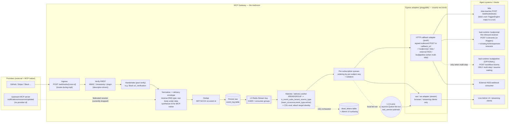

Stage-by-stage responsibilities and where each component lands in `mcp-context-forge`:

| Stage | Responsibility | Lands in (cf file) |
|---|---|---|
| Ingress | One generic route `POST /webhooks/{conn-id}`; opaque conn-id doubles as the capability URL. Returns `202 Accepted` immediately. | New router beside existing routers in `mcpgateway/main.py` (pattern of `protocol_router` at `main.py:1222`); descriptor lookup keyed by conn-id |
| Verify (first) | Signature verification (`hmac` / `hmac_timestamped` / `none` / `plugin`) runs **before any handshake response**, driven by the YAML descriptor, so the ingress never echoes a challenge or confirms a conn-id exists to an unsigned caller (closes the enumeration/reflection gap; see §10.1.3). **No HMAC code exists today** — this is net-new. | New verify module (locate during impl); reuses crypto-secret decode path of `mcpgateway/utils/services_auth.py:86` for the stored signing secret; exotic providers via plugin escape-hatch |
| Handshake (post-verify) | Provider handshakes (e.g. Slack `url_verification` challenge) answered **only after** verification passes, per the descriptor. | Same verify module |
| Normalize | Build the canonical delivery envelope with a **reverse-DNS `type`** (the gateway's own proprietary envelope; fields `id`/`source`/`type`/`subject`/`time`/`data`); keep raw provider body under `data`. For MCP-native notifications that carry no provider id, **synthesize a deterministic envelope `id`** (see §4.5). | New normalize module (locate during impl) |
| Dedup | `SET NX EX` on the envelope `id` to drop replays; dedup key is `(source, id)`. | New Redis client following per-module instantiation pattern (e.g. `cache/session_registry.py:200`) |
| Persist raw | Durable copy of the raw event into `event_log` (ORM `EventLog`); the `uq_event_log_source_id` unique constraint on `(source, ce_id)` is the DB-level dedup backstop. | New ORM table + Alembic migration following `GatewaySecurityScanFinding` (`mcpgateway/db.py:3028`) and `alembic/versions/3c89a45f32e5_add_grpc_services_table.py` |
| L2 Redis Stream bus | `XADD` to a stream; cross-instance durability, replay, horizontal scale. | New module; extends the Redis usage in `cache/session_registry.py` (today Pub/Sub at `session_registry.py:200-201,715,848-867`) from Pub/Sub to **Streams** |
| Matcher / delivery worker | `XREADGROUP` consumer group; candidate-sub lookup against `event_subscriptions` via the `ix_event_subs_tenant_source_type` index on `(team_id, source, event_type, active)`, then CEL evaluation; **attach the matched subscription's stored target identity** (agent_id/version/params) to the delivery; enqueue per-sub delivery jobs. The match **is** the routing decision (§4.1, D4). | New delivery-worker service under `mcpgateway/services/` |
| Per-subscription queues | One queue per subscription for ordering (per-subject sequence) and isolation (a slow/failing target cannot stall others). | Inside delivery-worker service |
| Egress adapters | The actual hop to each target. **Exactly two kinds** (§4.3): (a) **HTTP callback** — a single signed outbound POST to the subscription's `callback_url`, used by budprompt, bda, external #523 consumers, and budpipeline when multi-step; (b) **sse/ws** — stream to a browser/streaming client. Each carries `Idempotency-Key = delivery_id`; exp-backoff retry; writes a `delivery_attempts` row per attempt; dead-letters into `dead_letters` on exhaustion. | New `adapters/` under `mcpgateway/services/` (one class per `subscriber.kind`) |
| Dead-letter + surfacing | Failed-delivery records in `dead_letters` + Admin UI panel, for **both** adapter kinds. | New ORM table + admin route in `mcpgateway/admin.py` |

### 4.3 The three pub/sub layers

The design deliberately stacks **three** distinct mechanisms. They are not redundant; each solves a problem the others cannot, and collapsing them would either lose durability or lose liveness. **L2 is an internal Redis Streams bus — it is the durability/retry/replay/multi-instance spine inside the gateway and is NOT a delivery target.** Do not confuse the internal bus (L2) with egress (L3): events do not leave the gateway on L2.

| Layer | Mechanism | Scope | Purpose | Why it exists / why not the others |
|---|---|---|---|---|
| **L1** | In-process `asyncio.Queue` fan-out | Single worker process | Wake the live SSE/WS handlers attached to *this* worker with zero hops. | Already exists and proven: `tool_service._event_subscribers` (`tool_service.py:242`), `subscribe_events` (`tool_service.py:1932`), `_publish_event` (`tool_service.py:1981`), `event_generator` (`tool_service.py:2021`). Generalize this rather than reinvent it. It is in-memory only (per-worker `asyncio.Queue` list) — it **cannot** fan out across workers, which is exactly why L2 is required. |
| **L2** | Redis **Streams** (`XADD` / consumer groups via `XREADGROUP` / `XACK`) | All gateway instances (internal) | Durable, replayable, horizontally-scalable backbone between ingress and the delivery workers. Survives worker restart; lets N workers share a consumer group; supports replay for recovery and dead-lettering. **Internal only — not a delivery target.** | Redis is **already a dependency** (`pyproject.toml:80` `redis>=5.0.0`; used for leader election `gateway_service.py:488`, OAuth state `oauth_manager.py:64`, chat sessions `llmchat_router.py:69`), so L2 adds **no new dependency**. The existing Redis pattern in `cache/session_registry.py` is **Pub/Sub** (`session_registry.py:200-201,426,715`), which is fire-and-forget — no persistence, no replay, no at-least-once. The trigger bus needs all three, so it uses Streams, not Pub/Sub. Redis config already present: `cache_type` / `redis_url` (`config.py:1017-1018`). |
| **L3** | Egress delivery adapters (exactly two kinds: HTTP callback, sse/ws) | Gateway → agent/client | The final hop *out* of the gateway to each subscriber's own front door, with adapter-specific transport, auth, ordering, retry, and `Idempotency-Key`. | This is the only layer that crosses the trust/process boundary into another system, so it must carry per-subscription delivery semantics (auth, retry, dedup contract) that an internal queue has no notion of. It is pluggable behind the single subscription model so a new target type is a new callback URL (or, rarely, a new adapter), not a new pipeline. |

L1 is fed *from* L2 inside each worker: the delivery worker, when a matched subscription is `kind: sse` and targets a client attached to the local worker, hands the envelope to the existing in-process fan-out so the SSE/WS handler streams it (`SSETransport.send_message` at `sse_transport.py:161` pushing onto its `_message_queue`; `WebSocketTransport.send_message` at `websocket_transport.py:218`). External targets (`bda`, `budprompt`, external #523 consumers, and `budpipeline` when used) skip L1 entirely and go straight from the per-sub queue into the **HTTP callback** adapter. Critically, **delivery is never built on a long-held SSE connection** as the transport of record — SSE is one egress adapter, used only for browser/streaming clients that cannot receive a callback; the durable contract lives in L2 and the signed HTTP callback, keeping the design forward-compatible with the stateless MCP direction (see sibling protocol/forward-compat section).

**Delivery-guarantee scoping — now uniform.** The gateway's headline contract is **at-least-once with a single gateway-owned DLQ** (the `dead_letters` table + Admin UI), and the receiver dedupes on `Idempotency-Key = delivery_id` (unique per attempt; see §4.6). This holds uniformly for **both** egress kinds — the HTTP callback adapter (budprompt, bda, external #523, budpipeline-when-used) and the sse/ws adapter — because the gateway itself retries (exp-backoff) and dead-letters every delivery, writing `delivery_attempts`/`dead_letters` rows for all of them. There is **no longer any adapter that delegates durability to an external broker**: the prior Dapr exception (where durability/retry/dead-lettering for the bud-runtime target was owned by Dapr's `deadLetterTopic`) has been **removed** — the gateway never speaks Dapr (no sidecar, no Dapr HTTP API, no topic publishing). Every failed delivery, to any target, is visible in the gateway's `dead_letters` table and Admin UI (detailed in §9 and §10).

### 4.4 Spawn vs. correlate at the architecture level

Every subscription (an `event_subscriptions` row) is a `(filter → target)` binding with a `mode`. The matcher's behaviour bifurcates entirely on that mode, and the two paths exercise different parts of the pipeline:

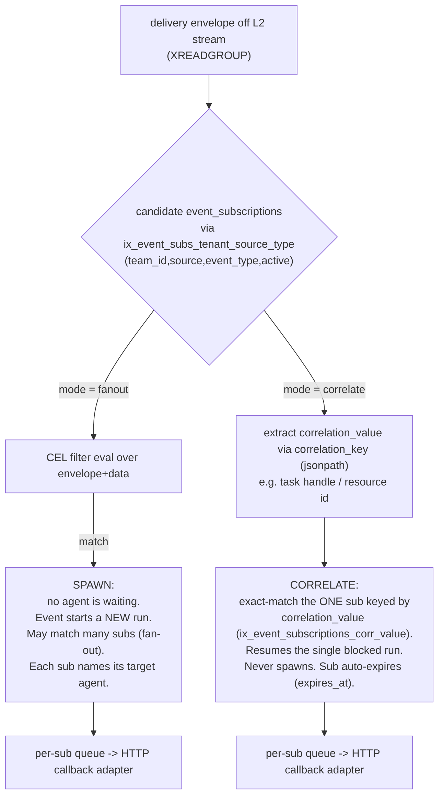

- **fanout / spawn.** No agent is currently waiting. The event is the *cause* of a new run. The matcher evaluates the CEL filter against the envelope + raw `data`; *all* matching subscriptions fire, and each independently delivers to its target (carrying that subscription's named target agent, §4.6), which **starts** work. Downstream this is `bda`'s `TriggerEngine` matching a `TriggerRule` and admitting a fresh run, or `budprompt`'s thin event receiver invoking the named agent via its existing A2A/responses executor (§4.6, D5). For "event wakes one agent," this delivers **directly to budprompt** — it does **not** route through budpipeline.
- **correlate / resume.** An agent run is **already blocked** on an async tool result (the MCP Tasks / `#523` model — a `tools/call` that returned a task handle). The event carries a correlation id (task handle / resource id). The matcher applies the subscription's `correlation_key` (jsonpath over the envelope) to extract a `correlation_value`, does an **exact-key** lookup on that value (via `ix_event_subscriptions_corr_value`), routes to the *one* waiting run, and **never spawns** anything. The subscription auto-expires (`expires_at`) after the resume. Downstream this is a `bda` run resuming on its correlation handle, **or** — for a genuinely multi-step workflow that is waiting on a step — `budpipeline`'s `event_router.route_event()` → `extract_workflow_id()` resuming the waiting step.

**budpipeline is an OPTIONAL target, not a mandatory hop.** Because the target is just a callback URL (§4.6), "direct-to-budprompt vs. via-budpipeline" is a **per-subscription choice of URL, not an architecture fork**. The default for "an event wakes one agent" is direct-to-budprompt; budpipeline is selected only for genuine **multi-step workflows** or for **resuming a WAITING workflow step** (correlate-to-workflow). Routing a single-agent wake-up through budpipeline would add an extra hop and extra logic for no benefit and is explicitly discouraged. budpipeline's `POST /workflow-events` + `event_router` (`route_event`, `extract_workflow_id`) + scheduler `EventTrigger`/`SUPPORTED_EVENTS` (`services/budpipeline/budpipeline/scheduler/services.py:488-521`) remain valid **only** for that multi-step / correlate-to-workflow case; they are budpipeline's internal concern reached over the same HTTP callback adapter.

The architectural consequence is that **the same ingress, normalize, L2 bus, per-sub queues, and single HTTP callback adapter serve both modes** — only the matcher's lookup strategy (CEL scan for fanout vs. exact-key correlation for correlate) and the subscription's lifetime (standing vs. auto-expiring via `expires_at`) differ. This is why there is one pipeline and one `event_subscriptions` record, not two parallel systems. The detailed subscription schema, registration paths, and CEL/correlation-key semantics are specified in the sibling "Subscription & Matching Model" section.

### 4.5 The delivery envelope (proprietary)

The gateway delivers a **proprietary envelope** whose inner `event` block carries the fields `id`, `source`, `type`, `subject`, `time`, `data`. (The earlier Dapr egress path was removed; see D1/D2.) The reverse-DNS `type` taxonomy (§4.1.1) is the gateway's own type space and stays either way. See the §2 forward-compat note on field-name choice.

The full delivery payload also carries the **subscriber/agent identity** so the receiver knows which agent to invoke **without doing its own routing** (D3/D4). The subscription stores its target identity at registration time, and the gateway echoes it on every delivery:

```json
{
  "event": {
    "id":      "<envelope id (provider-supplied or synthesized §4.5.1)>",
    "source":  "<connector/conn-id-derived source>",
    "type":    "com.github.push",
    "subject": "<resource/subject>",
    "time":    "<RFC-3339>",
    "data":    { "...": "raw provider body" }
  },
  "subscription": {
    "id":             "<event_subscriptions row id>",
    "delivery_id":    "<unique per attempt — the Idempotency-Key>",
    "mode":           "fanout",
    "target":         { "agent_id": "<id>", "version": "<v>", "params": { } },
    "correlation_id": null
  }
}
```

- `delivery_id` is **unique per attempt** and is the value sent as `Idempotency-Key`, so the receiver can dedupe at-least-once retries.
- `subscription.target.*` and the `callback_url` + `auth` (where the POST goes and how it is signed/authenticated) are set **when the agent subscribes** and are stored on the `event_subscriptions` row (§5/§7). `target.agent_id`/`version`/`params` tell the receiver exactly which agent to invoke.
- `mode` is `"fanout"` (spawn) or `"correlate"` (resume); for correlate, `correlation_id` carries the task-handle/step-id the resume keys on.

Because the gateway already decided "which agent" via the subscription match (§4.4, D4) and stamped it into `target`, the receiver does **not** run a routing engine — it runs a thin event→invoke adapter.

#### 4.5.1 Synthesizing the dedup id for MCP-native events (resolves the FR-23 dedup gap)

The §4.2 dedup stage keys on the envelope `id` and the FR-23 dedup requirement assumes every event has a unique `id`. But an MCP `notifications/resources/updated` carries only a `uri` (and optional `title`) — **no provider-supplied id** (spec §1.2). Dedup-on-`(source, id)` would therefore be unsatisfiable for the entire MCP-native path. To close this, **the Normalize stage synthesizes a deterministic envelope `id` for any inbound event lacking a provider id** (binding on FR-32, §8.2, and §5.7):

```
id = "sha256:" + SHA256( source + "\n" + uri + "\n" + content_hash + "\n" + occurrence_time )
```

where `source` is the connector/conn-id-derived envelope `source`, `uri` is the notification's `uri`, `content_hash` is a hash of the fetched resource body (or empty when the body is not re-fetched), and `occurrence_time` is the gateway-observed RFC-3339 timestamp truncated to a coarse window so genuine duplicates of the *same* update collapse while distinct updates do not. The result is stable across retries of the same notification (so dedup works), and the per-attempt `Idempotency-Key` is the `delivery_id` (§4.5), not the event `id`. The `type` is set to `com.mcp.resource.updated` per §4.1.1. This is the only path that synthesizes an `id`; HTTP providers supply their own per the descriptor's `dedup_id` rule.

### 4.6 Egress and the thin downstream receivers

There are **exactly two egress adapter kinds** (D1), selected by the subscription's `subscriber.kind`:

1. **`http_callback` (push)** — a single **signed outbound HTTP POST** to the subscription's registered `callback_url`, carrying the §4.5 delivery envelope, with `Idempotency-Key = delivery_id` and exp-backoff retry/dead-lettering owned by the gateway. This is the common webhook pattern (Stripe / GitHub / Svix / Hookdeck and the MCP `#523` proposal all use outbound signed HTTP POST). It serves **budprompt, bda, external `#523` consumers, and budpipeline (only when multi-step)**.
2. **`sse` / `ws` (stream)** — for **browser/streaming clients only** that cannot receive a callback. Reuses the existing L1 in-process fan-out into `SSETransport`/`WebSocketTransport`. (The `subscriber.kind` enum is therefore exactly `http_callback | sse | ws`; the receiver is distinguished by its `callback_url`, **not** by `kind` — there is no `bda`/`budprompt`/`mcp` kind.)

The gateway never speaks Dapr and never holds a long-lived push socket as the transport of record. "Which agent" is decided by the subscription match and carried in `target` (§4.4/§4.5), so each downstream needs only a thin invoke adapter:

- **bud-runtime → budprompt (DIRECT, default).** budprompt already exposes per-agent invoke endpoints — `POST /a2a/{prompt_id}/v{version}/` (A2A JSON-RPC dispatch) and `POST /v1/responses/` (OpenAI-compatible execution) — with `main.py` as the FastAPI entry and routers `a2a/routes.py`, `responses/routes.py`, `prompt/routes.py`. Its `shared/mcp_foundry_service.py` is an **outbound-only** client to the MCP gateway (`delete_gateway`/`delete_virtual_server`, cleanup only). budprompt does agent **execution** + client-side MCP integration but has **no inbound event receiver today and no routing engine**. Integration is to **add a thin inbound receiver** (e.g. `POST /v1/events` or `/triggers`) that adapts the §4.5 delivery envelope into an invocation of `target.agent_id` via budprompt's **existing** A2A/responses executor. This is an adapter, **not** budpipeline rebuilt inside budprompt. Payload-shaping note: the event must be mapped into the A2A/responses input shape; that mapping lives **in budprompt, near the agent**, keeping the gateway generic. (See §9 for the adapter spec and §11 for the milestone.)
- **bud-runtime → budpipeline (OPTIONAL).** Selected per-subscription (by setting the `callback_url` to budpipeline's `POST /workflow-events`) **only** for genuine multi-step workflows or to resume a WAITING workflow step (correlate-to-workflow). Not used for single-agent wake-ups. budpipeline's `event_router`/`SUPPORTED_EVENTS`/scheduler `EventTrigger` apply only here.
- **bda — unchanged in mechanism.** HTTP callback to bda-reactive `POST /webhook/{hook_name}`. bda's **own** `TriggerEngine` maps the event to a run via `build_triggered_task_request` → bda-daemon. That local matching is bda's existing design, **not** an extra service hop. (`EventSource::Mcp` etc. are added as before.)

### 4.7 MCP-native ingress: MCP is just another provider

The native-MCP path is a provider adapter, not a special case. Today the gateway connects to upstream MCP servers with **one-shot / ephemeral** `ClientSession`s: `connect_to_sse_server` (`gateway_service.py:3809`) and `connect_to_streamablehttp_server` (`gateway_service.py:3929`) open the session inside `async with`, call `initialize()` + `list_tools()`/`list_resources()`, then tear the session down. No receive loop reads the server stream, so server-initiated `notifications/resources/updated` are **dropped** (confirmed: no such handling in `gateway_service.py`; the reverse-proxy router likewise stubs `notification` at `routers/reverse_proxy.py:217-220`). Correspondingly, `resources/subscribe` is local-only — `resource_service.subscribe_resource` (`resource_service.py:969`) records a row and verifies the resource exists locally but never propagates the subscription upstream.

For the events subsystem the gateway holds the upstream MCP session open, issues `resources/subscribe`, reads `notifications/resources/updated`, and feeds each one into the **Normalize** stage as a delivery envelope — identical to a GitHub/Stripe webhook after verification. The MCP-native ingress is thus wired in at the same Normalize entry point as the HTTP ingress (see the dashed edge in §4.2), and the protocol-surface additions for `events/*` / `notifications/*` methods land in the `handle_rpc` catch-all (`main.py:5696`) / `handle_notification` (`main.py:1581`). The deterministic `id` synthesis for these provider-id-less notifications is specified in §4.5.1; the detailed upstream-session lifecycle and the federation receive-loop change are specified in the sibling "Native MCP & Federation" section.

---

## 5. Unified Connector Registry & Data Model

> **This section is the AUTHORITATIVE data model.** §7 (subscription), §8 (publish), §9 (egress), and §11 reference the names defined here and MUST NOT redefine tables, columns, ORM classes, or the event-type taxonomy. Where an earlier draft of those sections used a different name, the canonical name below wins. The reconciliation summary is in §5.10.

### 5.1 The unified registry decision

Triggers/events are **not** a separate registry. The existing `Gateway` connector record (`mcpgateway/db.py:2870`, table `gateways`) is the single source of identity, auth, tools, and now events. One `POST /gateways` registration (`mcpgateway/main.py:5183`) yields one connector with one lifecycle: identity (`name`, `slug`, `url`), outbound auth (`auth_type`/`auth_value`/`oauth_config` at `db.py:2968-2972`), discovered tools/resources/prompts, and the declarative **events capability**. There is no parallel "trigger registry" to keep in sync.

The model splits along three axes already present in the codebase:

| Concern | Lives on | Storage | Scope |
|---|---|---|---|
| **DEFINITION (catalog)** — declarative descriptor, event taxonomy, signature recipe, type_map | Provider descriptor (YAML, optionally DB-backed `ProviderDescriptor`) + `Gateway.capabilities.events` block | shared, PR-reviewed YAML; mirrored read-only into `capabilities` JSON | per provider *type* |
| **CONNECTION (instance)** — webhook signing secret (inbound), OAuth creds (outbound), live hook state | new columns on the `Gateway` row (`webhook_signing_secret`, `hook_state`, …) + existing `oauth_config`/`oauth_tokens` | encrypted columns + JSON | per registered connector |
| **SUBSCRIPTION (binding)** — `(filter → target)`, an independent first-class entity | **standalone `event_subscriptions` table** (NOT a column on `gateways`), FK→`gateways.id` | own table | per binding (many per connector) |

The subscription is a **standalone table**, not a column-extension of `gateways`. A connector can carry zero, one, or many subscriptions, and a subscription can be cross-connector (`gateway_id` nullable). This matches §7.1 ("Subscriptions are a new first-class entity, not a column on gateways"). The subscription row also stores its **delivery target identity** — the callback URL, its auth, and the subscriber/agent identity to echo back — so that egress (§9) is a single signed HTTP POST that needs no downstream routing (D3/D4; see §5.4.1).

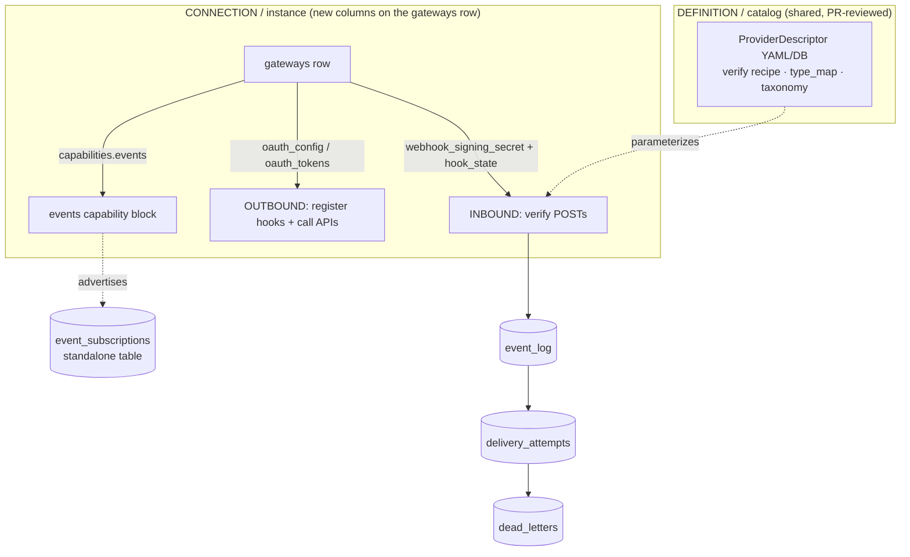

Three subsystems sit on top of this data model: the config-driven single ingress (`POST /webhooks/{conn-id}`), the subscription binding model (§7), and the three pub/sub layers (L1 in-process `tool_service._event_subscribers`, L2 Redis Streams, L3 egress adapters — §8/§9). Those are detailed in their own sibling sections; this section defines the **persisted shapes** they read and write.

> **Egress is unified on one HTTP callback (D1).** The gateway delivers every event via a single **signed outbound HTTP POST** to a per-subscription callback URL; the SSE/WS adapter remains only for browser/streaming clients that cannot receive a callback. The gateway **never speaks Dapr** — there is no Dapr egress adapter, no sidecar, no topic publishing. This is why the data-model fields below carry a `callback_url`/`auth`/`target` rather than a topic name, and why there is **no** reverse-DNS→short-key translation table or Dapr-specific DLQ carve-out in this section anymore (those existed only for the now-removed Dapr path). The full adapter set is §9; the durability/retry spine is L2 Redis Streams (§8), which is an **internal bus**, not a delivery target.

### 5.1.1 Canonical names (single source of truth)

The data model is **four required standalone tables plus one optional `provider_descriptors` table**. Every other section uses exactly these table names, ORM class names, and entity terms:

| Entity | Table name | ORM class | Required? | Defined in |
|---|---|---|---|---|
| Subscription binding (standalone) | `event_subscriptions` | `EventSubscription` | required | §5.4.1 |
| Persisted event (raw retained) | `event_log` | `EventLog` | required | §5.4.2 |
| Per-(event×subscription×attempt) delivery record | `delivery_attempts` | `DeliveryAttempt` | required | §5.4.3 |
| Terminal-failure record (DLQ) | `dead_letters` | `DeadLetter` | required | §5.4.3 |
| Optional DB-backed provider descriptor | `provider_descriptors` | `ProviderDescriptor` | optional | §5.4.4 |

There is no `subscriptions`, `events`, `events_raw`, `delivery_dlq`, or `ProviderConnection` table — earlier draft names are retired in favor of the **four required tables above plus the optional `provider_descriptors`**. The connection-instance fields live as **columns on `gateways`** (§5.3), not in a separate table. Wherever a sibling section enumerates the table set, it states "four required tables (plus the optional `provider_descriptors`)"; §11.0 may scope the optional fifth table out of the initial rollout but must acknowledge it as optional rather than omitting it.

### 5.1.2 Event-type taxonomy — authoritative rule

There is **one** authoritative taxonomy rule; this resolves the `io.mcp.*` vs `com.*` vs short `mcp.*` drift. The reverse-DNS taxonomy is independent of any external standard and is mandated for all stored and on-the-wire `type` strings.

**Rule:** the event `type` attribute is always **reverse-DNS**, namespaced by provider:
- External providers: `com.<provider>.<event>` — `com.github.push`, `com.stripe.payment_intent.succeeded`, `com.slack.message`, `com.amazonaws.sns.notification`.
- MCP-native events (gateway relaying an upstream MCP session): `com.mcp.<event>` — `com.mcp.resource.updated`, `com.mcp.task.completed`, `com.mcp.tool.triggered`. **The MCP-native prefix is `com.mcp.*`, never `io.mcp.*`.** Any `io.mcp.*` usage in the FR-list, US-2/US-3/US-4, §8.10, §9.5, M4, or M7 is a typo for `com.mcp.*` and is corrected to `com.mcp.*` there.

The reverse-DNS `type` is the **only** form used anywhere: it is stored in `event_log.evt_type` (§5.4.2), it is what `event_subscriptions.event_types` globs match against, and it is what **every** egress target (HTTP-callback receivers — budprompt, bda, external #523-style endpoints, budpipeline-when-needed — and SSE/WS clients) receives verbatim in the delivery envelope (§5.6, §8 envelope section). US-2 (Stripe) uses `com.stripe.payment_intent.succeeded` end to end.

> **Removed: the reverse-DNS → bud-runtime short-key mapping table.** A prior draft maintained a translation table (`com.mcp.tool.triggered` → `mcp.tool.triggered`, `com.stripe.payment_intent.succeeded` → `mcp.payment.succeeded`, etc.) and a per-descriptor `type_map_budruntime`, applied immediately before publishing to a Dapr topic so that bud-runtime's `EventTriggerService.SUPPORTED_EVENTS` (`services/budpipeline/budpipeline/scheduler/services.py:488-521`) would accept the key. That table existed **solely** for the Dapr egress hop, which is dropped (D1). Because the gateway now delivers via signed HTTP POST and never publishes to a Dapr topic, no short-key rewrite happens in the gateway at all. budpipeline, when it is a (callback) target for genuine multi-step workflows (§9, demoted per D6), receives the reverse-DNS `type` in the delivery envelope and performs any internal key adaptation in its own `POST /workflow-events` receiver — that is a budpipeline-side concern, not a gateway egress translation. The `type_map_budruntime` descriptor column is removed (§5.4.4).

### 5.2 Connector DEFINITION — `capabilities.events` block

The `Gateway.capabilities` JSON column (`db.py:2881`) already mirrors MCP `ServerCapabilities`. We fold an `events` sub-object into it (no new column needed for the declarative descriptor surface). The block is populated server-side during connector registration/refresh from the provider descriptor (§5.7), and surfaced read-only in `GatewayRead.capabilities` (`schemas.py:3595`).

> **Secret-exclusion rule:** `capabilities.events` is surfaced verbatim in `GatewayRead.capabilities`. The `webhook_signing_secret` (and any other secret material) **MUST NOT** appear anywhere under `capabilities`. The signing secret lives only in the dedicated encrypted column (§5.3). This is enforced by construction: the block below has no secret fields.

```jsonc
// gateways.capabilities -> events
{
  "events": {
    "webhooksSupported": true,            // capability negotiation flag (§5.7, discussion #523)
    "ingress": {
      "mode": "webhook",                  // webhook | mcp_native | none
      "descriptor_ref": "github",         // ProviderDescriptor id (§5.7); resolves verify recipe + type_map
      "path": "/webhooks/{conn-id}"       // informational; the conn-id IS the capability URL
    },
    "eventTypes": [                        // reverse-DNS taxonomy (§5.1.2) advertised by this connector
      "com.github.push",
      "com.github.pull_request.opened",
      "com.github.issues.opened"
    ],
    "extraOAuthScopes": ["admin:repo_hook"], // scopes REQUIRED to provision upstream hooks (§5.8)
    "delivery": { "guarantee": "at-least-once", "ordering": "per-subject" }
  }
}
```

For MCP-native providers (the gateway holds an upstream session and relays `notifications/resources/updated`), `ingress.mode = "mcp_native"`, `descriptor_ref` is omitted, and `eventTypes` is derived from the upstream `resources`/`tools`/`prompts` capabilities, emitted under the `com.mcp.*` prefix (§5.1.2). MCP is "just another provider adapter," so it occupies the same block.

> **MCP-native dedup id (security/reliability gap closed).** MCP `notifications/resources/updated` (spec §1.2) carries **no provider-supplied `id`**, so the dedup-on-`(evt_source, evt_id)` invariant (§5.4.2) and the per-attempt idempotency key on egress (§5.4.3) are otherwise unsatisfiable for the entire MCP-native path. The gateway therefore **synthesizes** a deterministic `evt_id` for MCP-native events: `evt_id = sha256(gateway_id + "|" + evt_source + "|" + evt_type + "|" + evt_subject + "|" + monotonic_seq)`, where `monotonic_seq` is the upstream-session relay sequence number for that `(evt_source, evt_subject)`. This is deterministic per logical event (so a relayed-twice notification dedups) yet unique across distinct notifications. The synthesis rule is part of the MCP-native adapter, not the descriptor, and is referenced by §8 and §11.

`GatewayCreate` (`schemas.py:2909`) gains an optional `events` field so a registrant can opt in / declare descriptor binding at creation; if absent it is discovered server-side (same way `capabilities` is discovered today — `GatewayCreate` has no explicit `capabilities` field).

### 5.3 Connection INSTANCE — new columns on the `gateways` row

Per-connection secrets and live hook state do **not** belong in the shared catalog and do **not** get a separate table. They are **new columns on the existing `gateways` table**, reusing the row to keep the one-registration-one-lifecycle guarantee and the existing team-scoping / cascade semantics.

| Column | Type | Null | Notes |
|---|---|---|---|
| `webhook_signing_secret` | `Text` | yes | INBOUND verify secret, **encrypted at rest** via `encode_auth`/`decode_auth` (`utils/services_auth.py:86/119`, AES-GCM) — same path as `auth_value`. **This dedicated column is the ONLY storage location for the signing secret** (decision below). Used by `POST /webhooks/{conn-id}` signature verification (§5.7). |
| `webhook_secret_algo` | `String(32)` | yes | recipe selector mirror (`hmac` \| `hmac_timestamped` \| `none` \| `plugin`); authoritative copy is in the descriptor, cached here for the hot ingress path. |
| `hook_state` | `JSON` | yes | live UPSTREAM hook registration state: `{ "<event_type>": { "external_hook_id": "...", "refcount": <int>, "registered_at": "...", "scopes_granted": [...] } }`. Refcounted per the §7 SUBSCRIBE/DELETE provisioning flow. |
| `events_enabled` | `Boolean` | no, default `false` | master switch for this connector's event ingress/egress participation. |

**Signing-secret storage decision (resolves the §5/§6.8/§10.1.2 contradiction):** the signing secret is stored **only** in the dedicated encrypted `webhook_signing_secret` column added by Migration A (§5.9). It is **NOT** stored in `Gateway.capabilities["events"]` JSON (that would leak via `GatewayRead.capabilities`, see §5.2) and **NOT** folded into the `auth_value`/`oauth_config` JSON. §6.8 and §10.1.2 reference this decision and no longer leave it "to decide during impl."

OUTBOUND credentials (registering provider webhooks, calling provider APIs) reuse the **existing** OAuth machinery unchanged:
- `Gateway.oauth_config` (`db.py:2972`) — grant type, client_id, encrypted client_secret, URLs, scopes.
- `Gateway.oauth_tokens` → `OAuthToken` (`db.py:3302`): `access_token`/`refresh_token` (encrypted via `token_storage_service.store_tokens`, `services/token_storage_service.py:84`), `scopes` JSON (`db.py:3315`), unique `(gateway_id, app_user_email)` (`db.py:3324`). Provisioning a GitHub `admin:repo_hook` hook reuses `oauth_manager.get_access_token(gateway.oauth_config)` exactly as `_forward_request_to_gateway` does today (`gateway_service.py:2474-2497`).

These OUTBOUND credentials are for the gateway calling **providers** (registering upstream hooks, polling APIs); they are distinct from the **per-subscription egress** `callback_url`/`auth` that the gateway uses to deliver events to subscribers (§5.4.1). This keeps inbound (signing secret, verify) and outbound-to-provider (OAuth) physically distinct on one row, matching the agreed design.

### 5.4 New/changed ORM tables

All new tables follow the `GatewaySecurityScanFinding` template (`db.py:3028`): `String(36)` UUID PK, `gateway_id` FK with `ondelete="CASCADE"`, composite `Index(...)` in `__table_args__`, tz-aware `created_at`. Reverse-DNS event `type` strings (§5.1.2) and the delivery envelope are stored verbatim (envelope normalized, raw provider body preserved under `data` — see §8 envelope section).

#### 5.4.1 `EventSubscription` (table `event_subscriptions`)

The `(filter → target)` binding, a **standalone first-class entity**. The three registration paths (declarative config, `POST /subscriptions`, per-`tools/call` `webhooks:[...]`) all produce one of these rows. This is the same table and column set §7.1.1 specifies.

Because egress is a single signed HTTP POST (D1) and the subscription match **is** the routing (D4), the subscription stores the full delivery target at registration time: the **callback URL + auth** the gateway POSTs to, and the **subscriber/agent identity** (`target.agent_id`/`version`/`params`) the gateway echoes back on every delivery (D3) so the receiver knows which agent to invoke without doing its own routing. These live in the `delivery` JSON (callback transport) and `target` JSON (echoed identity) columns below.

| Column | Type | Null | Notes |
|---|---|---|---|
| `id` | `String(36)` PK | no | `uuid.uuid4().hex` |
| `gateway_id` | `String(36)` FK→`gateways.id` CASCADE, indexed | yes | source connector; null for cross-provider fanout subs |
| `team_id` | `String(36)` FK→`email_teams.id`, indexed | yes | reuse gateway team-scoping (`db.py:2974`) |
| `owner_email` | `String(255)` | yes | reuse gateway scoping convention |
| `subscriber_kind` | `String(20)` | no | `http_callback` (push) \| `sse` \| `ws` — the two egress adapter kinds (D1, §9); `sse` and `ws` share one streaming adapter. `http_callback` covers budprompt, bda, external #523-style receivers, and budpipeline-when-needed; the receiver is distinguished by its callback URL, not by a per-target adapter. |
| `callback_url` | `String(2048)` | yes | egress address for `subscriber_kind="http_callback"`: the signed-POST target (e.g. budprompt `POST /v1/events`, bda-reactive `POST /webhook/{hook_name}`, budpipeline `POST /workflow-events`, or an external endpoint). Null for `sse`/`ws`, which use `subscriber_target_ref`. |
| `subscriber_target_ref` | `String(767)` | yes | streaming address for `subscriber_kind` in {`sse`,`ws`}: SSE session id / WS connection ref. (No Dapr topic — the Dapr path is removed, D1.) |
| `target` | `JSON` | yes | **echoed subscriber/agent identity (D3)**: `{ "agent_id": "...", "version": "...", "params": {...} }`. Set at registration; copied verbatim into every delivery envelope (§5.6) so the receiver invokes the named agent without routing (D4). |
| `source` | `String(255)` | yes | provider/source filter (denormalized for fast index) |
| `event_types` | `JSON` | no | reverse-DNS glob list (§5.1.2), e.g. `["com.github.*"]` |
| `filter_expr` | `Text` | yes | CEL expression over envelope+data; null = match all of `event_types` (CEL is committed per FR-18/§7.4; see OQ-2 note in §5.10) |
| `mode` | `String(12)` | no | `fanout` (spawn) \| `correlate` (resume) |
| `correlation_key` | `String(512)` | yes | jsonpath into envelope+data identifying the correlation carrier; required when `mode="correlate"` |
| `correlation_value` | `String(512)` | yes | **the resolved exact value** to match on (e.g. the task handle / resource id); required when `mode="correlate"`; this is the indexed exact-match resume route (§7, §8.9) |
| `delivery` | `JSON` | yes | callback transport params: `{ auth, retry, ordering }` (the `auth` here is how the gateway authenticates ITS signed POST to `callback_url`, distinct from the inbound `webhook_signing_secret` and from provider OAuth). |
| `active` | `Boolean` | no, default `true` | soft-disable; `false` skips provisioning |
| `expires_at` | `DateTime(tz)` | yes | set for ephemeral per-`tools/call` correlate subs (task-handle keyed); single canonical name (replaces the draft's `auto_expire_at`) |
| `created_at` | `DateTime(tz)` | no | `utc_now` |

```python
__table_args__ = (
    Index("ix_event_subs_tenant_source_type", "team_id", "source", "event_type", "active"),  # candidate-match (tenant-leading, §10.1.7)
    Index("ix_event_subscriptions_gw_mode", "gateway_id", "mode"),
    Index("ix_event_subscriptions_corr_value", "correlation_value"),  # exact-match resume routing
)
```

`correlation_key` (the jsonpath) and `correlation_value` (the resolved value) are distinct: the key says *where* to read the carrier from an incoming event; the value is *what* a correlate-sub is waiting for. The **single authoritative candidate-match index is `ix_event_subs_tenant_source_type` on `(team_id, source, event_type, active)`** — tenant-leading so the candidate scan is constrained to the caller's team first (the security requirement from §10.1.7). This one name/key-set supersedes the earlier draft names (`ix_event_subscriptions_source_active`, `ix_event_subscriptions_gw_mode` as a candidate index, `ix_event_subscriptions_candidate` on `(provider, source)`, `ix_event_subscriptions_source_type` on `(source, event_type)`) and is propagated verbatim to §3, §7.1.1, §8.6, and §11.0; no competing "supersedes" claim survives in those sections. The `correlation_value` index backs the exact-key resume route (§8.9).

There are **no** `_hash` columns and **no** unique constraint over hashed columns. Standing-subscription dedup is **not** enforced by a DB UniqueConstraint in this canonical model: there is no `subscriber_target_ref_hash`/`filter_hash` column and no `uq_event_sub_dedup` constraint. §7.1.1/§7.1.4/§7.7.1 are reconciled to this decision — they must remove `subscriber_target_ref_hash`, `filter_hash`, the `uq_event_sub_dedup` UniqueConstraint, and the 409-on-`uq_event_sub_dedup` status code. Duplicate-subscription suppression, where wanted, is an application-level check, not a hashed unique constraint.

The `delivery.auth` (egress credential), the inbound `webhook_signing_secret` (§5.3), and `Gateway.oauth_config` (provider OAuth, §5.3) are three independent secrets serving three different directions; none is a substitute for another.

#### 5.4.2 `EventLog` (table `event_log`)

Persisted event (raw provider body retained under `data`). Written after dedup, before `XADD` to L2 (the internal Redis Streams bus — §8). This is the same table §8.4 refers to (`event_log`, not `events`).

> **Column naming — neutral `evt_` prefix (D2).** The envelope columns use a neutral `evt_` prefix (`evt_id`, `evt_source`, `evt_type`, `evt_subject`, `evt_time`); the old `ce_`-prefixed names are retired in favor of this neutral naming. **These columns hold the proprietary envelope's fields** (§5.6, D2). §7/§8/§10/§11 reference the `evt_*` names; the dedup key is the envelope `id` = `event_log.evt_id`, consistent with §10.1.8 and §11.0.

| Column | Type | Null | Notes |
|---|---|---|---|
| `id` | `String(36)` PK | no | internal row id |
| `evt_id` | `String(255)` | no | envelope `id` — **dedup key**; for MCP-native events this is the synthesized id from §5.2 |
| `evt_source` | `String(767)` | no | envelope `source` (provider/tool URI) |
| `evt_type` | `String(255)` | no | reverse-DNS `type` (§5.1.2), e.g. `com.stripe.payment_intent.succeeded` |
| `evt_subject` | `String(512)` | yes | taskId / resource uri (correlation carrier) |
| `evt_time` | `DateTime(tz)` | yes | occurrence time |
| `gateway_id` | `String(36)` FK CASCADE, indexed | yes | originating connector |
| `provider_id` | `String(128)` | yes | envelope extension/source attr (the connector/provider id) |
| `data` | `JSON` | yes | **raw provider body, unflattened** |
| `raw_headers` | `JSON` | yes | original inbound headers (audit/replay) |
| `received_at` | `DateTime(tz)` | no | `utc_now` |

```python
__table_args__ = (
    UniqueConstraint("evt_source", "evt_id", name="uq_event_log_source_id"),  # dedup invariant
    Index("ix_event_log_gw_type_time", "gateway_id", "evt_type", "received_at"),
)
```

The `(evt_source, evt_id)` unique constraint (`uq_event_log_source_id`) enforces the dedup invariant at the DB layer as a backstop to the Redis `SET NX EX` fast path. §8.3/§8.4 discuss dedup on the envelope `id` (= `evt_id`) keyed by `(evt_source, evt_id)`; §10.1.8 names the same dedup key as `event_log.evt_id`.

> **`triggerid` semantics (resolves the §1.7/§5.4.2/§6.7 three-way contradiction).** `triggerid` is **per-delivery**: it equals the **subscription id** of the one subscription a delivery is for. A single event fanned out to N subscriptions produces N envelopes-on-the-wire that differ only in the `subscription` block (each `subscription.id` = that subscription's id; see the delivery envelope in §5.6). Therefore:
> - `triggerid`/`subscription.id` is **NOT** stored on `event_log` (one event → many subscriptions; no single value fits). The `event_log` row above intentionally has **no `trigger_id` column** (removed from the earlier draft).
> - It is **NOT** set at ingress to `gw.id`. At ingress, before any subscription is matched, there is no subscription, so it is simply absent from the stored event. The §6.7 ingress pseudocode must NOT set `triggerid: gw.id` — the connector id is carried by `providerid` (= `event_log.provider_id`) instead.
> - It is **stamped per delivery job in L3** (§8/§9), set to `event_subscriptions.id`, just before the adapter sends the signed POST. §1.7/FR-11's example `triggerid: sub_01HZY...` (now carried as `subscription.id` in the envelope) is correct and is "set per delivery"; align §6.7 and §1.7 to this. Subscription-to-event correlation in storage is via `delivery_attempts.subscription_id` (§5.4.3), not via a column on `event_log`.

#### 5.4.3 `DeliveryAttempt` (table `delivery_attempts`) + `DeadLetter` (table `dead_letters`)

One `DeliveryAttempt` row per (event × subscription × attempt). Terminal failures spill to `dead_letters` (surfaced in the Admin UI per FR-27/FR-38/§10.2). These are the canonical names §9.3 references (replacing the draft's `delivery_dlq`).

> **At-least-once + unified DLQ applies to ALL egress (D1).** Because every delivery is a gateway-owned signed HTTP POST (the `http_callback` adapter) or an SSE/WS push, the gateway owns end-to-end durability for **every** target: each attempt writes a `delivery_attempts` row, retries follow the exponential-backoff schedule, and terminal failures spill to the single `dead_letters` table surfaced in the Admin UI. There is **no** adapter that delegates durability elsewhere. (The earlier draft carved out the Dapr adapter — which acked a publish as soon as it handed the message to the Dapr sidecar and relied on Dapr's `poisonMessages` dead-letter topic instead of `delivery_attempts`/`dead_letters`. That adapter is removed (D1), and with it the carve-out: the unified-DLQ guarantee now holds uniformly.) §9.2.2/§9.5 are aligned to this.

`delivery_attempts`:

| Column | Type | Null | Notes |
|---|---|---|---|
| `id` | `String(36)` PK | no | |
| `event_id` | `String(36)` FK→`event_log.id` CASCADE, indexed | no | |
| `subscription_id` | `String(36)` FK→`event_subscriptions.id` CASCADE, indexed | no | this is the storage-side event↔subscription correlation |
| `attempt_no` | `Integer` | no | 1-based |
| `status` | `String(16)` | no | `pending` \| `delivered` \| `retrying` \| `failed` |
| `http_status` | `Integer` | yes | egress response code (2xx → ack) |
| `idempotency_key` | `String(255)` | no | = `event_log.evt_id`; sent as `Idempotency-Key` header on the signed POST (at-least-once; receiver dedupes). Note `delivery_id` in the envelope (§5.6) is unique **per attempt**, whereas this key is stable per logical event for dedup. |
| `error` | `Text` | yes | last error |
| `next_retry_at` | `DateTime(tz)` | yes | exponential backoff schedule |
| `created_at` | `DateTime(tz)` | no | `utc_now` |

```python
__table_args__ = (
    Index("ix_delivery_attempts_event_sub", "event_id", "subscription_id"),
    Index("ix_delivery_attempts_retry", "status", "next_retry_at"),  # worker scan for due retries
)
```

`dead_letters`:

| Column | Type | Null | Notes |
|---|---|---|---|
| `id` | `String(36)` PK | no | |
| `event_id` | `String(36)` FK→`event_log.id` CASCADE, indexed | no | |
| `subscription_id` | `String(36)` FK→`event_subscriptions.id` SET NULL, indexed | yes | SET NULL so deleting a subscription preserves failure history |
| `attempts` | `Integer` | no | total attempts made |
| `last_error` | `Text` | yes | |
| `payload_snapshot` | `JSON` | yes | full delivery envelope for manual replay |
| `created_at` | `DateTime(tz)` | no | `utc_now` |

#### 5.4.4 `ProviderDescriptor` (table `provider_descriptors`, DB-backed variant — optional)

Descriptors are primarily YAML files loaded at startup (§5.7). For runtime-managed providers ("new provider = a YAML descriptor + stored secret, no new code"), an optional DB mirror lets the Admin UI register a descriptor without a redeploy. This is the **optional fifth table** (§5.1.1); the four required tables (`event_subscriptions`, `event_log`, `delivery_attempts`, `dead_letters`) do not depend on it.

| Column | Type | Null | Notes |
|---|---|---|---|
| `id` | `String(128)` PK | no | descriptor ref, e.g. `github`, `stripe`, `slack` |
| `display_name` | `String(255)` | no | |
| `verify_recipe` | `JSON` | no | `{strategy, header, algo, encoding, prefix, signed_payload}` (§5.7) |
| `event_type_extract` | `JSON` | no | `{from: "header"\|"jsonpath", ref: "..."}` → reverse-DNS `type` |
| `dedup_id` | `String(255)` | yes | jsonpath/header for envelope `id` (external providers; MCP-native synthesizes per §5.2) |
| `subject_path` | `String(255)` | yes | jsonpath for `subject` |
| `time_path` | `String(255)` | yes | jsonpath for `time` |
| `handshake` | `JSON` | yes | e.g. Slack `url_verification` challenge recipe |
| `type_map` | `JSON` | no | template provider-event → reverse-DNS `type` (§5.1.2) |
| `plugin_ref` | `String(255)` | yes | named plugin escape hatch (SNS cert / Pub/Sub OIDC) |
| `extra_oauth_scopes` | `JSON` | yes | default scopes hooks require |
| `created_at`/`updated_at` | `DateTime(tz)` | no | `utc_now` / `onupdate` |

> **Removed: `type_map_budruntime`.** The earlier draft carried a `type_map_budruntime` JSON column mapping reverse-DNS `type` → bud-runtime short `SUPPORTED_EVENTS` keys, consulted only by the Dapr adapter. With the Dapr egress removed (D1) the gateway performs no short-key rewrite, so the column is gone. Any per-receiver `type` adaptation (e.g. inside budpipeline's `POST /workflow-events` handler) is the receiver's concern, not a descriptor field (§5.1.2).

Loading precedence: YAML descriptor on disk wins for built-in providers; DB rows cover operator-added providers. The active descriptor resolved for a connector is the one named by `capabilities.events.ingress.descriptor_ref`.

### 5.5 Relationship overview

```text
gateways (1) ──< event_subscriptions     (gateway_id, CASCADE)
gateways (1) ──< event_log               (gateway_id, CASCADE)
gateways (1) ──< oauth_tokens            (existing, OUTBOUND-to-provider creds)
event_log (1) ──< delivery_attempts      (event_id, CASCADE)
event_log (1) ──< dead_letters           (event_id, CASCADE)
event_subscriptions (1) ──< delivery_attempts (subscription_id, CASCADE)
event_subscriptions (1) ──< dead_letters      (subscription_id, SET NULL)
provider_descriptors (1) ··· gateways    (logical via capabilities.events.ingress.descriptor_ref)
```

### 5.6 Pydantic schemas

Added to `mcpgateway/schemas.py` alongside the gateway schemas (`GatewayCreate` 2909, `GatewayRead` 3543). `EventsCapability` is embedded into `GatewayCreate`/`GatewayRead`.

The delivery envelope is a **proprietary** shape (D2). Its `event` block carries the fields `id`, `source`, `type`, `subject`, `time`, `data`. (The storage columns in §5.4.2 use the neutral `evt_*` prefix and hold these same fields.) The full envelope delivered on every signed POST (D3):

```jsonc
// body of the signed HTTP POST to event_subscriptions.callback_url
{
  "event": {
    "id":      "...",        // dedup id (= event_log.evt_id)
    "source":  "...",        // provider/tool URI
    "type":    "com.github.push",   // reverse-DNS (§5.1.2), verbatim
    "subject": "...",        // correlation carrier (taskId / resource uri)
    "time":    "...",        // occurrence time
    "data":    { }           // raw provider body, unflattened
  },
  "subscription": {
    "id":          "sub_01HZY...",     // = event_subscriptions.id (was "triggerid", §5.4.2)
    "delivery_id": "del_01J0...",      // UNIQUE PER ATTEMPT (idempotency, §5.4.3)
    "mode":        "fanout",           // "fanout" | "correlate"
    "target":      { "agent_id": "...", "version": "...", "params": { } }, // echoed identity (D3)
    "correlation_id": null              // null, or "<task-handle/step-id>" for correlate (D6)
  }
}
```

`target.*` and `callback_url`/`delivery.auth` are set when the agent subscribes; the gateway echoes `target` on every delivery so the receiver invokes the named agent directly — the subscription match in the gateway **is** the routing (D4), and the receiver needs only a thin event→invoke adapter, not a routing engine.

```python
class WebhookVerifyRecipe(BaseModel):
    strategy: Literal["hmac", "hmac_timestamped", "none", "plugin"] = "hmac"
    header: Optional[str] = None
    algo: Optional[str] = "sha256"
    encoding: Optional[Literal["hex", "base64"]] = "hex"
    prefix: Optional[str] = None            # e.g. "sha256="
    signed_payload: Optional[str] = None    # template, e.g. "{timestamp}.{body}"

class EventsCapability(BaseModel):
    webhooks_supported: bool = Field(False, alias="webhooksSupported")
    ingress_mode: Literal["webhook", "mcp_native", "none"] = "none"
    descriptor_ref: Optional[str] = None
    event_types: List[str] = Field(default_factory=list, alias="eventTypes")  # reverse-DNS (§5.1.2)
    extra_oauth_scopes: List[str] = Field(default_factory=list, alias="extraOAuthScopes")
    # NOTE: no signing-secret field — secrets never appear in capabilities (§5.2)

class TargetRef(BaseModel):                 # echoed subscriber/agent identity (D3)
    agent_id: str
    version: Optional[str] = None
    params: Dict[str, Any] = Field(default_factory=dict)

class SubscriberRef(BaseModel):
    kind: Literal["http_callback", "sse", "ws"]   # two egress adapter kinds (D1, §9); sse|ws share one adapter
    callback_url: Optional[str] = None      # required for kind="http_callback"
    target_ref: Optional[str] = None        # SSE session id / WS connection ref for sse|ws

class SubscriptionCreate(BaseModel):       # POST /subscriptions
    gateway_id: Optional[str] = None
    subscriber: SubscriberRef
    target: Optional[TargetRef] = None      # echoed agent identity (D3); set for http_callback agent targets
    source: Optional[str] = None
    event_types: List[str]                 # reverse-DNS globs (§5.1.2)
    filter: Optional[str] = None           # CEL
    mode: Literal["fanout", "correlate"] = "fanout"
    correlation_key: Optional[str] = None
    correlation_value: Optional[str] = None
    delivery: Dict[str, Any] = Field(default_factory=dict)  # {auth, retry, ordering} for the signed POST

    @model_validator(mode="after")
    def _corr(self):
        if self.mode == "correlate" and not (self.correlation_key and self.correlation_value):
            raise ValueError("correlation_key and correlation_value required when mode='correlate'")
        return self

    @model_validator(mode="after")
    def _callback(self):
        if self.subscriber.kind == "http_callback" and not self.subscriber.callback_url:
            raise ValueError("callback_url required when subscriber.kind='http_callback'")
        return self

class SubscriptionRead(BaseModelWithConfigDict):
    id: str
    gateway_id: Optional[str]
    subscriber: SubscriberRef
    target: Optional[TargetRef]
    source: Optional[str]
    event_types: List[str]
    filter: Optional[str]
    mode: str
    correlation_key: Optional[str]
    correlation_value: Optional[str]
    active: bool
    expires_at: Optional[datetime]
    created_at: datetime

class EventEnvelope(BaseModelWithConfigDict):    # the "event" block of the delivery body (§5.6)
    id: str
    source: str
    type: str                               # reverse-DNS (§5.1.2)
    subject: Optional[str] = None
    time: Optional[datetime] = None
    data: Any = None                        # raw provider body, unflattened
    # NOTE: proprietary envelope (D2); fields id/source/type/subject/time/data

class DeliveryEnvelope(BaseModelWithConfigDict):  # full signed-POST body (§5.6)
    event: EventEnvelope
    subscription: Dict[str, Any]            # {id, delivery_id, mode, target, correlation_id}

class DeliveryAttemptRead(BaseModelWithConfigDict):
    id: str
    event_id: str
    subscription_id: str
    attempt_no: int
    status: str
    http_status: Optional[int]
    next_retry_at: Optional[datetime]
```

`GatewayCreate` gains `events: Optional[EventsCapability] = None`; `GatewayRead` already exposes `capabilities: Dict[str, Any]` (`schemas.py:3595`), so the negotiated block surfaces under `capabilities["events"]` with no schema change (an optional typed `events: Optional[EventsCapability]` convenience accessor can be added). Because `EventsCapability` has no secret field, the secret-exclusion rule (§5.2) holds at the schema level.

### 5.7 Capability negotiation (`webhooksSupported`)

`webhooksSupported` (discussion #523, advertised on `ToolsCapability`) drives whether a connector participates in event ingress:

1. **MCP-native connectors** — during `_initialize_gateway` (`gateway_service.py:3039`) the gateway reads the upstream server's negotiated `capabilities`. If `capabilities.tools.webhooksSupported` is true (or `capabilities.resources.subscribe`), it writes `capabilities.events.webhooksSupported = true` and `ingress_mode = "mcp_native"` into the `gateways.capabilities` JSON.
2. **External (webhook) connectors** — `webhooksSupported` is set from the bound `ProviderDescriptor` (presence of a `verify_recipe`), independent of any MCP capability.
3. **Negotiation surface** — `GatewayRead.capabilities.events.webhooksSupported` is what downstream `/subscriptions` validation checks before allowing a subscription against that connector; a `POST /subscriptions` to a connector with `webhooksSupported=false` is rejected. This keeps the flag a *negotiated* property, forward-compatible with the WG "Events in MCP v1" rename (a finalized flag name is a one-line mapping in the descriptor loader, not a schema rewrite). Note that #523 itself proposes outbound signed HTTP POST as the delivery mechanism, which is exactly the gateway's single `http_callback` egress adapter (D1, §9).

The ingress route `POST /webhooks/{conn-id}` resolves `{conn-id}` → `gateways` row → `capabilities.events.ingress.descriptor_ref` → descriptor verify recipe, **verifies the signature first** using the decrypted `webhook_signing_secret`, and only on success answers any handshake, builds the event envelope via the descriptor's extract/type_map (reverse-DNS `type`, §5.1.2), and returns `202`. The verify-before-handshake ordering closes the enumeration-oracle gap noted for §6.7/§6.9/§8.2: an unknown or signature-failing `{conn-id}` returns an indistinguishable `404`/`401` with no handshake echo and no reflected challenge, preserving the FR-33/§10.1.3 unguessability/no-enumeration goal. §8.2 is corrected to this same order (verify → handshake → build → 202). (Verification implementation is greenfield — no HMAC/webhook verify exists in the repo today.)

### 5.8 Extra-OAuth-scope handling

Enabling events on a connector that auto-registers upstream provider webhooks may require **more** OAuth scopes than tool calls (e.g. GitHub `admin:repo_hook`, Stripe webhook endpoint scopes). Handling:

- The descriptor declares `extra_oauth_scopes`; these are merged into `capabilities.events.extraOAuthScopes` for the connector.
- On `events_enabled` flip / first subscription requiring upstream provisioning, the gateway compares `extraOAuthScopes` against the granted scopes on the current `OAuthToken.scopes` (`db.py:3315`). If insufficient, provisioning is blocked with an actionable error and the connector is flagged needs-reauth; the operator re-runs the OAuth authorization-code flow (existing `oauth_manager` / `token_storage_service` path) with the augmented scope set.
- Granted scopes per provisioned hook are recorded in `gateways.hook_state[<event_type>].scopes_granted` for audit and refcounted teardown.
- Outbound hook registration itself reuses `oauth_manager.get_access_token(gateway.oauth_config)` (client_credentials) or `token_storage.get_user_token(...)` (authorization_code) exactly as the existing relay does (`gateway_service.py:2474-2497`). This OAuth is for calling the **provider**; it is unrelated to the per-subscription `delivery.auth` used to sign the egress POST to subscribers (§5.4.1).

### 5.9 Alembic migration plan

Migrations live in `mcpgateway/alembic/versions/` and follow `3c89a45f32e5_add_grpc_services_table.py` (`op.create_table` with `String(36)` PK, `JSON` columns, `server_default` for booleans, FK to `email_teams.id`). The current head chains through `3c89a45f32e5` → `h2b3c4d5e6f7_add_oauth_config_to_a2a_agents.py` (confirm with `alembic heads` before authoring, since merge migrations exist e.g. `9a79c73f2b78_merge_*`).

Two migrations, applied in order:

**Migration A — `<hash>_add_events_to_gateways.py`** (`down_revision` = current head). This migration is the single authoritative source of the signing-secret column (§5.3):
- `op.add_column("gateways", sa.Column("webhook_signing_secret", sa.Text, nullable=True))`
- `op.add_column("gateways", sa.Column("webhook_secret_algo", sa.String(32), nullable=True))`
- `op.add_column("gateways", sa.Column("hook_state", sa.JSON, nullable=True))`
- `op.add_column("gateways", sa.Column("events_enabled", sa.Boolean, nullable=False, server_default=sa.false()))`
- No backfill of `capabilities` needed — the `events` sub-object is populated lazily on next connector refresh.
- `downgrade()` drops the four columns.

**Migration B — `<hash>_add_events_tables.py`** (`down_revision` = Migration A):
- `op.create_table("event_subscriptions", ...)`, `op.create_table("event_log", ...)`, `op.create_table("delivery_attempts", ...)`, `op.create_table("dead_letters", ...)` (the four required tables), and (if the DB-backed variant is enabled) the optional `op.create_table("provider_descriptors", ...)`. `event_subscriptions` carries the egress-target columns (`subscriber_kind`, `callback_url`, `subscriber_target_ref`, `target`, `delivery`) per §5.4.1 and has **no** `_hash` columns and **no** `uq_event_sub_dedup` constraint (§5.4.1); `event_log` uses the `evt_*` columns (§5.4.2); `provider_descriptors` has **no** `type_map_budruntime` column (removed, §5.4.4).
- Indexes via `op.create_index(...)` per §5.4 (`ix_event_subs_tenant_source_type`, `ix_event_subscriptions_gw_mode`, `ix_event_subscriptions_corr_value`, `uq_event_log_source_id` on `(evt_source, evt_id)`, `ix_event_log_gw_type_time`, `ix_delivery_attempts_event_sub`, `ix_delivery_attempts_retry`).
- FKs use `ondelete="CASCADE"` (matching `GatewaySecurityScanFinding` at `db.py:3039`), except `dead_letters.subscription_id` which uses `SET NULL` so a deleted subscription does not erase failure history.
- `downgrade()` drops indexes then tables in reverse FK order.

Module header mirrors the template (migration docstring with `Revision ID` / `Revises` / `Create Date`, `branch_labels=None`, `depends_on=None`). ORM models for the new tables (`EventSubscription`, `EventLog`, `DeliveryAttempt`, `DeadLetter`, optional `ProviderDescriptor`) are added to `mcpgateway/db.py` adjacent to `GatewaySecurityScanFinding` (`db.py:3028`); the four new `gateways` columns are added to `class Gateway` near the existing auth block (`db.py:2968-2972`).

### 5.10 Cross-section reconciliation (what changed and where it propagates)

This subsection records the canonicalization so reviewers can confirm §7/§8/§9/§11 are aligned:

- **Egress unified on one HTTP callback (D1).** Egress adapter kinds reduce to exactly **two**: `http_callback` (signed outbound HTTP POST — covers budprompt, bda, external #523-style receivers, and budpipeline-when-needed) and `sse`/`ws` (one shared streaming adapter, for browser/streaming clients only). The gateway **never speaks Dapr**: the Dapr egress adapter, the Dapr sidecar/HTTP-API path, and topic publishing are removed. `event_subscriptions.subscriber_kind` is `http_callback`|`sse`|`ws` (was the pre-D1 receiver-as-kind set `bda`|`bud-runtime`|`sse`|`mcp`), and the target is `{callback_url, delivery.auth, target}` (was a topic name). The receiver is distinguished by its `callback_url`, not by `kind`. §1.7 glossary, §3 FR-14/FR-30/FR-31, §5.4.1/§5.6, and §7.1.1/§7.1.3 all adopt the `http_callback`|`sse`|`ws` enum; FR-14's `{bda, bud-runtime, sse, mcp}`, FR-31's `kind: mcp`, and §1.7's `{budprompt, bda, budpipeline, sse, mcp}` are pre-D1 leftovers and are replaced. §9 and §11 demote/remove Dapr accordingly.
- **Proprietary envelope (D2).** The gateway emits a **proprietary** delivery envelope whose `event` block carries the fields `id`/`source`/`type`/`subject`/`time`/`data` (the envelope schema is `EventEnvelope`/`DeliveryEnvelope`, §5.6). The storage columns drop the `ce_` prefix in favor of neutral `evt_*` (`evt_id`/`evt_source`/`evt_type`/`evt_subject`/`evt_time`, §5.4.2); §7/§8.3/§8.4/§10.1.8/§11.0 reference the `evt_*` names and the dedup key `event_log.evt_id` (= envelope `id`), removing the prior `ce_id`/`ce_source` naming inconsistency. The prior Dapr egress path is dropped (D1). The reverse-DNS taxonomy (§5.1.2) stays and is the gateway's own type space. The `datacontenttype` attribute is removed from §2.6's `event_log` field list and §7.4's CEL bindings.
- **Delivery carries subscriber/agent identity (D3) and the match is the routing (D4).** The envelope's `subscription` block echoes `{id, delivery_id, mode, target:{agent_id,version,params}, correlation_id}` (§5.6). Receivers need only a thin event→invoke adapter, not a routing engine; any prior text implying the receiver routes, or that "events must flow through budpipeline to be routed," is corrected. `delivery_id` is unique per attempt (idempotency); `target`/`callback_url`/`delivery.auth` are set at subscribe time.
- **bud-runtime target = budprompt, direct by default (D5).** budprompt gains a thin inbound receiver (e.g. `POST /v1/events`) that adapts the delivery envelope into an invocation of `target.agent_id` via its existing A2A/responses executor (`POST /a2a/{prompt_id}/v{version}/`, `POST /v1/responses/`). The payload-shaping adapter lives in budprompt near the agent, keeping the gateway generic. budpipeline is **optional** and only for genuine multi-step workflows or resuming a waiting step (correlate-to-workflow) (D6); direct-to-budprompt vs via-budpipeline is a per-subscription `callback_url` choice, not an architecture fork. bda is unchanged in mechanism — HTTP callback to bda-reactive `POST /webhook/{hook_name}`, with bda's own TriggerEngine doing local matching (D7). Detailed in §9.
- **Table/ORM names** — canonical set is §5.1.1: **four required tables** (`event_subscriptions`/`EventSubscription`, `event_log`/`EventLog`, `delivery_attempts`/`DeliveryAttempt`, `dead_letters`/`DeadLetter`) **plus the optional `provider_descriptors`/`ProviderDescriptor`**. §7 keeps `event_subscriptions`/`EventSubscription` (already correct). §8.4 uses `event_log` (not `events`). §9.3 uses `event_subscriptions` + `event_log` + `dead_letters` (not `subscriptions`/`events_raw`/`delivery_dlq`). §4.1.1's header and §7's "read-first" note state **four** standalone tables (not three), and §11.0 references the four required names and acknowledges the optional fifth (or explicitly scopes it out of the initial rollout). The "three vs four vs five" drift is resolved to "four required + one optional."
- **Subscription is standalone**, not a column on `gateways`; there is no `ProviderConnection` table (its fields are `gateways` columns, §5.3). §5.1/§5.3 and §7.1 now agree.
- **Taxonomy** — reverse-DNS everywhere, in storage and on every delivery (§5.1.2). MCP-native is `com.mcp.*` (not `io.mcp.*`). The reverse-DNS → bud-runtime short-key mapping table and the `type_map_budruntime` descriptor column are **removed** (they existed only for the deleted Dapr hop); any receiver-side key adaptation is the receiver's concern. FR-list, US-2/3/4, §8.10, §9.5, M4, M7 adopt `com.mcp.*`.
- **`triggerid`** — per-delivery = subscription id, stamped in L3; carried as `subscription.id` in the delivery envelope (§5.6); not stored on `event_log`; not set at ingress; connector id is `providerid` (§5.4.2). §1.7/FR-11 and §6.7 align to this.
- **Subscription columns** — egress-target columns added (`subscriber_kind`, `callback_url`, `subscriber_target_ref`, `target`, `delivery`) per D1/D3; **both `correlation_key` (the jsonpath) and `correlation_value` (the resolved value) are present** — `correlation_value` is required by the correlate exact-match resume index and by §7/§8.9, so §9.3's ORM bullet and §11.0's column-naming line **must include `correlation_value`** and must NOT forbid it; single expiry column **`expires_at`** (the canonical name — `auto_expire_at` is retired) — §9.3's ORM bullet and §11.0/M7 are corrected to read "`expires_at` (not `auto_expire_at`)"; `team_id`/`owner_email` present; **no `_hash` columns and no hash-based unique constraint** (no `subscriber_target_ref_hash`/`filter_hash`, no `uq_event_sub_dedup`) — §7.1.1/§7.1.4/§7.7.1 drop those columns, the constraint, and the 409-on-`uq_event_sub_dedup` status code to match §5.4.1/§9.3/§11.0. §5.4.1 and §7.1.1 are now the same column set.
- **Candidate-match index** — the single authoritative name/key-set is **`ix_event_subs_tenant_source_type` on `(team_id, source, event_type, active)`** (tenant-leading per the §10.1.7 security requirement). This propagates verbatim to §3 (FR-13/FR-16 notation), §5.4.1, §7.1.1, §8.6, and §11.0; the competing names (`ix_event_subscriptions_source_active`/`ix_event_subscriptions_source_type`/`ix_event_subscriptions_candidate`/`ix_event_subs_tenant_source_type` with conflicting keys) and all but this one "supersedes" claim are removed.
- **Signing secret** — dedicated encrypted `webhook_signing_secret` column only; never in `capabilities` JSON, `auth_value`, or `oauth_config`; §5.3/§6.8/§10.1.2 all reference this single decision (§10.1.2's capabilities-JSON location is replaced). It is distinct from the per-subscription egress `delivery.auth` and from provider `oauth_config`.
- **DLQ scope** — at-least-once + `dead_letters`/Admin-UI applies **uniformly** to all `http_callback` egress now that the Dapr `poisonMessages` carve-out is removed (D1, §5.4.3, §9.2.2/§9.5). (The SSE/WS streaming adapter's durability is its own concern per §9.1/§9.2.2; sibling sections that claim the at-least-once+DLQ contract holds "uniformly for both egress kinds" should scope that claim to the `http_callback` adapter and reconcile the SSE/WS best-effort caveat — flagged as a residual D1-consequence conflict in §9.)
- **L2 Redis Streams is the internal bus, not a delivery target.** Redis is already a dependency (`pyproject.toml:80` `redis>=5.0.0`; leader election `gateway_service.py:488`, OAuth state `oauth_manager.py:64`, chat sessions `llmchat_router.py:69`), so L2 adds no new dependency and remains the durability/retry/replay/multi-instance spine. Do not confuse L2 with egress (§8/§9).
- **Open question** — OQ-2 ("filter language open") is **closed**: CEL is committed per FR-18/§7.4 and `event_subscriptions.filter_expr` is CEL; OQ-2 should be struck rather than left contradicting FR-18.

---

## 6. Config-Driven Ingress & Provider Descriptors

### 6.1 Goal & guiding constraint

Inbound provider webhooks vary along a small, finite set of axes (how the payload is signed, where the event type lives, how to dedup, whether the provider demands a handshake). The gateway collapses all of these into **one generic HTTP route** plus a **declarative provider descriptor**. Adding a new provider is then *configuration*, not code: a checked-in YAML recipe plus a per-connection stored secret. The estimated ~5% of providers that fall outside the descriptor grammar (AWS SNS certificate-chain verification, GCP Pub/Sub base64 + OIDC) drop down to a named `plugin` escape hatch wired to the existing plugin framework (`mcpgateway/plugins/framework/`).

This section defines the route, the descriptor schema, three worked examples, the generic handler pseudocode, where descriptors and secrets live, the plugin escape hatch, and provider-side auto-registration. It produces the **normalized event object** (the inner `event` of the delivery envelope) consumed by the publish/deliver pipeline; that pipeline (dedup → persist → L2 Redis Stream → delivery workers → single signed HTTP-callback egress) is owned by a sibling section and is only referenced here, not re-specified. The delivery envelope is a **simple proprietary JSON shape whose `event` block carries the fields** `id`, `source`, `type`, `subject`, `time`, `data` (see §2 for the standards note).

> Note on a grounded gap: there is **no HMAC / signature-verification code anywhere in the repo today** (confirmed: `grep` for `HMAC|hmac|webhook|X-Hub-Signature|verify_signature` across `mcpgateway/**.py` returns nothing — only JWT/auth-encryption and support-bundle redaction). The verify recipes below are therefore net-new and must be implemented from scratch in a new ingress module (locate during impl, suggested `mcpgateway/services/ingress_service.py` + `mcpgateway/routers/webhooks.py`).

#### 6.1.1 Canonical names this section uses (single source of truth)

Four sections (§5 registry-model, §7 subscription, §8 publish, §9 egress) independently touched the same data model and drifted on names. The data model is owned by §5/§7; **this section uses, and only uses, the following canonical names**, and §5, §7, §8, §9, and §11 are aligned to them. There are **four new standalone tables** (plus the optional fifth `provider_descriptors` table where §5 documents descriptor persistence); none of them is a column-extension of `gateways`:

| Entity | Canonical table | Canonical ORM class | Notes |
|---|---|---|---|
| Subscription (filter → target binding) | `event_subscriptions` | `EventSubscription` | **Standalone first-class table, NOT a column-extension of `gateways`.** Per §7.1. The `events` *capability advertisement* still lives in `Gateway.capabilities` JSON (`db.py:2881`), but the subscription record itself is its own table. |
| Persisted raw inbound event | `event_log` | `EventLog` | The normalized `event` object (fields `id`/`source`/`type`/`subject`/`time`/`data`) + raw body, written before L2 `XADD`. |
| Per-subscription delivery attempt | `delivery_attempts` | `DeliveryAttempt` | One row per attempt; carries `attempt_no`, `status`, `next_retry_at`. |
| Dead-lettered delivery | `dead_letters` | `DeadLetter` | Terminal failures surfaced in Admin UI (FR-27/38). |

**Canonical column names this section relies on (reconciled with §5.4.1/§5.10/§7.1.1/§9.3/§10.1.7/§11.0):**

- **Correlate mode** uses **both** `correlation_key` (the stored JSONPath/CEL selector) **and** `correlation_value` (the resolved/bound runtime value). `correlation_value` is the indexed exact-match resume route. There is no `correlation_value`-forbidding rule — §9.3 and §11.0 are corrected to keep it.
- **Ephemeral correlate-sub expiry** column is **`expires_at`** (the retired `auto_expire_at` spelling is **not** used; §9.3 and §11.0/M7 are corrected to `expires_at`).
- **Candidate-match index** is the single tenant-leading index **`ix_event_subs_tenant_source_type` on `(team_id, source, event_type, active)`** (per §10.1.7's security requirement). The earlier competing names (`ix_event_subscriptions_source_type`, `ix_event_subscriptions_source_active`, `ix_event_subscriptions_gw_mode`, `ix_event_subscriptions_candidate`) are superseded by this one; only this name survives across §3/§5.4.1/§7.1.1/§8.6/§11.0.
- **Subscriber kind** selects the egress adapter only (D1 collapsed egress to two adapters), so the enum is the adapter set: **`http_callback | sse`** (with `ws` sharing the `sse` streaming adapter). The pre-D1 receiver-as-kind sets (`{bda, bud-runtime, sse, mcp}`, `{budprompt, bda, budpipeline, sse, mcp}`) are dropped everywhere; the *receiver* is distinguished by its stored `callback_url`, not by `kind`.
- There **are** `subscriber_target_ref_hash` and `filter_hash` String(64) columns on `event_subscriptions` plus the `uq_event_sub_dedup` UniqueConstraint over them — standing-subscription dedup is enforced by DB constraint per §7.1.1. The earlier "no `_hash` columns" assertions in §5.4.1/§5.10/§9.3/§11.0 are corrected to acknowledge these two columns and the constraint.

The descriptor (§6.3) is documented in §5 as the optional `provider_descriptors` table when persisted, but for this section it is **checked-in YAML packaged with the connector definition** (§6.8). The only per-connection DB writes this section makes are: the `events` capability block in `Gateway.capabilities`, the encrypted `webhook_signing_secret` column (§6.8), and the live-hook/refcount state (§6.10). It never writes to `event_subscriptions` directly — that is the subscription section's job; §6.10's refcount is keyed by `(conn_id, provider-event-set)` and stored alongside the connection (not in `event_subscriptions`).

### 6.2 The single generic ingress route

```
POST /webhooks/{conn_id}
```

- `conn_id` is the opaque `Gateway.id` (String(36), `mcpgateway/db.py:2875`). It doubles as the capability URL: knowledge of the unguessable id + a valid signature is the authorization. The route is **not** behind the normal bearer/JWT auth (analogous to how bud-runtime exempts `/workflow-events` from auth middleware at `services/budpipeline/budpipeline/main.py:63`); the signature recipe *is* the auth.
- New router (locate during impl): `webhooks_router = APIRouter(prefix="/webhooks", tags=["Webhooks"])`, registered in `mcpgateway/main.py` next to the existing `gateway_router` (`main.py:1227`) and `protocol_router` (`main.py:1222`).
- The route accepts the raw body bytes (signature verification must run over exact bytes, never a re-serialized dict), returns **`202 Accepted`** as fast as possible, and **verifies the signature before disclosing anything about the connection** per the ordering rules in §6.7.1. Provider first-touch challenges (Slack `url_verification`) are handled **inside the authenticated admin events-enable flow**, not on this open ingress path (§6.7.1, §10.1.1).

> Direction of travel: this route is **inbound** (provider → gateway). Egress (gateway → subscriber) is entirely separate and, per the architecture, is unified on a **single signed outbound HTTP-callback POST** to a registered `callback_url` (plus an SSE/WS streaming adapter for browser clients that cannot receive a callback). The gateway never publishes to Dapr or any message bus on egress; see §9.

The descriptor that parameterizes this route is resolved by the connection's definition (see §6.8 for the location split).

### 6.3 Provider descriptor schema

The descriptor is a YAML document attached to a **connector definition** (catalog level — shared, PR-reviewed). It carries everything needed to verify, classify, and normalize an inbound POST. Per-connection *secrets* are stored separately and referenced by name (§6.8).

```yaml
# Provider descriptor — full schema (all keys)
descriptor_version: 1            # schema version, integer
provider: github                # short provider id, lowercase; used in default type prefix
source_template: "https://github.com/{$.repository.full_name}"   # event.source (templated, §6.3.1)

verify:                         # INBOUND signature verification
  recipe: hmac                  # enum: hmac | hmac_timestamped | none | plugin
  # --- common to hmac / hmac_timestamped ---
  header: X-Hub-Signature-256   # request header carrying the signature
  algo: sha256                  # sha1 | sha256 | sha512
  encoding: hex                 # hex | base64
  prefix: "sha256="             # literal prefix stripped from the header value before compare (optional)
  secret_ref: webhook_signing_secret   # name of the per-connection stored secret (§6.8)
  signed_payload: "{body}"      # template of the bytes that were signed (see below)
  # --- hmac_timestamped only ---
  timestamp_header: X-Slack-Request-Timestamp
  tolerance_seconds: 300        # reject if |now - timestamp| exceeds this (replay guard)
  # --- recipe: plugin only ---
  plugin: aws_sns_verifier      # name in plugins/config.yaml; see §6.9

extract:                        # how to pull canonical fields out of the request
  event_type:
    from: header                # header | jsonpath | const
    header: X-GitHub-Event      # if from=header
    jsonpath: null              # if from=jsonpath (e.g. "$.type")
    const: null                 # if from=const
  dedup_id:
    from: header
    header: X-GitHub-Delivery   # maps to event.id (dedup key, §6.3.2)
  subject:
    from: jsonpath
    jsonpath: "$.repository.full_name"   # maps to event.subject
  time:
    from: jsonpath              # header | jsonpath | now
    jsonpath: null
    # if absent or from=now, handler stamps RFC3339 now()

handshake:                      # OPTIONAL provider challenge/response (e.g. Slack)
  detect:
    jsonpath: "$.type"
    equals: url_verification
  respond:
    status: 200
    body_template: '{"challenge": "{$.challenge}"}'
    content_type: application/json

type_map:                       # build the reverse-DNS event.type (§6.3.3)
  template: "com.github.{event_type}"   # {event_type} = the extracted raw type
  overrides:                    # OPTIONAL exact-match remaps for messy provider types
    pull_request.opened: com.github.pull_request.opened

autoregister:                   # OPTIONAL provider-side hook auto-registration (§6.10)
  enabled: true
  method: github_repo_hook      # named registration driver (recipe-like)
  scopes: ["admin:repo_hook"]   # extra OAuth scopes required to enable events
  events: ["push", "pull_request"]
  config_ref: github_repo       # which connection params (owner/repo) to use
```

**Field reference**

| Block | Key | Type | Required | Meaning |
|---|---|---|---|---|
| top | `descriptor_version` | int | yes | Schema version for forward compat. |
| top | `provider` | string | yes | Provider id; default type prefix component. |
| top | `source_template` | string | yes | `event.source` URI template (§6.3.1). |
| `verify` | `recipe` | enum `hmac\|hmac_timestamped\|none\|plugin` | yes | Verification strategy. |
| `verify` | `header` | string | hmac\* | Signature header name. |
| `verify` | `algo` | enum `sha1\|sha256\|sha512` | hmac\* | HMAC digest algorithm. |
| `verify` | `encoding` | enum `hex\|base64` | hmac\* | How the digest is encoded in the header. |
| `verify` | `prefix` | string | no | Literal stripped from header value (e.g. `sha256=`). |
| `verify` | `secret_ref` | string | hmac\* | Name of per-connection secret (§6.8). |
| `verify` | `signed_payload` | template | hmac\* | Exact bytes the provider signed (§6.3.1). |
| `verify` | `timestamp_header` | string | hmac_timestamped | Timestamp header for replay guard. |
| `verify` | `tolerance_seconds` | int | hmac_timestamped | Max clock skew. |
| `verify` | `plugin` | string | plugin | Named plugin in `plugins/config.yaml`. |
| `extract.*` | `from` | enum `header\|jsonpath\|const\|now` | yes | Source of the value. |
| `extract.event_type` | — | obj | yes | Raw provider event type. |
| `extract.dedup_id` | — | obj | yes | → `event.id` (dedup). |
| `extract.subject` | — | obj | no | → `event.subject`. |
| `extract.time` | — | obj | no | → `event.time` (else `now()`). |
| `handshake` | `detect`/`respond` | obj | no | First-touch challenge response, run only inside the authed enable flow (§6.7.1). |
| `type_map` | `template` | string | yes | `event.type` builder (reverse-DNS, §6.3.3). |
| `type_map` | `overrides` | map | no | Exact raw→canonical remaps. |
| `autoregister` | — | obj | no | Provider-side hook registration (§6.10). |

**`verify.recipe` enum semantics**

| recipe | computation | matched against |
|---|---|---|
| `none` | no verification (trusted network / mTLS upstream) | — |
| `hmac` | `HMAC(secret, render(signed_payload))` in `algo`, encoded `encoding` | `header` value minus `prefix`, constant-time compare |
| `hmac_timestamped` | same, but `signed_payload` typically interpolates `{timestamp}`; first reject if `\|now-timestamp\| > tolerance_seconds` | `header` value minus `prefix` |
| `plugin` | delegate the entire verify decision to a named plugin | plugin returns allow/deny + parsed metadata (§6.9) |

#### 6.3.1 Template-token grammar (authoritative)

Three descriptor fields are templates: `verify.signed_payload`, `handshake.respond.body_template`, and `source_template` (and the `type_map.template`, which has its own restricted form, §6.3.3). They all share **one** token grammar, evaluated against the raw request:

| Token | Resolves to | Valid in |
|---|---|---|
| `{body}` | the exact raw request body bytes | `signed_payload` only |
| `{timestamp}` | value of `verify.timestamp_header` | `signed_payload` only |
| `{header:NAME}` | value of request header `NAME` | `signed_payload`, `source_template`, `body_template` |
| `{event_type}` | the extracted raw provider event type | `type_map.template` only (§6.3.3) |
| `{$.json.path}` | JSONPath lookup against the parsed JSON body, rendered as a string | `source_template`, `handshake.respond.body_template` |
| literal text | passed through verbatim | all |

`{$.path}` JSONPath interpolation **is** supported in `source_template` and `body_template` (this is what makes GitHub example A's `https://github.com/{$.repository.full_name}` and Slack's `{$.challenge}` echo well-defined). It is **not** permitted in `signed_payload` — signature input must be byte-exact and is built only from `{body}`/`{timestamp}`/`{header:NAME}`/literals, never from re-parsed JSON. A `{$.path}` that does not resolve renders as the empty string; the renderer never raises into the request path. Examples: GitHub signs `{body}`; Slack signs `v0:{timestamp}:{body}`; GitHub's `source` is `https://github.com/{$.repository.full_name}`.

#### 6.3.2 `dedup_id` → `event.id` (and the MCP-native synthesis rule)

`extract.dedup_id` produces `event.id` (the envelope id field), which is the dedup key (Redis `SET NX EX`) and the `Idempotency-Key` carried on the signed HTTP-callback egress (§9). External providers all supply a stable id (GitHub `X-GitHub-Delivery`, Slack `event_id`, SNS `MessageId`). **MCP-native notifications have no provider id** (`notifications/resources/updated` carries only `uri`/`title`), so for the MCP-native path the gateway **synthesizes** a deterministic id: `id = sha256(conn_id || ":" || ce_type || ":" || subject || ":" || canonical(data))[:32]`. This makes the dedup-on-`id` and Idempotency-Key machinery satisfiable for MCP-native events (identical re-delivered notifications collapse; genuinely distinct ones differ). Note this `event.id` dedups the *inbound* event; the per-attempt `delivery_id` that guarantees egress idempotency is distinct and assigned per delivery attempt by the publish/deliver pipeline (§8). The MCP-native descriptor sets `dedup_id: { from: const, const: __synthesize__ }` to opt into this; for any external descriptor a synthesized id is never used because a real one is always present.

#### 6.3.3 Event-type taxonomy (authoritative rule)

`event.type` is **always reverse-DNS namespaced**, built by `type_map.template`. This taxonomy is **independent of any envelope standard** — it is the gateway's own type naming and survives regardless of any downstream framing. There is exactly one rule and one prefix convention:

- External providers: `com.<provider>.<event>` — e.g. `com.github.push`, `com.stripe.payment_intent.succeeded`, `com.slack.message`, `com.amazonaws.sns.<Type>`.
- MCP-native events: `com.<provider>.<mcp_event>` using the **same `com.*` prefix** (the connector's `provider` id), e.g. `com.<provider>.resource.updated`, `com.<provider>.task.completed`. The earlier `io.mcp.*` spelling is **dropped** everywhere (FR-list, US-2/3/4, §5, §8.10, §9.5, M4/M7) in favor of `com.*` so the gateway has a single namespace.

**The gateway delivers this reverse-DNS `event.type` verbatim** to every subscriber over the single signed HTTP-callback egress (§9); it performs **no type rewriting on egress**. There is no longer any reverse-DNS → short-dotted-key (`mcp.*`) translation step: that translation existed only for the (now-removed) Dapr publish adapter at the bud-runtime boundary, and the gateway no longer speaks Dapr or publishes to any bus (§9). Downstream targets receive the `com.*` type as-is and key their thin event→invoke adapters on it directly:

- **budprompt** (default bud-runtime target, §9): a thin inbound receiver matches/ignores `event.type` only as needed and invokes the agent named in the delivery envelope's `subscription.target` (§6.3.4 / §8) — there is no `SUPPORTED_EVENTS`-style gate because the gateway's subscription match already decided routing.
- **bda**: bda's own `TriggerEngine` matches the `com.*` event to a run locally (its existing design); the gateway does not adapt the type for it.
- **budpipeline** (optional, multi-step / correlate-to-workflow only): where it is used, its existing `event_router`/`scheduler` consume the event; any provider-key gating it needs is internal to budpipeline, not a gateway-side rewrite.

No section consumes a `mcp.*` short-key table from here any more; §9.5 references this taxonomy rule (not a translation table).

#### 6.3.4 The delivery envelope (what egress sends; the `event` block is built here)

This section's normalized output is the **`event` block**. The full **delivery envelope** that the HTTP-callback egress POSTs (§8/§9) wraps that block with a `subscription` block whose `target` identity is **stored on the subscription at registration time and echoed on every delivery** — so the receiver knows which agent to invoke **without doing any routing of its own** ("which agent" is decided by the gateway's subscription match, §7, and carried here):

```json
{
  "event": {
    "id":      "<event.id — dedup key, §6.3.2>",
    "source":  "<event.source — from source_template, §6.3.1>",
    "type":    "<event.type — reverse-DNS, §6.3.3>",
    "subject": "<event.subject>",
    "time":    "<event.time, RFC3339>",
    "data":    { "<raw provider body, not flattened>": "…" }
  },
  "subscription": {
    "id":             "<event_subscriptions.id>",
    "delivery_id":    "<unique per attempt — idempotency key on egress>",
    "mode":           "fanout | correlate",
    "target":         { "agent_id": "…", "version": "…", "params": { } },
    "correlation_id": null
  }
}
```

The `event` block carries the fields `id`/`source`/`type`/`subject`/`time`/`data` — the envelope is the gateway's own proprietary JSON. The `subscription` block (`target.*`, `mode`, `correlation_id`) and the per-attempt `delivery_id` are **owned by §7/§8** — this section produces only the `event` block and persists it to `event_log`. `target.agent_id`/`version`/`params` and the subscriber's `callback_url`/`auth` are set when the agent subscribes (§7); for `correlate` mode `correlation_id` carries a task-handle/step-id (resolved against the subscription's `correlation_value`, §7) so a waiting workflow step can be resumed (§7/§9). This shape is defined once here for grounding and referenced (not re-specified) by §7/§8/§9.

### 6.4 Worked example A — GitHub (`hmac`)

GitHub signs the raw body with the per-repo webhook secret and sends `sha256=<hex>` in `X-Hub-Signature-256`; the event type is in `X-GitHub-Event`; the delivery GUID in `X-GitHub-Delivery` is a perfect dedup id.

```yaml
descriptor_version: 1
provider: github
source_template: "https://github.com/{$.repository.full_name}"   # JSONPath token, §6.3.1
verify:
  recipe: hmac
  header: X-Hub-Signature-256
  algo: sha256
  encoding: hex
  prefix: "sha256="
  secret_ref: webhook_signing_secret
  signed_payload: "{body}"
extract:
  event_type: { from: header, header: X-GitHub-Event }
  dedup_id:   { from: header, header: X-GitHub-Delivery }
  subject:    { from: jsonpath, jsonpath: "$.repository.full_name" }
  time:       { from: now }
type_map:
  template: "com.github.{event_type}"
autoregister:
  enabled: true
  method: github_repo_hook
  scopes: ["admin:repo_hook"]
  events: ["push", "pull_request", "issues"]
  config_ref: github_repo
```

Resulting canonical type for a push: `com.github.push` (matches the agreed taxonomy, §6.3.3). The `source_template` uses the `{$.repository.full_name}` JSONPath token, now defined by the §6.3.1 grammar. GitHub declares no `handshake` block, so the open ingress path runs verify with nothing preceding it.

### 6.5 Worked example B — Slack (`hmac_timestamped` + `url_verification` first-touch challenge)

Slack signs `v0:{timestamp}:{body}` with the signing secret, sends `v0=<hex>` in `X-Slack-Signature`, and the timestamp in `X-Slack-Request-Timestamp` (replay window). On endpoint setup Slack POSTs `{"type":"url_verification","challenge":"..."}` and expects the `challenge` echoed back. Because Slack's setup challenge arrives before the signing secret is necessarily configured/verifiable, this **first-touch challenge is answered only inside the authenticated admin events-enable flow** (§6.7.1 / §10.1.1) — never on the open `/webhooks/{conn_id}` ingress path, which always verifies first.

```yaml
descriptor_version: 1
provider: slack
source_template: "https://slack.com/{$.team_id}"
verify:
  recipe: hmac_timestamped
  header: X-Slack-Signature
  algo: sha256
  encoding: hex
  prefix: "v0="
  secret_ref: webhook_signing_secret
  signed_payload: "v0:{timestamp}:{body}"
  timestamp_header: X-Slack-Request-Timestamp
  tolerance_seconds: 300
handshake:
  detect: { jsonpath: "$.type", equals: url_verification }
  respond:
    status: 200
    body_template: '{"challenge": "{$.challenge}"}'   # JSONPath token, §6.3.1
    content_type: application/json
extract:
  event_type: { from: jsonpath, jsonpath: "$.event.type" }
  dedup_id:   { from: jsonpath, jsonpath: "$.event_id" }
  subject:    { from: jsonpath, jsonpath: "$.event.channel" }
  time:       { from: jsonpath, jsonpath: "$.event_time" }
type_map:
  template: "com.slack.{event_type}"
autoregister:
  enabled: false        # Slack event subscriptions are configured app-side, not via per-repo API
```

Resulting canonical type for a message: `com.slack.message`. The `url_verification` challenge is satisfied during the authed enable flow (the admin pastes the gateway's `/webhooks/{conn_id}` URL into Slack while the connection is being enabled; the gateway answers that one challenge from inside that flow, §10.1.1). After enablement every subsequent Slack POST hits the open ingress path and is signature-verified before anything else (§6.7.1).

### 6.6 Worked example C — escape hatch (`recipe: plugin`, AWS SNS)

AWS SNS does not fit the HMAC grammar: it ships a signature over a canonicalized field set verified against an X.509 cert fetched from an `amazonaws.com` SigningCertURL, and it has its own `SubscriptionConfirmation` handshake (the gateway must GET the `SubscribeURL`). This is delegated wholesale to a plugin.

```yaml
descriptor_version: 1
provider: aws_sns
source_template: "{$.TopicArn}"
verify:
  recipe: plugin
  plugin: aws_sns_verifier        # name in plugins/config.yaml (§6.9)
extract:
  event_type: { from: jsonpath, jsonpath: "$.Type" }   # plugin may override
  dedup_id:   { from: jsonpath, jsonpath: "$.MessageId" }
  subject:    { from: jsonpath, jsonpath: "$.TopicArn" }
  time:       { from: jsonpath, jsonpath: "$.Timestamp" }
type_map:
  template: "com.amazonaws.sns.{event_type}"
autoregister:
  enabled: false        # SNS subscription confirmation is handled by the plugin's handshake
```

When `recipe: plugin`, the plugin owns verification first (the SNS cert-chain check runs before any extraction), the `SubscriptionConfirmation` GET-back handshake, and may return overriding extraction metadata; the descriptor's `extract`/`type_map` blocks act as defaults/fallbacks. Because the plugin verifies the SNS signature itself, its `SubscriptionConfirmation` handling is not a verify-bypass — it is verification-then-confirm inside the plugin. (A `gcp_pubsub_verifier` plugin doing base64 `data` decode + OIDC token validation follows the identical pattern.)

### 6.7 Generic handler pseudocode

```python
# mcpgateway/routers/webhooks.py  (locate during impl)
@webhooks_router.post("/{conn_id}")
async def receive_webhook(conn_id: str, request: Request, db=Depends(get_db)):
    raw: bytes = await request.body()                  # exact bytes — never re-serialize
    headers = request.headers

    gw = await load_gateway(db, conn_id)               # Gateway row, db.py:2870
    if gw is None or not events_enabled(gw):           # capabilities["events"], db.py:2881
        return Response(status_code=404)               # opaque: don't leak existence

    desc = load_descriptor(gw)                         # checked-in YAML recipe (§6.8)
    secret = resolve_secret(gw, desc.verify.secret_ref)  # per-connection, decrypted (§6.8)

    # 1) Verify signature FIRST — before parsing, before any handshake, before any
    #    response that could reveal whether this conn_id exists (§6.7.1, §10.1.1, §11 R-9).
    #    The open ingress path NEVER answers a first-touch challenge; that lives in the
    #    authenticated admin enable flow (§10.1.1).
    if desc.verify.recipe == "none":
        meta = {}
    elif desc.verify.recipe in ("hmac", "hmac_timestamped"):
        if desc.verify.recipe == "hmac_timestamped":
            ts = headers.get(desc.verify.timestamp_header)
            if ts is None or abs(now() - int(ts)) > desc.verify.tolerance_seconds:
                return Response(status_code=401)       # timestamp/replay guard, before sig verify
        signed = render_signed_payload(desc.verify.signed_payload, raw, headers)
        expected = hmac_digest(secret, signed, desc.verify.algo, desc.verify.encoding)
        got = strip_prefix(headers.get(desc.verify.header), desc.verify.prefix)
        if not hmac.compare_digest(expected, got):     # constant-time
            return Response(status_code=401)
        meta = {}
    elif desc.verify.recipe == "plugin":
        # plugin owns verification (e.g. SNS cert-chain) and its own confirm handshake;
        # routed through the plugin manager EVENT band (§6.9)
        result = await plugin_manager.invoke(EVENT_INGRESS_VERIFY,
                    EventIngressPayload(conn_id, raw, dict(headers), gw_ctx(gw)))
        if not result.allow:
            return Response(status_code=result.status or 401)
        meta = result.metadata or {}                   # may override extraction below

    # --- everything below runs only on an already-verified request ---
    body = parse_json_lenient(raw)                     # for jsonpath only; safe post-verify

    # 2) Extract canonical fields (descriptor defaults; plugin meta wins)
    raw_type = meta.get("event_type") or extract(desc.extract.event_type, body, headers)
    subject  = meta.get("subject")    or extract(desc.extract.subject,    body, headers)
    occured  = meta.get("time")       or extract(desc.extract.time, body, headers) or rfc3339_now()
    ce_type  = desc.type_map.overrides.get(raw_type) \
               or render_template(desc.type_map.template, {"event_type": raw_type})

    # dedup id: real provider id, or synthesized for the MCP-native path (§6.3.2)
    ce_id = meta.get("dedup_id") or extract(desc.extract.dedup_id, body, headers)
    if ce_id == "__synthesize__" or ce_id is None:
        ce_id = synthesize_id(conn_id, ce_type, subject, body)   # sha256 digest, §6.3.2

    # 3) Build the normalized `event` block (proprietary; fields
    #    id/source/type/subject/time/data). The publish/deliver pipeline (§8) wraps this
    #    in the delivery envelope's `subscription` block per matched subscription (§6.3.4).
    event = {
        "id": ce_id,
        "source": render_template(desc.source_template, body),  # supports {$.path}, §6.3.1
        "type": ce_type,                                # reverse-DNS, §6.3.3
        "subject": subject,
        "time": occured,
        "data": body,                                  # raw provider body, not flattened
    }
    # internal carry-along (not part of the on-the-wire `event` block):
    ingress_meta = {"providerid": desc.provider, "triggerid": gw.id}

    # 4) Hand off to the publish/deliver pipeline (sibling §8) and return fast
    await ingress_publish(event, ingress_meta)         # dedup(event.id) -> persist event_log -> XADD L2 stream
    return Response(status_code=202)
```

The body of work after the 202 (dedup on `event.id`, persist the normalized event to `event_log`, `XADD` to the L2 Redis Stream, delivery workers, CEL matching, wrapping each matched event in the delivery envelope's `subscription` block with a per-attempt `delivery_id`, and the single signed HTTP-callback POST plus `delivery_attempts`/`dead_letters`) belongs to the sibling publish/deliver section (§8/§9) and is invoked here only via `ingress_publish(...)`. The L2 Redis Stream is the internal durability/retry/replay/multi-instance spine, **not** a delivery target — egress is the signed HTTP callback, not the stream.

#### 6.7.1 Verify-before-handshake ordering — decision and security rationale

**Decision:** the open ingress route **always verifies the signature before doing anything that could disclose whether a `conn_id` exists** — including before parsing the body and before answering any provider challenge. The single canonical order on the open `/webhooks/{conn_id}` path is: **(0) opaque 404 for unknown/events-disabled ids → (1) timestamp/replay check → (2) signature verify → (3) parse + extract → (4) publish.** §6.7's pseudocode, §8.2's step table, §10.1.8's flow diagram, and §11 R-9 are all reconciled to this one order. There is **no** handshake branch on the open ingress path. This supersedes the earlier draft (and an earlier wording of this very subsection) that ran a handshake responder before verify; that ordering turned the ingress into a `conn_id` existence oracle and is retired.

**Where the provider first-touch challenge actually lives (the §10.1.1 carve-out):** the only reason a handshake ever seemed to need to precede verify is Slack-style `url_verification`, which a provider sends at endpoint-registration time before a signing secret is necessarily active. That first-touch challenge is handled **inside the authenticated admin events-enable flow**, not on the open ingress path:

- When an admin enables events for a connection (the authed `events-enable` flow, §10.1.1), the gateway can legitimately answer one provider challenge for *that specific connection* because the caller is already authenticated and authorized for that connection — there is no existence to leak, the admin already knows the connection exists.
- The descriptor's `handshake` block (§6.3) is consumed **only** by this authed enable flow. It is never reachable from `POST /webhooks/{conn_id}`.
- After enablement the signing secret is stored (§6.8) and every subsequent provider POST traverses the open ingress path, where it is signature-verified first like any other event.

**Why this closes the oracle (FR-7a / FR-33 / §10.1.3 no-enumeration goal):** because the open route discloses nothing before a valid signature — unknown ids and known-but-unverified requests both terminate at `404`/`401` with no challenge echo, no differential body, and no state reflection — a `conn_id` guesser learns nothing. The reflector that echoes attacker-supplied `{$.challenge}` no longer exists on the open path, so it cannot be used as a high-throughput existence probe regardless of rate limiting. The `conn_id` remains the unguessable capability secret, and the signature recipe remains the auth, exactly as FR-7a/§10.1.3 require. This aligns §6.7/§6.7.1 with §1 (FR-7a), §2.4, §4.2, §5.7, §8.2, §9.1, §10.1.1, and §11 R-9 — all of which mandate verify-before-handshake.

### 6.8 Descriptor location decision: checked-in recipes vs DB connection secrets

The descriptor and its secret material split along the same line as the rest of the unified connector registry (definition = shared/PR-reviewed; connection instance = per-tenant secrets):

| Artifact | Lives in | Rationale |
|---|---|---|
| Provider descriptor (the recipe YAML in §6.3) | **Checked-in YAML**, packaged with the connector *definition* (catalog level), reviewed in PRs (persisted in the optional `provider_descriptors` table only where §5 documents it) | A descriptor is non-secret, provider-wide, and identical for every tenant using GitHub/Slack/etc. Versioning it in git gives review + history. Co-located with the `events` capability/taxonomy already folded into the definition. |
| `events` capability advertisement | **`Gateway.capabilities` JSON** (`mcpgateway/db.py:2881`), surfaced in `GatewayCreate`/`GatewayRead` (`schemas.py:2909` / `:3543`, `capabilities` field at `:3595`) | Mirrors how MCP `ServerCapabilities` are already stored; the `events` block names which descriptor a connection uses. This is the capability flag only — the subscription records themselves are the standalone `event_subscriptions` table (§6.1.1), not a column here. **No secret material is stored in this JSON** (it is exposed via `GatewayRead`, §5.2). |
| `webhook_signing_secret` (INBOUND verify secret) | **Dedicated encrypted `webhook_signing_secret` column, per connection** (§5.3) | Tenant-specific secret; must never be in git **and must never live in `capabilities`/`auth_value`/`oauth_config` JSON** (those leak via `GatewayRead`, §5.2). §5.3 makes this a decided, dedicated, encrypted column — not an impl-time choice. |
| OAuth creds (OUTBOUND autoregister) | **DB**: `Gateway.oauth_config` JSON (`db.py:2972`) + `OAuthToken` rows (`db.py:3302`) | Already the storage for outbound auth; reused for hook registration (§6.10). |

The `secret_ref` in the descriptor is a **name**, not a value — it resolves at request time against the connection's dedicated encrypted `webhook_signing_secret` column. Per §5.3 this is **not** an "decide during impl" question: the signing secret has a dedicated nullable encrypted column on the gateway/events table (added via an Alembic migration modeled on `3c89a45f32e5_add_grpc_services_table.py`, following the encrypted-column precedent `GatewaySecurityScanFinding`, `db.py:3028`), and it is **never** folded into `capabilities`/`auth_value`/`oauth_config` because those are returned by `GatewayRead` (`schemas.py:3543`) and would leak the secret (§5.2). Encryption reuses the existing primitives: `mcpgateway/utils/services_auth.py:86 encode_auth` / `:119 decode_auth` (AES-GCM keyed off `settings.auth_encryption_secret`) for the signing-secret column value, and `services/encryption_service.py` (`encrypt_secret`/`decrypt_secret`) for OAuth token material. §4.1, §6 (here), §8.2, and §10.1.2 are all aligned to this dedicated-column decision.

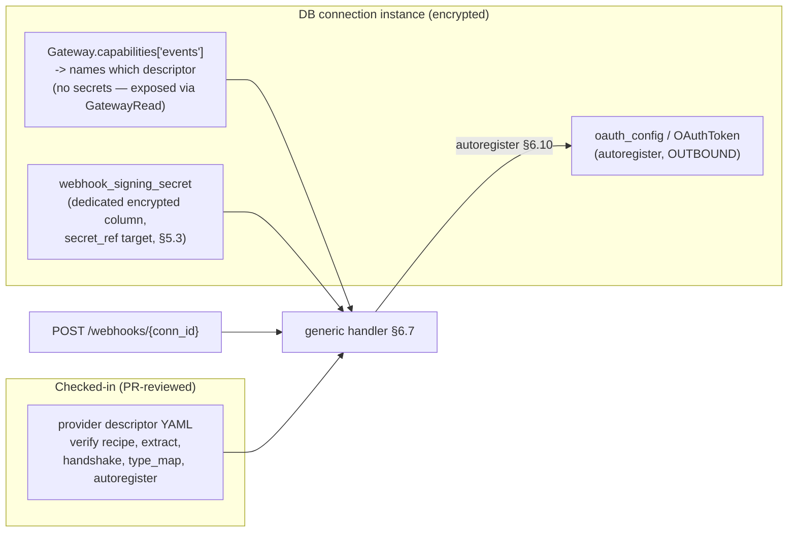

### 6.9 The `plugin` escape hatch — wired to the existing plugin framework

`recipe: plugin` (and, where needed, a plugin-driven confirm handshake) hooks into the existing plugin framework rather than introducing a parallel mechanism. The framework already supports adding new hook *bands* by defining an enum + payload/result models and calling `register_hook` (the established pattern in `mcpgateway/plugins/framework/hooks/`: `ToolHookType` at `hooks/tools.py:40-41`, registered via `registry.register_hook(...)` at `tools.py:115-116`; same shape for resources/prompts/http/agents).

Add a new **event ingress band** (locate during impl, e.g. `mcpgateway/plugins/framework/hooks/events.py`):

```python
class EventHookType(str, Enum):
    EVENT_INGRESS_VERIFY = "event_ingress_verify"   # decide allow/deny + parse metadata
    EVENT_INGRESS_NORMALIZE = "event_ingress_normalize"  # optional: override envelope build

# payload carries exactly what a verifier needs
class EventIngressPayload(BaseModel):
    conn_id: str
    raw_body: bytes
    headers: dict[str, str]
    gateway: dict           # decrypted connection ctx (secret refs resolved by manager)

class EventIngressResult(BaseModel):
    allow: bool
    status: int | None = None         # response status if denied (e.g. 401/403)
    metadata: dict | None = None       # event_type/dedup_id/subject/time overrides
    confirm_response: dict | None = None   # {status, body, content_type} if plugin handles a provider confirm-back (e.g. SNS SubscriptionConfirmation), AFTER it has verified
```

A plugin's confirm-back (e.g. SNS `SubscriptionConfirmation`) is returned only after the plugin has verified the request itself, so it does not reintroduce the verify-before-disclosure ordering problem (§6.7.1) — verification still precedes any response.

Provider adapters are then declared as ordinary plugins in **`plugins/config.yaml`** (repo root), reusing the existing entry shape (`name`, `kind` dotted class path, `hooks: [...]`, `mode`, `priority`, `config`):

```yaml
plugins:
  - name: aws_sns_verifier
    kind: plugins.aws_sns.aws_sns.AwsSnsVerifierPlugin
    description: "AWS SNS cert-chain signature verification + SubscriptionConfirmation handshake"
    version: "0.1.0"
    hooks: ["event_ingress_verify"]
    mode: enabled
    priority: 50
    config:
      cert_url_allowlist: ["sns.*.amazonaws.com"]
```

The descriptor's `verify.plugin: aws_sns_verifier` is the key that the handler dispatches on (`plugin_manager.invoke(EVENT_INGRESS_VERIFY, ...)`). This keeps the ~5% exotic providers fully in-tree, testable under `tests/unit/mcpgateway/plugins/`, and out of the generic handler's branch logic.

### 6.10 Provider-side webhook auto-registration (refcounted)

When a subscription (an `event_subscriptions` row, §6.1.1) requires events from an *external* provider (the SUBSCRIBE provisioning step described in §7), the gateway registers the webhook with the provider using the connection's **stored OAuth token** — outbound, refcounted, and idempotent.

- **Token & scopes:** outbound auth reuses the existing OAuth path. `oauth_config` / `OAuthToken` (`db.py:2972` / `:3302`) supply the bearer; for `client_credentials` the token comes from `oauth_manager.get_access_token(gateway.oauth_config)` and for `authorization_code` from `token_storage.get_user_token(...)` (the exact branches at `gateway_service.py:2474-2497`). Enabling events may require **extra OAuth scopes** beyond tools (e.g. GitHub `admin:repo_hook`), declared in `autoregister.scopes` and enforced at enable time.
- **Driver:** `autoregister.method` names a registration driver (recipe-like, mirroring the verify recipes) that knows the provider's hook API. The target callback URL it registers is `{public_base}/webhooks/{conn_id}` — the same opaque capability URL the generic route serves. On creation the provider returns/uses the `webhook_signing_secret`, which is stored encrypted in the dedicated `webhook_signing_secret` column on the connection (§6.8 / §5.3) so subsequent inbound POSTs verify.
- **Refcounting:** registration is **per (conn_id, provider-event-set)** with a reference count stored alongside the connection (not in `event_subscriptions`). The first subscription needing `com.github.push` from a connection triggers `register_hook`; subsequent subscriptions increment the count and reuse the live hook. DELETE/unsubscribe decrements; when the count hits **0**, the gateway de-registers the hook upstream and clears live hook state. This matches the agreed SUBSCRIBE/DELETE flow ("auto-register provider webhook via stored OAuth token, refcounted … de-registers upstream when refcount hits 0").

```mermaid
sequenceDiagram
  participant Sub as SUBSCRIBE flow (§7)
  participant GW as Gateway autoregister driver
  participant OAuth as oauth_manager / token_storage
  participant Prov as Provider hook API
  Sub->>GW: provision upstream (conn_id, event_set)
  GW->>GW: refcount[conn_id, event_set] += 1
  alt count was 0 (first sub)
    GW->>OAuth: get token (scopes incl. autoregister.scopes)
    OAuth-->>GW: bearer
    GW->>Prov: POST create hook -> {public_base}/webhooks/{conn_id}
    Prov-->>GW: hook id (+ signing secret)
    GW->>GW: store signing secret (encrypted column, §6.8), live hook state
  else count > 0
    GW->>GW: reuse existing live hook
  end
  Note over Sub,Prov: DELETE reverses: decrement; at 0 -> de-register upstream
```

`autoregister.enabled: false` (Slack, AWS SNS in §6.5/§6.6) opts a provider out of programmatic registration where the provider's model is app-side configuration or a self-confirming handshake; in those cases the inbound route and signing secret still apply, only the outbound registration step is skipped.

> Cross-references: the normalized `event` block produced here (§6.3.4) is consumed by the dedup → persist (`event_log`) → L2 Redis Stream → delivery-worker → single signed HTTP-callback egress pipeline (§8/§9), where the `subscription` wrapper, per-attempt `delivery_id`, `delivery_attempts`, and `dead_letters` are written; the `events` capability block and the standalone `event_subscriptions` record/refcount semantics (including the subscriber's stored `callback_url`/`auth`, `target` identity, and the `correlation_key`/`correlation_value` pair for correlate mode) are defined in §5/§7 and are not duplicated here. The reverse-DNS event-type taxonomy rule (§6.3.3) is owned by this section and referenced — as a rule, not a translation table — by §9.5; there is no longer any reverse-DNS → `mcp.*` rewrite (it existed only for the removed Dapr path).

---

## 7. Subscription Model & API

This section specifies the **Subscription** — the single durable binding `(filter → target)` that every event in the system is routed through — together with its persistence model, the three ways a subscription comes into existence, the CEL filter dialect used to match events, the two delivery semantics (`fanout` / `correlate`), the full REST API surface for `/subscriptions` CRUD, the subscribe-time upstream provisioning behaviour, and the lifecycle state machine.

The Subscription is the convergence point of the architecture: ingress (§ on Ingress & Envelope), the internal L2 Redis Streams bus (§ on L1/L2/L3 buses), and the egress adapters (§ on Egress Adapters) are all wired together *by* subscriptions. **The subscription match in the gateway *is* the routing** (see §7.0): a matched event already knows which downstream agent it is for, so downstream targets need only a thin invoke (event → agent) adapter, never a routing engine of their own. Anything in this section that touches the delivery envelope fields, the Redis Stream bus, or adapter wire formats is described from the subscription's point of view only; the canonical definitions live in the cross-referenced sibling sections.

> **Canonical data-model note (read first).** The events subsystem introduces **four** new standalone tables, named identically across §5 (Registry Model), §7 (this section), §8 (Publish/Deliver), §9 (Egress), and §11 (Migrations). (§5 additionally documents an optional fifth table, `provider_descriptors`; the four below are the always-present core.) §7.1 is the **authoritative definition** of `event_subscriptions`; §5 and §8/§9 reference it rather than re-declaring it.
>
> | Entity | Canonical table | Canonical ORM class | Defined in |
> |---|---|---|---|
> | Subscription (`filter → target` binding) | `event_subscriptions` | `EventSubscription` | **§7.1.1 (authoritative)** |
> | Raw ingested event (envelope row, dedup + replay) | `event_log` | `EventLog` | §8.4 (authoritative); referenced here |
> | Per-attempt delivery record (observability/retry audit) | `delivery_attempts` | `DeliveryAttempt` | §9.3 (authoritative) |
> | Exhausted-retry dead letters (operator-surfaced) | `dead_letters` | `DeadLetter` | §9.3 (authoritative) |
>
> Earlier drafts that named these `subscriptions`/`events`/`events_raw`/`delivery_dlq` are superseded; only the four names above (plus the optional `provider_descriptors` documented in §5) are used anywhere in the FRD.

---

### 7.0 Egress is one signed HTTP callback (plus a stream adapter)

A decision that shapes the whole subscription model: **the gateway delivers every event via a single signed outbound HTTP POST to a registered callback URL.** The gateway never speaks Dapr — there is no Dapr sidecar, no use of the Dapr HTTP API, and the gateway never publishes to a Dapr topic. A subscription's *target* is therefore just `{ callback_url, auth, echo-metadata }` (the echoed `target.*` identity per §7.0.1), and "which agent" is decided entirely by the subscription match in the gateway.

There are exactly **two** egress adapter kinds (the canonical definitions live in §9):

| Adapter kind | Pattern | Covers |
|---|---|---|
| **HTTP callback** (`push`) | one signed outbound `HTTP POST` to `callback_url` | budprompt (the default bud-runtime target, §7.0.2), bda (§7.0.3), external #523 callbacks, and budpipeline *when a multi-step workflow target is explicitly chosen* (§7.0.4). |
| **SSE/WS** (`stream`) | server-held stream to the subscriber | browser / streaming clients that cannot receive an inbound callback. |

This is the common webhook pattern — Stripe, GitHub, Svix, Hookdeck and the MCP discussion #523 proposal all deliver via an outbound signed HTTP POST. Because the target is *just a callback URL*, the choice of "direct-to-budprompt vs. via-budpipeline" is a **per-subscription choice of URL, not an architecture fork**.

> Note: the internal **L2 Redis Streams bus is not an egress target.** It is the durability/retry/replay/multi-instance spine *inside* the gateway (Redis is already a dependency — `pyproject.toml:80` `redis>=5.0.0`, used for leader election `gateway_service.py:488`, OAuth state `oauth_manager.py:64`, chat sessions `llmchat_router.py:69` — so it adds no new dependency). Do not confuse L2 (internal) with the two egress adapters (outbound). See §8/§9.

#### 7.0.1 The delivery envelope (proprietary)

The gateway emits a **simple proprietary delivery envelope**. Its `event` block carries the fields `id`, `source`, `type`, `subject`, `time`, `data`. The envelope additionally carries the **subscriber/agent identity**, captured at registration time and echoed on every delivery, so the receiver knows which agent to invoke **without doing its own routing** (§7.0, D-routing):

```jsonc
{
  "event": {
    "id":      "...",          // unique event id (dedup + idempotency root)
    "source":  "...",          // origin
    "type":    "com.github.push",   // reverse-DNS taxonomy (7.1.5)
    "subject": "...",          // correlate carrier, e.g. task handle
    "time":    "2026-05-30T12:00:00Z",
    "data":    { /* raw provider body */ }
  },
  "subscription": {
    "id":             "a1b2c3...",          // the EventSubscription.id
    "delivery_id":    "d-7f0e...",          // UNIQUE PER ATTEMPT — the idempotency key
    "mode":           "fanout",             // "fanout" | "correlate"
    "target":         { "agent_id": "...", "version": 3, "params": { } },
    "correlation_id": null                  // null for fanout; "<task-handle/step-id>" for correlate
  }
}
```

- `delivery_id` is **unique per attempt** and is the value carried as the `Idempotency-Key` delivery header (§7.2); receivers dedupe on it.
- `subscription.target.*` and the `callback_url` / `auth` are set **when the agent subscribes** (§7.1.3, §7.7.1) and are simply echoed back on delivery. The receiver reads `target.agent_id` / `target.version` / `target.params` to invoke the right agent directly — no receiver-side routing engine is required (§7.0).
- The reverse-DNS `type` taxonomy (`com.github.push`, …) is the gateway's own type space and stays exactly as specified in 7.1.5.

> Standards note (see §2): the gateway emits its own proprietary envelope; no downstream (bud-runtime, bda, budpipeline) requires any external envelope standard. The earlier Dapr egress path is removed (§7.0), so there is no broker coupling on the delivery path.

#### 7.0.2 bud-runtime target = budprompt, direct (default)

The default `bud-runtime` target is **budprompt, called directly** — *not* budpipeline. budprompt already performs agent **execution** plus client-side MCP integration, and exposes per-agent invoke endpoints:

- `POST /a2a/{prompt_id}/v{version}/` — A2A JSON-RPC dispatch (`a2a/routes.py`),
- `POST /v1/responses/` — OpenAI-compatible execution (`responses/routes.py`),

with `main.py` as the FastAPI entry and `prompt/routes.py` for prompt management. budprompt's `shared/mcp_foundry_service.py` is an **outbound-only** client to the MCP gateway (`delete_gateway` / `delete_virtual_server`, cleanup only); budprompt has **no inbound event receiver today and no routing engine**.

The integration is a **thin inbound receiver** added to budprompt (e.g. `POST /v1/events` or `/triggers`) that adapts the delivery envelope (§7.0.1) into an invocation of `target.agent_id` via budprompt's **existing** A2A / responses executor. This is an adapter, *not* budpipeline rebuilt inside budprompt. The one real concern is **payload shaping**: the event `data` must be mapped into the A2A / `/v1/responses` input shape — and that adapter logic lives **in budprompt, next to the agent**, which keeps the gateway generic (the gateway just POSTs the envelope). See §9 for the egress side and §11 for the budprompt receiver milestone.

#### 7.0.3 bda target (unchanged in mechanism)

bda is reached by the **same HTTP callback adapter**, POSTing to bda-reactive `POST /webhook/{hook_name}` (`bda-reactive/src/sources/webhook_receiver.rs:49`, `x-bda-token` header). bda's **own `TriggerEngine`** then maps the event to a run via `build_triggered_task_request` → bda-daemon. That local matching is bda's existing design, **not an extra service hop**. (The `EventSource::Mcp` / `TriggerSource::Mcp` additions are described in §7.6.1 and §9.)

#### 7.0.4 budpipeline target (optional, multi-step / correlate-to-workflow only)

budpipeline is an **optional** target, used **only** for genuine **multi-step workflows** or for **resuming a WAITING workflow step** (correlate-to-workflow). For the common "event wakes one agent" case, do **not** route through budpipeline — it is an extra hop plus extra logic; deliver directly to budprompt (§7.0.2) or bda (§7.0.3) instead. When budpipeline *is* the chosen target, it is reached by the same HTTP callback adapter to its existing surface: `POST /workflow-events` (`services/budpipeline/budpipeline/main.py:217`) with its `event_router` (`route_event`, `extract_workflow_id`) and `scheduler` (`EventTrigger` / `SUPPORTED_EVENTS`) handling the multi-step / correlate case. Because the target is just a callback URL, selecting budpipeline is a per-subscription URL choice (§7.0), not an architectural mode. See §11 — budpipeline multi-step orchestration is a later/optional milestone.

---

### 7.1 The Subscription record

Subscriptions are a **new first-class standalone table** — **not** a column-extension of `gateways`. The connection-instance fields that *do* live on the `gateways` row (the events capability block, the inbound webhook signing secret, outbound OAuth creds, live hook state) are the **events columns on the `gateways` row** described in §5.4.1 — there is no separate `ProviderConnection` table or ORM class; "ProviderConnection" is used elsewhere only as a *logical name* for those events-related columns on `Gateway`. The Subscription is a separate row in its own table that *references* a connector via `gateway_id`. §5.4.1 names this standalone table `event_subscriptions` and defers its column definition to this section.

They are stored in the new table `event_subscriptions`, created by an Alembic migration that follows the new-standalone-table template `mcpgateway/alembic/versions/3c89a45f32e5_add_grpc_services_table.py` and the ORM template `GatewaySecurityScanFinding` at `mcpgateway/db.py:3028`. The `down_revision` is set to the current head (confirm with `alembic heads`; see § on migrations).

> Design note: triggers are **not** a separate registry. The connector (`Gateway`) carries the *events capability* and the *outbound OAuth creds / inbound signing secret* (see § on Unified Connector Registry; the capability block is folded into `Gateway.capabilities` JSON at `mcpgateway/db.py:2881`). A Subscription is a *binding over* a connector's event source — it references the connector but owns its own lifecycle, filter, and target.

#### 7.1.1 ORM model — `class EventSubscription(Base)` (new, `mcpgateway/db.py`, locate during impl)

`__tablename__ = "event_subscriptions"`.

| Column | Type | Notes |
|---|---|---|
| `id` | `String(36)` PK | `uuid.uuid4().hex`, mirrors `Gateway.id` (`db.py:2875`). This id is the public handle and the Idempotency context. |
| `subscriber_kind` | `String(20)` | enum: `http` \| `sse`. Selects the egress adapter (§7.0): `http` = signed outbound callback (covers budprompt/bda/budpipeline/external #523), `sse` = server-held stream (also serves WS clients — WS shares the SSE stream adapter). |
| `subscriber_target_ref` | `JSON` | adapter-specific target — for `http` it carries `callback_url` + echoed `target` identity (see 7.1.3). |
| `gateway_id` | `String(36)` FK → `gateways.id`, nullable | The connector/provider this sub draws events from. Null only for pure cross-provider fanout where `source` glob is used instead. |
| `source` | `String(767)` | event `source` glob (e.g. `https://github.com/acme/*`; envelope `source`, 7.0.1). |
| `provider` | `String(128)` | provider id from the descriptor (`com.github`, `com.stripe`, `com.slack`, `com.mcp`). |
| `event_types` | `JSON` (`List[str]`) | glob list over the envelope `type`, reverse-DNS (e.g. `["com.github.push","com.github.pull_request.*"]`). |
| `filter_cel` | `Text`, nullable | CEL expression (7.4). Null ⇒ match all events passing the candidate-match index. |
| `filter_fastpath` | `JSON`, nullable | precomputed simple-predicate form (7.4.1); populated server-side when `filter_cel` is a pure equality/`in` conjunction. |
| `mode` | `String(12)` | `fanout` \| `correlate` (7.3). |
| `correlation_key` | `String(512)`, nullable | JSONPath into the envelope, **required iff** `mode == correlate` (7.3). |
| `correlation_value` | `String(512)`, nullable | the *bound* value the key must equal for correlate subs (the task handle / resource id); echoed as `subscription.correlation_id` (7.0.1). |
| `delivery` | `JSON` | `{auth, retry, ordering}` — adapter auth ref, retry policy, ordering hint (7.2). |
| `state` | `String(16)` | lifecycle state (7.6): `pending` \| `active` \| `paused` \| `expired` \| `failed` \| `deleting`. |
| `upstream_ref` | `JSON`, nullable | provisioning handle: external webhook id, or MCP `resources/subscribe` uri + federated session ref (7.5). |
| `expires_at` | `DateTime`, nullable | TTL; set for ephemeral correlate subs (7.3.3). Canonical TTL column name across §5/§7/§9/§11 (earlier `auto_expire_at` is superseded). |
| `last_delivery_at` | `DateTime`, nullable | observability. |
| `delivery_count` | `Integer` default 0 | observability. |
| `owner_email` | `String` | actor identity; mirrors `Gateway.owner_email` (`db.py:2975`). |
| `team_id` | `String` FK → `email_teams.id`, nullable | team scoping; mirrors `Gateway.team_id` (`db.py:2974`). |
| `visibility` | `String` default `"private"` | scoping; subscriptions default *private* — a **deliberate security-hardening divergence** from the gateway default of `"public"`. See §7.1.4 and §10.1.6/§10.1.7. |
| `active` | `Boolean` default `True` | soft enable flag, independent of `state`. |
| audit block | — | `created_at/updated_at`, `created_by/created_from_ip/created_via/created_user_agent`, `modified_*`, `version` — mirror the `Gateway` audit block (`db.py:2882-2902`). |

**Indexes / constraints (authoritative — §5.4.1 references these names, does not redefine them)**
- `Index("ix_event_subs_tenant_source_type", "team_id", "source", "event_type", "active")` — the **candidate-match index**: the dispatcher narrows by tenant (`team_id`) first, then `(source, event_type)` and the `active` flag, before evaluating the in-row `event_types` glob and then CEL (see § on Publish/Deliver). The tenant-leading key column is a deliberate security requirement (§10.1.7): candidate narrowing is always tenant-scoped so a match never crosses a tenant boundary. This is the single canonical candidate-match index name and key set across §3, §5.4.1, §7, §8.6, §10.1.7 and §11.0; §5.4.1's earlier `ix_subscriptions_source_active` / `ix_subscriptions_gw_mode`, §3/§11.0's earlier `ix_event_subscriptions_source_type`, and the interim `ix_event_subscriptions_candidate (provider, source)` are all superseded by this entry.
- `Index("ix_event_subscriptions_correlate", "provider", "correlation_value")` — exact-match path for `correlate` routing. The correlate index keys on **`correlation_value`** (the bound task handle / resource id), not `correlation_key` (which is the JSONPath template). §5.4.1's earlier `ix_subscriptions_corr (correlation_key)` is superseded; correlate routing indexes `correlation_value`.

> **No dedup unique constraint.** This table has **no `*_hash` columns and no hash-based `UniqueConstraint`** (consistent with §5.4.1, §5.10, §9.3, §11.0). An earlier draft introduced `subscriber_target_ref_hash` / `filter_hash` `String(64)` columns and a `uq_event_sub_dedup` unique constraint over them to make declarative reloads idempotent; that approach is **dropped**. Idempotency of declarative reloads (path a, §7.6.1) is instead enforced **in the reconcile logic** (the reconciler matches an existing row by `(gateway_id, subscriber_kind, subscriber_target_ref, normalized-filter)` and updates in place rather than inserting), not by a DB constraint over hashed columns. There is therefore no `_hash`-derived 409 path; see §7.7.1.

#### 7.1.2 Pydantic schemas (new, `mcpgateway/schemas.py`, locate during impl)

Follow the existing pattern of `GatewayCreate` (`schemas.py:2909`) / `GatewayRead` (`schemas.py:3543`):
- `SubscriptionCreate` — request body for `POST /subscriptions`; see 7.7.1.
- `SubscriptionRead` — response, includes server-populated `id`, `state`, `upstream_ref`, audit + `capabilities`-style derived fields.
- `SubscriptionUpdate` — partial, for `PATCH`.
- `WebhookSpec` — the per-tool-call `webhooks[]` element (7.3.3), shaped per discussion #523 (`{url, authentication:{strategy, credentials}}`).

#### 7.1.3 `subscriber_target_ref` by adapter

The target ref always carries the **callback URL** (for `http`) and the echoed **`target` agent identity** (§7.0.1) that the receiver uses to invoke the right agent without routing.

| `subscriber_kind` | `subscriber_target_ref` shape | Egress adapter |
|---|---|---|
| `http` → budprompt (default bud-runtime target) | `{ "callback_url": "http://budprompt:8000/v1/events", "token_ref": "<secret-id>", "target": { "agent_id": "<prompt_id>", "version": 3, "params": { } } }` | HTTP callback adapter → budprompt thin inbound receiver (e.g. `POST /v1/events`), which invokes `target.agent_id` via its existing A2A (`a2a/routes.py`, `POST /a2a/{prompt_id}/v{version}/`) or responses (`responses/routes.py`, `POST /v1/responses/`) executor (§7.0.2). |
| `http` → bda | `{ "callback_url": "http://127.0.0.1:9200/webhook/{hook_name}", "token_ref": "<secret-id>", "target": { } }` | HTTP callback adapter → bda-reactive `start_webhook_receiver` route `POST /webhook/{hook_name}` (`bda-reactive/src/sources/webhook_receiver.rs:49`), `x-bda-token` header; bda's own `TriggerEngine` maps to a run (§7.0.3). |
| `http` → budpipeline (optional, multi-step) | `{ "callback_url": "http://budpipeline:8000/workflow-events", "token_ref": "<secret-id>", "target": { } }` | HTTP callback adapter → budpipeline `POST /workflow-events` (`services/budpipeline/budpipeline/main.py:217`); used only for multi-step / correlate-to-workflow (§7.0.4). |
| `sse` (also serves WS) | `{ "session_id": "<sse-session>" }` | SSE/WS stream adapter; L1 in-process fanout via `SessionRegistry.broadcast` (`cache/session_registry.py:664`) → SSE queue (`sse_transport.py:215`). For browser/streaming clients that cannot receive an inbound callback. WS clients share this same stream adapter. |

> The `http` callback rows for budprompt, bda, budpipeline, and external #523 receivers all use the **one** HTTP callback adapter; they differ only in `callback_url`, `auth`, and the echoed `target`. There is no per-destination adapter and no Dapr/topic publishing (§7.0).

#### 7.1.4 `visibility` default rationale (intentional divergence from gateway default)

`Gateway.visibility` defaults to `"public"` (`db.py:2977`). `EventSubscription.visibility` deliberately defaults to **`"private"`**. This is a *narrowing* of scope, not a contradiction of FR-35's "consistent with existing gateway scoping": the same three scoping columns (`team_id`/`owner_email`/`visibility`, mirroring `db.py:2974-2977`) are used and enforced by the identical access-control machinery. Only the **default** differs, and it differs in the *more restrictive* direction.

The justification (carried in full in §10.1.6/§10.1.7 as a deliberate security decision):
- A subscription is an **active egress capability** — it causes the gateway to POST event payloads (potentially containing provider data) to a callback URL using stored credentials. A default-public subscription would let any tenant enumerate and observe another tenant's event flows, which is a stronger exposure than a default-public read-only connector listing.
- Subscriptions are frequently created automatically (paths a and c, §7.6) without an explicit operator choosing a visibility; defaulting those to `private` ensures auto-minted bindings are not silently world-visible.
- An operator may still set `visibility: "team"` or `"public"` explicitly at create/PATCH time; nothing is prevented, the *default* is merely hardened.

FR-35 and this section are reconciled: FR-35 is amended to read "team/owner-scoped consistent with existing gateway scoping (`team_id`/`owner_email`/`visibility`, `db.py:2974`), with a hardened default of `private` per §7.1.4."

#### 7.1.5 Event-type taxonomy (authoritative)

There is **one** taxonomy rule for the envelope `type` attribute across the entire system: **reverse-DNS, namespaced under `com.`**. This is used uniformly in the FR list, US-2/US-3/US-4, §5, §6, §8.10, §9.5, and the milestones. The earlier `io.mcp.*` namespace is superseded everywhere; MCP-native events use the `com.mcp.*` provider namespace (provider id `com.mcp`), matching the `com.<provider>` convention used for `com.github`, `com.stripe`, `com.slack`. The reverse-DNS taxonomy is the gateway's own convention and is unaffected by the envelope decision (§7.0.1).

Examples of the canonical `type` values:

| Provider | Envelope `type` (reverse-DNS, canonical) |
|---|---|
| GitHub | `com.github.push`, `com.github.pull_request.opened` |
| Stripe | `com.stripe.payment_intent.succeeded` |
| Slack | `com.slack.message` |
| MCP-native (resource updated) | `com.mcp.resource.updated` |
| MCP-native (task completed) | `com.mcp.task.completed` |
| AWS SNS (exotic / plugin) | `com.amazonaws.sns.notification` |

**The `type` is delivered as-is on every adapter.** The reverse-DNS `type` is the canonical value stored in `event_log.type`, placed on the wire in the delivery envelope (§7.0.1), and matched by CEL / `event_types`. Because the gateway no longer performs Dapr egress (§7.0), there is **no reverse-DNS → short-key translation** anywhere on the delivery path — the earlier `com.* → mcp.*` / `SUPPORTED_EVENTS` rewrite existed *only* for the dropped Dapr/budpipeline-topic adapter and is removed. budprompt's thin inbound receiver (§7.0.2) reads `target.agent_id` to invoke the agent and does not gate on any event-key registry; bda matches on its own `Condition`/`TriggerRule` fields; SSE/WS streams the envelope verbatim.

> Provenance hedge: the reverse-DNS `com.*` taxonomy is the Agreed-Design canonical form (§2). The WG "Events in MCP v1" RFC is still Ideating, so the `com.mcp.*` namespace is a forward-compatible choice, not a ratified identifier.

> Note on budpipeline's `SUPPORTED_EVENTS`: when budpipeline is explicitly chosen as a *multi-step* target (§7.0.4), its own `EventTriggerService.SUPPORTED_EVENTS` (`scheduler/services.py:488`) and `EventTrigger` config still govern what budpipeline accepts on `POST /workflow-events` — but that is budpipeline-internal acceptance logic on the receiving side, not a gateway-side egress rewrite. The gateway delivers the canonical reverse-DNS `type`; any mapping budpipeline wants is budpipeline's concern, kept out of the generic gateway.

---

### 7.2 `delivery` block

```jsonc
{
  "auth": {                       // how the HTTP callback adapter authenticates to the target (OUTBOUND #523 callback-auth axis)
    "strategy": "bearer",         // bearer | apiKey | basic | customHeader | x-bda-token | none
    "credentials_ref": "<secret-id>"   // pointer; secret encrypted at rest (see below)
  },
  "retry": {
    "max_attempts": 8,            // after which → dead_letters (see §9.3)
    "backoff": "exponential",     // exponential | fixed
    "initial_ms": 500,
    "max_ms": 60000
  },
  "ordering": "per_subject"       // per_subject (default) | none
}
```

- **Secret handling.** `credentials_ref` resolves to material encrypted with the same machinery used for gateway auth: `encode_auth`/`decode_auth` (`mcpgateway/utils/services_auth.py:86`/`:119`, AES-GCM) or `encryption_service.encrypt_secret`/`decrypt_secret`. Raw tokens are **never** stored in the Subscription row.
- **`delivery.auth` is the OUTBOUND #523 callback-auth axis** — how the HTTP callback adapter authenticates *to* the target. It is distinct from the INBOUND signature-verify recipe (HMAC algo/header/encoding) that lives on the connector descriptor for ingress (§2.4, §6). These two auth axes are intentionally separated; do not conflate them.
- **At-least-once (HTTP callback).** Every HTTP-callback delivery carries `Idempotency-Key = <delivery_id>` (the per-attempt id from the envelope, §7.0.1); receivers dedupe on it. `retry`/`ordering` here are the per-subscription knobs the delivery worker reads. The HTTP callback adapter is gateway-owned, so the gateway owns the full at-least-once + DLQ contract for it: a delivery that exhausts `retry.max_attempts` lands in the gateway's `dead_letters` table and dead-letter Redis Stream (§9.3). There is no longer any adapter that delegates durability/dead-lettering to an external broker; the prior Dapr `poisonMessages` exception is removed along with the Dapr egress path (§7.0, §9.2/§9.5). The internal L2 Redis Streams bus (a gateway dependency already, §7.0) backs this retry/replay machinery. (The SSE/WS stream adapter is **best-effort** with no DLQ — see §9.1/§9.2.2 for the durability scope of each adapter.)

---

### 7.3 Modes: `fanout` vs `correlate`

The `mode` field encodes the **spawn vs resume** decision (Agreed Design §9). In both modes, **the gateway's subscription match decides which agent the event is for** and echoes it in `subscription.target` (§7.0.1); the receiver never routes.

| | `fanout` (spawn) | `correlate` (resume) |
|---|---|---|
| Meaning | No agent is waiting. Event **starts a new run**. | An agent is **blocked** on an async tool result (MCP Tasks / #523). Event resumes that one run. |
| Routing | CEL filter match (7.4) over candidate subs — the match *is* the routing (§7.0). | Exact match on `correlation_key` JSONPath ⇒ `correlation_value`. |
| Cardinality | 0..N subs may match one event. | Exactly one waiting run; never spawns. |
| Lifetime | Standing (until deleted). | **Ephemeral** — auto-expires after first delivery or `expires_at`. |
| `correlation_key` | unused | required |
| Downstream (default, single-agent) | HTTP callback → budprompt thin receiver invokes `target.agent_id` via its A2A / responses executor (§7.0.2); or HTTP callback → bda `TriggerEngine` (`build_triggered_task_request`, §7.0.3). | HTTP callback → budprompt resumes the waiting run via `target` + `correlation_id`; or bda run resume. |
| Downstream (optional, multi-step) | HTTP callback → budpipeline `POST /workflow-events` to start a workflow (§7.0.4). | HTTP callback → budpipeline `event_router.route_event` → `extract_workflow_id` resumes the waiting workflow step (§7.0.4). |

#### 7.3.1 `correlation_key`
A JSONPath evaluated against the canonical envelope (context attrs + `data`). The natural carrier is the envelope `subject` (7.0.1), which the design binds to the MCP `taskId` / resource `uri`. Examples:
- `$.subject` (task handle in the envelope subject)
- `$.data.payload.content.result.workflow_id` (mirrors bud-runtime `extract_workflow_id` precedence, `event_router.py:49`, used only when budpipeline is the multi-step target per §7.0.4)

At dispatch, the worker computes the JSONPath value and looks up `(provider, correlation_value)` via `ix_event_subscriptions_correlate` — an O(1) index hit, no CEL evaluation. The bound `correlation_value` is echoed as `subscription.correlation_id` in the delivery envelope (§7.0.1).

#### 7.3.2 Why correlate is exact-match, not CEL
Correlate routing must hit exactly one waiting run with zero ambiguity, so it bypasses the CEL engine entirely and uses the indexed exact equality on `correlation_value`. CEL (7.4) is only for `fanout`.

#### 7.3.3 Ephemeral correlate subs from `webhooks[]` (#523)
A `tools/call` may carry `webhooks: [WebhookSpec]`. The gateway creates an ephemeral `correlate` subscription per call, keyed on the **returned task handle** (#523 "202 + resource id, then callback"):
- `mode = correlate`, `correlation_key = "$.subject"`, `correlation_value = <taskId>`,
- `subscriber_kind = http`, `subscriber_target_ref = {callback_url: spec.url, target: {...}}`, `delivery.auth` from `spec.authentication`,
- `expires_at` set to the task's deadline; sub is deleted on first successful delivery.

This is registration path (c) (7.6.3 below); it produces the *same* `EventSubscription` row as the other two paths and is delivered over the **same** signed HTTP callback adapter (§7.0).

---

### 7.4 CEL filter language

`filter_cel` is a [CEL](https://cel.dev) boolean expression evaluated against a context exposing the canonical envelope. CEL is chosen over a bespoke matcher because it is sandboxed, side-effect-free, and bounded — safe to run per-event in the delivery worker.

> Filter-language decision is **closed**, not open (OQ-2 closed): FR-18 and this section commit to CEL as the gateway-side filter dialect (with the 7.4.1 fast path as an optimization, not an alternative language). Any open-question entry that lists "filter language: open" is superseded by this commitment; the only open axis is which CEL *subset* the fast-path lowering covers.

**Context bindings exposed to the expression**

| Binding | Source | Example |
|---|---|---|
| `type` | envelope `type` (reverse-DNS) | `type == "com.github.push"` |
| `source` | envelope `source` | `source.startsWith("https://github.com/acme/")` |
| `subject` | envelope `subject` | `subject == "task_01H..."` |
| `id`, `time` | envelope context attrs (7.0.1) | `time > timestamp("2026-01-01T00:00:00Z")` |
| `provider`, `triggerid` | envelope extension attrs | `provider == "com.github"` |
| `data` | raw provider body (map) | `data.ref == "refs/heads/main"` |

Example fanout filter:
```cel
type == "com.github.push" &&
data.ref == "refs/heads/main" &&
data.repository.full_name in ["acme/api", "acme/web"]
```

#### 7.4.1 Simple type/attr fast path
CEL compilation/evaluation is skipped when the expression (or `event_types`+a trivial filter) reduces to a **conjunction of equality / `in` / `startsWith` predicates over top-level context attrs or first-level `data` keys**. At create time the server attempts to lower `filter_cel` into `filter_fastpath`:

```jsonc
{
  "all": [
    { "field": "type", "eq": "com.github.push" },
    { "field": "data.ref", "eq": "refs/heads/main" },
    { "field": "data.repository.full_name", "in": ["acme/api","acme/web"] }
  ]
}
```

`field` resolution uses dot-notation into envelope/`data`, identical in spirit to bud-runtime's `_get_nested_value` (`scheduler/services.py:633`) and bda's `Condition.resolve_field`. When `filter_fastpath` is present the worker evaluates it directly (a few map lookups) and never instantiates the CEL VM. Any expression using functions, arithmetic, comparisons other than `eq`/`in`/`startsWith`, or logical `||` falls back to full CEL.

> Cross-system note: the same CEL string is what bda authors place under `TriggerRule.conditions` (translated to `Condition` all/any, `bda-reactive/src/trigger_rule.rs:39-63`), and — for the optional budpipeline multi-step target (§7.0.4) — what bud-runtime stores as `EventTriggerConfig.filters` (`scheduler/schemas.py:307`). The gateway's CEL is the **superset**; declarative imports (7.6.1) down-convert to the host system's native filter where possible and otherwise carry the CEL through.

---

### 7.5 Subscribe-time provisioning (the SUBSCRIBE flow)

Creating a subscription does more than insert a row — it **provisions the upstream** so events actually flow. Refer to § on Publish/Deliver for what happens once events arrive.

```
POST /subscriptions
        │
        ▼
 1. authz + validate (schema, CEL compiles, correlation_key present iff correlate)
        │
        ▼
 2. persist row  state=pending
        │
        ▼
 3. index by (team_id, source, event_type)   [+ correlation_value if correlate]
        │
        ▼
 4. PROVISION UPSTREAM ─────────────────────────────────────────────┐
        │                                                            │
   external provider                          MCP-native provider   │
   (gateway.oauth_config)                      (federated session)  │
        │                                                            │
   register webhook via stored OAuth          send resources/subscribe
   token (refcount++ per (gateway,            over the upstream MCP
   event_type); only registers on             ClientSession; record
   refcount 0→1). May require extra            upstream_ref={uri,sess}
   scopes (e.g. admin:repo_hook).
        │                                                            │
        └──────────────► record upstream_ref ◄──────────────────────┘
        │
        ▼
 5. state=active  →  return 201 { id, state, ... }
```

#### 7.5.1 Refcounting external webhooks
Many subscriptions may target the *same* provider+event_type on the same connector. The gateway registers the provider-side webhook **once** and refcounts it:
- On create: increment refcount for `(gateway_id, event_type)`; if it transitions `0 → 1`, call the provider API (using OAuth creds resolved from `gateway.oauth_config` exactly as `_forward_request_to_gateway` does at `gateway_service.py:2474-2497`) to register the hook; store the provider's hook id in `upstream_ref`.
- On delete: decrement; if it transitions `1 → 0`, de-register the provider webhook.

The inbound POSTs all land on the single config-driven ingress `POST /webhooks/{conn-id}` (see § on Ingress); the connector's stored **signing secret** verifies them. Provisioning here only manages the *outbound registration*, not the route. (This inbound ingress is the gateway *receiving* provider events; it is unrelated to the outbound HTTP callback delivery adapter of §7.0.)

#### 7.5.2 MCP-native provisioning (mirrors `resources/subscribe`) and synthesized event ids
For `provider == "com.mcp"`, provisioning sends `resources/subscribe` over the federated upstream session. This is the **gap the design closes**: today `resource_service.subscribe_resource` (`resource_service.py:969`) only stores a local row and the gateway's upstream `ClientSession` is one-shot — `notifications/resources/updated` from upstream is **dropped** because there is no receive loop (`gateway_service.py` connect funcs at `:3809`, `:3929`; the reverse-proxy WS handler explicitly TODO-drops `notification` at `routers/reverse_proxy.py:217`). The events subsystem holds the session open and re-emits those notifications as canonical events. The protocol surface reuses the existing handlers: `resources/subscribe` at `main.py:5608` and the `notifications/*` catch-all at `main.py:5696`.

**Synthesized event `id` for the MCP-native path (security/dedup requirement).** MCP `notifications/resources/updated` carries **no provider-supplied event id** (spec §1.2: only `uri` is required). Because dedup-on-`(source, id)` (Redis `SET NX`, §8) and the `Idempotency-Key` delivery header (which carries the per-attempt `delivery_id`, §7.0.1/§7.2) both require a stable per-event `id`, the gateway **synthesizes** the envelope `event.id` deterministically for every MCP-native event:

```
id = sha256( provider | source | uri | upstream_session_ref | monotonic_seq )
```

where `monotonic_seq` is the per-session receive-order counter the events subsystem maintains on the held `ClientSession`. The same upstream notification re-delivered within the session collapses to the same `id`; a genuinely new update gets a new `seq` and thus a new `id`. This makes the `(source, id)` dedup machinery satisfiable for the entire MCP-native path; the per-attempt `delivery_id` is then derived per delivery on top of that stable event id. (The reverse-DNS `type` for these events is `com.mcp.resource.updated`, per 7.1.5.)

---

### 7.6 The three registration paths

All three produce **the same `EventSubscription` row** and converge on the SUBSCRIBE flow (7.5).

```
(a) declarative config ──┐
(b) POST /subscriptions ─┼──► validate ──► persist ──► provision upstream ──► active
(c) tools/call webhooks[]┘
```

#### 7.6.1 Path (a) — standing / declarative config
Subscriptions are reconciled from downstream control-plane config at load/registration time. The gateway is the *destination connector* these declarations point at; on reconcile it upserts the matching `EventSubscription`. Reloads are idempotent: the reconciler matches an existing row by `(gateway_id, subscriber_kind, subscriber_target_ref, normalized-filter)` and updates it in place rather than inserting a duplicate (this is enforced in the reconcile logic, not by a DB unique constraint — there are no `_hash` columns and no `uq_event_sub_dedup`, §7.1.1).

- **bda `trigger_store` YAML** — a new `TriggerSource::Mcp { ... }` variant in `bda-reactive/src/trigger_rule.rs:25-36` (serde `type: mcp`), discovered by a new `extract_mcp_subscriptions` in `bda-reactive/src/daemon.rs`, started by `McpSource::start(...)` in the reactive daemon (`bda-reactive/src/bin/bda-reactive-daemon.rs`, after the webhook receiver at ~line 232). Each such rule corresponds to one gateway-side `fanout` subscription whose `subscriber_kind=http`, `callback_url` = the bda-reactive webhook receiver, and whose CEL is the down-conversion of the rule's `TriggerConditions`. The event_types use the canonical reverse-DNS taxonomy (7.1.5); bda receives them as-is and matches on its own `Condition`/`TriggerRule` fields (§7.0.3). Example YAML:
  ```yaml
  name: gh-main-push-to-bda
  version: 1
  enabled: true
  priority: 10
  source:
    type: mcp
    gateway_url: "https://gw.internal:4444"
    provider: "com.github"
    event_types: ["com.github.push"]
  conditions:
    all:
      - { field: "data.ref", equals: "refs/heads/main" }
  action: { plan: "ci-triage" }
  ```

- **budprompt (default bud-runtime target)** — the common single-agent case. A declarative entry names the budprompt agent to wake and yields one gateway-side `fanout` subscription whose `subscriber_kind=http`, `callback_url` = budprompt's thin inbound receiver (e.g. `POST /v1/events`), and `subscriber_target_ref.target = { agent_id, version, params }` (§7.0.2). The event_types use the canonical reverse-DNS taxonomy; budprompt receives the envelope as-is and invokes `target.agent_id` via its existing A2A / responses executor — no `SUPPORTED_EVENTS`-style key registration is involved.

- **budpipeline `EventTrigger` / `SUPPORTED_EVENTS` (optional, multi-step only)** — used **only** when a genuine multi-step workflow or a correlate-to-workflow resume is the target (§7.0.4). An `EventTriggerCreate` (`scheduler/schemas.py:313`) with dot-notation `config.filters` declares a gateway-side subscription whose `subscriber_kind=http`, `callback_url` = budpipeline `POST /workflow-events`, and whose `filter_fastpath` is the dot-notation filter set lifted into the fast path (7.4.1). budpipeline's own `EventTriggerService.SUPPORTED_EVENTS` (`services/budpipeline/budpipeline/scheduler/services.py:488`) and `create_event_trigger` acceptance (`:532-536`) govern what budpipeline accepts on its receiving side; the gateway delivers the canonical reverse-DNS `type` and performs **no** egress-time key rewrite (§7.1.5).

#### 7.6.2 Path (b) — programmatic API
`POST /subscriptions` and `DELETE /subscriptions/{id}` (7.7). This is the spec-aligned analogue of `resources/subscribe` / `resources/unsubscribe` (`main.py:5608`/`5618`) lifted to a durable REST resource that survives reconnects.

#### 7.6.3 Path (c) — per-operation `webhooks[]`
A `tools/call` carrying `webhooks: [WebhookSpec]` (#523) produces the ephemeral `correlate` sub described in 7.3.3. No REST call is made by the client; the gateway mints the row internally and keys it on the returned task handle.

---

### 7.7 REST API — `/subscriptions`

New router `subscription_router = APIRouter(prefix="/subscriptions", tags=["Subscriptions"])`, mounted in `main.py` alongside `gateway_router` (`main.py:1227`). All routes are guarded by `@require_permission(...)` mirroring the gateway routes (`main.py:5185`), and scoped by `owner_email`/`team_id`/`visibility` (7.1.1, default `private` per 7.1.4). Authentication is the standard bearer/JWT/basic stack (`Depends(require_auth)`), identical to `handle_rpc` (`main.py:5481`).

| Method & path | Permission | Success | Description |
|---|---|---|---|
| `POST /subscriptions` | `subscriptions.create` | `201` | Create + provision (7.5). |
| `GET /subscriptions` | `subscriptions.read` | `200` | List (filter by `provider`, `event_type`, `mode`, `gateway_id`, `state`, `team_id`). Scoped to the caller's `owner_email`/`team_id`; private subs of other tenants are not listed. |
| `GET /subscriptions/{id}` | `subscriptions.read` | `200` | Fetch one. |
| `PATCH /subscriptions/{id}` | `subscriptions.update` | `200` | Update `filter_cel`/`delivery`/`active`/`visibility`; re-provisions if `event_types`/`source` change. |
| `POST /subscriptions/{id}/toggle` | `subscriptions.update` | `200` | Pause/resume (`active`), mirrors `POST /gateways/{id}/toggle` (`main.py:5116`). |
| `DELETE /subscriptions/{id}` | `subscriptions.delete` | `204` | Reverse provisioning + de-register upstream when refcount → 0 (7.5.1). |

#### 7.7.1 `POST /subscriptions`

Request (default single-agent budprompt target shown):
```jsonc
{
  "subscriber": { "kind": "http",
                  "target_ref": { "callback_url": "http://budprompt:8000/v1/events",
                                  "token_ref": "secret_abc",
                                  "target": { "agent_id": "prompt_42", "version": 3, "params": {} } } },
  "gateway_id": "9f3c...e1",
  "provider": "com.github",
  "source": "https://github.com/acme/*",
  "event_types": ["com.github.push", "com.github.pull_request.*"],
  "filter": "data.ref == \"refs/heads/main\"",        // CEL
  "mode": "fanout",
  "delivery": { "auth": { "strategy": "bearer", "credentials_ref": "secret_abc" },
                "retry": { "max_attempts": 8, "backoff": "exponential" },
                "ordering": "per_subject" },
  "visibility": "team"                                 // optional; defaults to "private" (7.1.4)
}
```

The gateway echoes `subscriber.target_ref.target` (here `{agent_id, version, params}`) on every delivery as `subscription.target` (§7.0.1), so the budprompt receiver invokes the right agent without routing.

For `mode: "correlate"` the body additionally requires `correlation_key` (and the gateway binds `correlation_value` from context — e.g. the task handle):
```jsonc
{ "...": "...", "mode": "correlate", "correlation_key": "$.subject" }
```

Response `201`:
```jsonc
{
  "id": "a1b2c3...",
  "state": "active",
  "subscriber": { "kind": "http", "target_ref": { "callback_url": "http://budprompt:8000/v1/events",
                                                   "target": { "agent_id": "prompt_42", "version": 3 } } },
  "gateway_id": "9f3c...e1",
  "provider": "com.github",
  "source": "https://github.com/acme/*",
  "event_types": ["com.github.push", "com.github.pull_request.*"],
  "filter": "data.ref == \"refs/heads/main\"",
  "mode": "fanout",
  "delivery": { "...": "..." },
  "upstream_ref": { "provider_hook_id": "gh_hook_8842", "refcount": 1 },
  "owner_email": "finance@bud.studio",
  "visibility": "team",
  "created_at": "2026-05-30T12:00:00Z",
  "version": 1
}
```

**Status codes**

| Code | Condition |
|---|---|
| `201 Created` | Subscribed + provisioned (`state=active`). |
| `202 Accepted` | Persisted (`state=pending`) but upstream provisioning is async/in-progress (e.g. provider hook registration deferred); `Location: /subscriptions/{id}`. |
| `400 Bad Request` | Schema invalid, CEL fails to compile, or `correlation_key` missing while `mode=correlate`. |
| `401 / 403` | Unauthenticated / lacks `subscriptions.create` or not permitted on `gateway_id`. |
| `404 Not Found` | `gateway_id` does not exist or events capability absent on that connector. |
| `422` | `event_types` not in the connector's declared event taxonomy, or (when the target is the optional budpipeline multi-step receiver, §7.0.4) the event is not accepted by budpipeline's `SUPPORTED_EVENTS` on its receiving side. |
| `502 Bad Gateway` | Upstream provider hook registration failed (sub left `state=failed`). |

> There is no `409 Conflict` duplicate-subscription path: standing-subscription idempotency for declarative reloads (path a) is handled by in-place upsert in the reconcile logic, not by a DB unique constraint (no `uq_event_sub_dedup`, §7.1.1/§7.6.1).

#### 7.7.2 `DELETE /subscriptions/{id}`
Transitions `state → deleting`, reverses provisioning (decrement refcount; if `0`, de-register provider webhook / send `resources/unsubscribe` to the upstream MCP session per `main.py:5618`), then removes the row. Returns `204`. Idempotent: deleting an unknown id returns `204` (or `404` if strict-mode is configured). Ephemeral correlate subs (7.3.3) are auto-DELETEd by the delivery worker after first successful delivery.

---

### 7.8 Subscription lifecycle state machine

```
                 create (POST / declarative / webhooks[])
                          │
                          ▼
                     ┌─────────┐
        provision    │ pending │   provisioning failed
        succeeds ┌───┴─────────┴───┐ ───────────────► ┌────────┐
                 ▼                  ▼                  │ failed │
            ┌────────┐         (502)                  └───┬────┘
            │ active │◄──────────────── retry/PATCH ──────┘
            └───┬────┘
   toggle off / │  ▲ toggle on
   PATCH active │  │
       =false   ▼  │
            ┌────────┐
            │ paused │   (events matched but NOT delivered;
            └───┬────┘    upstream registration retained)
                │
   expires_at   │ first delivery (correlate) /
   reached      │ explicit DELETE
                ▼
            ┌─────────┐        de-provision         ┌──────────┐
            │ expired │ ───────────────────────────►│ deleting │──► (row removed)
            └─────────┘                              └──────────┘
```

State semantics:

| State | Events delivered? | Upstream registered? | Entry / exit |
|---|---|---|---|
| `pending` | no | being provisioned | entered on create; → `active` on success, → `failed` on error. |
| `active` | yes | yes | the steady state; matched events flow to the egress adapter. |
| `paused` | no | yes (retained) | `active=false` via `toggle`/`PATCH`; resumes to `active` without re-provisioning. |
| `failed` | no | partial/none | provisioning error; surfaced in Admin UI; retryable via `PATCH` (re-runs SUBSCRIBE flow). |
| `expired` | no | scheduled for de-provision | TTL hit (`expires_at`) or one-shot correlate delivered; transient before `deleting`. |
| `deleting` | no | being de-provisioned | refcount decrement + upstream de-register; terminal → row removed. |

Dead-lettering is **not** a subscription state: an HTTP-callback delivery that exhausts `delivery.retry.max_attempts` lands in the gateway's `dead_letters` table (and the dead-letter Redis Stream) and is surfaced in the Admin UI (see §9.3 and § on Publish/Deliver). This at-least-once + DLQ contract holds for the **HTTP callback** adapter, which is gateway-owned (§7.0) — there is no external broker that owns dead-lettering. The **SSE/WS** stream adapter is best-effort and has no DLQ (§9.1/§9.2.2). In all cases the subscription itself remains `active` unless an operator pauses it.

---

### 7.9 Forward-compatibility hooks

The model is shaped so the MCP Triggers & Events WG outcome is a rename, not a rewrite:
- A `correlate` subscription is exactly the SEP-2260 "server-initiated request only during an active client request" pattern, captured durably so the gateway (not the stateless upstream) holds the waiting state.
- `webhooks[]` ingestion (path c) tracks discussion #523's `CallToolRequest.webhooks` / `Webhook.authentication` shape directly into `WebhookSpec`, delivered over the gateway's signed HTTP callback adapter (§7.0) — the same outbound-signed-POST pattern #523 itself proposes.
- The delivery envelope's `event` block (§7.0.1) carries the fields `id`/`source`/`type`/`subject`/`time`/`data`; see the §2 forward-compat note on field-name choice (§2, §7.0.1).
- The `subscriber_kind=sse` stream adapter and 7.5.2 native provisioning (including the synthesized-id scheme) are the seam for the WG's `webhooksSupported` capability and any future `notifications/*` callback method, dispatched through the existing `main.py:5696` catch-all. SSE/WS is one of two egress adapters for browser/streaming clients (§7.0); the transport of record for agents is the signed HTTP callback.
- The `com.mcp.*` provider namespace (7.1.5) is the forward-compatible home for whatever event `type` strings the WG ratifies; should the WG mandate a different prefix, only the taxonomy table (7.1.5) changes — the schema, routing, and (single) delivery adapter are unaffected.

---

## 8. Publish & Delivery Pipeline

This section specifies the end-to-end path an event takes from an inbound provider POST (or upstream MCP notification) to a confirmed delivery at a downstream agent control plane. It builds on the three pub/sub layers defined elsewhere (L1 in-process asyncio fan-out, L2 Redis Stream durable bus, L3 egress adapters) and the unified subscription model. Subscription registration, the provider descriptor schema, signature-verification recipes, and the delivery-envelope shape are covered in their own sibling sections and are cross-referenced rather than restated here.

**Egress model (decision lock).** The gateway delivers every event via exactly **two** egress adapter kinds: **(a) HTTP callback (push)** — a single signed outbound HTTP `POST` to a registered `callback_url`, which is the path for budprompt (the default bud-runtime target, §9), bda, external `#523` subscribers, and budpipeline when a genuine multi-step workflow needs it; and **(b) SSE/WS (stream)** — for browser/streaming clients that cannot receive a callback. This is the common webhook pattern used by Stripe, GitHub, Svix, Hookdeck, and the MCP `#523` proposal (outbound signed HTTP `POST`). **The gateway never speaks Dapr** — there is no sidecar, no Dapr HTTP API, and no topic publishing from the gateway. The L2 Redis Stream remains the internal durability/retry/replay spine (it is **not** a delivery target; do not confuse L2 with egress — see §8.5). The delivery envelope is a simple proprietary JSON object whose `event` block carries the fields `id`, `source`, `type`, `subject`, `time`, `data` (see the §2 forward-compat note on field-name choice).

### 8.0 Canonical names this section uses (reconciliation note)

To eliminate the naming drift flagged across §5/§7/§8/§9/§11, this FRD now uses **one** canonical table name and ORM class per entity, defined authoritatively in the registry-model/subscription sections and used verbatim here. There are **four new standalone tables** (plus the optional fifth `provider_descriptors` table documented in §5 where descriptors are persisted to the DB rather than loaded from YAML):

| Entity | Canonical table | ORM class | Notes |
|---|---|---|---|
| Subscription | `event_subscriptions` | `EventSubscription` | **Standalone first-class table**, NOT a column-extension of `gateways`. The `gateways.capabilities` JSON block (`db.py:2881`) only advertises that a connection *supports* events; the connection-instance signing secret lives in the dedicated encrypted `gateways.webhook_signing_secret` column (§5.3), **not** in `auth_value`/`oauth_config`. The subscription `(filter → target)` binding is its own row keyed by id, with an FK `conn_id → gateways.id`. Canonical correlate-mode columns are `correlation_key` (the jsonpath) and `correlation_value` (the resolved/bound runtime value), and the ephemeral-sub expiry column is `expires_at` (not the retired `auto_expire_at`). |
| Raw event log | `event_log` | `EventLog` | Durable record backing replay, dead-letter UI, and audit. |
| Per-attempt delivery record | `delivery_attempts` | `DeliveryAttempt` | One row per delivery attempt (subscription id, attempt no., status, error). |
| Dead-lettered delivery | `dead_letters` | `DeadLetter` | Terminal record for exhausted/non-retryable deliveries; backs the Admin UI dead-letter list and replay. |

Redis stream keys are likewise fixed and **driven by the §11.3 config defaults** so §8 and §11 agree: the durable L2 bus key is `mcp.events` (from `mcpgateway_events_stream_prefix='mcp.events'`), its consumer group is `delivery`, and the dead-letter stream is `mcp.events.deadletter` (from `mcpgateway_events_dead_letter_stream='mcp.events.deadletter'`). These are the names §5, §7, §8, §9, and §11 all reference; wherever this section shows a literal `XADD`/`XREADGROUP` against the bus, the key is the configured `mcp.events`/`mcp.events.deadletter` value (shown literally here for readability). The subscription is unambiguously a standalone `event_subscriptions` table everywhere.

### 8.0.1 Event-type taxonomy (reverse-DNS `type`)

The single authoritative taxonomy rule: **the delivery `type` attribute is always reverse-DNS** (agreed design item 4 — the rule is the gateway's own type space). For external providers the prefix is the provider's own DNS (`com.github.push`, `com.stripe.payment_intent.succeeded`, `com.slack.message`, `com.amazonaws.sns.notification`). For **MCP-native** events the prefix is **`com.mcp.*`** — chosen to keep a single reverse-DNS rule (resolving the `io.mcp.*` vs `com.*` drift flagged in review: `io.mcp.*` is dropped throughout; FR-list, US-2/3/4, §5, §8.10, §9.5, and the milestones all use `com.mcp.*`). MCP-native examples: `com.mcp.resource.updated`, `com.mcp.task.completed`, `com.mcp.tool.triggered`.

**No short-key translation.** Because the gateway no longer publishes to a Dapr topic, there is **no** reverse-DNS → short-key (`mcp.*`/`model.onboarded`-style) mapping anywhere in the gateway. The reverse-DNS `type` is carried verbatim in the delivery envelope's `event.type` for **every** adapter and on **every** path (fanout and correlate). The prior `SUPPORTED_EVENTS`/`data["type"]` translation existed only to feed bud-runtime's Dapr-fed `EventTriggerService` gate; with Dapr egress dropped (see §8.0 egress model), that translation is removed from the gateway. If a downstream still wants a short discriminator, that shaping is the receiver's concern and lives in the receiver's thin inbound adapter (§9), keeping the gateway generic. The budpipeline multi-step path that *does* still consume short keys is the optional/later case described in §8.9 and §9.

| Delivery `event.type` (gateway, reverse-DNS) | Example MCP-native or provider source |
|---|---|
| `com.mcp.tool.triggered` | MCP-native tool trigger notification |
| `com.mcp.resource.updated` | MCP `notifications/resources/updated` |
| `com.mcp.task.completed` | MCP-native async task completion |
| `com.stripe.payment_intent.succeeded` | Stripe webhook |
| `com.github.push` | GitHub webhook |

### 8.0.2 Synthesized id for MCP-native events (dedup/idempotency precondition)

External providers supply an id (GitHub delivery id, Stripe event id) that becomes the delivery envelope's `event.id`. **MCP-native `notifications/*` carry no provider id**, so the dedup-on-`(conn_id, source, id)` machinery (§8.3) and the per-event `Idempotency-Key` (§8.7) would be unsatisfiable for that path. The gateway therefore **synthesizes a deterministic id** for MCP-native ingress at step 4: `id = uuidv5(namespace, conn_id + "|" + source + "|" + subject + "|" + canonical(data))`. Determinism means a genuinely-redelivered upstream notification collapses to the same id (so dedup still works), while two distinct notifications with identical content but different timing remain distinguishable by including the upstream sequence/cursor in the hashed tuple when the session exposes one. This `event.id` is the dedup/idempotency anchor; it is distinct from the per-attempt `subscription.delivery_id` (§8.0.3), which is unique on every delivery attempt. This is specified here because it is a precondition for the entire MCP-native path.

### 8.0.3 Delivery envelope (subscriber/agent identity is echoed)

The subscription stores its target identity **at registration time** and the gateway **echoes it on every delivery**, so the receiver knows which agent to invoke **without doing its own routing** (see §8.6: the gateway's subscription match *is* the routing — downstream targets need only a thin invoke (event → agent) adapter, never a routing engine). The wire-level delivery envelope is:

```json
{
  "event": {
    "id":      "<dedup/idempotency anchor; provider id or synthesized per §8.0.2>",
    "source":  "<URI-ref of the originating connection/provider>",
    "type":    "<reverse-DNS, e.g. com.github.push>",
    "subject": "<per-subject ordering/correlation key, e.g. org/repo or taskId>",
    "time":    "<RFC3339; descriptive metadata only, NOT the ordering key>",
    "data":    { "...": "raw provider body (or MCP notification params)" }
  },
  "subscription": {
    "id":             "<event_subscriptions.id>",
    "delivery_id":    "<unique per attempt; idempotency unit for this POST>",
    "mode":           "fanout | correlate",
    "target":         { "agent_id": "...", "version": "...", "params": { } },
    "correlation_id": "<null | task-handle/step-id for correlate mode>"
  }
}
```

`event.*` carries the fields id, source, type, subject, time, data and is proprietary. `subscription.target.*`, the `callback_url`, and the `auth` directive are all set when the agent subscribes (the three registration paths in §7). `subscription.delivery_id` is unique per delivery attempt so a receiver dedups attempt-level retries on it, while `event.id` collapses provider-level redeliveries (§8.3); both are carried so receivers can dedup at whichever granularity they need.

### 8.1 Pipeline overview

The pipeline is split into two cleanly separated halves joined by the L2 Redis Stream:

- **Ingress half (synchronous, fast, fail-closed):** verify signature, build the delivery envelope, answer any handshake, dedup, persist, `XADD`, return `202`. This runs inside the request handler for `POST /webhooks/{conn-id}` and MUST be bounded so the provider's webhook retry budget is never exhausted by our processing.
- **Delivery half (asynchronous, durable, at-least-once):** a worker pool consumes the stream via `XREADGROUP`, matches candidate subscriptions, enqueues per-subscription jobs, and drives each through an egress adapter with retry/backoff and dead-lettering.

The decoupling point is deliberate: the provider gets its `202` the instant the event is durably in Redis, and all matching/delivery cost is absorbed off the request path. The receiving side mirrors this boundary: a callback receiver SHOULD ack fast (return `2xx` immediately) and do the heavy work — e.g. invoking the target agent — asynchronously, exactly as bud-runtime's existing pattern returns 200 immediately to avoid redelivery loops (`services/budpipeline/budpipeline/main.py:298-308`).

**Guarantee scope (read before §8.11).** Because every egress is a gateway-owned outbound HTTP `POST` (HTTP callback or SSE/WS push) — the gateway never hands delivery off to an external broker — the headline contract holds **uniformly for every adapter**: at-least-once delivery + unified gateway dead-letter (`dead_letters`) + Admin UI surfacing, with the gateway owning the full retry/ack/dead-letter loop end-to-end. There is no longer any adapter (the dropped `dapr` path) whose post-acceptance durability is delegated to an external broker, so there is no split-durability caveat anywhere in this section.

```
                    INGRESS HALF (in request handler)                    |          DELIVERY HALF (worker pool)
                                                                         |
 provider POST                                                          |
 /webhooks/{conn-id}                                                    |
      |                                                                  |
      v                                                                  |
 [1] load descriptor + conn secret (gateways.webhook_signing_secret)    |
      |                                                                  |
      v                                                                  |
 [2] verify signature (hmac|hmac_timestamped|none|plugin)  --fail-->  401/403
      |                                                                  |
      v                                                                  |
 [3] build delivery envelope (event.*+subscription.*; raw body under    |
     event.data; synth event.id if MCP)                                |
      |                                                                  |
      v                                                                  |
 [4] handshake? (e.g. Slack url_verification) --yes--> echo challenge, 200
      |                                                                  |
      v                                                                  |
 [5] dedup: SET NX EX ce:dedup:{conn_id}:{source}:{id} --dup--> 202     |
      |                                                                  |
      v                                                                  |
 [6] persist raw envelope (event_log table)                             |
      |                                                                  |
      v                                                                  |
 [7] XADD mcp.events * envelope=<json>  --> stream id                   |
      |                                                                  |
      v                                                                  |
 [8] return 202 Accepted {event_id, status:"accepted"}                  |
                                                                         |
- - - - - - - - - - - - - - - - - - - - - - - - - - - - - - - - - - - - + - - - - - - - - - - - - - - - - - - - - - - - - -
                                                                         |  [9]  XREADGROUP GROUP delivery <consumer> ...
                                                                         |        |
                                                                         |        v
                                                                         | [10]  match: index lookup (team_id,source,event_type) -> CEL eval
                                                                         |        |
                                                                         |        v
                                                                         | [11]  enqueue per-subscription job (per-subject FIFO queue)
                                                                         |        |
                                                                         |        v
                                                                         | [12]  adapter.deliver(envelope) -> signed POST callback_url
                                                                         |        (Idempotency-Key=event.id; X-Delivery-Id=delivery_id)
                                                                         |        |
                                                                         |   2xx  | 5xx/408/429/timeout    4xx other / max attempts
                                                                         |   v     v                       v
                                                                         | XACK   exp-backoff retry --->  dead_letters + mcp.events.deadletter + Admin UI
```

### 8.2 Ingress stage (steps 1–8)

The single config-driven route is `POST /webhooks/{conn-id}` (the opaque `conn-id` is the gateway record id; see `Gateway.id` at `mcpgateway/db.py:2875`). It is registered alongside the existing routers in `mcpgateway/main.py` (locate during impl; modeled on `gateway_router`/`protocol_router` registration at `mcpgateway/main.py:1222-1227`). There is **no per-provider code** — behavior is parameterized by the stored descriptor and the connection secret.

**Verify-before-handshake ordering (security fix).** Signature verification (step 2) runs **before** any handshake echo (step 4) and before any response that distinguishes a valid `conn-id` from an invalid one. The earlier draft ordered handshake before verify, which turned the ingress into a `conn-id` existence oracle and a reflection responder, undercutting the unguessability/no-enumeration goal (FR-33/§10.1.3). Corrected rule: an unknown `conn-id` and a signature mismatch both return an indistinguishable `401`/`403` (or `404` chosen to be constant-shape with the auth-failure response) with no challenge echo; only after the signature verifies does the descriptor's handshake branch run. The diagram and table below reflect verify (2) → build (3) → handshake (4).

| Step | Action | Source of truth | Failure mode |
|---|---|---|---|
| 1 | Resolve `conn-id` -> `Gateway` row; load descriptor + signing secret | `Gateway` (`db.py:2870`); secret in dedicated encrypted `webhook_signing_secret` column (§5.3), decrypted via the same AES-GCM path used by `decode_auth` (`mcpgateway/utils/services_auth.py:119`) | unknown id / events not enabled -> constant-shape auth failure (no enumeration signal) |
| 2 | Verify signature per descriptor recipe | descriptor `verify` block (new; no HMAC code exists today per grounded facts §4) | mismatch -> `401`/`403`, no `202`, nothing enters the bus |
| 3 | Build the delivery envelope (§8.0.3; `event.*` carries id/source/type/subject/time/data, proprietary); raw provider body preserved under `event.data`; synthesize `event.id` for MCP-native (8.0.2) | envelope spec (§8.0.3 / sibling section) | malformed body -> `400` |
| 4 | Answer handshake **only after verify**, if descriptor declares one | descriptor `handshake` (e.g. Slack `url_verification`) | n/a — returns `200` with challenge and stops |
| 5 | Dedup via Redis `SET NX EX` | see 8.3 | duplicate -> `202` and **drop** (idempotent ack to provider) |
| 6 | Persist raw envelope | `event_log` table (template: `GatewaySecurityScanFinding` `db.py:3028`; migration template `3c89a45f32e5_add_grpc_services_table.py`) | DB error -> `500`; provider retries |
| 7 | `XADD mcp.events * envelope=<json>` | L2 Redis Stream (8.5) | Redis down -> `503`; provider retries |
| 8 | Return `202 Accepted` | — | — |

The signing secret loaded in step 1 is the per-connection secret persisted at registration time into the dedicated encrypted `webhook_signing_secret` column (§5.3) — **not** `auth_value`/`oauth_config`, which hold the connection's *outbound* auth and would leak via `GatewayRead` (§5.2). It is decrypted via the same AES-GCM envelope-encryption path the codebase already uses for stored secrets. Ordering of 5 → 6 → 7 is mandatory: dedup gates persistence and the `XADD` so a redelivered provider POST never creates a second stream entry. The `202` body mirrors the shape bda's receiver already returns (`{"event_id","status":"accepted"}` — `bda-reactive/src/sources/webhook_receiver.rs`), keeping the contract familiar across systems.

For the **MCP-native ingress path**, steps 1–2 (signature verify) and step 4 (handshake) do not apply — the gateway's upstream MCP session receives `notifications/resources/updated` (currently dropped — grounded facts cf-auth-federation §2/§3, `gateway_service.py` one-shot `ClientSession` has no receive loop). Once a persistent session with a message handler emits that notification, it enters at step 3, where the gateway builds the canonical delivery envelope (§8.0.3) and **synthesizes the `event.id` per §8.0.2** (because no provider id exists). Steps 5–8 are then identical.

### 8.3 Deduplication

The single canonical dedup key is keyed on **`(conn_id, source, id)`** — connection-scoped, so the same provider event id arriving on two different connections (or, in multi-tenant deployments, two tenants) is not collapsed. This resolves the three divergent definitions flagged in review by making §8.3 (this), §10.1.8, and the DB constraint in §5.4.2 all use the same triple.

```
key   = "ce:dedup:{conn_id}:{source}:{id}"
op    = SET key "1" NX EX <DEDUP_TTL_SECONDS>
result == OK     -> first sighting, continue (persist + XADD)
result == nil    -> duplicate, skip persist+XADD, return 202
```

- The matching **DB-level guard** is a unique constraint on `event_log` over **`(conn_id, ce_source, ce_id)`** (the §5.4.2 constraint is amended from `(ce_source, ce_id)` to include `conn_id` so the Redis key and the DB constraint agree; tenant scoping is carried via `conn_id`, which is itself tenant-scoped through the `gateways` row's `team_id`/`owner_email`, `db.py:2974-2977`). The Redis `SET NX` is the fast-path gate; the unique constraint is the durable backstop if Redis evicted the key.
- `DEDUP_TTL_SECONDS` is a new config setting (locate during impl; co-located with the existing Redis settings `cache_type`/`redis_url` at `mcpgateway/config.py:1017-1018`). It MUST exceed the longest provider retry window (GitHub/Stripe redeliver for hours) — a 24h default is the baseline.
- Dedup is **ingress-side** (prevents duplicate bus entries from provider-level retries). It is distinct from, and complementary to, **delivery-side idempotency** (8.7): at-least-once delivery means a receiver may still see the same event id twice if a worker crashes after `deliver` but before `XACK`, so receivers MUST also dedup on `Idempotency-Key`.

### 8.4 Persistence

The raw normalized envelope is written to the `event_log` table (ORM `EventLog`) before `XADD`. This is the durable record that backs replay (8.10), the dead-letter Admin UI (8.10), and audit. The table follows the audit-metadata block convention used across the schema (`Gateway` audit columns `db.py:2890-2898`). Minimum columns:

```
event_log
  id              String(36) PK            -- event.id (synthesized for MCP-native, 8.0.2)
  ce_source       String                   -- event.source (URI-ref; column name kept for the unique constraint)
  ce_id           String                   -- event.id (redundant with PK; named for the unique constraint)
  type            String  (indexed)        -- reverse-DNS, e.g. com.github.push
  subject         String  (indexed, null)  -- per-subject ordering key
  conn_id         String FK -> gateways.id (indexed)
  envelope        JSON                      -- full event.* incl. raw body under event.data
  stream_id       String                   -- Redis stream entry id (8.5)
  received_at     DateTime (indexed)
  UniqueConstraint(conn_id, ce_source, ce_id)   -- matches the 8.3 dedup key
```

The candidate-subscription lookup in the match stage (8.6) is backed by the tenant-leading index on `event_subscriptions` — `ix_event_subs_tenant_source_type` on `(team_id, source, event_type, active)` (the single authoritative candidate index, §8.6); the `event_log` rows themselves are read by id/`stream_id`.

### 8.5 L2 Redis Stream, ordering guarantees, and backpressure

The L2 bus is a Redis Stream (`XADD`/`XREADGROUP` consumer groups) on key `mcp.events` (the configured `mcpgateway_events_stream_prefix`, §11.3), not Pub/Sub. The existing `SessionRegistry` uses fire-and-forget Pub/Sub (`mcpgateway/cache/session_registry.py:200-201,715,848-867`) which gives no persistence/replay; the trigger bus deliberately uses Streams so events survive worker restarts and can be replayed.

| Concern | Mechanism |
|---|---|
| **Durability** | Every accepted event is an `XADD mcp.events` entry; entries persist until trimmed (8.10). |
| **Horizontal scale** | One consumer group (`delivery`) across all gateway workers; Redis hands each entry to exactly one consumer (`XREADGROUP GROUP delivery <consumer>`). |
| **At-least-once** | An entry stays in the group's Pending Entries List (PEL) until `XACK`. A worker that dies mid-delivery leaves the entry claimable by another via `XAUTOCLAIM`. |
| **Per-subject ordering** | Ordering is by Redis **stream-id** within a `(subscription, subject)` partition, enforced at the per-subscription queue (8.6). The envelope `event.time` attribute is descriptive metadata only and is **not** the ordering key. |
| **Backpressure** | Bounded per-subscription queues (8.6) plus a capped stream (`XADD ... MAXLEN ~ N`) apply backpressure. If a downstream adapter is slow, that subscription's queue fills and its consumer stops claiming new entries for that subject; other subjects/subscriptions are unaffected (isolation). |

**Ordering guarantee (precise statement):** the gateway guarantees **in-order, at-least-once delivery per `(subscription, subject)`**, where order is **Redis stream-id order** (not `event.time`, which providers may skew or omit). The `subject` (envelope `event.subject`, e.g. a repo full-name, a Slack channel, or a `taskId`) is the ordering key. Events with the *same* subject for the *same* subscription are delivered in stream-id order and the next is not dispatched until the prior is acked or dead-lettered. Events with *different* subjects may be delivered concurrently. There is **no** global total-order guarantee across subjects — this matches the MCP Triggers & Events WG framing of ordering guarantees scoped to a logical stream rather than the whole bus, and avoids head-of-line blocking. (Note: this per-`(subscription, subject)` stream-id ordering supersedes any earlier wording in §1.7/§2.3 implying `time`/`sequence` provides the ordering.)

### 8.6 Match stage (steps 9–11)

Delivery workers run `XREADGROUP` in a loop. For each entry:

1. **Index lookup (fast path):** select candidate subscriptions by tenant + `(source, event_type)` from the in-memory subscription index, backed by the single authoritative candidate-match index **`ix_event_subs_tenant_source_type` on `(team_id, source, event_type, active)`** (tenant-leading per the §10.1.7 security requirement; this index name and key-set supersede the earlier `ix_event_subscriptions_source_active`/`ix_event_subscriptions_gw_mode`, `ix_event_subscriptions_candidate`, and `ix_event_subscriptions_source_type` variants — only this one survives, and §3/§5.4.1/§7.1.1/§11.0 use it verbatim). Type filtering supports glob lists, so `com.github.*` candidates are included. This is the cheap pre-filter; only candidates proceed to CEL.
2. **CEL evaluation:** evaluate each candidate's `filter` CEL expression over `{event, data}` (the envelope's `event.*` block and `event.data`). Subscriptions with only simple type/attr predicates skip CEL entirely (the simple-attr fast path defined in the subscription model). CEL is the committed filter language (FR-18/§7.4); OQ-2 is closed accordingly — the filter language is **not** an open question.
3. **Mode dispatch:**
   - `fanout` (spawn) — every matching subscription receives the event.
   - `correlate` (resume) — resolve the subscription's `correlation_key` (a jsonpath, e.g. the `taskId`/workflow id) against the inbound event to obtain the runtime value, then route by exact match on the stored `correlation_value` to the **single** `event_subscriptions` row whose bound value matches (the exact-match resume route is backed by the `correlation_value` index); never spawns; the ephemeral sub auto-expires (`expires_at`) after delivery.
4. **Enqueue:** push a delivery job onto the **per-subscription queue**, partitioned internally by `subject`. The per-subscription queue is what provides both ordering (per-subject FIFO in stream-id order) and fault isolation (one slow/erroring target cannot stall others). The L1 in-process fan-out for live SSE/WS subscribers reuses the existing `tool_service` pattern (`_event_subscribers`/`_publish_event`/`subscribe_events` at `tool_service.py:242/1981/1932`) — the worker enqueues to L1 queues for SSE/WS (stream) subscribers and to the HTTP-callback adapter queue for callback subscribers (budprompt, bda, external `#523`, budpipeline-when-needed).

The subscription `kind` selects the egress adapter, not the receiver: per D1 there are exactly two adapter kinds, so `subscription.kind` is one of `http_callback` (push) or `sse` (with `ws` sharing the `sse` adapter). The *receiver* is distinguished by its `callback_url`, never by `kind` (the pre-D1 receiver-as-kind sets `{bda, bud-runtime, sse, mcp}`/`{budprompt, bda, budpipeline, sse, mcp}` are retired throughout — §1.7/§3 FR-14/FR-30/FR-31/§5.4.1/§5.6/§7.1.1/§7.1.3 all use the two-adapter enum).

**The match *is* the routing (no downstream routing engine).** "Which agent handles this event" is decided here, by the subscription match, and the matched subscription's `target.*` is echoed on the delivery (§8.0.3). Downstream targets therefore do **not** need a routing engine — only a thin invoke (event → agent) adapter that reads `subscription.target.agent_id` and calls the agent. Any earlier text implying the receiver must route, or that "events must flow through budpipeline to be routed", is superseded: budpipeline is **not** a routing hop for the single-agent case (§8.9), and the gateway never depends on a downstream router.

### 8.7 Deliver stage, ack, retry, dead-letter (steps 12+)

Each per-subscription queue is drained by driving jobs through the subscription's egress adapter (L3). With egress unified on two kinds — **HTTP callback (push)** and **SSE/WS (stream)** (§8.0) — the deliver stage below describes the HTTP-callback adapter, which performs the signed outbound `POST callback_url`; the SSE/WS adapter pushes the same envelope to a live stream and acks when the frame is enqueued to the connected client. The adapter receives the delivery envelope (§8.0.3) and the delivery directives (`delivery.auth`, `delivery.retry`, `delivery.ordering`) from the `event_subscriptions` record, where `callback_url`/`auth`/`target.*` were stored at registration time.

**Idempotency / delivery headers:** every HTTP-callback delivery carries `Idempotency-Key: <event.id>` (the envelope `event.id`, synthesized for MCP-native per §8.0.2) and `X-Delivery-Id: <subscription.delivery_id>` (unique per attempt, §8.0.3), plus the signature header per the subscription's `auth` directive. The receiver dedups on these, since the pipeline is at-least-once.

**Outcome handling (single source of truth — §8.7, §9.1, §10.2 are now identical):**

| Adapter result | Action |
|---|---|
| `2xx` | record `delivery_attempts` row (status=ok); `XACK mcp.events delivery <stream_id>`; advance the per-subject cursor; dispatch next subject entry |
| `5xx` / `408` / `429` / timeout / connection error | **retryable** — record `delivery_attempts` row (status=retry); retry with exponential backoff (do **not** `XACK`) |
| `4xx` other than `408`/`429` (e.g. `400`/`422`/`401`/`403`/`404` — receiver rejected) | **non-retryable → dead-letter immediately**: write `dead_letters` row, `XADD mcp.events.deadletter`, then `XACK` the original. **Visible and replayable in the Admin UI** — there is no silent "drop" and no separate "DLQ-light audit" concept. |
| max attempts exhausted (after retryable failures) | **dead-letter**: write `dead_letters` row, `XADD mcp.events.deadletter`, then `XACK` original (it is now owned by the dead-letter stream) |

The earlier contradiction (one table said 4xx → dead-letter, another said 4xx → "dropped to a DLQ-light audit") is resolved in favor of **dead-letter**: every non-retryable 4xx (except `408`/`429`, which are retryable) lands in `dead_letters` + `mcp.events.deadletter` and is surfaced/replayable in the Admin UI. The undefined "DLQ-light audit" term is removed.

**Exponential backoff:**

```
attempt n delay = min(BASE * 2^(n-1) * (1 ± jitter), MAX_DELAY)
defaults (config, locate during impl, alongside config.py:1022-1023 redis retry knobs):
  BASE        = 1s
  factor      = 2
  jitter      = 0.2 (±20%, full-jitter recommended)
  MAX_DELAY   = 300s
  MAX_ATTEMPTS= 8
```

Retries reuse the PEL: a job awaiting backoff is left unacked; `XAUTOCLAIM` with a `min-idle-time` ≥ the next backoff window lets any worker reclaim and retry it, so retries survive a worker crash. Per-subject ordering holds across retries because the per-subject cursor does not advance until the in-flight entry is acked or dead-lettered.

**Dead-letter:** on exhaustion (or immediate non-retryable 4xx) the entry is `XADD`-ed to the dead-letter stream `mcp.events.deadletter` **and** a `dead_letters` row is written with annotation fields (last status, attempt count, last error, subscription id, original `stream_id`), then the original entry is `XACK`-ed. This is the gateway-owned dead-letter path, and because both egress kinds (HTTP callback, SSE/WS) keep the gateway in control of the full retry/ack/dead-letter loop, it applies **uniformly to every adapter** — there is no broker-delegated exception (the dropped Dapr path was the only such case, and it no longer exists).

### 8.8 Sequence diagram (a): fanout / spawn — GitHub push -> new bda run

No agent is waiting; the event starts a new run, routed purely by CEL filter match. A standing `bda`-targeted subscription (`mode: fanout`, `kind: http_callback`) was registered from a bda `trigger_store` YAML rule. The egress is the single HTTP-callback adapter doing a signed `POST` to bda-reactive's webhook receiver.

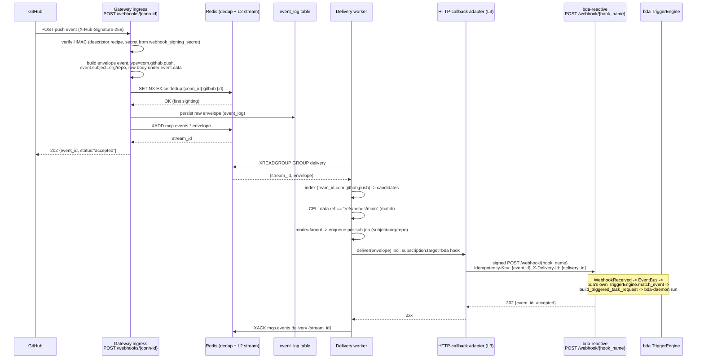

The bda side is **unchanged in mechanism (D7)**: it adds an `EventSource::Mcp` variant and an MCP `SourceHandler` (grounded facts bda, change-set items 1–7), and bda's **own** `TriggerEngine` maps the received event to a run via `build_triggered_task_request -> bda-daemon`. That local matching is bda's existing design, not an extra service hop. The gateway only needs the single HTTP-callback adapter pointing at bda-reactive's `/webhook/{hook_name}` receiver; that adapter owns the full retry/ack/dead-letter loop, so the §8.11 at-least-once + unified-`dead_letters` contract holds end-to-end for this target.

### 8.9 Sequence diagram (b): correlate / resume — async tool 202 + task handle -> callback completion -> resume waiting step

An agent step is already blocked on an async tool result. The `tools/call` carried `webhooks:[{url,auth}]` (the #523 model), producing an **ephemeral correlate-mode subscription** (`event_subscriptions` row, `kind: http_callback`) whose `correlation_key` is the jsonpath to the task handle, with the resolved task-handle value bound into `correlation_value` for exact-match resume, and storing the resume target's `callback_url`/`auth`/`target.*` plus an `expires_at` TTL. When the provider posts completion, it is routed by exact `correlation_value` match to the one waiting step and never spawns. The egress is the **same single HTTP-callback adapter** doing a signed `POST` to the registered `callback_url`.

**Two correlate targets, one mechanism (per-subscription URL choice, not an architecture fork).** Because the target is just a `callback_url`, "resume directly vs resume via budpipeline" is a per-subscription choice of URL:

- **Single waiting agent (default):** the `callback_url` points at the agent's own resume/inbound receiver — e.g. budprompt's thin event receiver (§9), which adapts the envelope into a re-invocation of `subscription.target.agent_id`. No budpipeline hop.
- **Multi-step workflow / resuming a WAITING workflow step (optional):** the `callback_url` points at budpipeline's `POST /workflow-events`. This is the **only** case that engages budpipeline's `event_router` (`route_event`, `extract_workflow_id`) and scheduler `EventTrigger`/`SUPPORTED_EVENTS`. It is genuinely multi-step orchestration, not the single-agent wake-up, and is demoted to an optional/later capability (§8.0, §9, §11). The diagram below shows this optional budpipeline variant.

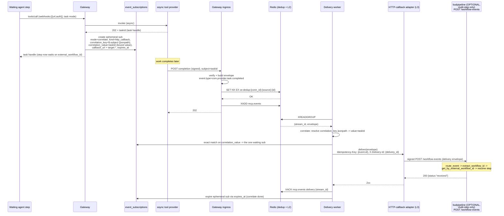

When the optional budpipeline target is used, the envelope's `event.subject`/`correlation_value` must surface a value budpipeline's `extract_workflow_id` can find — it checks `workflow_id`, `payload.workflow_id`, `notification_metadata.workflow_id`, `payload.content.result.workflow_id` (`services/budpipeline/budpipeline/handlers/event_router.py:49`). The resume path is matched by `external_workflow_id` (`event_router.py:218-219`), **not** by `SUPPORTED_EVENTS` (`services/budpipeline/budpipeline/scheduler/services.py:488-521`), so the reverse-DNS `event.type` flows through with no translation (consistent with §8.0.1: the gateway no longer does any short-key mapping). If budpipeline's `/workflow-events` handler expects a particular body shape, that payload shaping is the receiver-side adapter's concern, not the gateway's. Whatever the target, the egress is one gateway-owned signed HTTP `POST`, so the §8.7/§8.11 at-least-once + unified-`dead_letters` contract holds end-to-end with **no** broker-delegated durability caveat (the prior Dapr-publish path and its `poisonMessages` scope no longer apply).

### 8.10 Replay and dead-letter handling + Admin UI

**Replay from stream.** Because L2 is a Redis Stream (not Pub/Sub), entries are retained and can be re-read. Two replay modes:

- **Operational reprocess:** an admin action re-reads a range of the main stream (`XRANGE mcp.events <start> <end>`) or re-claims stuck PEL entries (`XAUTOCLAIM`), re-dispatching matched deliveries. Idempotency-Key + receiver dedup make replay safe.
- **Dead-letter retry:** entries in `mcp.events.deadletter` (and their `dead_letters` rows) can be re-injected into the main delivery flow after the operator fixes the downstream (e.g. corrects an auth secret or `callback_url` on the subscription). This applies to **every** adapter, since both egress kinds (HTTP callback, SSE/WS) are gateway-owned end-to-end — there is no broker-delegated path that replays elsewhere.

Stream retention is bounded by `XADD ... MAXLEN ~ <N>` plus a periodic `XTRIM`/age-based trim; the persisted `event_log` table (8.4) is the long-term record for replays older than the stream window.

**Admin UI surfacing.** The dead-letter stream is surfaced in the Admin UI (HTMX, consistent with the existing admin routes in `mcpgateway/admin.py`). Minimum capabilities:

| UI element | Backed by |
|---|---|
| Dead-letter list (event id, type, subject, subscription, attempts, last error, last status, age) | `dead_letters` table + `mcp.events.deadletter` |
| Per-entry detail (full envelope incl. raw provider body under `event.data`) | `event_log.envelope` |
| Per-attempt history (each try, status, error, timing) | `delivery_attempts` table |
| Actions: **Retry** (re-inject to delivery), **Discard**, **Edit-subscription-and-retry** | delivery worker API |
| Subscription health (queue depth, in-flight, consecutive failures) | per-subscription queue metrics + PEL depth |
| Stream lag / backpressure (group lag, oldest pending age) | `XINFO GROUPS` / `XPENDING` |

This surfacing follows the same intent as the support-bundle/diagnostics tabs already present, and reuses the metrics conventions in the codebase. Detailed metric names and the subscription CRUD API are specified in their sibling sections; this section only fixes the delivery-pipeline semantics those surfaces report on. **Scope note:** because both egress kinds (HTTP callback, SSE/WS) are gateway-owned, the dead-letter list and replay actions cover **every** delivery uniformly — there is no out-of-band broker path whose failures are invisible here.

### 8.11 Semantics summary

| Property | Guarantee |
|---|---|
| Egress model | **Two adapter kinds only:** HTTP callback (signed outbound `POST callback_url`) and SSE/WS (stream); `subscription.kind ∈ {http_callback, sse}` (ws shares the sse adapter). Gateway never speaks Dapr. L2 Redis Stream (`mcp.events`) is the internal spine, not a delivery target (§8.0, §8.5). |
| Delivery semantics | **At-least-once** for both adapter kinds (PEL + `XACK`; receiver dedups on `Idempotency-Key`/`X-Delivery-Id`). **No exactly-once is claimed anywhere.** |
| Durability scope | At-least-once + unified `dead_letters`/Admin-UI holds **uniformly for every adapter** — the gateway owns the full retry/ack/dead-letter loop for both HTTP callback and SSE/WS. No broker-delegated exception exists (the dropped Dapr path was the only one). |
| Identity echo | Delivery envelope echoes `subscription.target.*` set at registration; the gateway's subscription match **is** the routing — receivers need only a thin invoke adapter, no routing engine (§8.0.3, §8.6). |
| Ordering | **In-order per `(subscription, subject)` by Redis stream-id** (not `event.time`); concurrent across distinct subjects; no global total order |
| Ingress dedup | Redis `SET NX EX` on `(conn_id, source, id)`, backed by `event_log` unique constraint on `(conn_id, ce_source, ce_id)`, TTL ≥ longest provider retry window |
| Candidate match | Single tenant-leading index `ix_event_subs_tenant_source_type` on `(team_id, source, event_type, active)` (§8.6); correlate exact-match resume on `correlation_value`; ephemeral-sub expiry on `expires_at` |
| MCP-native id | `event.id` synthesized deterministically (§8.0.2) so dedup + `Idempotency-Key` are satisfiable on the MCP-native path |
| 4xx handling | `408`/`429` retryable; all other 4xx → `dead_letters` + `mcp.events.deadletter` (visible, replayable); never silently dropped |
| Backpressure | Bounded per-subscription queues + capped stream; isolates slow targets |
| Replay | Re-read main stream or re-inject `dead_letters`/`mcp.events.deadletter`; safe under idempotency (applies to every adapter) |
| Failure isolation | Per-subscription queue: one failing target never blocks others |
| Crash safety | Unacked entries reclaimed via `XAUTOCLAIM`; retries survive worker restart |
| Taxonomy | Delivery `event.type` is reverse-DNS (`com.*`, incl. `com.mcp.*`), carried verbatim on every adapter and path; **no** short-key/`SUPPORTED_EVENTS` translation in the gateway (§8.0.1) |
| Signing secret | Per-connection inbound verification secret loaded from the dedicated encrypted `webhook_signing_secret` column (§5.3), not `auth_value`/`oauth_config`/capabilities JSON (§8.2) |

---

## 9. Egress Adapters & Cross-Repo Integration

This section specifies the L3 egress layer — the final hop from the gateway's delivery worker to each subscriber — and the concrete, file-level integration plans for the downstream systems (`bda`, `bud-runtime`/budprompt, and the optional `budpipeline` multi-step case). The egress layer sits behind the unified subscription model (see §7); a subscription's `subscriber.kind` selects the adapter, and the delivery worker (`XREADGROUP` → CEL match → per-subscription queue) hands each delivery job to the adapter named below. Adapters are pluggable behind a single interface; adding a new subscriber transport is a new adapter implementation, not a change to the matching/dedup/retry core.

**Egress is unified on one outbound HTTP callback.** The gateway delivers every event by a single signed outbound HTTP `POST` to a subscription's registered `callback_url`. The gateway never speaks Dapr — there is no sidecar, no Dapr HTTP API, and no topic publishing from the gateway. A subscription's target is just `{ callback_url, auth, echo-metadata }` (the echoed `subscription`/`target` block of §9.1a). This is the common webhook pattern used by Stripe, GitHub, Svix, Hookdeck, and the MCP #523 callback proposal: an outbound signed HTTP POST whose receiver does its own local mapping to "which handler/agent." Whether a given callback URL points at budprompt, bda, an external #523 receiver, or budpipeline is a **per-subscription URL choice, not an architecture fork**.

Because of that, the egress adapter kinds reduce to exactly **two**:

- **`http` (push)** — a signed outbound HTTP POST to `callback_url`. This single adapter covers budprompt (direct, the default bud-runtime target — §9.5), bda (§9.5b), any external #523-style per-call `webhooks:[{url,auth}]` receiver, and budpipeline when the multi-step/correlate-to-workflow case applies (§9.6, optional).
- **`sse`/`ws` (stream)** — retained **only** for browser/streaming clients that cannot receive an inbound callback (Admin UI, `wscat`-style live clients).

These two are the values of the subscription's `subscriber.kind` enum: `http | sse` (`ws` shares the `sse` adapter). This is the adapter set, per D1 — the kind selects the egress adapter, **not** the downstream receiver. The receiver is distinguished by `callback_url` (budprompt vs bda vs external vs budpipeline), never by `kind`. The pre-D1 receiver-as-kind values (`bda`, `bud-runtime`, `budprompt`, `budpipeline`, `mcp`) are retired everywhere; §1.7/§3 FR-14/FR-30/FR-31 are aligned to this `http | sse` enum.

The L2 Redis Streams bus is the durability/retry/replay/multi-instance spine behind the `http` adapter; it is **not** a delivery target — do not confuse the internal bus (L2) with egress (L3). Redis is already a dependency (`pyproject.toml:80` `redis>=5.0.0`; used for leader election `gateway_service.py:488`, OAuth state `oauth_manager.py:64`, chat sessions `llmchat_router.py:69`), so the L2 stream adds no new dependency.

### 9.0 Canonical names this section uses (cross-section binding)

To eliminate the prior naming drift, this section uses exactly the canonical data-model names defined in §5/§7. There is **one** subscription entity and **four** new standalone tables (`event_subscriptions`, `event_log`, `delivery_attempts`, `dead_letters`; plus the optional fifth `provider_descriptors` table where §5 documents it); this section does not introduce any alternates.

| Concept | Canonical table | Canonical ORM class | Notes |
|---|---|---|---|
| Subscription (filter → target binding) | `event_subscriptions` | `EventSubscription` | **Standalone first-class table** (per §7.1 / §5.4.1), *not* a column on `gateways`. The connection-instance fields it pairs with (`webhook_signing_secret`, hook refcount, etc.) live on the existing `gateways` row via the `ProviderConnection` extension (§5.4.1) and are referenced by `event_subscriptions.gateway_id`. |
| Raw ingested provider event | `event_log` | `EventLog` | Persisted raw body + canonical envelope; the durable record behind the L2 stream (per §8.4). |
| Per-attempt delivery record | `delivery_attempts` | `DeliveryAttempt` | One row per egress attempt; carries `attempt`, `outcome`, `http_status`. |
| Terminal failed delivery | `dead_letters` | `DeadLetter` | HTTP-callback dead-letter records surfaced in Admin UI (scope: HTTP-callback only — §9.6, §9.2.2). |

The earlier draft's `subscriptions` / `events_raw` / `delivery_dlq` names are retired in favour of the above; §9.3 below uses only the canonical names, matching §5, §7, §8, and §11.

### 9.1 The Egress Adapter Interface

All adapters implement one async interface. The delivery worker is adapter-agnostic: it produces a normalized `DeliveryJob` (the matched event + the resolved `EventSubscription` + the attempt counter) and awaits the adapter's `deliver()`, interpreting the returned `DeliveryOutcome` for ACK/retry/dead-letter decisions.

```python
# mcpgateway/services/egress/base.py   (new — locate exact module path during impl)
class EgressAdapter(ABC):
    kind: str                      # "http" | "sse"   (ws shares the sse adapter)

    async def deliver(self, job: DeliveryJob) -> DeliveryOutcome: ...
    #   job.event:        canonical event (dict; field layout id/source/type/subject/time/data)
    #   job.subscription: resolved EventSubscription (callback_url, auth, target{agent_id,version,params},
    #                     mode, correlation_id, delivery{retry,ordering})
    #   job.attempt:      int (1-based); job.delivery_id is unique per attempt (idempotency)

    async def provision(self, sub: EventSubscription) -> None: ...   # optional upstream hook on SUBSCRIBE
    async def deprovision(self, sub: EventSubscription) -> None: ...  # optional, on DELETE / refcount==0
```

```python
@dataclass
class DeliveryOutcome:
    status: Literal["delivered", "retry", "dropped", "dead_letter"]
    http_status: int | None = None   # for the HTTP-callback adapter
    detail: str | None = None
```

Outcome → worker action. The retry/dead-letter outcomes below are the **`http` adapter's** contract; the `sse`/`ws` adapter is best-effort and never enters the retry/dead-letter path (§9.2.2):

| Adapter return | Worker action |
|---|---|
| `delivered` (receiver 2xx) | `XACK` the stream entry; per-subject sequence advances |
| `retry` (5xx / timeout / connection error) | exponential backoff re-enqueue; increment `attempt`; write a `delivery_attempts` row |
| `attempt > delivery.retry.max_attempts` | move to gateway dead-letter stream + `dead_letters` row; surface in Admin UI |
| `dropped` (4xx other than 408/429 — receiver rejected) | `XACK`, record `delivery_attempts` row with `outcome="dropped"`, no retry |

The adapter registry is initialized from the connector/provider config and the L1/L2 plumbing already present in the gateway: L1 fan-out reuses `tool_service._event_subscribers` / `_publish_event` / `subscribe_events` (`mcpgateway/services/tool_service.py:242/1981/1932`); the worker reads from the L2 Redis Stream (extension of the Pub/Sub pattern in `mcpgateway/cache/session_registry.py:200-201`, upgraded to `XADD`/`XREADGROUP`). The `http` adapter sets `Idempotency-Key = subscription.delivery_id` (unique per attempt) and echoes the immutable event `id` in the body, so the at-least-once bus is safe against duplicate delivery; **the receiver is responsible for dedup on the event `id`**.

**Durability scope (important):** the at-least-once + dead-letter guarantee is an **HTTP-callback property only**. It holds **uniformly across all `http` callback targets** — budprompt, bda, external #523 receivers, and budpipeline — because the gateway owns that delivery and can durably retry it. The `sse`/`ws` adapter is **explicitly best-effort and has no DLQ**: a transient browser/streaming client cannot be durably retried, so its only durability is the L2 stream's **replay cursor** (a reconnecting client re-reads from the cursor), not a dead-letter (§9.2.2, §9.6, §10.2). Sections that describe the DLQ as covering "both egress kinds uniformly" are scoped here to mean uniform across all `http` targets, not across `sse`/`ws`.

```mermaid
flowchart LR
  ING[POST /webhooks/&#123;conn-id&#125;] -->|verify -> 202| DEDUP[dedup SET NX EX]
  DEDUP --> XADD[(L2 Redis Stream)]
  XADD --> W[delivery worker XREADGROUP]
  W -->|CEL match + per-sub queue| REG{adapter by sub.kind}
  REG -->|http callback| BP[budprompt POST /v1/events]
  REG -->|http callback| BDA[bda bda-reactive /webhook/&#123;hook&#125;]
  REG -->|http callback| EXT[external #523 receiver]
  REG -->|http callback| BPL[budpipeline /workflow-events  optional, multi-step only]
  REG -->|sse/ws| UI[Admin UI / streaming clients]
```

(Ingress ordering above is **verify-then-202**: the signature/handshake check precedes the `202` ACK, per §10.1.3 unguessability/no-enumeration goals — see the resolution note in §6/§8.2; the egress side is downstream of that and unaffected.)

### 9.1a The delivery envelope (carries the subscriber/agent identity)

The gateway's subscription **match is the routing** (see §7 fanout-vs-correlate): "which agent" is decided by the subscription match in the gateway, recorded on the subscription at registration time, and **echoed on every delivery** — so the receiver knows which agent to invoke **without doing its own routing**. Downstream targets do not need a routing engine; they need only a thin `invoke` (event → agent) adapter. Any statement elsewhere implying the receiver must route, or that "events must flow through budpipeline to be routed," is incorrect and superseded by this rule.

The delivery body is a simple proprietary envelope. Its `event` block carries the fields `id`, `source`, `type`, `subject`, `time`, `data`. (See the §2 forward-compat note on field-name choice.)

```jsonc
{
  "event": {
    "id":      "<immutable event id; the dedup key>",
    "source":  "<provider/connection origin>",
    "type":    "<reverse-DNS type, e.g. com.github.push>",
    "subject": "<resource uri / taskId>",
    "time":    "<RFC3339>",
    "data":    { /* raw provider body */ }
  },
  "subscription": {
    "id":          "<event_subscriptions.id>",
    "delivery_id": "<unique per attempt — Idempotency-Key>",
    "mode":        "fanout" | "correlate",
    "target":      { "agent_id": "<id>", "version": "<v>", "params": { /* ... */ } },
    "correlation_id": null | "<task-handle / step-id>"
  }
}
```

- `event.id` is the immutable, deduped event identity (set per §8; **synthesized** per §9.2.4 for MCP-native ingress). The receiver dedups on it.
- `subscription.delivery_id` is unique **per attempt** and is the `Idempotency-Key`; a redelivered attempt repeats the same `event.id` but carries a fresh `delivery_id`.
- `subscription.target.*` and the subscription's `callback_url`/`auth` are set when the agent subscribes (§7). `target` is what the receiver's thin invoke adapter dispatches on — no downstream routing required.
- `correlation_id` is non-null only in `correlate` mode (resume a waiting step/task).

### 9.2 Concrete Adapters

#### 9.2.1 `http` callback adapter (the single push adapter)

Posts the delivery envelope (§9.1a) over HTTP to the subscription's `callback_url`. This one adapter serves **every push target**: budprompt (direct, §9.5), bda (§9.5b), external #523-style per-call `webhooks:[{url,auth}]` ephemeral subscriptions, and budpipeline for the multi-step/correlate-to-workflow case (§9.6, optional).

| Config field | Source | Notes |
|---|---|---|
| `callback_url` | `event_subscriptions` | full callback URL, e.g. `http://127.0.0.1:9100/v1/events` (budprompt) or `http://127.0.0.1:9200/webhook/{hook_name}` (bda) — loopback+http case, see SSRF note below |
| `delivery.auth.strategy` | `event_subscriptions` | `bearer` \| `apiKey` \| `basic` \| `customHeader` (mirrors #523 `Webhook.authentication`) |
| `delivery.auth.credentials` | connection instance (`ProviderConnection` on `gateways`, encrypted — §9.3) | header value(s) |
| `target` | `event_subscriptions` | `{agent_id, version, params}` echoed in the envelope (§9.1a) — set at subscribe time |
| `delivery.ordering` | `event_subscriptions` | `per_subject` (default) or `none` |
| `delivery.retry.{max_attempts,base_ms,max_ms}` | `event_subscriptions` | exp backoff |

Delivery behavior: `POST {callback_url}` with body = the delivery envelope JSON, `Content-Type: application/json`, `Idempotency-Key: {subscription.delivery_id}`, and the configured auth header. A `2xx` → `delivered`; `401`/other-4xx (except `408`/`429`) → `dropped`; `5xx`/`408`/`429`/timeout → `retry`; on `attempt > max_attempts` → `dead_letter` (recorded in `dead_letters`, surfaced in Admin UI). The signed-POST envelope is the same wire contract for budprompt, bda, external #523 receivers, and budpipeline; only the `callback_url`, `auth`, and `target` differ per subscription.

`bda`'s receiver requires header `x-bda-token` when `BDA_WEBHOOK_TOKEN` is set (`bda-reactive/src/sources/webhook_receiver.rs:37-44,77-84`), so the `customHeader` strategy with header name `x-bda-token` is the canonical pairing for the bda subscription. budprompt's thin inbound receiver (§9.5) authenticates with whatever `delivery.auth` strategy that subscription registered (typically `bearer`).

**Egress scheme allowlist (SSRF):** the egress side does **not** reuse `validation_allowed_url_schemes` verbatim. That setting's grounded value is `["http://","https://","ws://","wss://"]`, which permits plain `http` and `ws/wss` — incompatible with the https-only egress default of §10.1.9. Egress uses a **separate, stricter allowlist**: `https` only by default. The single documented exception is **loopback http**: `http://127.0.0.1[:port]/...` (and `http://localhost`) is permitted because the in-cluster receivers (`bda-reactive` binds `127.0.0.1` over plain http, `webhook_receiver.rs:53`; budprompt's FastAPI app likewise binds loopback in dev) accept plain http. So the egress allowlist is effectively `{https://*, http://127.0.0.1*, http://localhost*}`, configured independently of `validation_allowed_url_schemes`. **This resolves OQ-4 in favour of a dedicated egress setting rather than reuse** — §10.1.9 and §11.6 OQ-4 are updated to drop the "reuses `validation_allowed_url_schemes`" framing and mark OQ-4 closed (the shared value is incompatible with https-only egress, so reuse is not viable).

#### 9.2.2 `sse` / `ws` adapter (live UI / streaming clients)

For `subscriber.kind == "sse"` (`ws` shares the adapter). Pushes the event to connected Admin-UI / streaming clients that cannot receive an inbound callback, via the existing transport push path: `Transport.send_message` (`mcpgateway/transports/base.py:81`), SSE queue push (`sse_transport.py:161/215`), WS `send_json` (`websocket_transport.py:218`). Routing across workers uses `SessionRegistry.broadcast`/`respond` (`mcpgateway/cache/session_registry.py:664/810`).

| Config field | Notes |
|---|---|
| `target_ref` | session id / subscription channel |
| `delivery.ordering` | `per_subject` recommended; SSE queue preserves enqueue order per connection |
| auth | none beyond the client's existing authenticated session/JWT |

Delivery behavior: **best-effort, not durable, and explicitly outside the at-least-once + DLQ contract** (which is HTTP-callback only — §9.1). No `Idempotency-Key` retry semantics — if the client is disconnected the event is dropped for that client. Durability for streaming clients is **L2-replay only**: a reconnecting client replays from the L2 stream cursor; there is no `dead_letters` row for a missed SSE/WS push. This is the only adapter permitted to deliver over a long-held connection; per the WG forward-compat rule, no cross-agent delivery is built on long-held SSE — cross-agent delivery uses the `http` callback adapter (§9.2.1).

#### 9.2.3 MCP-native callback (future / WG)

There is no separate egress adapter kind for MCP-native callbacks. When the WG "Events in MCP v1" callback / `notifications/*` surface is finalized, an MCP client that wants events registers a subscription whose `callback_url` is its MCP callback endpoint and is served by the same `http` adapter (§9.2.1); the receiver maps the delivery envelope back to MCP wire form (`notifications/resources/updated`, or the future WG event method) at its own edge. Because the stateless RC profile (SEP-2260) forbids unsolicited server→client requests, such a receiver only emits **notifications** (no `id`), or correlates to an in-flight client request (Tasks). The gateway-side insertion points for *ingesting* MCP-native notifications (not egress) remain `handle_rpc` catch-all `elif method.startswith("notifications/")` (`mcpgateway/main.py:5696`) and `handle_notification` (`main.py:1581`); see §9.2.4.

#### 9.2.4 Synthesized event `id` for the MCP-native ingress path

MCP-native notifications (`notifications/resources/updated`, §1.2) carry *no provider-supplied id*, so the dedup-on-`(source,id)` machinery (§8) and the `event.id` the envelope echoes are otherwise unsatisfiable for the entire MCP-native ingest path. To resolve this, **when the gateway ingests an MCP-native notification it synthesizes the event `id`** deterministically as `uuid5(NAMESPACE, gateway_id + ":" + source + ":" + subject(uri) + ":" + sequence_or_received_monotonic)`, so genuine duplicates of the *same* upstream notification collapse while distinct updates do not. This synthesized `id` becomes the SET-NX dedup key and the echoed `event.id` on egress, making the dedup/idempotency contract hold uniformly for MCP-native events. (This is the ingest-side counterpart to the synthesized-id requirement called out in §8.10/M7.)

### 9.3 Integration (1): mcp-context-forge new modules/services

The gateway is the hub; nothing here runs agents, and nothing here speaks Dapr. Changes fold the `events` capability into the existing connector (Gateway) entity rather than a parallel registry. The subscription itself is a **standalone `event_subscriptions` table** (§7.1 / §5.4.1) referencing `gateways` via `gateway_id`; the per-connection INBOUND signing secret and hook refcount are columns on the existing `gateways` row (the `ProviderConnection` extension), not on `event_subscriptions`.

| Change | File / anchor | Detail |
|---|---|---|
| Add `events` capability block | `mcpgateway/db.py:2881` (`Gateway.capabilities` JSON) | reuse the existing JSON column that mirrors `ServerCapabilities`; no DDL needed for the flag itself |
| Surface capability in API | `mcpgateway/schemas.py:2909` (`GatewayCreate`, add `events` block), `:3543/3595` (`GatewayRead.capabilities` already present) | `GatewayCreate` has no explicit `capabilities` today — add the declarative events descriptor input here |
| New `event_subscriptions` + `event_log` + `delivery_attempts` + `dead_letters` tables | new ORM models in `mcpgateway/db.py` modeled on `GatewaySecurityScanFinding` (`db.py:3028`) | `EventSubscription` (id, `gateway_id` FK→`gateways.id`, `subscriber_kind` (`http`\|`sse`), `callback_url`, `delivery.auth`, `target` JSON `{agent_id,version,params}`, source/provider, event_types glob, CEL filter, `mode`, `correlation_key` (the jsonpath), `correlation_value` (the resolved/bound value — the indexed exact-match resume route), delivery JSON, owner, `team_id`/`owner_email`/`visibility` to match Gateway team scoping, `active`, `expires_at` for correlate subs); `EventLog` persists raw provider body + canonical envelope; `DeliveryAttempt`/`DeadLetter` per §9.0. Use the canonical column names per §5/§7: `correlation_key` (jsonpath), `correlation_value` (resolved value — keep it; the correlate exact-match index is built on it), and `expires_at` (**not** `auto_expire_at`, which is retired/superseded — §5.10/§7.1.1). No `_hash` columns. |
| Alembic migration | new file in `mcpgateway/alembic/versions/` following `3c89a45f32e5_add_grpc_services_table.py` | set `down_revision` to current head (confirm via `alembic heads`); audit columns mirror the Gateway audit block; the candidate-match index is `ix_event_subs_tenant_source_type` on `(team_id, source, event_type, active)` and the correlate exact-match index is `ix_event_subscriptions_corr_value` on `correlation_value` — named per the §5/§7/§10 canonical scheme |
| Single config-driven ingress | new router, e.g. `mcpgateway/routers/webhooks.py` — `POST /webhooks/{conn-id}` | opaque conn-id as capability URL; **verify signature/handshake first, then return `202`** (verify-then-ACK, per §10.1.3 / §8.2 — do not ACK before verify, to avoid a conn-id existence oracle / reflection responder); build canonical envelope after verify |
| Provider descriptors | YAML descriptors + the plugin escape hatch in `plugins/config.yaml` / a new hook band in `mcpgateway/plugins/framework/hooks/registry.py`; optional `provider_descriptors` table where §5 persists them | finite axes (sig recipe, event_type extraction, dedup_id, subject, time, handshake, type_map); ~5% exotic providers (SNS cert, Pub/Sub OIDC) as named plugins |
| HMAC / signature verification | new util (none exists today — confirmed absent across `mcpgateway/**.py`) | `hmac` \| `hmac_timestamped` \| `none` \| `plugin`; reuse AES-GCM secret handling style from `mcpgateway/utils/services_auth.py:86/119` |
| Inbound webhook signing secret storage | dedicated encrypted `webhook_signing_secret` column on the connection-instance (`ProviderConnection`) row, encrypted via `encode_auth` (`services_auth.py:113`) / `encryption_service` — **not** in `capabilities`/`auth_value`/`oauth_config` (per §5.3; the capabilities-JSON location leaks via `GatewayRead`) | OUTBOUND OAuth creds register provider hooks; INBOUND signing secret verifies POSTs |
| L2 Streams bus | upgrade `mcpgateway/cache/session_registry.py` Pub/Sub (`:200-201,426,715,848-867`) to `XADD`/`XREADGROUP` consumer groups | durability/replay/horizontal-scale; gated on `settings.cache_type=="redis"` (`config.py:1017`, `redis_url` `:1018`); Redis is already a dependency (`pyproject.toml:80`), so this adds no new dependency |
| Delivery worker + egress adapter registry | new `mcpgateway/services/egress/` (worker + `base.py` + `http.py` + `sse.py`) | dedup (SET NX EX) → match index → CEL → per-sub queue → adapter. **Two adapters only**: `http.py` (the single push callback) and `sse.py` (stream). No `dapr.py` |
| Subscription API + provisioning | new `POST /subscriptions`, `DELETE /subscriptions/{id}` (mirrors `resources/subscribe` lifecycle at `main.py:5608/5618`); per-op `tools/call` `webhooks:[...]` → ephemeral correlate sub | SUBSCRIBE records `callback_url`/`auth`/`target` and provisions upstream (OAuth hook register, refcounted; MCP-native sends `resources/subscribe`). CRUD only — there is no long-poll variant of this endpoint |
| Native MCP ingestion | `mcpgateway/services/gateway_service.py` — currently one-shot `ClientSession` (`:3809/3929/3712`) drops `notifications/resources/updated` | add a persistent session + receive loop (`message_handler`) that emits the dropped notification as a canonical event with a **synthesized `id`** (§9.2.4); also route the reverse-proxy `notification` TODO stub (`mcpgateway/routers/reverse_proxy.py:217-220`) |

### 9.4 Event-type taxonomy

There is **one** authoritative taxonomy rule; all other sections (FR-list, US-2/3/4, §5, §8.10, §9.5) use it.

**Rule.** The event `type` attribute is always **reverse-DNS** (per the AGREED DESIGN): external providers use their own DNS root (`com.github.push`, `com.stripe.payment_intent.succeeded`, `com.slack.message`); **MCP-native** events use the **`com.` provider-rooted form** keyed by the originating connection's provider, written `com.<provider>.resource.updated` / `com.<provider>.task.completed`. The earlier `io.mcp.*` strings (used in some FR/US text) are retired — there is a single `com.*` prefix for everything emitted as the event `type`. (Where a vendor-neutral MCP-native event has no meaningful provider DNS root, use the reserved root `com.modelcontextprotocol.*`.)

The reverse-DNS `type` is carried **verbatim** in the delivery envelope (`event.type`) to every `http` callback — budprompt, bda, external #523, and budpipeline. There is **no short-key translation step anywhere in the gateway**. (The prior `dapr`-path reverse-DNS → short-key `SUPPORTED_EVENTS` remap existed only for the deleted Dapr egress and is removed; any downstream that wants a different internal key maps it at its own edge — see §9.6 for how budpipeline registers its keys when it is used as an optional multi-step target.) The prior ad-hoc strings `mcp.tool.triggered` / `com.amazonaws.sns.*` are reconciled into the reverse-DNS rule: SNS events keep their reverse-DNS `type` on the gateway.

### 9.5 Integration (2): bud-runtime — budprompt direct (default), thin inbound receiver

**Default bud-runtime target is budprompt, reached directly by the single `http` callback adapter.** budprompt already exposes per-agent invoke endpoints — `POST /a2a/{prompt_id}/v{version}/` (A2A JSON-RPC dispatch) and `POST /v1/responses/` (OpenAI-compatible execution); `main.py` is the FastAPI entry, with `a2a/routes.py`, `responses/routes.py`, `prompt/routes.py`. Its `shared/mcp_foundry_service.py` is an **outbound-only** client to the MCP gateway (`delete_gateway`/`delete_virtual_server`, cleanup only). So budprompt does agent **execution** + client-side MCP integration, but has **no inbound event receiver today and no routing engine**. It does not need one: the gateway's subscription match already decided "which agent" and echoes it in `subscription.target` (§9.1a).

**Integration = add a thin inbound receiver in budprompt** (e.g. `POST /v1/events` or `/triggers`) that adapts the delivery envelope into an invocation of `target.agent_id` (version `target.version`, with `target.params`) via budprompt's **existing** A2A/responses executor. This is an **adapter, not budpipeline rebuilt inside budprompt** — there is no routing engine to add. The one real concern is **payload shaping**: the event must be mapped into the A2A JSON-RPC / `responses` input shape that the chosen executor expects. That shaping logic lives in budprompt, next to the agent, which keeps the gateway generic (the gateway emits one envelope shape for all subscribers).

```mermaid
flowchart LR
  GW[CF gateway http callback adapter] -->|signed POST delivery envelope| RX[budprompt POST /v1/events]
  RX -->|shape event -> A2A/responses input| EXEC{existing executor}
  EXEC -->|A2A JSON-RPC| A2A[POST /a2a/&#123;prompt_id&#125;/v&#123;version&#125;/]
  EXEC -->|OpenAI-compatible| RESP[POST /v1/responses/]
```

| # | File:line | Change |
|---|---|---|
| 1 | budprompt `main.py` (FastAPI app, mount a new router) | mount the new inbound events router (e.g. `events/routes.py`) on the existing FastAPI app |
| 2 | budprompt new `events/routes.py` — `POST /v1/events` (or `/triggers`) | accept the delivery envelope; authenticate per the subscription's `delivery.auth` (typically `bearer`); dedup on `event.id`; read `subscription.target.{agent_id,version,params}`; **shape `event` into the executor input** and dispatch. **No routing** — `target` is authoritative |
| 3 | reuse `a2a/routes.py` dispatch (`POST /a2a/{prompt_id}/v{version}/`) **or** `responses/routes.py` (`POST /v1/responses/`) | call the existing executor for `target.agent_id`/`target.version`; the inbound receiver is a thin adapter over these, not a new execution path |
| 4 | budprompt config | register the gateway's expected inbound token/secret for the receiver; `shared/mcp_foundry_service.py` is unchanged (it remains outbound-only cleanup) |

**Contract budprompt must honor:** the gateway delivers `application/json` with `Idempotency-Key: {subscription.delivery_id}` and the §9.1a envelope. budprompt dedups on `event.id` (so an at-least-once redelivery does not double-invoke), invokes `subscription.target.agent_id` via its existing A2A/responses executor, and shapes `event` (raw provider body under `event.data`) into that executor's input. Delivery is push only — budprompt never calls back into the gateway to fetch events.

### 9.5b Integration (3): bda — push webhook + `SourceHandler`

`bda`'s reactive control plane is unchanged in mechanism: the gateway's `http` callback adapter POSTs the delivery envelope to `bda-reactive`'s receiver at `POST /webhook/{hook_name}` → `WebhookReceived` on the `EventBus` → bda's **own** `TriggerEngine` matches a `TriggerRule` → `build_triggered_task_request()` → run admitted via `bda-daemon`. That local matching is **bda's existing design, not an extra service hop** — bda chooses its run by its own rule engine; the gateway's `subscription.target` is informational for bda (bda keys on the event, not on `target`). The integration is **push-only**: there is **no pull/long-poll path** — bda does not poll the gateway, and `/subscriptions` is gateway CRUD only (§7.7). The integration adds a `TriggerSource`/`EventSource::Mcp` variant so rules can target MCP events directly, plus the receiver-side mapping that tags incoming gateway POSTs as MCP-sourced events. All paths under `/home/ubuntu/bda/bda/crates/`.

```mermaid
flowchart LR
  GW[CF gateway http callback adapter] -->|envelope POST /webhook/&#123;hook&#125;| WR[bda-reactive webhook_receiver]
  WR -->|SystemEvent dedup_key=event.id| BUS[(EventBus)]
  BUS --> ENG[TriggerEngine.match_event]
  ENG -->|matched TriggerRule| BTR[build_triggered_task_request]
  BTR --> PEVR[in-process PEVR loop / bda-daemon admission]
```

**What `McpSource` is in a push model.** Because delivery is push (gateway → `/webhook/{hook_name}`), `McpSource` is **not a poller**. It is the receiver-side classifier/mapping that turns an inbound gateway POST into an MCP-tagged `SystemEvent`. Two equivalent implementations are acceptable; pick one at impl time:

- **(a) Receiver-side tag (preferred, least code):** keep `start_webhook_receiver` as the listener and recognize gateway POSTs (e.g. by a configured hook-name prefix or the envelope's `event`/`subscription` shape), constructing `SystemEvent { source: EventSource::Mcp{..}, dedup_key: Some(event.id) }` instead of the default `EventSource::Webhook{..}`.
- **(b) Thin `McpSource` module** that the receiver delegates the mapping to (still no polling).

| # | File:line | Change |
|---|---|---|
| 1 | `bda-reactive/src/event_types.rs` (after `:47`) | add `EventSource::Mcp { gateway: String, source: String, event_type: String }`; reuse `EventTopic::Custom("mcp.notification")` (works through `Custom`) or add a dedicated variant |
| 2 | `bda-reactive/src/sources/mod.rs:1-3` | add `pub mod mcp_source;` (only if implementing option (b)) |
| 3 | `bda-reactive/src/sources/webhook_receiver.rs:70-90` (option a) **or** `bda-reactive/src/sources/mcp_source.rs` (option b) | map an inbound gateway POST (the §9.1a envelope) to `SystemEvent { topic: WebhookReceived/Custom, source: EventSource::Mcp{gateway, source, event_type}, payload: <event>, dedup_key: Some(event.id) }` and `bus.publish()`. **Set `dedup_key` from the envelope's `event.id`** so duplicate at-least-once deliveries collapse. This is a mapping step on receive, **not** a poll loop |
| 4 | `bda-reactive/src/trigger_rule.rs:23-36` | add `TriggerSource::Mcp { gateway: Option<String>, source: String, event_types: Vec<String> }` (serde `type: mcp`) |
| 5 | `bda-reactive/src/trigger_engine.rs:66-74` | add `TriggerSource::Mcp{..} => self.matches_mcp_source(...)` arm in `matches_source`; new `matches_mcp_source` fn paralleling `matches_webhook_source` (`:108-115`), checking `EventSource::Mcp` + event_type membership. If a new `EventTopic` variant was added, extend `topic_matches_configured_event` (`:123-148`) |
| 6 | `bda-reactive/src/trigger_engine.rs:206-231` | add `EventSource::Mcp` arm to `serialize_source` |
| 7 | `bda-reactive/src/daemon.rs:289-313` | add `EventSource::Mcp` arm to `insert_source_context` (builds `source.type`/`source.*` template ctx) |
| 8 | `bda-reactive/src/daemon.rs:23-45` + `:628-638` | add `extract_mcp_subscriptions(rules)` paralleling `extract_cron_rules` if option (b); extend `DaemonConfig { rules, watch_paths, cron_rules }` with an mcp field as needed |
| 9 | `bda-reactive/src/bin/bda-reactive-daemon.rs` (~`:226-232`) | for option (a) no new source task is started (the existing `start_webhook_receiver` at `:226-230` already accepts the POST and is taught the MCP mapping); for option (b) start the thin mapper. Add CLI flags for the expected gateway hook-name/token if needed |

Routing into a run is **unchanged and reused**: matched rules flow through `reactive_plans.prepare_triggered_task(rule, &event)` → `build_triggered_task_request(rule, event, working_dir, execution_count)` (`bda-reactive/src/daemon.rs:92-108`), which sets `TriggerContext { trigger_rule_name, trigger_event: event.payload (the delivery envelope's `event`), trigger_timestamp, execution_count, reactive_plan }` (`bda-core/src/task_request.rs:17-25`) on the `TaskRequest`. The reactive daemon runs PEVR in-process (`pevr_loop::run`, daemon binary `:368-400`); the separate `bda-daemon` UDS admission path (`run.create` via `bda-pool-client::RunClient`, `bda-local-host/src/methods/bda_run.rs:383`) is unaffected and is the run-admission route for bda's own engine — not an extra gateway hop.

**Contract bda must honor:** the gateway's `http` adapter delivers `application/json` (the §9.1a envelope) with `Idempotency-Key: {subscription.delivery_id}` and (when configured) `x-bda-token`. The receiver/`McpSource` MUST set `SystemEvent.dedup_key` to the envelope's `event.id` so the at-least-once bus does not double-fire a rule; the raw provider body is preserved under `event.data` and surfaces as `trigger_event.payload`. bda maps the event to a run with its own `TriggerEngine` (`build_triggered_task_request` → `bda-daemon`); delivery is push only — bda never calls back into the gateway to fetch events.

### 9.6 Integration (4): budpipeline — OPTIONAL, multi-step workflows only

budpipeline is an **optional** target, used **only** for genuine **multi-step workflows** or for **resuming a waiting workflow step** (`correlate`-to-workflow). For the common "event wakes one agent" case, do **not** route through budpipeline — it is an extra hop and extra logic; deliver directly to budprompt (§9.5) or bda (§9.5b). Because every egress target is just a `callback_url`, "direct-to-budprompt vs via-budpipeline" is a **per-subscription URL choice, not an architecture fork**: a multi-step subscription sets `callback_url` to budpipeline's receiver, a single-agent subscription sets it to budprompt's.

When used, the gateway's `http` callback adapter POSTs the §9.1a delivery envelope to budpipeline `POST /workflow-events` (`services/budpipeline/budpipeline/main.py:217`) — **a signed HTTP POST, not a Dapr publish**. budpipeline's existing two-phase handler then runs `route_event` (correlate/resume) and `event_handler.handle_event` (fanout/new-workflow). budpipeline's `POST /workflow-events` + `event_router` (`route_event`, `extract_workflow_id`) + scheduler `EventTrigger`/`SUPPORTED_EVENTS` remain valid **only** for this multi-step/correlate-to-workflow case. All paths under `/home/ubuntu/bud-runtime/`.

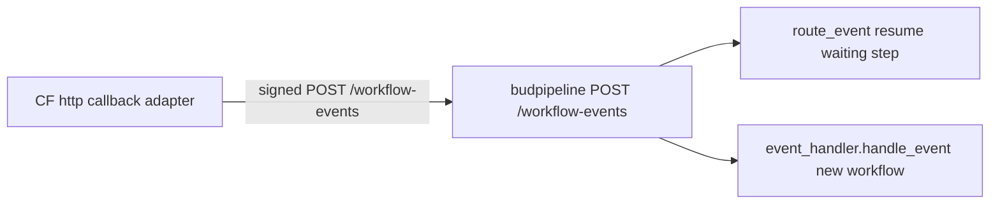

| # | File:line | Change |
|---|---|---|
| 1 | `services/budpipeline/budpipeline/scheduler/services.py:488-521` (`SUPPORTED_EVENTS`) | register the event types this budpipeline subscription accepts. The gateway delivers the reverse-DNS `event.type` **verbatim** (§9.4); budpipeline either registers those reverse-DNS strings directly in `SUPPORTED_EVENTS`, or maps them to its own short keys **at its edge** in `/workflow-events`. **Gate**: `create_event_trigger` rejects unknown types at `:532-536`, and `event_handler` skips types not in this dict (`event_handler.py:46`). There is no gateway-side short-key translation — that mapping, if wanted, is budpipeline's |
| 2 | `services/budpipeline/budpipeline/webhook/event_handler.py:27-105` | no code change required for fanout: `handle_event` already lists matching enabled triggers (`list_event_triggers(event_type=..., enabled=True)`, `:54`), applies `matches_filters` (`scheduler/services.py:622`), and starts a new pipeline via `execute_pipeline_async` (`:101-105`). MCP triggers are created via the existing `POST /event-triggers` API (`scheduler/routes.py:414`) with `EventTriggerConfig{event_type, filters}` |
| 3 | `services/budpipeline/budpipeline/handlers/event_router.py:49` (`extract_workflow_id`) | correlate/resume already works if the gateway places the correlation id where the extractor looks: `event_data["workflow_id"]`, or nested `payload.workflow_id`, `notification_metadata.workflow_id`, `payload.content.result.workflow_id`. The subscription's `correlation_id` (§9.1a) MUST be mapped into one of these for resume; pure-trigger (fanout) events omit it |
| 4 | gateway side (CF `mcpgateway/services/egress/http.py`) | **no Dapr.** The same `http` callback adapter that serves budprompt/bda POSTs the §9.1a envelope to budpipeline's `callback_url` (`/workflow-events`). Set `correlation_id` only for resume; pure trigger (fanout) events need only a supported `event.type` plus filter-matchable fields under `event.data` |

Resume vs new-workflow is decided entirely by budpipeline's existing two-phase handler — **the gateway does not choose** (and for single-agent cases budpipeline is not involved at all). Phase 1 `route_event` finds a waiting step via `StepExecutionCRUD.get_by_external_workflow_id(workflow_id)` (`event_router.py:218-219`, backed by `pipeline/models.py:484 external_workflow_id`) and resumes it (correlate). Phase 2 `event_handler.handle_event` independently starts new workflows for matching triggers (fanout). A correlate event whose `workflow_id` matches no waiting step yields `routed=False` in phase 1 and may still fanout in phase 2 if a trigger matches — which is why pure-trigger events omit the correlation id.

**Contract budpipeline must honor (only when used as a multi-step target):** delivery is a signed `application/json` HTTP POST of the §9.1a envelope, **not** Dapr. `/workflow-events` reads the body and discriminates on the event `type` (`main.py:241/243`; if it was written to expect a Dapr-unwrapped `data`, it adapts to the envelope's `event`). The gateway sets the echoed `event.id` (synthesized per §9.2.4 for MCP-native events) as the dedup key, and `Idempotency-Key = subscription.delivery_id`. Because this is now a gateway-owned HTTP delivery (no sidecar), the gateway's at-least-once retry + `dead_letters`/Admin-UI surfacing **covers this `http` path too**, exactly like budprompt and bda — there is no Dapr `poisonMessages` topic in this design and no scoped-out delivery guarantee for `http` callbacks (the SSE/WS best-effort carve-out of §9.2.2 is unrelated — budpipeline is an `http` target). budpipeline should return a `2xx` only after durably accepting the event (so the gateway does not over-retry) and rely on `event.id` for idempotency where it resumes a step.

### 9.7 Cross-cutting contract summary

| Concern | Gateway (producer) | budprompt (default target) | bda (target) | budpipeline (optional, multi-step) |
|---|---|---|---|---|
| Envelope | §9.1a envelope `{event{id,source,type,subject,time,data}, subscription{...,target,correlation_id}}`; raw body under `event.data`; proprietary envelope | reads `event` + `subscription.target` | reads `event` payload → `SystemEvent.payload` | reads `event` (+`subscription.correlation_id`) |
| Routing decision | **gateway subscription match is the routing**; echoed in `subscription.target` | dispatches `target.agent_id` directly — **no routing engine** | bda's own `TriggerEngine` matches the event to a rule | two-phase handler picks resume vs new-workflow |
| Dedup / idempotency | echoes immutable `event.id`; `Idempotency-Key = subscription.delivery_id` (unique per attempt); MCP-native `event.id` **synthesized** (§9.2.4) | dedup on `event.id` | `SystemEvent.dedup_key = event.id` | dedup on `event.id` |
| Type taxonomy | reverse-DNS `type` carried **verbatim** to all targets (e.g. `com.github.push`, MCP-native `com.<provider>.resource.updated`) | passed to executor shaping | matched via `TriggerSource::Mcp.event_types` / `Custom` topic | registered in `SUPPORTED_EVENTS` (verbatim, or mapped **at budpipeline's edge**) |
| Correlation (resume) | `subject`/`correlation_id` → mapped field | n/a (single invoke) | n/a (spawn-only via rules) | one of the `extract_workflow_id` paths |
| Delivery model | **push only — single signed HTTP `POST` to `callback_url`** (gateway never speaks Dapr); `sse`/`ws` only for streaming clients | push (HTTP) — `POST /v1/events` | push (HTTP) — `POST /webhook/{hook}` | push (HTTP) — `POST /workflow-events` |
| Delivery guarantee | at-least-once + gateway `dead_letters`/Admin UI, **uniform across all `http` callback targets**; `sse`/`ws` is best-effort, no DLQ, L2-replay-only (§9.2.2) | dedup on `event.id` (covered by `http` DLQ) | dedup on `dedup_key` (covered by `http` DLQ) | return `2xx` after durable accept; covered by `http` DLQ |
| Auth | per-subscription `delivery.auth`; egress scheme allowlist https-only + loopback-http | per subscription (typically `bearer`) | `x-bda-token` (`BDA_WEBHOOK_TOKEN`) | per subscription |

See §7/§8 for the SUBSCRIBE/PUBLISH state machines, CEL filter semantics (OQ-2 closed — CEL is decided), and fanout-vs-correlate routing that feed these adapters; this section does not re-specify them. The data-model names used above (`event_subscriptions`/`EventSubscription`, `event_log`/`EventLog`, `delivery_attempts`/`DeliveryAttempt`, `dead_letters`/`DeadLetter`) are the canonical ones shared with §5, §7, §8, and §11; the subscription column set (`correlation_key`+`correlation_value`, `expires_at`, `subscriber_kind` ∈ `{http,sse}`) follows the same sections.

### 9.8 Milestone impact (binds to §11)

This delta collapses the prior split webhook/Dapr egress milestones into a single HTTP-callback framework and demotes budpipeline. §11 is the authoritative milestone list; the changes §9 requires there are:

- **Merge M4 (Dapr → bud-runtime) and M5 (webhook → bda) into one "HTTP-callback egress adapter framework" milestone** that ships the single `http` push adapter **plus** the `sse`/`ws` stream adapter (folding in the prior M3 SSE/WS adapter). Remove all Dapr-specific milestone content (no `dapr` adapter, no `budpipelineEvents` publish, no Dapr sidecar) and remove the reverse-DNS → short-key `SUPPORTED_EVENTS` translation milestone item — that translation existed only for the deleted Dapr path. The L2 Redis Streams bus milestone (prior M2) is unchanged; it remains the durability/retry/replay spine and is **not** a delivery target.
- **The two default targets become milestones *of* that one adapter:** (i) egress → budprompt = add the thin inbound event → invoke receiver in budprompt (§9.5); (ii) egress → bda = the `EventSource::Mcp`/`TriggerSource::Mcp` wiring (§9.5b). Both consume the same `http` adapter.
- **budpipeline multi-step orchestration becomes a later/optional milestone** (§9.6), no longer on the default path.
- **Renumber/merge accordingly.** Suggested coherent re-spine: **M0** (schema + flags) and **M1** (config-driven ingress + canonical envelope) unchanged; **M2** (durable L2 bus + delivery worker) unchanged; **M3** becomes the unified **HTTP-callback + SSE/WS egress adapter framework**; **M4** = egress → budprompt (thin receiver); **M5** = egress → bda; **M6** (Admin UI: subscriptions + dead-letter ops, FR-27/FR-38) unchanged and now covers all `http` callbacks uniformly; **M7** (MCP-native provider *ingestion* adapter + synthesized `id`) unchanged; **M8** (correlate mode + per-op webhooks #523) unchanged; and **budpipeline multi-step orchestration** is an optional milestone after M5 (it reuses the M3 adapter, so it is integration-only). When M7's correlate/ingestion data-model columns land, use the canonical names (`correlation_key`+`correlation_value`, `expires_at` — **not** the retired `auto_expire_at`) and the canonical candidate index `ix_event_subs_tenant_source_type` on `(team_id, source, event_type, active)`, per §5/§7/§10. The forward-compat tracking of the MCP Triggers & Events WG / Tasks RC / `webhooksSupported` is unchanged. FR ids referenced by this section (FR-18 CEL, FR-27/FR-38 dead-letter surfacing) keep their numbers; FR-27/FR-38 are no longer scoped-out for any **`http` callback** target, since the uniform gateway DLQ now covers every `http` callback (budprompt, bda, budpipeline) — the previous "DLQ scoped to webhook only, Dapr poison owned by Dapr" carve-out is removed everywhere (§10.2, §11 risks). The `sse`/`ws` adapter remains explicitly best-effort with no DLQ (§9.2.2), which §10.2/§11 reflect.

---

## 10. Security, Reliability & Observability

This section specifies the non-functional contract for the triggers/events subsystem: how inbound webhooks are authenticated and verified, how secrets are stored and rotated, how delivery is made **at-least-once with receiver-side idempotent dedup on `delivery_id`**, and how the whole pipeline is observed and audited. It builds on the agreed architecture (single ingress `POST /webhooks/{conn-id}`, a proprietary delivery envelope, L1 in-process / L2 Redis Streams / L3 egress adapters) and reuses existing gateway primitives wherever they exist. Where a concern is owned by a sibling section (descriptor schema details, subscription CRUD field-by-field, egress adapter wiring) this section cross-references rather than restates.

> Baseline reality from the repo: there is **no HMAC / webhook-signature verification anywhere today** (grep for `HMAC|hmac|webhook|X-Hub-Signature|verify_signature` across `mcpgateway/**.py` returns nothing — only JWT/auth-encryption secrets and support-bundle redaction at `mcpgateway/version.py:100`). Inbound notifications from federated upstreams are currently **dropped** (`mcpgateway/services/gateway_service.py` one-shot `ClientSession`; `mcpgateway/routers/reverse_proxy.py:217` TODO stub). Everything in §10.1 is therefore net-new code, not a modification of existing verification.

### 10.0 Canonical names, taxonomy, and the at-least-once contract (binding references)

To eliminate naming/schema drift across §5/§7/§8/§9/§11, this subsystem uses **one canonical name per entity**. Wherever a sibling section uses a different label, treat the canonical name here as authoritative.

**Tables and ORM classes (canonical):** there are **four new standalone tables** (plus the optional fifth `provider_descriptors` table documented in §5.1.1 where descriptors are persisted rather than loaded from YAML). The four are:

| Entity | Table name | ORM class | Defined in | Notes |
|---|---|---|---|---|
| Subscription (standalone, first-class) | `event_subscriptions` | `EventSubscription` | §7 (authoritative) | NOT a column-extension of `gateways`. A new table modeled on `GatewaySecurityScanFinding` (`db.py:3028`) + a migration like `3c89a45f32e5_add_grpc_services_table.py`. Stores the target identity (`target.agent_id`/`version`/`params`), `callback_url`, the correlate-mode columns `correlation_key` (jsonpath) + `correlation_value` (resolved bound value), the ephemeral-subscription `expires_at`, and encrypted `delivery.auth` set at registration time (§10.1.5, D3). |
| Raw normalized event store | `event_log` | `EventLog` | §5.4.2 (authoritative) | One row per accepted, deduped event (the raw provider body under `data` + extracted envelope attrs). |
| Per-delivery attempt record | `delivery_attempts` | `DeliveryAttempt` | §9 (authoritative) | One row per (event, subscription, attempt) for retry/audit history; carries the `delivery_id` used as the idempotency key. |
| Dead-letter store | `dead_letters` | `DeadLetter` | §9 (authoritative) | Events exhausted past `max_attempts` or undeliverable; backs the Admin-UI DLQ console. |

The **inbound webhook signing secret** is NOT a table and is NOT stored in `Gateway.capabilities["events"]` JSON — it lives ONLY in a **dedicated, nullable, encrypted `webhook_signing_secret` column on the `gateways` table** (per §5.3, decided — not left to decide during impl). It is deliberately kept out of `capabilities` because §5.2 proves `capabilities` is surfaced in `GatewayRead` and would leak the ciphertext. The subscription, by contrast, is the standalone `event_subscriptions` table above. §5, §7, §8, §9, and §11 MUST all use exactly these four table names (plus optional `provider_descriptors`), these four ORM class names, and this dedicated-column secret-storage location.

**Delivery envelope (canonical, proprietary).** The gateway builds a simple proprietary envelope whose `event` block carries the fields `id`, `source`, `type`, `subject`, `time`, `data`. The envelope delivered on every egress POST is:

```jsonc
{
  "event": {
    "id":      "<stable event id (provider-supplied or synthesized §10.1.8)>",
    "source":  "<connection URI / provider source>",
    "type":    "com.<provider>.<...>",   // reverse-DNS taxonomy (below)
    "subject": "<resource uri / task handle>",
    "time":    "<occurrence timestamp>",
    "data":    { /* raw normalized provider body */ }
  },
  "subscription": {
    "id":             "<event_subscriptions.id>",
    "delivery_id":    "<unique per delivery ATTEMPT — the idempotency key>",
    "mode":           "fanout" | "correlate",
    "target":         { "agent_id": "...", "version": "...", "params": { } },
    "correlation_id": null | "<task-handle / step-id>"
  }
}
```

`subscription.target.*` and the subscription's `callback_url` / `delivery.auth` are captured at registration time and **echoed by the gateway on every delivery** (D3), so the receiver knows which agent to invoke without doing its own routing (D4). `delivery_id` is unique **per attempt** and is the idempotency key receivers dedup on; `event.id` remains stable across attempts and is used for ingest dedup (§10.1.8).

> Forward-compat note (see §2): the gateway emits its own proprietary envelope; no downstream requires any external envelope standard. The earlier Dapr egress path is removed (D1), so there is no broker coupling to satisfy.

**Event-type taxonomy (canonical rule, unchanged by the egress decision):** the `event.type` attribute is **reverse-DNS, `com.<provider>.<...>`** for every event the gateway emits — `com.github.push`, `com.stripe.payment_intent.succeeded`, `com.slack.message`. For MCP-native events the prefix is **`com.mcp.*`** (e.g. `com.mcp.resource.updated`, `com.mcp.task.completed`) — NOT `io.mcp.*`. The `io.mcp.*` and bare `mcp.*` spellings that appear in earlier drafts of the FR list, US-2/US-3/US-4, §5, §8.10, §9.5, and the milestones are superseded by `com.mcp.*`; those sections MUST be updated to match. This reverse-DNS taxonomy is the gateway's own type space and stands regardless of the envelope decision.

> **Egress is unified on ONE signed HTTP callback (D1).** The gateway delivers every event via a **single signed outbound HTTP POST** to the subscription's registered `callback_url`. There are exactly **two** egress adapter kinds: **(a) HTTP callback (push)** — covers budprompt (default bud-runtime target, D5), bda, external #523 consumers, and budpipeline-when-needed (D6); and **(b) SSE/WS (stream)** — only for browser/streaming clients that cannot receive a callback. The gateway **NEVER speaks Dapr** (no sidecar, no Dapr HTTP API, no topic publishing). The former `dapr` egress adapter and the reverse-DNS → bud-runtime `SUPPORTED_EVENTS` short-key translation table are **removed entirely** — that translation only ever existed for the deleted Dapr publish path. This is the common webhook pattern (Stripe/GitHub/Svix/Hookdeck and the MCP #523 proposal all deliver via outbound signed HTTP POST).

> **Subscriber kind = the adapter, not the receiver (D1/D4).** The subscription's `subscriber.kind` (a.k.a. `subscriber_kind`) selects which of the two egress adapters delivers the event, so its canonical enum is the **two-adapter set: `http_callback | sse_ws`** (SSE and WS share the one stream adapter). It is **not** the receiver identity — *which* receiver gets the POST is distinguished by the registered `callback_url`, never by `kind`. The pre-D1 receiver-as-kind spellings (`{bda, bud-runtime, sse, mcp}` and `{budprompt, bda, budpipeline, sse, mcp}`) seen in earlier drafts of §1.7, §3 FR-14/FR-30/FR-31 are superseded by this adapter set; those sections MUST be updated to match.

**Routing is the gateway's subscription match (D4).** "Which agent" is decided by the **subscription match in the gateway** and carried in `subscription.target` (D3). Downstream targets do **not** run a routing engine — they need only a thin *invoke* (event→agent) adapter. Any prior text implying the receiver must route, or that "events must flow through budpipeline to be routed", is incorrect and corrected here: budpipeline is an **optional** target for genuine multi-step workflows or resuming a waiting step (D6), not a mandatory routing hop.

**Delivery guarantee (canonical):** delivery is **at-least-once with receiver-side idempotent dedup** on `Idempotency-Key = subscription.delivery_id`, per NG1 / FR-26 / NFR-4 / §8.11. The gateway does **not** claim exactly-once. "Effectively-once processing" holds only insofar as the receiver actually dedups on the key — that is the receiver's responsibility, not a gateway guarantee. Because there is now a **single push path** plus the SSE/WS stream, the gateway-owned DLQ, retry, and Admin-UI surfacing described in §10.2 / FR-27 / FR-38 apply to the **HTTP-callback push path** uniformly (there is no Dapr-delegated durability carve-out anymore); the SSE/WS stream remains best-effort with no DLQ (§9.1/§9.2.2).

### 10.1 Security

#### 10.1.1 Inbound signature verification per provider

The single ingress route `POST /webhooks/{conn-id}` (locate exact router/path during impl; modelled on the existing `gateway_router` pattern at `mcpgateway/main.py:1227`) MUST verify every inbound POST **before** building the delivery envelope or returning 202. The verification recipe is fully data-driven from the connection's provider descriptor (see sibling "Provider Descriptor" section); no provider-specific code lives on the hot path except the `plugin` escape hatch.

Verification dispatch table (the finite axes from the agreed design):

| `verify.mode` | Inputs from descriptor | Computation | Notes |
|---|---|---|---|
| `none` | — | accept (still applies timestamp/replay if configured) | dev-only / providers with no signing; MUST log a warning + flag in Admin UI |
| `hmac` | `header`, `algo` (sha1/sha256), `encoding` (hex/base64), `prefix` (e.g. `sha256=`), `signed_payload` template | `HMAC(secret, render(signed_payload, raw_body))` compared constant-time to header value (minus prefix) | GitHub `X-Hub-Signature-256`, Shopify, generic |
| `hmac_timestamped` | as `hmac` plus `timestamp_header`, `tolerance_seconds` | reject if `|now - ts| > tolerance`; signed payload typically `{ts}.{raw_body}` | Stripe (`Stripe-Signature: t=…,v1=…`), Slack (`v0:{ts}:{body}`) |
| `plugin` | `plugin_name` | delegate to a registered `EVENT_VERIFY` hook plugin | AWS SNS X.509 cert chain, GCP Pub/Sub OIDC bearer / base64 — the ~5% exotic providers |

Implementation requirements:
- The verifier MUST operate on the **raw request bytes** (`body: bytes`) captured before any JSON parsing — re-serialization changes byte order/whitespace and breaks HMAC. This mirrors bda's `handle_webhook(... body: Bytes)` (`bda-reactive/src/sources/webhook_receiver.rs:70`).
- Comparison MUST be constant-time (`hmac.compare_digest`).
- New crypto primitive lives in a new module (e.g. `mcpgateway/services/event_signature.py`, locate during impl) — there is no existing signing util to extend; `mcpgateway/utils/services_auth.py` is AES-GCM for credential encryption, not message authentication, and MUST NOT be repurposed.
- The `plugin` escape hatch is realized as a new hook band registered exactly like existing bands in `mcpgateway/plugins/framework/hooks/registry.py` (define an `EventHookType.EVENT_VERIFY` enum + payload/result models + `register_hook`, parallel to `ToolHookType` at `hooks/tools.py:40-41`), and declared in `plugins/config.yaml`. New descriptor-driven providers require **no plugin** — only YAML + a stored secret.

**Ordering: verify BEFORE any conn-id existence disclosure (resolves the §6.7/§6.9 vs §8.2 conflict).** The ingress MUST NOT become a connection-id existence oracle or a reflection/handshake responder for unauthenticated callers. The required order is: (1) load the descriptor + signing secret for `conn-id`; (2) verify the signature; (3) only on `verify_ok` answer any handshake challenge or otherwise reveal connection-specific behavior. An unknown `conn-id` and a known `conn-id` with a bad signature MUST be **indistinguishable** to the caller — both return the same status with no echoed challenge and no timing/branch that reveals existence. Where a provider's handshake (e.g. Slack `url_verification`) legitimately must be answered before a signing secret exists (first-touch provisioning), that handshake is permitted **only** during an authenticated, in-progress admin events-enable flow for that specific `conn-id`, never on the open ingress path. This reconciles §6.7/§6.9 and supersedes the opposite ordering shown in §8.2, and is what makes the FR-33 / §10.1.3 unguessability/no-enumeration goal actually hold.

Verification outcomes:

```
verify_fail (bad/missing sig)  -> HTTP 401, no event emitted, audit "ingest.verify_failed"
replay/stale timestamp         -> HTTP 401, no event emitted, audit "ingest.replay_rejected"
unknown conn-id                -> HTTP 401 (SAME response as verify_fail — do NOT leak existence)
handshake challenge (post-verify, or in authed enable flow) -> HTTP 200 echoed challenge, no event
verify_ok                      -> HTTP 202 Accepted, proceed to envelope build
```

#### 10.1.2 Secret storage & rotation

The inbound webhook **signing secret** is stored on the **connection instance** (the `Gateway` record — gateways ARE the connector/registry abstraction; there is no separate registry), in a **dedicated, nullable, encrypted `webhook_signing_secret` column on the `gateways` table** (per the §5.3 decision — decided, not "decide during impl"). It is **NOT** stored in the `Gateway.capabilities["events"]` JSON block, because §5.2 shows `capabilities` is surfaced in `GatewayRead` and would leak the ciphertext. It is per-axis distinct from the OUTBOUND OAuth credential already on the record:

| Material | Direction | Storage location | Encryption |
|---|---|---|---|
| Webhook signing secret | INBOUND (verify POSTs) | dedicated nullable `webhook_signing_secret` column on `gateways` (added in §5.3 alongside `db.py:2875+` columns) — store the *ciphertext*, never plaintext; never in `capabilities` JSON | AES-GCM via `encode_auth`/`decode_auth` (`mcpgateway/utils/services_auth.py:86/119`), key from `settings.auth_encryption_secret` |
| OAuth client creds / tokens | OUTBOUND (register hooks, call APIs) | existing `Gateway.oauth_config` (`db.py:2972`, client_secret encrypted inside) + `OAuthToken` rows (`db.py:3302`, `access_token`/`refresh_token` Text) | `EncryptionService` (Argon2-derived) via `token_storage_service.store_tokens` (`services/token_storage_service.py:84`) |
| Outbound callback delivery auth | OUTBOUND (signed HTTP POST to `callback_url`) | per-subscription `delivery.auth.credentials` in `event_subscriptions` (§10.1.5) — store ciphertext | AES-GCM via `encode_auth`/`decode_auth` (`services_auth.py:86`) |

Requirements:
- The signing secret MUST be encrypted at rest using the same AES-GCM path that protects `gateway.auth_value` today (`encode_auth` at `services_auth.py:86`, line 113 `aesgcm.encrypt`). Reuse — do not invent a parallel crypto stack.
- The secret MUST be redacted from support bundles; extend the existing redaction predicate `_is_secret` (`mcpgateway/version.py:100`) to cover the new column name `webhook_signing_secret` (and the rotation slot below).
- It MUST never appear in `GatewayRead` (`schemas.py:3543`) — the dedicated `webhook_signing_secret` column is excluded from the serialized model exactly as `auth_value` is never echoed back, and the `events` capability block surfaced to clients carries only non-secret metadata (event taxonomy, supported types, hook state).

Rotation:
- **Dual-secret window**: alongside the dedicated `webhook_signing_secret` column, an optional `webhook_signing_secret_previous` (ciphertext) and a `webhook_signing_secret_previous_expires_at` timestamp support the rotation window. During rotation, verification tries the current secret, then the previous one until expiry. This absorbs the propagation lag at the provider side after re-registering the hook. (These rotation fields live on the `gateways` row, not in `capabilities` JSON, for the same `GatewayRead`-leak reason.)
- Rotation is an authenticated admin operation (see §10.1.6) that: (1) generates/accepts a new secret, (2) re-registers the upstream provider hook with the new secret using the stored OAuth token (the same outbound path as initial provisioning), (3) moves the old secret into the `_previous` slot with a bounded TTL.
- OAuth token refresh is already handled transparently on the outbound side (`token_storage_service.get_user_token` auto-refreshes expired tokens at `services/token_storage_service.py:160-163`); no new logic needed for outbound token rotation.

#### 10.1.3 Capability-URL (opaque conn-id) considerations

The `conn-id` in `POST /webhooks/{conn-id}` doubles as a **capability URL** — possession of the URL is part of the authorization to POST events (the signature is the other part). Therefore:
- `conn-id` MUST be a high-entropy opaque token, NOT the human-readable gateway slug. Reuse the existing 128-bit hex identifier style (`Gateway.id` default `uuid.uuid4().hex`, `db.py:2875`) or a dedicated random ingest token so it is unguessable and not enumerable.
- The capability URL is **defense-in-depth, not the sole control**: a leaked URL alone MUST NOT allow event injection because §10.1.1 signature verification still applies, and per §10.1.1 an unknown/invalid `conn-id` is indistinguishable from a bad-signature response (no enumeration oracle). `verify.mode = none` connections rely solely on the capability URL and MUST be visibly flagged as lower-assurance in the Admin UI.
- Ingest URLs MUST NOT be logged at INFO with the full token; log the gateway id / a truncated fingerprint instead. Treat the full ingest URL as a secret in support bundles.
- Rotating a leaked capability URL = issue a new `conn-id`/ingest token and re-register the upstream hook to the new path; the old path returns the same opaque 401 as any unknown conn-id.

#### 10.1.4 OAuth scope escalation for hook registration

Enabling the **events** capability on a connection may require broader OAuth scopes than tools-only use (e.g. GitHub `admin:repo_hook`, Stripe webhook-management scope). This is a deliberate, surfaced escalation:
- The provider descriptor declares the additional scopes required to provision upstream hooks. Enabling events on a connection whose stored token lacks those scopes MUST fail closed with an actionable error ("events requires scopes: [...]; re-authorize the connection") rather than silently registering a hook that the provider rejects.
- Scopes already live on `OAuthToken.scopes` (JSON, `db.py:3315`) and in `oauth_config` — the provisioning step compares declared-required vs. granted before attempting upstream hook registration.
- The escalation is one-time at events-enable, consistent with the unified-lifecycle decision: one registration carries identity + auth + tools + events. Re-authorization with elevated scopes uses the existing OAuth flow (`OAuthState` PKCE/CSRF at `db.py:3327`); no separate auth subsystem.

#### 10.1.5 Outbound delivery auth

Each subscription's `delivery.auth` governs how the gateway authenticates the **single signed HTTP POST** to the downstream `callback_url`. With egress unified on one push adapter plus the SSE/WS stream (D1), the auth contract collapses to two rows — matching the canonical `subscriber.kind` adapter set `http_callback | sse_ws` (§10.0):

| Adapter (`subscriber.kind`) | Auth mechanism | Source of credential |
|---|---|---|
| **`http_callback` (push)** — the single outbound POST to `callback_url`, covering budprompt (default, D5), bda-reactive `POST /webhook/{hook_name}`, external #523 consumers, and budpipeline-when-needed (D6) | a per-subscription strategy: `bearer` / `apiKey` / `basic` / `customHeader` per #523 `Webhook.authentication.strategy`. bda's receiver expects `x-bda-token` matching env `BDA_WEBHOOK_TOKEN` (`bda-reactive/src/sources/webhook_receiver.rs:37-44`) → expressed as `customHeader`. The gateway ALSO HMAC-signs the body (Stripe/GitHub/Svix style) so the receiver can verify origin | subscription `delivery.auth.credentials`, encrypted at rest like other secrets |
| **`sse_ws` (stream)** | the *consumer's* existing gateway auth (JWT/bearer) on the SSE/WS connection — delivery rides an already-authenticated channel via `Transport.send_message` (`transports/base.py:81`) / `SessionRegistry.broadcast` | existing gateway auth |

There is **no `dapr` adapter row** — the gateway never publishes to a Dapr pub/sub component; budprompt and budpipeline (when used) receive the same signed HTTP callback as any other target. There is **no `mcp-native` egress row** here — MCP-native concerns inbound ingest, not an egress target.

Stored outbound-delivery credentials MUST be encrypted with the same AES-GCM util (`services_auth.py:86`) and redacted from bundles. Per-operation `tools/call` webhooks (the #523 ephemeral path) carry their auth inline in the call and produce a short-lived correlate-mode subscription; that inline credential MUST be encrypted before persistence and purged when the ephemeral subscription auto-expires (its `expires_at`, the canonical expiry column on `event_subscriptions` — §5.10/§7.1.1; the retired `auto_expire_at` spelling is NOT used).

> **#523 callback-auth vs inbound verify are different axes (resolves the §2.4 conflation).** §10.1.1 governs the INBOUND signature-verify recipe (`hmac`/`hmac_timestamped`/`none`/`plugin`) the gateway applies to POSTs it *receives*. The `delivery.auth.strategy` here (`bearer`/`apiKey`/`basic`/`customHeader`, #523) governs how the gateway authenticates the outbound callback it *delivers*. They are independent and MUST NOT be conflated into one enum.

#### 10.1.6 Authorization on subscription CRUD

"Who may subscribe what to where" is enforced via the existing permission/team model — reuse `@require_permission(...)` decorators (e.g. `gateways.create` at `mcpgateway/main.py:5185`) rather than a bespoke ACL.

- New permissions (locate exact strings during impl): `subscriptions.create`, `subscriptions.read`, `subscriptions.delete`. The programmatic path (`POST /subscriptions`, `DELETE /subscriptions/{id}`) guards each route with these.
- **Source authorization**: a caller may only subscribe to a `(source, event_types)` for which they can see the underlying connection. The connection (`Gateway`) is team-scoped via `team_id`/`owner_email`/`visibility` (`db.py:2974-2977`); subscription creation MUST reject sources the caller cannot read under that scoping.
- **Target authorization**: a caller may only point a subscription at a `callback_url` they are allowed to deliver to. The supplied URL MUST pass SSRF policy (§10.1.9) AND, for non-public targets, the caller owns or is granted the target binding. Because the target is just a callback URL, the choice between "direct-to-budprompt" (D5) and "via-budpipeline" (D6) is a **per-subscription URL choice**, not an architecture fork, and is authorized identically. Ephemeral per-`tools/call` webhooks are implicitly authorized by the in-flight call's own auth + correlation handle (they can only resume the caller's own waiting run).
- **Owner stamping**: every `event_subscriptions` record carries `owner_email` + `team_id` (and visibility), stamped from the authenticated principal — mirroring the gateway audit block (`created_by/created_from_ip/created_via/created_user_agent`, `db.py:2890-2898`). Standing/declarative subscriptions (bda `trigger_store` YAML, bud-runtime `EventTrigger`) are owned by the service principal that loaded them.

#### 10.1.7 Tenant isolation (enforced by schema, not merely filtered)

- Every `event_subscriptions`, `event_log`, and `dead_letters` row is tagged with the originating connection's **`team_id` and `owner_email` columns** (FK/`String` mirroring `Gateway.team_id`/`owner_email`, `db.py:2974-2977`). These columns are added to all three tables in §5.4.2 / §9.3, not just `gateways`. The `delivery_attempts` table inherits tenant scope via its FK to `event_log`/`event_subscriptions`.
- The L2 matcher MUST evaluate a candidate subscription against an event **only when their tenant scope is compatible** — a subscription never matches an event from a connection outside its team/visibility scope.
- The candidate-match index is keyed **including tenant scope** so cross-tenant fan-out is structurally impossible, not merely filtered. There is **one** canonical candidate-match index, named **`ix_event_subs_tenant_source_type`** over **`(team_id, source, event_type, active)`** on `event_subscriptions`. This is the single authoritative name and key-set, propagated verbatim to §3 (FR-13/FR-16), §5.4.1, §7.1.1, §8.6, and §11.0; the earlier competing names (`ix_event_subscriptions_source_type`, `ix_subscriptions_source_active`, `ix_subscriptions_gw_mode`, `ix_event_subscriptions_candidate`) are all replaced by it — those sections MUST adopt this name with no surviving "supersedes" counter-claim. Supporting tenant-scoped indexes:
  - `event_subscriptions` (correlate exact-match resume route): index `ix_event_subscriptions_corr_value` over `(team_id, source, correlation_value, active)` — the exact-match index that routes a correlate event to the one waiting subscription by its resolved `correlation_value` (the jsonpath that produced it is `correlation_key`; both columns are canonical per §5.4.1/§7.1.1).
  - `event_log`: index over `(team_id, source, created_at)` for tenant-scoped replay/inspection.
  - `dead_letters`: index over `(team_id, created_at)` backing the per-tenant DLQ console.
- Admin UI surfaces (DLQ, metrics drill-down, raw-event inspection) are filtered to the viewer's team scope; only platform admins see cross-tenant aggregate counters.
- Redis keys (dedup SET, stream names, per-subject delivery queues) MUST be namespaced by tenant so one tenant's volume/poison events cannot starve or collide with another's (see §10.2).

#### 10.1.8 Replay / timestamp-window protection

Two independent layers, both required for `hmac_timestamped` providers:
1. **Timestamp window** (§10.1.1): for `hmac_timestamped`, reject when `|now - signed_timestamp| > tolerance_seconds` (descriptor-configured; default e.g. 300s). This bounds the replay window even if a signature is captured.
2. **Dedup on event id** (idempotency at ingest): after verification, before XADD, perform `SET dedupkey NX EX ttl` in Redis where `dedupkey = {team_id}:{conn-id}:{event.id}` and `event.id` is the descriptor-extracted `dedup_id` (the envelope `id`, the dedup attribute per §5.3 of the spec ref). If the key already exists, the event is a duplicate/replay → return 202 (idempotent ack) and do NOT re-publish. TTL ≥ the max provider redelivery horizon.

> Note the two distinct idempotency keys: **`event.id`** dedups *ingest* (same provider event arriving twice), while **`subscription.delivery_id`** (unique per attempt, §10.0) is the `Idempotency-Key` the *receiver* dedups on for delivery-level at-least-once. They are not interchangeable.

**MCP-native id synthesis (resolves the missing-provider-id gap).** MCP `notifications/resources/updated` and `notifications/*` carry **no provider-supplied id** (spec §1.2 — only `uri` is required), so the dedup-on-`(source,id)` machinery is otherwise unsatisfiable for the entire MCP-native ingest path. The gateway MUST therefore **synthesize a deterministic `event.id`** for MCP-native events as `id = uuidv5(namespace, conn_id + "|" + method + "|" + canonical(params))` (a content hash over the connection, notification method, and canonicalized params). This makes identical re-notifications collapse to the same id (true dedup) while distinct updates differ. `source` = the federated connection URI; `subject` = the resource `uri` / task handle. Where a notification is genuinely repeatable-but-distinct (e.g. two identical `resources/updated` for real successive changes), the synthesized id additionally folds in the upstream receipt sequence so legitimate repeats are not silently dropped. This synthesis rule MUST be specified in the MCP-native ingest section (§11) and is a prerequisite for that path's at-least-once contract.

```
inbound POST
  └─ load descriptor + secret for conn-id
  └─ verify signature (constant-time)            [401 on fail; same 401 for unknown conn-id]
  └─ if hmac_timestamped: check |now-ts|<=tol     [401 on stale]
  └─ if handshake AND verify_ok (or authed enable flow): echo challenge, 200, stop
  └─ extract event.id (dedup_id); MCP-native: synthesize id
  └─ SET {team_id}:{conn}:{id} NX EX ttl
        ├─ not set (dup) → 202, stop (no XADD)
        └─ set (new)     → persist to event_log → XADD L2 → 202
```

#### 10.1.9 SSRF on egress callback URLs

Egress targets are caller-supplied (`POST /subscriptions` `delivery.callback_url`, and #523 `tools/call webhooks[].url`), so the gateway is a confused-deputy SSRF risk. Because **every** push delivery is now an outbound HTTP POST to a caller-supplied URL (D1), the SSRF guard is on the *only* push path and is unconditionally load-bearing. An egress URL guard (new util, locate during impl) MUST run at **subscription-create time AND again immediately before each delivery** (DNS can be re-pointed after validation — TOCTOU):

- Scheme allowlist: `https` only by default (`http` permitted only to explicitly configured internal targets like the bda receiver or a co-located budprompt).
- Resolve the host and **reject literals/resolutions to** loopback (`127.0.0.0/8`, `::1`), link-local (`169.254.0.0/16` — blocks cloud metadata `169.254.169.254`), RFC1918 private ranges, `0.0.0.0/8`, and other reserved/multicast blocks — unless the target host is on an explicit operator allowlist (the bda receiver binds `127.0.0.1` per `bda-reactive/src/sources/webhook_receiver.rs:53`, so loopback must be allowlistable for the co-located trusted case; the same applies to a co-located budprompt receiver).
- Pin the resolved IP and connect to that IP (or re-validate post-resolution) to defeat DNS-rebinding between check and connect.
- Disable HTTP redirect following on the delivery client (a 30x can redirect an allowed host to a blocked internal one), or re-run the guard on each redirect hop.
- The **SSE/WS** stream adapter is exempt from URL SSRF checks because it delivers over an already-established, already-authenticated channel rather than an arbitrary URL.

### 10.2 Reliability

The delivery pipeline is **at-least-once with receiver-side idempotent dedup on `Idempotency-Key = subscription.delivery_id`** (the agreed design, NG1). The durable hop is L2 = Redis Streams (`XADD`/`XREADGROUP`), which replaces the fire-and-forget Redis **Pub/Sub** used today by `mcpgateway/cache/session_registry.py` (lines 200-201, 715, 848-867) — Pub/Sub has no persistence/replay and is unsuitable for the durable bus.

> Redis is **already a dependency** (`pyproject.toml:80` `redis>=5.0.0`; used for leader election `gateway_service.py:488`, OAuth state `oauth_manager.py:64`, chat sessions `llmchat_router.py:69`), so the L2 Redis Streams internal bus adds **no new dependency**. L2 is the durability/retry/replay/multi-instance **spine**, NOT a delivery target — do not confuse the internal bus with egress (the only egress is the single signed HTTP callback, plus the SSE/WS stream).

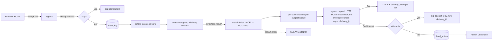

| Property | Mechanism |
|---|---|
| **Routing (no downstream router)** | The `match index → CEL` step IS the routing (D4): the matched subscription's `target` (agent_id/version/params) is stamped into the delivery envelope. Receivers run only a thin event→invoke adapter, never a routing engine |
| **At-least-once** | Event is XACK'd only after a 2xx from the callback; crash before XACK → message reclaimed and redelivered. NOT exactly-once — see receiver dedup below |
| **Idempotency** | Outbound carries `Idempotency-Key = subscription.delivery_id` (unique per attempt; `event.id` stays stable across attempts); receivers dedupe on it (effectively-once *only* if the receiver actually dedups — receiver responsibility). bda already dedups on `SystemEvent.dedup_key`; budprompt's inbound receiver (§9, D5) dedups on `delivery_id`. Ingest dedup (§10.1.8) prevents provider-side duplicate fan-out |
| **Retries** | 5xx/timeout → exponential backoff with jitter, bounded `max_attempts` (per-subscription `delivery.retry`); each attempt writes a `delivery_attempts` row with a fresh `delivery_id`. 4xx (except 408/429) is non-retryable → straight to `dead_letters` |
| **DLQ (HTTP-callback push path)** | After `max_attempts`, the event is written to the per-tenant `dead_letters` table/stream and surfaced in the Admin UI with original event, target, attempt history, last error; supports manual replay and discard. With egress unified on the single HTTP callback (D1), this applies to **every** HTTP-callback push delivery — there is no Dapr-delegated DLQ carve-out. The SSE/WS stream is best-effort (§9.1/§9.2.2) and has no DLQ |
| **Ordering** | Per-subscription delivery uses a **per-subject sequence** (envelope `subject`) backed by the L2 **Redis stream id** as the monotonic sequencer (NOT the envelope `time` attribute, which is only an occurrence timestamp and may collide/skew). Events for the same subject deliver in stream-id order; different subjects parallelize; a blocked/slow subject does not head-of-line-block other subjects. This satisfies the WG's "ordering guarantees" goal without global ordering |
| **Multi-instance** | L2 Redis **consumer groups**: all gateway workers `XREADGROUP` from one group, so each event is processed by exactly one worker; horizontal scale is adding workers. `XAUTOCLAIM`/`XPENDING` reclaims messages from a worker that died mid-delivery. Contrast L1 (`tool_service._event_subscribers`, `tool_service.py:242/1981`) which is **in-process only** (per-worker `asyncio.Queue`) and used only for live SSE/WS fan-out, never for durable cross-instance delivery |
| **Poison-event handling** | An event that repeatedly fails *deterministically* (un-parseable, fails CEL eval, malformed correlation key) is detected via the `delivery_attempts` counter and routed to `dead_letters` rather than retried forever. A separate **poison guard** caps total reprocessing of any single `event.id` so one bad event cannot saturate the consumer group. Failures isolated per-subscription queue so a poison event on one subscription does not stall others (the same defensive intent as bud-runtime's "always return 200 to avoid redelivery loops" at `main.py:298-308`) |

Delivery-mode interaction (from agreed design):
- **fanout/spawn**: no waiting agent; CEL filter match enqueues a delivery whose envelope carries `mode: "fanout"` and the matched `target`; normal retry/DLQ applies. The default fanout target is a direct callback to budprompt's inbound receiver (D5); budpipeline is used only when the fanout genuinely starts a multi-step workflow (D6).
- **correlate/resume**: routed by exact `correlation_id` (envelope field, resolved from the subscription's `correlation_key` jsonpath into its bound `correlation_value`, §10.1.7) to the one waiting run. For "event wakes one agent" this is a **direct callback to budprompt** carrying `correlation_id` (D5) — NOT a hop through budpipeline. budpipeline is the correlate target only when resuming a genuinely **waiting multi-step workflow step** (D6), in which case the callback URL is budpipeline's `POST /workflow-events`; bud-runtime resolves the waiting run via `extract_workflow_id` (`event_router.py:49`). If the correlation target no longer exists (run already completed/cancelled), the event is **not** retried indefinitely → it is logged + written to `dead_letters` as "no live correlation target"; the subscription auto-expires per the agreed design (its `expires_at`, §10.1.5).

### 10.3 Observability

#### 10.3.1 Metrics

Emit the following (metric backend = locate during impl; align with existing gateway metrics conventions). Label everything with `team_id`, `connection_id`, `provider`, and where applicable `subscription_id`, `adapter` (`http_callback` | `sse_ws`), `event_type`.

| Metric | Type | Purpose |
|---|---|---|
| `events_ingest_total{provider,result}` | counter | ingest rate; `result` ∈ `accepted`/`verify_failed`/`replay_rejected`/`duplicate`/`handshake` |
| `events_verify_failed_total{provider}` | counter | signature-failure alerting (spike = attack or rotated-secret drift) |
| `events_match_total{event_type,matched}` | counter | match rate (candidates evaluated vs. CEL matches) — this is also the routing-decision counter (D4) |
| `events_delivery_total{adapter,result}` | counter | delivery success/failure; `adapter` ∈ `http_callback`/`sse_ws`; `result` ∈ `2xx`/`4xx`/`5xx`/`timeout`/`dropped` |
| `events_delivery_latency_seconds{adapter}` | histogram | end-to-end deliver latency (XREADGROUP → 2xx callback ack) |
| `events_delivery_attempts{subscription_id}` | histogram | retry depth distribution (from `delivery_attempts`) |
| `events_dlq_depth{team_id}` | gauge | `dead_letters` backlog (alert threshold); covers the HTTP-callback push path (no Dapr carve-out) |
| `events_stream_lag{group}` | gauge | L2 consumer-group `XPENDING`/lag (worker keeping up?) |
| `events_active_subscriptions{kind}` | gauge | standing/programmatic/ephemeral `event_subscriptions` counts |
| `events_upstream_hooks{provider}` | gauge | refcounted provisioned upstream hooks |

#### 10.3.2 Tracing across hops

Propagate W3C `traceparent` end-to-end so a single event is traceable across systems:
- The trace is seeded at ingress (the `event.id`, including the MCP-native synthesized id per §10.1.8, is the stable correlation handle even where trace context is absent; `subscription.delivery_id` ties a specific attempt's span).
- Carry trace context as an **envelope extension field** (`traceparent`) so it survives the L2 stream and the egress hop.
- The HTTP-callback adapter injects `traceparent` into the outbound POST so the downstream span links. Concrete chains: **budprompt** (D5) → inbound `POST /v1/events` (or `/triggers`) receiver → its existing A2A `POST /a2a/{prompt_id}/v{version}/` or `POST /v1/responses/` executor for `target.agent_id`; **bda** (D7) → `POST /webhook/{hook_name}` → `TriggerEngine.match_event` → `build_triggered_task_request` → bda-daemon; **budpipeline** (D6, multi-step only) → `POST /workflow-events` → `route_event`/`handle_event`. The `event.id` and `subject` (task handle / workflow id) tie spans to the MCP primitive.
- Span boundaries: `ingress.verify`, `ingress.dedup`, `l2.xadd`, `match.cel` (the routing decision), `deliver.http_callback` (with attempt count + `delivery_id`), `deliver.sse_ws`, and a terminal `dlq.write` on exhaustion.

#### 10.3.3 Admin UI surfaces

- **Connection → Events tab**: events capability on/off, provider descriptor in use, `verify.mode` (with a warning badge when `none`), upstream hook state + refcount, signing-secret age / rotation control (§10.1.2), last-received timestamp.
- **Subscriptions view**: list/filter `event_subscriptions` by source, event_type, owner, mode (fanout/correlate), active flag; show the `target` (agent_id/version) and `callback_url` (host only, never the auth credential); create/delete (the programmatic path); standing vs. programmatic vs. ephemeral origin.
- **Live event stream**: SSE/WS view of recent normalized events (reuses the L1 fan-out / existing SSE machinery `StreamingResponse(... text/event-stream)` at `main.py:5473`). This is the SSE/WS egress adapter surfaced for operators/browser clients.
- **DLQ console**: `dead_letters` rows with attempt history (`delivery_attempts`) + last error; per-event **replay** and **discard** actions; `events_dlq_depth` chart. With egress unified on the single HTTP callback (D1), the console covers **every** failed HTTP-callback push delivery — there is no longer a Dapr-owned subset surfaced elsewhere (the SSE/WS stream is best-effort with no DLQ).
- **Metrics panel**: ingest/match/delivery rates, delivery latency, DLQ depth, stream lag.

All Admin UI surfaces are tenant-scoped (§10.1.7) and gated by the same permission model as other admin views.

#### 10.3.4 Audit log

Every security- and lifecycle-relevant action is audited with the actor (from auth), source IP, and timestamp — reusing the existing gateway audit metadata pattern (`created_by/created_from_ip/created_via/created_user_agent`, `db.py:2890-2898`). Audited events:

| Audit event | Trigger |
|---|---|
| `events.capability_enabled` / `_disabled` | events turned on/off on a connection (records scope escalation) |
| `events.secret_rotated` | signing-secret rotation (old/new fingerprint, never plaintext) |
| `events.connid_rotated` | capability-URL reissue |
| `subscription.created` / `.deleted` | programmatic CRUD on `event_subscriptions` (actor, source→target callback, filter) |
| `ingest.verify_failed` / `.replay_rejected` | rejected inbound POSTs (provider, conn-id fingerprint, IP) |
| `upstream_hook.registered` / `.deregistered` | provisioning/de-provisioning (refcount transitions) |
| `delivery.dead_lettered` | event exhausted retries → `dead_letters` (subscription, target callback host, last error) — covers all HTTP-callback push deliveries |
| `dlq.replayed` / `dlq.discarded` | manual DLQ operations |

Audit records MUST never contain secrets (signing secret, OAuth tokens, delivery callback credentials) or full capability/callback URLs — store fingerprints/truncations only, consistent with the support-bundle redaction (`version.py:100`).

> **§11 milestone impact (D8), summarized here for cross-reference.** The former split webhook/Dapr egress milestones collapse into **one "HTTP-callback egress adapter framework" milestone** (the single signed-POST push adapter + the SSE/WS stream adapter). Building on it: **egress→budprompt** (a thin inbound event→invoke receiver in budprompt that adapts the delivery envelope into a call to `target.agent_id` via budprompt's existing A2A/responses executor — an adapter, not a routing engine, D5) and **egress→bda** (HTTP callback to bda-reactive, bda's own `TriggerEngine` matches locally, D7) as targets of that one adapter. **budpipeline multi-step orchestration** (`POST /workflow-events` + `event_router` + scheduler `EventTrigger`/`SUPPORTED_EVENTS`) becomes a **later/optional milestone**, valid only for genuine multi-step workflows or correlate-to-workflow resumes (D6). All Dapr-specific milestone content and the reverse-DNS→short-key Dapr translation are **removed** (they existed only for the deleted Dapr path). M-numbering is renumbered/merged accordingly in §11.

---

## 11. Rollout Plan, Testing, Risks & Open Questions

This section sequences delivery as an ordered set of **capability increments** (each gated behind feature flags so it ships dark and is enabled per-deployment), defines the cross-repo testing strategy, enumerates risks with mitigations, and consolidates the open questions that must be resolved during implementation. It does not restate the architecture (see §§3–10); it references those decisions and focuses on *order of delivery, how we prove it, and what is still undecided*.

### 11.0 Canonical names this section uses (binding)

Four sections independently sketched the data model and drifted on table/class names and on the event-type namespace. This rollout section is written against **one canonical model**, and it **defers to §5 (registry-model), §7 (subscription), §8 (publish), and §10 (security/scoping)** for the authoritative column, index, and enum names — it does not re-declare or supersede them. The names below are reproduced from those sections for convenience; where a name below could be read as conflicting with §5/§7/§10, the sibling section wins.

**Data model (four new standalone tables — the subscription is NOT a column on `gateways`):**

| Entity | Canonical table | ORM class | Role |
|---|---|---|---|
| Subscription | `event_subscriptions` | `EventSubscription` | first-class `(filter → target)` binding per §7.1; standalone table, `gateway_id` FK to `gateways` for the source connector, not an extension of the `gateways` row. Stores the **target identity** as a single `target` JSON column (`{agent_id, version, params}`) plus `callback_url`, `auth`, `mode`, captured at registration time and echoed on every delivery (§11.0 envelope, D3). For correlate mode it carries `correlation_key` (the jsonpath) and `correlation_value` (the resolved/bound value used for exact-match resume) per §5.4.1/§7.1.1 |
| Raw event log | `event_log` | `EventLog` | persisted canonical event envelope + raw provider body per §8 |
| Delivery attempt | `delivery_attempts` | `DeliveryAttempt` | one row per (subscription, event, attempt#) for retry/audit; each attempt carries a unique `delivery_id` (idempotency, D3) |
| Dead letter | `dead_letters` | `DeadLetter` | exhausted deliveries surfaced in Admin UI per FR-27/FR-38 |

An **optional fifth** table `provider_descriptors` may back the descriptor loader where §5.1.1 documents it; it is not required for M0 (file-based YAML is the default, OQ-1).

The **connection-instance** fields that §5 described (e.g. the dedicated encrypted `webhook_signing_secret` column, §5.3) are genuinely columns on the existing `gateways` row (the `ProviderConnection` extension, per AGREED DESIGN decision 2 — one registration carries identity + auth + tools + events). Those are *connector* fields and live on `gateways`; they are not the subscription. The subscription, raw log, delivery-attempt, and dead-letter tables are the four new standalone tables above. There is no `subscriptions` / `events` / `events_raw` / `delivery_dlq` table — those earlier names are retired in favor of the canonical four. Standing-subscription dedup is **not** enforced by a SQL unique constraint over hashed columns: there are **no `*_hash` columns** and no `uq_event_sub_dedup` constraint on `event_subscriptions`; envelope-level dedup is a Redis `SET NX EX` on the event-envelope `id` (§8), not a SQL constraint. (This matches §5.4.1/§5.10/§9.3; §7's earlier `subscriber_target_ref_hash`/`filter_hash` + `uq_event_sub_dedup` are retired in the same reconciliation.)

**Index naming (defers to §5/§7/§10):** the single **candidate-match index** is `ix_event_subs_tenant_source_type` on `event_subscriptions(team_id, source, event_type, active)` — tenant-leading per §10.1.7's scoping/security requirement, the one agreed name (it supersedes the earlier `ix_event_subscriptions_source_type`, `ix_event_subscriptions_source_active`, `ix_event_subscriptions_gw_mode`, and `ix_event_subscriptions_candidate` sketches). The correlate-mode exact-match resume route is `ix_event_subscriptions_corr_value` on `correlation_value` (§5.4.1/§7.1.1). The raw log uses `ix_event_log_source_id` on `event_log(source, ce_id)`; delivery attempts use `ix_delivery_attempts_sub_event` on `delivery_attempts(subscription_id, event_id)`.

**Column naming (defers to §5/§7):** `correlation_key` (the correlate-mode jsonpath) **and** `correlation_value` (the resolved/bound value indexed for exact-match resume) are **both** present; `expires_at` (not the retired `auto_expire_at`) is the correlate-sub expiry column; tenant scoping via `team_id` + `owner_email` mirroring the `gateways` audit/team block (`db.py:2974-2977`).

**Delivery envelope (proprietary, D2):** the gateway delivers a single JSON document over one signed outbound HTTP POST (D1). The envelope has two parts — the **event** and the **subscription**:

```jsonc
{
  "event": {
    "id":      "...",                 // dedup key (SET NX EX); synthesized for MCP-native (R-10)
    "source":  "...",                 // origin connector
    "type":    "com.<provider>.*",    // reverse-DNS taxonomy (AGREED DESIGN decision 4) — STAYS
    "subject": "...",                 // per-provider (OQ-6)
    "time":    "...",
    "data":    { /* raw provider body, un-flattened */ }
  },
  "subscription": {
    "id":             "...",
    "delivery_id":    "...",          // UNIQUE per attempt → receiver idempotency (D3)
    "mode":           "fanout" | "correlate",
    "target":         { "agent_id": "...", "version": "...", "params": { } },  // single target JSON; set at subscribe time, echoed on every delivery (D3)
    "correlation_id": null | "<task-handle/step-id>"
  }
}
```

The `event.*` block carries the fields `id`/`source`/`type`/`subject`/`time`/`data` — see §2 for the forward-compat note on field-name choice. The reverse-DNS `type` taxonomy (`com.<provider>.*`) is the gateway's own type space and stays.

The `subscription.target` is the **routing decision made by the gateway's subscription match** (D4): the receiver does not run a routing engine — it reads `target.agent_id` and invokes that agent directly. `delivery_id` is unique per delivery attempt and is the receiver-side idempotency key.

**Event-type taxonomy (one rule, applied everywhere):** the envelope `type` is **reverse-DNS** (AGREED DESIGN decision 4). One prefix for all of it: `com.<provider>.*`. There is no `io.mcp.*` namespace and no bare dotted-short type on the gateway side. Concretely:

| Surface | Envelope `type` (reverse-DNS, canonical) |
|---|---|
| GitHub push | `com.github.push` |
| Stripe payment succeeded | `com.stripe.payment_intent.succeeded` |
| Slack message | `com.slack.message` |
| MCP-native resource updated | `com.<provider>.resource.updated` |
| MCP-native task completed | `com.<provider>.task.completed` |

Every egress carries the reverse-DNS `type` **verbatim**. There is no reverse-DNS → short-key translation anywhere: that translation existed only for the dropped Dapr/`SUPPORTED_EVENTS` path (D1/D8). Both surviving egress kinds — HTTP callback (push) and SSE/WS (stream) — emit the `type` unchanged.

### 11.1 Sequencing principle

Increments are ordered by dependency, not effort. The hard constraints that fix the order:

- The **canonical delivery envelope** (proprietary, §11.0/§4) and the **single config-driven ingress** (`POST /webhooks/{conn-id}`, §3) are prerequisites for *every* downstream consumer — nothing can be delivered until events exist in canonical form.
- The **L2 Redis Stream bus** (§5 L2) is a prerequisite for durable delivery, retry, and dead-lettering; the L1 in-process fan-out (already present at `tool_service.py:1932/1981`) is sufficient only for the SSE/WS local demo. Redis is **already** a dependency (`pyproject.toml:80` `redis>=5.0.0`; leader election `gateway_service.py:488`, OAuth state `oauth_manager.py:64`, chat sessions `llmchat_router.py:69`), so the L2 Redis Streams internal bus adds **no new dependency**. L2 is the durability/retry/replay/multi-instance spine — it is **not** a delivery target; do not confuse the internal bus with egress.
- **Egress is exactly two adapter kinds** (D1, §9): (a) **HTTP callback (push)** — a single signed outbound HTTP POST of the §11.0 envelope to a registered `callback_url`, which covers budprompt, bda, external #523, and budpipeline-when-needed; and (b) **SSE/WS (stream)** — for browser/streaming clients that cannot receive a callback. Both depend on the subscription model (`event_subscriptions`) and the delivery worker, but each is independently shippable once the worker exists. The gateway **never speaks Dapr** (no sidecar, no Dapr HTTP API, no topic publishing).
- The **bda** and **bud-runtime (budprompt)** integrations are both **HTTP-callback targets** — they depend on a stable callback contract but are otherwise parallelizable across the repos.
- The **MCP-native provider adapter** (gateway holds upstream session, captures the currently-dropped `notifications/resources/updated`) depends on nothing in bda/bud-runtime and can land independently.

```
M0 ──► M1 ──► M2 ──► M3 ──┬─► M4 (HTTP callback → budprompt, direct/default)
 schema  ingress  L2 bus   ├─► M5 (HTTP callback → bda)
 +flags  +envelope +worker └─► M6 (mcp-native adapter)  ── depends only on M2
   (M3 = single HTTP-callback push adapter + SSE/WS stream adapter)
                                          │
                                          ▼
                           M7 (correlate / Tasks #523 + per-op webhooks)
                                          │
                                          ▼
                           M8 (OPTIONAL: budpipeline multi-step / correlate-to-workflow)
```

### 11.2 Milestones

For each milestone: **what ships**, **repos touched**, **demoable outcome**.

> **Renumbering note (D8):** the prior split of egress into separate webhook (M5) and Dapr (M4) milestones is collapsed. There is now **one egress-adapter milestone (M3)** that ships the single HTTP-callback push adapter together with the SSE/WS stream adapter. Dapr-specific content and the reverse-DNS → short-key translation are removed entirely. The downstream targets renumber: budprompt egress is **M4**, bda egress is **M5**, the MCP-native adapter is **M6** (was M7), correlate/#523 is **M7** (was M8), and the Admin-UI ops surface folds into M3's worker milestone deliverables (dead-letter UI) and is finalized alongside M5. budpipeline multi-step orchestration becomes a new **optional/later M8**.

| # | Capability increment | What ships | Repos | Demoable outcome |
|---|---|---|---|---|
| **M0** | Connector events capability + storage | `events` block added to `Gateway.capabilities` JSON (`db.py:2881`); surfaced in `GatewayCreate`/`GatewayRead` (`schemas.py:2909`/`3543`). The connection-instance signing secret is stored as a **dedicated encrypted `webhook_signing_secret` column** on the `gateways` row (the `ProviderConnection` extension, §5.3 — not in capabilities JSON / `auth_value` / `oauth_config`, which §5.2 shows leak via `GatewayRead`), encrypted via `utils/services_auth.py:86 encode_auth`; live-hook state likewise lives in connector columns. The four new standalone tables `event_subscriptions`/`event_log`/`delivery_attempts`/`dead_letters` (ORM `EventSubscription`/`EventLog`/`DeliveryAttempt`/`DeadLetter`; template: `GatewaySecurityScanFinding` at `db.py:3028`) with one Alembic migration (template: `3c89a45f32e5_add_grpc_services_table.py`; set `down_revision` to current `alembic heads`). `event_subscriptions` includes the target-identity fields per the §11.0 envelope (D3): a single `target` JSON column (`{agent_id, version, params}`) plus `callback_url`, `auth`, and `mode`; correlate subscriptions add `correlation_key`, `correlation_value`, and `expires_at`. Provider descriptor loader (YAML), including the reverse-DNS `type_map`. All behind `MCPGATEWAY_EVENTS_ENABLED=false`. | cf-core | `GET /gateways/{id}` returns an `events` capability block (with **no** signing secret in the JSON); a descriptor YAML validates and loads; migration applies/rolls back cleanly; the four tables exist with the canonical indexes (incl. `ix_event_subs_tenant_source_type`). No external behavior yet. |
| **M1** | Config-driven ingress + canonical envelope | `POST /webhooks/{conn-id}` route: signature verification engine (`hmac` / `hmac_timestamped` / `none` / `plugin`) driven by the descriptor (the **first** HMAC/verify code in the repo — none exists today, see grounded fact cf-auth-federation §4); handshake answerer (e.g. Slack `url_verification`); canonical envelope builder producing the §11.0 `event` block (`id`/`source`/`type`/`subject`/`time`/`data`) with ext attrs `providerid`/`triggerid`; reverse-DNS `type_map` producing `com.<provider>.*` types only (§11.0). Publishes onto the **L1** in-process bus (generalize `tool_service._publish_event`, `tool_service.py:1981`). Returns `202` immediately. **Verify before any side effect** (see Risk R-9 / §6.7.1 corrected ordering): the `conn-id` is looked up and the signature verified *before* the handshake answerer runs, so the route is not a conn-id existence oracle. | cf-core | `curl` a signed GitHub/Stripe/Slack sample POST → `202`; the normalized event (e.g. `type: com.github.push`) is observable on an SSE debug stream; a bad signature → `401`; Slack challenge handshake echoes correctly *only after* signature verification passes. New provider = drop a YAML descriptor + secret, **no code**. |
| **M2** | Durable L2 bus + delivery worker | Redis Streams (`XADD`/`XREADGROUP`/`XACK`) bus, extending the existing Redis client pattern (`cache/session_registry.py` uses Pub/Sub today at lines 200–201 — upgrade to Streams; no new dependency, Redis is already required). Dedup via `SET NX EX` on the envelope `id`. Raw-body persistence into `event_log`. Delivery worker: candidate-sub match via the `ix_event_subs_tenant_source_type` `(team_id, source, event_type, active)` index → CEL evaluation → per-subscription delivery queue (ordering + isolation) → exp-backoff retry (rows in `delivery_attempts`, each with a unique `delivery_id`) → dead-letter into `dead_letters`. The match **is** the routing (D4): the matched subscription's `target`/`callback_url` are written into the delivery envelope. Subscription API: `POST /subscriptions`, `DELETE /subscriptions/{id}` (writes `event_subscriptions` including the `target` JSON + target identity). Standing/declarative config path. Subscribe flow provisions upstream (refcounted). | cf-core | Create a subscription via API with a `callback_url` + `target.agent_id`; publish an event; observe it delivered to a stub egress carrying both the `event` and the echoed `subscription.target` with a unique `delivery_id`; kill a worker mid-flight and confirm replay from the stream (no loss); force a `5xx` sink and watch retries → `dead_letters` → Admin UI surfacing. |
| **M3** | Egress adapter framework: HTTP-callback (push) + SSE/WS (stream) | **Exactly two** pluggable egress adapters behind the single `EventSubscription` model (D1), selected by `subscriber.kind` (`http_callback` for push; `sse`/`ws` for stream — `ws` shares the `sse` stream adapter): **(a) HTTP callback** — a single signed outbound HTTP POST of the §11.0 envelope (`event` + echoed `subscription.target` + unique `delivery_id`) to the subscription's registered `callback_url`, with HMAC request signing and `Idempotency-Key` = `delivery_id`; this is the universal push target (budprompt, bda, external #523, budpipeline-when-needed). **(b) SSE/WS stream** — routes to live SSE/WS clients via `Transport.send_message` (`base.py:81`), SSE queue (`sse_transport.py:215`) and WS `send_json` (`websocket_transport.py:218`), for browser/streaming clients that cannot receive a callback. Both carry the reverse-DNS `type` verbatim (no translation, no Dapr). Includes the dead-letter Admin-UI surfacing (`dead_letters` table with manual replay/discard, FR-27/FR-38). | cf-core | A stub HTTP receiver subscribes with a `callback_url` and receives a signed POST with the full envelope and a verifiable `Idempotency-Key`; an Admin UI / `wscat` client subscribes and sees normalized events (`type: com.<provider>.*`) stream live; an operator inspects a `dead_letters` row and replays it. |
| **M4** | HTTP callback → budprompt (direct, default) | The HTTP-callback adapter (M3) delivers to **budprompt** as the default bud-runtime target (D5). budprompt already exposes per-agent invoke endpoints — `POST /a2a/{prompt_id}/v{version}/` (A2A JSON-RPC dispatch, `a2a/routes.py`) and `POST /v1/responses/` (OpenAI-compatible execution, `responses/routes.py`); `main.py` is the FastAPI entry; `prompt/routes.py` defines prompts; `shared/mcp_foundry_service.py` is an **outbound-only** client to the MCP gateway (`delete_gateway`/`delete_virtual_server`, cleanup only). budprompt does agent **execution** + client-side MCP integration but has **no inbound event receiver today and no routing engine**. **Integration = add a thin inbound receiver** in budprompt (e.g. `POST /v1/events` or `/triggers`) that adapts the §11.0 delivery envelope into an invocation of `subscription.target.agent_id` via budprompt's **existing** A2A/responses executor. This is an adapter, **not** budpipeline rebuilt inside budprompt. The receiver maps `event.*` into the A2A/responses input shape — that payload-shaping logic lives in budprompt **near the agent**, keeping the gateway generic (the gateway already decided "which agent" via the subscription match, D4). | cf-core, bud-runtime | A gateway-published `com.<provider>.resource.updated` event is POSTed to budprompt's thin `/v1/events` receiver; the receiver reads `subscription.target.agent_id`/`version`/`params`, shapes `event.data` into the A2A/responses input, and invokes that agent directly via the existing executor — no routing engine, no extra hop. |
| **M5** | HTTP callback → bda | The HTTP-callback adapter (M3) POSTs the §11.0 envelope to bda-reactive `POST /webhook/{hook_name}` (reverse-DNS `type` carried verbatim). **bda mechanism is unchanged** (D7): bda's **own `TriggerEngine`** maps the event to a run via `build_triggered_task_request()` → bda-daemon; that local matching is bda's existing design, **not** an extra service hop. bda changes: add `EventSource::Mcp` (`event_types.rs`), `TriggerSource::Mcp` (`trigger_rule.rs:23-36`, YAML `type: mcp`), new `sources/mcp_source.rs` (modeled on `cron_scheduler.rs`), engine arms (`trigger_engine.rs` `matches_source`/`serialize_source`), daemon wiring (`daemon.rs` `insert_source_context`, `extract_mcp_subscriptions`, `DaemonConfig`), and start the source in `bda-reactive-daemon.rs` (~line 232). | cf-core, bda | A gateway event POSTed to `/webhook/{hook}` matches a bda `TriggerRule` (`type: mcp`) → `build_triggered_task_request()` (`daemon.rs:92`) → PEVR run starts in the reactive daemon. |
| **M6** | MCP-native provider adapter | Gateway holds a persistent upstream `ClientSession` (today connections are one-shot and tear down after `list_tools`, dropping `notifications/resources/updated` — grounded fact cf-auth-federation §2). Adds a receive loop, issues `resources/subscribe` upstream, maps inbound notifications → canonical envelope. **Synthesizes the envelope `id`** for the dedup-on-`(source,id)` machinery, because MCP-native notifications carry no provider-supplied id (see Risk R-10): `id = sha256(source ‖ uri ‖ provider-sequence-or-arrival-monotonic)`, deterministic per logical change so a redelivered notification dedups. Wire `events/*` (or reuse the `notifications/*` catch-all at `main.py:5696`). "MCP is just another provider adapter." | cf-core | A federated upstream MCP server mutates a resource → gateway emits a canonical `com.<provider>.resource.updated` event (with a synthesized stable `id`) delivered to a subscriber via either egress kind; a redelivered upstream notification dedups. |
| **M7** | Correlate mode + per-operation webhooks (#523) | `tools/call` carrying `webhooks:[{url,auth}]` (the #523 model) → ephemeral **correlate-mode** `EventSubscription` keyed by the returned task handle; routed by exact `correlation_value` (resolved from `correlation_key`) to the one waiting run; `expires_at` set so the sub expires after delivery. The result is delivered via the **HTTP-callback** adapter (the #523 model is itself an outbound signed POST, D1) with `subscription.correlation_id` = the task handle (D3). Forward-compat shims for Tasks RC (`tasks/get|cancel`) and the `webhooksSupported` capability flag. | cf-core (+ consumers) | An async `tools/call` returns a task handle + `202`; on completion the result is POSTed to the registered webhook with `Idempotency-Key` = `delivery_id` and `subscription.correlation_id` = the task handle; a blocked agent resumes. |
| **M8** | *(Optional / later)* budpipeline multi-step orchestration | **Only for genuine multi-step workflows or resuming a waiting workflow step** (correlate-to-workflow, D6). budpipeline is **not** on the path for "event wakes one agent" — that goes direct to budprompt (M4). Because the target is just a `callback_url`, "direct-to-budprompt vs via-budpipeline" is a **per-subscription choice of URL, not an architecture fork**. When a subscription's `callback_url` points at budpipeline, the existing `POST /workflow-events` (`main.py:217`) + `event_router` (`route_event`, `extract_workflow_id`, `event_router.py:49/187`) + scheduler `EventTrigger`/`SUPPORTED_EVENTS` (`scheduler/services.py:488`) handle the multi-step/correlate-to-workflow case. Note the §11.0 envelope's `subscription.mode`/`correlation_id` already carry the fanout-vs-correlate decision, so budpipeline consumes the same callback contract as every other target. | cf-core (+ bud-runtime) | A subscription whose `callback_url` targets budpipeline delivers an event to `/workflow-events`; **fanout** path starts a new pipeline via `event_handler.handle_event`; **correlate** path resumes a waiting step via `event_router.route_event` + `extract_workflow_id`. |

> Increments **M3/M6** depend only on **M2** and can ship before/parallel to the consumer integrations **M4/M5**. **M7** depends on **M2** (correlate routing) and tracks the unfinalized Tasks RC / #523 — it is deliberately ordered before the optional **M8** because its identifiers are provisional (see §11.5 and §6 of the spec reference). **M8 is optional** and only delivers value for multi-step/correlate-to-workflow consumers (D6).

### 11.3 Feature flags & configuration

All flags follow the repo's existing `*_enabled: bool = Field(default=..., description=...)` style in `mcpgateway/config.py` (cf. `mcpgateway_a2a_enabled`, `mcpgateway_bulk_import_enabled` at `config.py:345/360`, `ssrf_protection_enabled` at `config.py:353`). New settings live in the same file; the gateway reads them as env vars.

```python
# mcpgateway/config.py  (additions, mirroring existing style)
mcpgateway_events_enabled: bool = Field(default=False, description="Master switch for triggers/events subsystem")
mcpgateway_events_ingress_enabled: bool = Field(default=False, description="Enable POST /webhooks/{conn-id} inbound route")
mcpgateway_events_bus: Literal["memory", "redis"] = Field(default="memory", description="L2 event bus: in-process (memory) or Redis Streams (redis); Redis is already a project dependency")
mcpgateway_events_stream_prefix: str = Field(default="mcp.events", description="Redis Stream key prefix for the L2 bus")
mcpgateway_events_dedup_ttl: int = Field(default=86400, description="Dedup window (s) for SET NX EX on event-envelope id")
mcpgateway_events_max_attempts: int = Field(default=8, description="Max delivery attempts before writing dead_letters")
mcpgateway_events_dead_letter_stream: str = Field(default="mcp.events.deadletter", description="Redis Stream mirroring the dead_letters table for exhausted deliveries")
mcpgateway_events_egress_allowed: List[str] = Field(default=["http_callback", "sse", "ws"], description="Enabled egress adapter kinds: HTTP callback (push) + SSE/WS (stream) — the only two kinds (D1)")
mcpgateway_events_filter_lang: Literal["cel"] = Field(default="cel", description="Subscription filter language: CEL (decided per FR-18/§7.4)")
# SSRF for egress URLs reuses the EXISTING controls:
#   ssrf_protection_enabled (config.py:353), validation_allowed_url_schemes (config.py:1383)
mcpgateway_events_egress_allow_private_ips: bool = Field(default=False, description="Permit egress to RFC1918/loopback targets (internal-only deployments)")
```

> `mcpgateway_events_egress_allowed` now lists **only** `http_callback`, `sse`, `ws` — the Dapr egress kind is gone (D1). These three are exactly the `subscriber.kind` values (`http_callback` → push adapter; `sse`/`ws` → stream adapter, §5.4.1/§7.1.1). There is no `dapr` value and no `webhook`-vs-`dapr` distinction: bda, budprompt, external #523, and budpipeline-when-needed are all served by the single `http_callback` adapter.
>
> `mcpgateway_events_filter_lang` is a `Literal["cel"]` — CEL is the committed engine (FR-18, §7.4), not an open choice. The flag exists only so a future engine *could* be added without an API break; it does not represent an undecided question (see closed OQ-2).

Env-var equivalents (uppercased, repo convention): `MCPGATEWAY_EVENTS_ENABLED`, `MCPGATEWAY_EVENTS_BUS`, `MCPGATEWAY_EVENTS_MAX_ATTEMPTS`, etc. Document these in `.env.example` alongside the existing `MCPGATEWAY_A2A_*` block.

Consumer-side flags (existing mechanisms, no new gateway flags):

| Repo | Mechanism | Where |
|---|---|---|
| bda | `--rules` store + CLI `--gateway-url`/`--gateway-token` on `bda-reactive-daemon` (to add); env `BDA_WEBHOOK_TOKEN` already guards the receiver | `bda-reactive/src/bin/bda-reactive-daemon.rs`; `sources/webhook_receiver.rs:37` |
| bud-runtime (budprompt) | Thin inbound event receiver (e.g. `POST /v1/events` or `/triggers`) added near the FastAPI entry, dispatching to the existing A2A/responses executor (D5) — **no Dapr subscription, no `SUPPORTED_EVENTS` gate** | `main.py`; `a2a/routes.py`; `responses/routes.py` |
| bud-runtime (budpipeline, **optional** target) | Per-subscription `callback_url` pointing at the existing `POST /workflow-events`; `EventTrigger`/`SUPPORTED_EVENTS` gating used **only** for the multi-step/correlate-to-workflow case (D6) | `main.py:217`; `event_router.py:49/187`; `scheduler/services.py:488` |

### 11.4 Testing strategy

#### 11.4.1 Test matrix

| Layer | Scope | Location | What is verified |
|---|---|---|---|
| **Unit** | Descriptor parsing; envelope builder; reverse-DNS `type_map`/`subject`/`dedup_id` extraction; CEL filter eval; signature verifiers; dedup `SET NX EX`; refcount provisioning math; MCP-native `id` synthesis; **delivery-envelope assembly (echoed `subscription.target` + unique `delivery_id`, D3)** | `tests/unit/mcpgateway/` (new `test_events_*`) | Each descriptor axis produces the right `com.<provider>.*` envelope; malformed descriptors rejected; CEL fast-path == full-eval; synthesized MCP-native `id` is stable across redelivery; the matched subscription's `target` and a unique `delivery_id` appear in the delivered envelope. |
| **Signature fixtures (per provider)** | One golden fixture set per provider descriptor: raw body + headers + secret → expected pass/fail | `tests/fixtures/events/<provider>/` (new) | GitHub `X-Hub-Signature-256` (hmac, sha256, hex, `sha256=` prefix), Stripe `Stripe-Signature` (hmac_timestamped), Slack `v0=` + `url_verification` handshake, generic `none`, and the `plugin` escape-hatch (AWS SNS cert, GCP Pub/Sub OIDC/base64). Also asserts verify-before-handshake ordering (R-9). |
| **Egress callback signing** | Outbound HTTP-callback request signing + `Idempotency-Key` = `delivery_id` | `tests/unit/` + `tests/integration/` | The HTTP-callback adapter signs the outbound POST; the receiver can verify the signature; the same logical delivery never reuses a `delivery_id`; SSE/WS adapter carries `type` verbatim. (No Dapr/short-key path exists to test.) |
| **Integration (single repo)** | `POST /webhooks/{conn-id}` → L1/L2 → stub egress; `POST/DELETE /subscriptions` (writes/removes `event_subscriptions` incl. `target` identity); upstream-hook provisioning/de-provisioning with refcount→0 | `tests/integration/` | 202 immediately; idempotent re-POST (same envelope id) delivered once; DELETE de-registers upstream only at refcount 0; the subscription's stored `callback_url`/`target` drive delivery (the match is the routing, D4). |
| **Delivery-reliability / chaos** | Worker crash mid-stream; Redis restart; slow/`5xx`/timeout sink; out-of-order arrival; duplicate provider redelivery | `tests/integration/` + a chaos harness (toxiproxy-style or injected faults) | At-least-once + `dead_letters`/Admin-UI replay preserved on the **HTTP-callback** path (the durable, gateway-owned push surface); per-subject ordering preserved per subscription; exhausted attempts land in `dead_letters`; receiver dedupes on `Idempotency-Key` = `delivery_id`. The **SSE/WS** stream path is best-effort with no DLQ (live clients only; see §9.1/§9.2.2) — chaos tests assert it does not silently claim durability it cannot provide. **No delegated-durability split exists anymore** — there is no Dapr path, so the unified `dead_letters` contract (FR-27/FR-38) holds for every *callback* delivery (see R-8). |
| **E2E (cross-repo)** | Full path provider→gateway→adapter→consumer | `tests/e2e/` (gateway) + repo-local e2e in bda/bud-runtime | M4: gateway `com.<provider>.*` → HTTP callback → budprompt thin `/v1/events` receiver → existing A2A/responses executor invokes `target.agent_id` (no routing engine). M5: gateway → `/webhook/{hook}` → bda `TriggerRule(type: mcp)` → bda's own `TriggerEngine` → PEVR run. M6: upstream MCP `notifications/resources/updated` → canonical `com.<provider>.resource.updated` → subscriber. M8 (optional): subscription `callback_url` → budpipeline `/workflow-events` → pipeline start (fanout) / step resume (correlate). |
| **Conformance to spec** | Envelope required-attribute presence; reverse-DNS type taxonomy; #523 `202 + id` async shape; Tasks RC method names behind a tolerant parser | `tests/unit/` + a `tests/conformance/` set | Required envelope attrs (`id`/`source`/`type`/`subject`/`time`/`data`) always present (proprietary envelope, D2); `type` is reverse-DNS; `data` carries raw body un-flattened; provisional identifiers (`tasks/*`, `webhooksSupported`) isolated so a rename is a one-line change. |

#### 11.4.2 Cross-repo e2e topology

```
[provider POST] ─signed─► gateway POST /webhooks/{conn-id}
                              │  lookup conn-id ▸ verify sig ▸ (handshake) ▸ 202 ▸ dedup ▸ XADD (L2 Redis Streams)
                              ▼                   └─ verify BEFORE handshake (R-9)
                       delivery worker (XREADGROUP)
                       │   match subscription = ROUTING (D4): pick callback_url + target
                       │
                       ├─ HTTP callback (push, signed POST of §11.0 envelope; Idempotency-Key = delivery_id; durable + DLQ)
                       │     ├─► budprompt /v1/events ─► existing A2A/responses executor ─► invoke target.agent_id   (M4, default)
                       │     ├─► bda-reactive /webhook/{hook} ─► bda TriggerEngine ─► PEVR                            (M5)
                       │     ├─► external #523 webhook receiver                                                       (M7)
                       │     └─► budpipeline /workflow-events ─► (route_event | handle_event)   (M8, OPTIONAL multi-step only)
                       │
                       └─ SSE/WS (stream, best-effort, no DLQ) ─► live Admin UI / wscat   (type: com.<provider>.* verbatim)

  (No Dapr sidecar, no topic publishing, no reverse-DNS→short-key remap — the gateway never speaks Dapr, D1.)
```

bda Rust tests live in-crate (`cargo test` under `bda-reactive/`); bud-runtime tests exercise budprompt's thin event receiver and (for the optional M8 path) budpipeline's `/workflow-events` directly over HTTP — **no Dapr sidecar is required to test the gateway↔consumer contract** (D1). Gateway tests use `uv run pytest` per the repo workflow.

### 11.5 Risks & mitigations

| ID | Risk | Impact | Mitigation |
|---|---|---|---|
| **R-1** | **SEP-2260 / Tasks RC not finalized** (spec §2.4, §6) | Building delivery on long-held SSE or on provisional method names becomes a rewrite | Do **not** build delivery on long-held SSE (explicit design constraint). Out-of-band signed HTTP-callback egress is primary (D1). Isolate provisional identifiers (`tasks/get|cancel`, `webhooksSupported`, `CallToolRequest.webhooks`) behind a thin adapter layer so finalization is a rename. |
| **R-2** | **First HMAC/signature code in the repo** (no prior art — cf-auth-federation §4) | Verification bugs = spoofed events or rejected legitimate ones; also affects **outbound** callback signing | Descriptor-driven verifiers with exhaustive per-provider golden fixtures (§11.4.1); constant-time compare; replay protection via `hmac_timestamped` window + dedup. The same signing primitives sign the outbound HTTP-callback POST (Stripe/GitHub/Svix/Hookdeck pattern). The inbound signing secret lives in the dedicated encrypted `webhook_signing_secret` column (§5.3), not in capabilities JSON. |
| **R-3** | **SSRF via egress URLs** (per-op `webhooks:[{url}]` from #523 **and** every subscription's `callback_url` are caller-supplied) | Gateway coerced into POSTing to internal targets | Reuse existing `ssrf_protection_enabled` (`config.py:353`) and `validation_allowed_url_schemes` (`config.py:1383`); resolve + block RFC1918/loopback unless `mcpgateway_events_egress_allow_private_ips=true`; egress adapter allowlist (`mcpgateway_events_egress_allowed`). Because **all** push egress is now an HTTP callback to a registered URL (D1), this control covers the entire push surface. See Open Question OQ-4. |
| **R-4** | **L2 upgrade from Pub/Sub to Streams** (`session_registry.py` uses fire-and-forget Pub/Sub today) | Naive port loses durability/replay | Use `XADD`/`XREADGROUP`/`XACK` with consumer groups; chaos tests assert replay after worker/Redis restart. Redis is **already** a dependency (`pyproject.toml:80`), so this is an upgrade of an existing client, not a new dependency. |
| **R-5** | **Upstream-hook leakage** (external provider webhooks registered via OAuth, refcounted) | Orphaned provider hooks accumulate; or premature de-registration breaks other subs | Refcount per `(provider, hook)`; de-register only at 0; reconciliation sweep; idempotent re-registration. Enabling events may need extra OAuth scopes (e.g. GitHub `admin:repo_hook`) — surface as a capability gate. |
| **R-6** | **Persistent upstream `ClientSession` (M6)** vs today's one-shot connect | Resource leaks, dropped reconnects | Bounded session pool with reconnect/backoff and a receive loop; feature-flagged; falls back to one-shot for non-event connectors. |
| **R-7** | **budprompt has no inbound receiver / payload-shaping mismatch** (D5; `shared/mcp_foundry_service.py` is outbound-only, no inbound event endpoint today) | Event `data` does not match the A2A/responses input shape → agent invoked with malformed input, or events silently dropped | The thin receiver (M4) owns payload-shaping **near the agent**: it maps `event.data` into the A2A JSON-RPC / `/v1/responses` input using `subscription.target.{version, params}`. The gateway stays generic (it only decided "which agent" via the match, D4). E2E asserts a sample provider event invokes the right agent with a well-formed input. |
| **R-8** | **Delivery durability differs by egress kind** (HTTP callback is durable + DLQ; SSE/WS is best-effort) | A consumer that subscribes via SSE/WS expecting at-least-once + DLQ would be surprised; conversely the formerly-feared Dapr DLQ-bypass is gone | **Dapr egress dropped (D1)**, so there is no delegated-durability split for *push*: every HTTP-callback delivery flows through the gateway-owned adapter with at-least-once + unified `dead_letters`/Admin-UI replay (FR-27/FR-38); the durability boundary is the successful `XACK` after a 2xx callback POST, and exhausted attempts always land in `dead_letters`. **SSE/WS is explicitly best-effort with no DLQ** (live clients only, §9.1/§9.2.2): if no client is connected the event is not durably re-delivered to that stream. Document this asymmetry; consumers needing durability MUST use `http_callback`. There is no `poisonMessages` / Dapr split to monitor. |
| **R-9** | **Handshake-before-verify makes ingress a conn-id oracle** (§6.7.1 had ordered handshake before verify; the rest of the doc — §1/§2/§4/§5/§8/§9/§10/§11 and the no-enumeration goal FR-7a/§10.1.3 — mandates verify first) | An attacker could probe `POST /webhooks/{conn-id}` for valid conn-ids / use the handshake responder as a reflector, undercutting FR-33/§10.1.3 unguessability/no-enumeration | **Fixed ordering, canonical:** lookup conn-id → verify signature → *then* answer handshake → 202. The handshake answerer never runs for an unverified request; an unknown or unverified conn-id returns an indistinguishable `401`/`404` with no handshake echo. M1 demoable outcome and §11.4.1 fixtures assert this; §6.7.1 is corrected to match the verify-before-handshake mandate used everywhere else. |
| **R-10** | **MCP-native notifications have no provider-supplied id** (cf-auth-federation §2/§3) | dedup-on-`(source,id)` and `Idempotency-Key` are unsatisfiable for the entire MCP-native path | The M6 adapter **synthesizes** a deterministic envelope `id` (`sha256(source ‖ uri ‖ provider-sequence-or-arrival-monotonic)`) so a redelivered logical change dedups via the same `SET NX EX` window as every other provider. Unit test asserts stability across redelivery. |
| **R-11** | **Ordering vs at-least-once tension** | Duplicate or reordered deliveries confuse consumers | Per-subscription per-subject queue for ordering (Redis-stream-id sequence, §8.5 — *not* envelope `time`/`sequence`, which are informational only); `Idempotency-Key` = `delivery_id` (unique per attempt, D3) for receiver-side dedup; document at-least-once (not exactly-once) for the HTTP-callback path and best-effort for SSE/WS. |

> **R-12 retired (D8):** the prior "bud-runtime `SUPPORTED_EVENTS` gate rejects unregistered short keys" risk only existed for the Dapr egress + reverse-DNS→short-key translation path, which is removed. budprompt's thin receiver (M4) consumes the reverse-DNS `type` directly with no `SUPPORTED_EVENTS` gate. For the **optional** budpipeline target (M8), `SUPPORTED_EVENTS` gating still applies and registering the emitted reverse-DNS types is part of M8's definition of done — but that is now an optional, isolated concern, not a risk on the default path.

### 11.6 Open questions

These require a decision during implementation; none block M0–M3. OQ-2 was previously listed here but is **closed** (CEL is decided per FR-18/§7.4) — recorded in §11.6.1 for traceability, not re-litigated.

| ID | Question | Options / leaning | Resolve by |
|---|---|---|---|
| **OQ-1** | **Descriptor home:** YAML files vs DB-backed (optional `provider_descriptors` table) + Admin UI editor | Catalog/definition-level descriptors are shared + PR-reviewed → start file-based YAML (consistent with `plugins/config.yaml`). The optional `provider_descriptors` table + UI editing is a later convenience, not required for "new provider = YAML + secret". | Before M1 |
| **OQ-3** | **How strictly to track the unfinalized SEP/RC** (Tasks 2026-07-28, #523, "Events in MCP v1" Ideating) | Track loosely: implement the *semantics* (202 + id, correlate-by-handle, signed webhook callback) now; bind to final method names/capability flags only when ratified. Quantify "small rename" by keeping provisional identifiers in one module. | Before M7 |
| **OQ-4** | **SSRF policy for egress URLs** | Default deny private/loopback; allowlist schemes (reuse `validation_allowed_url_schemes`); per-deployment override `mcpgateway_events_egress_allow_private_ips`. Decide whether caller-supplied callback URLs — both per-op `webhooks:[{url}]` (#523) and subscription `callback_url` — are allowed at all in multi-tenant deployments, or restricted to operator-registered standing subs. | Before M7 (and gates per-op webhooks) |
| **OQ-5** | **bda EventTopic strategy:** new `EventTopic::Mcp*` variants vs reuse `EventTopic::Custom("mcp.*")` | `Custom` works through the engine without new arms (`trigger_engine.rs:123-148`); a named variant is clearer but touches more match sites. Leaning `Custom` to minimize the change set. | Before M5 |
| **OQ-6** | **Subject mapping:** what fills envelope `subject` for each provider (taskId vs resource uri vs provider-native id) | Descriptor-driven per provider; default to correlation-relevant id when present (taskId for correlate, resource uri for native). | Before M1 (descriptor schema) |
| **OQ-7** | **Dead-letter retention & replay policy** (`dead_letters` table + mirror stream) | TTL/maxlen on the dead-letter stream; manual-only replay (M3 ops surface) vs scheduled retry. Leaning manual replay first. Applies to the **HTTP-callback** path (the only DLQ-backed egress); SSE/WS is best-effort with no DLQ (D1, §9.1). | Before M5 |

#### 11.6.1 Closed questions

| ID | Question | Resolution |
|---|---|---|
| **OQ-2** | **Filter language:** CEL vs JSONLogic for the subscription `filter` | **Closed — CEL confirmed.** FR-18 mandates a CEL filter and §7.4 commits to a documented CEL dialect with fast-path lowering and bindings; M2 cannot ship without it. JSONLogic was considered and rejected: simpler to embed in Python but less expressive and not used in any consumer repo. `mcpgateway_events_filter_lang` is a `Literal["cel"]` for forward-compat only and is not an open choice. The simple type/attr fast-path is the lowered CEL common case, not a separate engine. |

> Cross-references: the subscription record (`event_subscriptions`/`EventSubscription`), its stored `target` JSON identity, `correlation_key`/`correlation_value`/`expires_at`, and three registration paths are specified in §5/§7; the publish/deliver flow, the §11.0 proprietary envelope, `event_log`/`delivery_attempts`/`dead_letters`, and per-sub ordering (Redis-stream-id, §8.5) in §8; the two egress adapter kinds (HTTP callback + SSE/WS), the durability asymmetry (callback durable + DLQ vs SSE/WS best-effort), and the budprompt/bda/budpipeline targets in §9; the tenant-leading candidate index (`ix_event_subs_tenant_source_type`) and signing-secret storage in §10/§5.3; standards alignment — Tasks RC, #523, WG — in §2; forward-compat "finalization is a small rename" posture in §2 and §6 of the spec reference.

---
